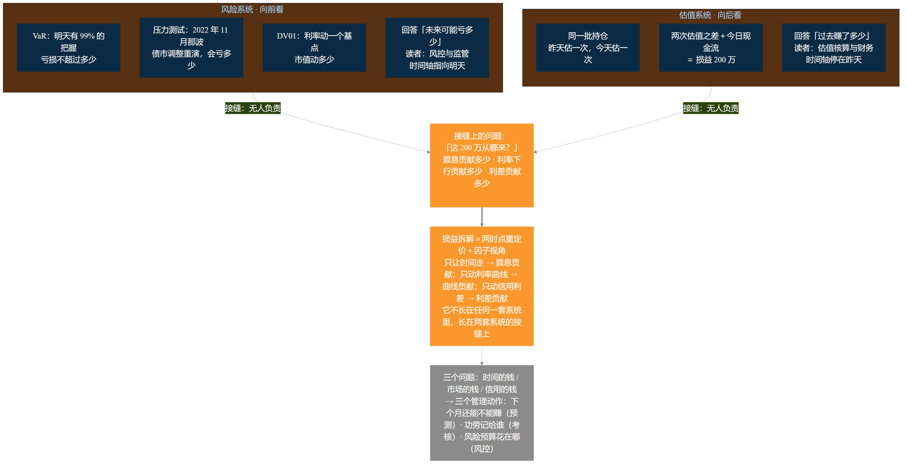
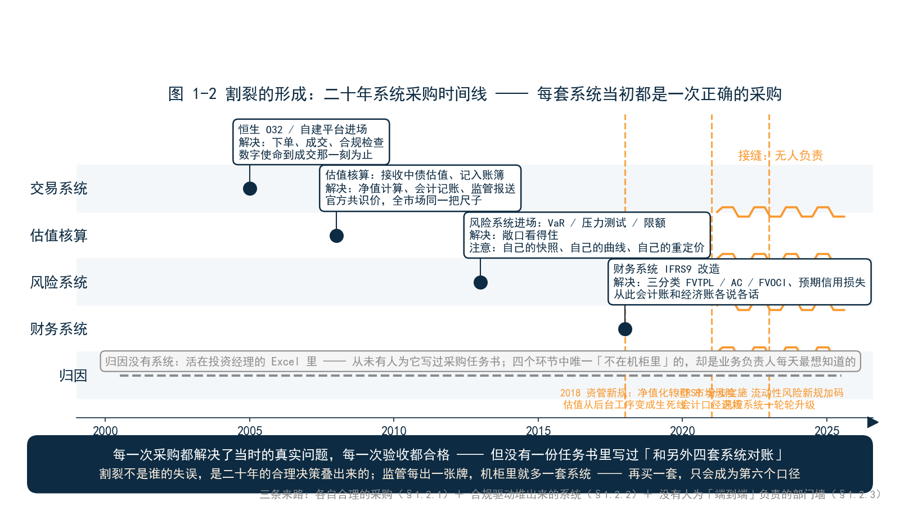
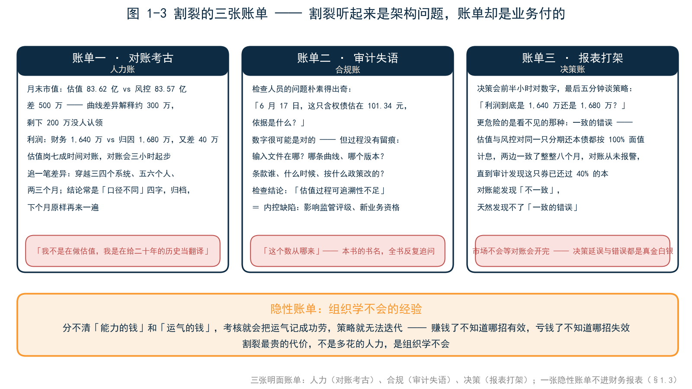
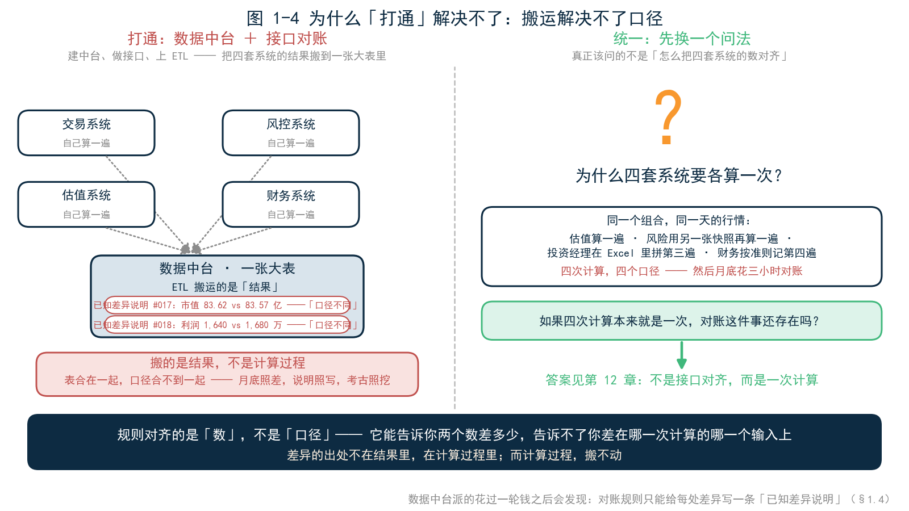
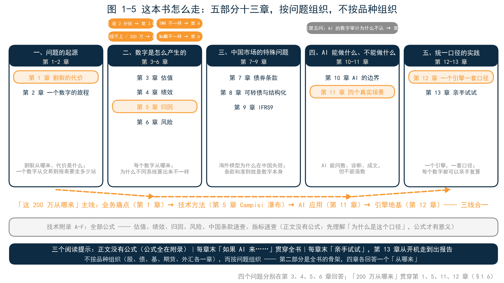

<!--
【素材来源】
- 章节定位与结构：docs/customer/财联社/book/_archive/02_提纲_方案B.md 第一部分第 1 章（割裂的代价：历史原因、真实困境、开篇案例、统一口径是业务刚需）
- 开篇案例（风险系统做不了损益拆解、「这 200 万从哪来」答不上、风险系统回答「未来可能亏多少」、估值引擎回答「过去赚了多少、为什么」）：_archive/02_提纲_方案B.md 核心定位与第 1 章
- 四个问题（2 分钱、VaR 不一样、归因接不上、200 万从哪来）：_archive/02_提纲_方案B.md 核心定位；22_第13章_亲手试试.md 全书总结「全书从四个问题开始」
- 历史原因（系统采购 O32/恒生/自建、监管要求 IFRS9/资管新规、部门墙）：_archive/02_提纲_方案B.md 第 1 章；21_第12章_一个引擎一套口径.md §12.1「割裂不是谁的失误，是二十年的合理决策叠出来的」「新系统只会成为第六个口径」
- 「搬运解决不了口径，搬的是结果不是计算过程」「对账规则只能写已知差异说明」：21_第12章_一个引擎一套口径.md §12.1（本章只提出问题，解决方案留待第 12 章）
- 「统一口径不是技术口号，是业务刚需」：_archive/02_提纲_方案B.md 第 1 章；21_第12章_一个引擎一套口径.md 引子与 §12.7 回收
- 判别问题「你们的归因数字，和估值数字，是同一次算出来的吗」：21_第12章_一个引擎一套口径.md 引子（沈工进场第一问）
- 全书结构（五部分 + 技术附录）：_archive/02_提纲_方案B.md
- 语气范本：docs/customer/财联社/三折页文案.md、12_第3章_估值.md、21_第12章_一个引擎一套口径.md

【衔接与伏笔】
- 引子的「200 万从哪来」是全书主线：第 5 章给技术方法（Campisi 七格瀑布）、第 11 章场景一给 AI 应用、第 12 章给引擎地基——三线合一
- 1.2 的历史回顾被 21_第12章_一个引擎一套口径.md §12.1 直接引用（「第 1 章回顾过这段历史」）
- 1.3 的月末对账会场景与第 12 章引子「东江资管月末对账会」呼应（本章是「病」，第 12 章是「愈」；本章对账会聚焦「考古」，「哪个对」的追问留给第 12 章）
- 1.5 的判别问题是第 12 章沈工进场的第一问；「统一口径不是技术口号，是业务刚需」由 21_第12章_一个引擎一套口径.md §12.7 回收；「另一家机构把会开到二十分钟」预告第 12 章
- 1.6 全书路线图：四个问题分别在第 3、4、5、6 章回答；第 13 章「五道关口」回收第 2 章的旅程
- 1.7 为第 10 章（AI 的边界）埋伏笔：AI 生成的数字必须可追溯
- 人物说明：本章引子的某券商（贺总、老林）为独立案例机构，与第 3–6 章老陈所在的券商资管不必然为同一家；审计师小周在第 9、10 章正式出场

【仍需补充】
1. 引子（某券商贺总、老林，日度损益 200 万、Excel 归因差 30 多万）与 1.3 对账会（市值 83.62 亿 vs 83.57 亿、利润 1,640 万 vs 1,680 万）均为合成案例，机构、人物、数字虚构但自洽，成稿前建议替换为可公开引用并脱敏的真实案例。
2. 1.2 的系统采购史（O32、恒生、自建估值与风控系统）与监管时间线（资管新规 2018、IFRS9 分步实施、市场风险新规）为行业通识性描述，关键年份与表述需与公开政策文件核对。
3. 1.3 的对账人力成本（估值岗七成时间对账、对账会三小时）为行业访谈口径的示意数字，建议用真实调研数据替换。
4. ~~正文【图 1-x 占位】待替换为实际图片引用。~~（2026-09-09 已完成：图 1-1～1-5 已替换为 figures/ch01/ 下的实际图片引用）
-->

# 第 1 章　割裂的代价

## 引子：一个答不上来的问题

十月的一个周二，晚上八点，某券商办公楼的灯还亮着一层。

分管自营与资管的副总裁贺总，在准备明天上午的季度经营分析会。自营固收组合今天赚了 200 万——数字是估值系统出的，他自己在系统里核过。写讲稿时，他顺手加了一页「收益来源分析」，然后发现：这一页，没人能帮他写完。

他先打给风险总监老林。老林打开风险系统，组合的风险指标一应俱全：DV01、久期、VaR、压力测试。「系统能告诉我明天可能亏多少，」老林说，「但『这 200 万从哪来』——票息贡献多少、利率下行贡献多少、利差贡献多少——风险系统没有这一栏。那是估值的事。」

估值主管的回答是：估值系统能告诉你昨天值多少、今天值多少，两个数一减就是 200 万，但「为什么」不在估值表里。「那是归因的事——归因在投资经理的 Excel 里。」

投资经理的 Excel 里确实有一张归因表：曲线变动来自风险系统，市值来自估值系统，票息是自己拿计算器算的。三个来源拼一张表，几项加总对不上 200 万，差 30 多万——差在哪一项上，没人说得清。

财务那边更帮不上忙：利润表按月结账，会计口径里根本没有「今天」这个颗粒度。

贺总把「收益来源分析」那页删了，换成一页 VaR。下楼时他跟老林说了一句话：「**我们管着上百亿的组合，回答得了『可能亏多少』，回答不了『赚的钱从哪来』。**」

这个场景不是某一家机构的窘境。如果你是一家金融机构的业务负责人，此刻不妨合上书想一分钟：你的组合上个月赚了钱——**这笔钱从哪来，你的系统答得上来吗？**

如果答不上来，这本书就是为你写的。全书围绕这个问题展开：本章看它是怎么成为问题的，第 5 章给它技术方法，第 11 章看 AI 怎么回答它，第 12 章看它脚下的地基。一个问题，四条线索，最后汇成一件事——**统一口径**。

---

## 1.1 两个引擎，一道接缝

为什么答不上来？不是人不专业，也不是系统不够好，而是这个问题恰好卡在两个引擎的接缝上。

**风险系统的世界观是向前看的。**它回答「未来可能亏多少」：VaR 告诉你「明天有 99% 的把握亏损不超过多少」，压力测试告诉你「如果 2022 年 11 月那波债市调整重演，组合会亏多少」，DV01 告诉你「利率动一个基点，市值动多少」。它的输入是持仓、行情和历史窗口，它的读者是风控和监管，它的时间轴指向明天。

**估值系统的世界观是向后看的。**它回答「过去赚了多少」：同一批持仓，昨天估一次，今天估一次，两次估值之差加上今天的现金流，就是损益。它的输入是持仓、条款和行情，它的读者是估值核算和财务，它的时间轴停在昨天。

而「这 200 万从哪来」要求的是第三件事：把昨天和今天的两次估值放在同一把尺子上，做一串「假如只动一个输入」的重定价——只让时间走，得到票息贡献；只动利率曲线，得到曲线贡献；只动信用利差，得到利差贡献。这件事需要估值引擎的重定价能力，又需要风险引擎的因子视角。**它不长在任何一套系统里，它长在两套系统的接缝上。**

再往下追一层，「这 200 万从哪来」其实不是一个问题，而是三个问题。多少来自**时间的钱**——票息、收敛、骑乘，只要拿着不动就会有，下个月大概率还有；多少来自**市场的钱**——利率下行、利差收窄，靠天吃饭，下个月未必还有；多少来自**信用的钱**——利差变动和个券选择，考验的是研究功底。三个问题的答案，直接决定三个管理动作：下个月还能不能赚（预测）、功劳记给谁（考核）、风险预算花在哪（风控）。答不上这三个问题，200 万就只是一个孤零零的数字——它有大小，没有来历；能记账，不能复制。

打个比方。病人出院，家属问医生：「他的病是怎么好的？」体检科说：「我们能预测他未来十年的心血管风险。」检验科说：「我们能告诉你他入院和出院两次指标的差值。」但「哪味药起了作用」，需要把两次检验放在同一套方法下逐项对比——没有科室管这个。不是体检科和检验科失职，是这个问题本来就不属于任何一个科室。

金融机构的损益拆解，就是这个「没有科室管」的问题。行业里其实存在能回答它的系统——一套成熟的估值引擎可以回答「过去赚了多少、为什么」，正如风险系统回答「未来可能亏多少」。但请注意，**这是两种不同的引擎**：采购清单上是两个条目，供应商常常是两家，数据各存一份，口径各有一套。贺总的机构两样都有，唯独接缝处是空的——于是「200 万从哪来」掉进了缝里。

这个问题值得被认真对待，因为它是全书的主线：**损益拆解是业务痛点（本章），是技术方法（第 5 章），是 AI 应用（第 11 章）——三线合一。**到第 5 章你会看到，另一家机构的投委会上，CIO 问了同样的问题，而那张答出来的瀑布图，改变了一整个部门的考核方式。

---

## 1.2 割裂不是事故，是历史

接缝是怎么来的？要理解统一的难，先得理解割裂的来路。它不是某次事故的产物，而是三段各自合理的历史叠出来的。

### 1.2.1 每套系统，当初都是一次正确的采购

把一家典型金融机构的系统机柜打开，里面的每一层都能说出一段正当理由。

最底层是**交易系统**——恒生 O32 这类厂商套件，或者自建平台，2000 年代陆续进场。它的任务是下单、成交、合规检查：价格有没有偏离中债估值太多、单笔有没有超授权、双录齐不齐。它的数字使命到成交那一刻就结束了。交易系统从不承诺「告诉你今天值多少」，那不是它被买来的理由。

往上是**估值核算**。中国市场的特殊之处在于，这件事有一个官方答案：中债估值每个交易日发布全市场债券的估值价与估值收益率，方法论公开、口径统一、全市场共用，是净值计算、会计记账、监管报送普遍采用的共识基准。于是大量机构的估值能力，长期停留在「接收中债估值、记入账簿」——至于自己重算一遍、回答「为什么差 2 分钱」，不在任务书里。

再往上是**风险系统**。2010 年代，市场风险管理系统陆续进场，VaR、压力测试、限额监控，一应俱全。它有自己的持仓快照、自己的曲线、自己的重定价引擎——注意，是「自己的」。采购它的时候，没有人要求它复用估值系统的那张快照；恰恰相反，风控的独立性还被视为内控的一部分。

旁边是**财务系统**，按会计准则说话，IFRS9 的三分类是它的世界观；以及**归因**——归因没有系统，归因活在投资经理的 Excel 里，因为从来没有一份采购任务书为它写过需求。它是四个环节里唯一一个「不在机柜里」的环节，也是业务负责人每天最想知道的那个。

每一次采购都解决了当时的真实问题，每一次验收都合格。**没有一份任务书里写过「和另外四套系统对账」。**这就像城市里各自修的路：每条路都验收合格，但路与路之间的接缝，没有写在任何一份图纸里。

### 1.2.2 监管每出一张牌，机柜里就多一套系统

第二段历史是监管驱动的。过去十年，每一轮监管新规都在机柜里添了一层新系统。

2018 年资管新规落地，净值化转型把「估值」从后台工序变成了生死线——摊余成本让位市值法，理财产品要每天出净值，一批理财子公司带着全新的系统栈出生。IFRS9 分步实施，三分类（FVTPL、AC、FVOCI）和预期信用损失进准则，会计系统经历一轮大改造，机柜里多了一套会计口径——从此同一只债券，会计账和经济账开始各说各话，这是第 9 章的故事。市场风险、流动性风险的监管要求层层加码，风控系统跟着一轮轮升级，每一轮升级都带来一套新的参数和口径。

每一轮都合理，每一轮都必要。但请注意这些系统的出生方式：**它们是合规驱动堆出来的，各自带着各自的口径落地。**合规是刚需，口径统一不是——至少，它从不出现在采购需求里。监管问的是「你有没有」，没有人问「你的第五套系统和前四套是不是同一套数」。于是机柜一层层加高，接缝一条条增多，每一条接缝都是月底对账会上的一处潜在战场。

### 1.2.3 部门墙：没有人为「端到端」负责

第三段历史是组织的。交易、估值、风控、财务，各管一段，各有 KPI：交易对「成交质量」负责，估值对「对账差异说得清」负责，风控对「敞口看得住」负责，财务对「报表经得起审」负责。

四个部门，四种 KPI，各自的供应商、各自的数据库、各自的口径文档。跨部门的数字流转，靠邮件和 Excel。**没有人的 KPI 是「四个部门的数字能对上」。**

部门墙不是态度问题，是专业分工的代价。一个常见的场景可以说明它的质地：投资经理想要一个数——「含权债按回售假设算，组合久期是多少」。这个数估值岗给不了（估值政策写的是按到期假设），风控系统里有但口径是风控的，财务根本不关心久期。五天后，投资经理拿到三个数，三个都不一样，每个都附一句「以我们系统为准」。没有人刁难他，每个部门都认真回复了——**只是没有人为「端到端」负责。**

数字的端到端旅程——从一笔交易到一张报表——没有负责人。第 2 章会跟着一个数字走完全程，你会看到它在每一站都被认真对待，也在每一站被悄悄改变。

三段历史合在一起，可以下一个结论了：**割裂不是谁的失误，是二十年的合理决策叠出来的。**这个结论有两层含义。一层是宽慰：对不上账，不代表你的团队不专业。另一层是警醒：既然割裂是「买」出来的，靠再买一套系统就解决不了它——新系统只会成为第六个口径。

---

## 1.3 割裂的三张账单

割裂听起来是个架构问题，但它的账单是业务付的。三张明面的账单，加一张隐性的。

### 1.3.1 账单一：月末对账，变成考古

月末最后一个工作日，晚上七点，还是那家券商，月度对账会开到了第三个小时。

长桌上摊着四张表。估值岗的组合月末市值是 83.62 亿，风控系统里是 83.57 亿——差 500 万。老林的解释是现成的：「风控用自家曲线快照，估值用中债估值，口径不同。」但 500 万里，曲线差异能解释的大约 300 万，剩下 200 万没人认领。财务送来的利润表上，组合当月盈利 1,640 万；投资经理 Excel 里的归因加总是 1,680 万——又差 40 万，差在哪一项，说不清。

接下来的流程，每个对过账的人都熟悉：翻三个月前的邮件，找当时的价格文件；找离职同事留下的 Excel，猜每个单元格的公式；打电话给供应商客服，问某个字段的确切含义——客服说要问实施，实施说要查当年的需求文档。一笔差异追到底，常常要穿越三四个系统、五六个人、两三个月的时间。追到最后一栏，最常见的结论不是「谁错了」，而是「口径不同」四个字——然后这四个字被写进对账说明，归档，下个月原样再来一遍。

估值岗的同事私下有个统计：他们七成的时间在对账，三成的时间在做估值。对账会三小时起步，月月如此。**对账会上最贵的不是差异本身，是差异没有出处——没有出处的差异，只能靠考古。**而考古的代价不只是人力：当七成的人力花在「找差异」上，就没有人有余力去「管口径」——差异于是越积越多，考古的现场越挖越大。一位估值主管形容自己的工作：「我不是在做估值，我是在给二十年的历史当翻译。」

### 1.3.2 账单二：审计问「这个数从哪来」

第二张账单在审计和监管现场检查时寄到。

检查人员的问题往往朴素得出奇：「6 月 17 日，这只含权债估在 101.34 元，依据是什么？」这个问题答不上来，通常不是因为数字错了——数字很可能是对的——而是因为**过程没有留痕**：当天的输入文件在哪？用的哪条曲线、哪个版本？条款是谁、什么时候、按什么政策改的？当时的估值政策是第几版？

一家机构被问住之后，检查结论里多了一行字：「估值过程可追溯性不足。」这行字翻译成管理语言，就是内控缺陷。它不影响某一天的利润，但它影响监管评级、影响新业务资格、影响审计签字时的心情。

「这个数从哪来」——请记住这句话，它是本书的书名，也是全书反复追问的一句话。第 9 章里，审计师小周会拿着一份询证清单追问实际利率的口径；第 10 章里，她会追问一份 AI 生成的报告。她问来问去，都是这一句。

### 1.3.3 账单三：决策会上，报表互相打架

第三张账单最贵，因为它直接打在决策上。

月度经营分析会的标准开场，是各部门依次汇报。但当估值、风控、财务、投资经理的报表并排放在一起时，会议的前半小时常常不属于策略，而属于对数字：「你的市值和我的市值差多少？为什么？」「利润到底是 1,640 万还是 1,680 万？」真正讨论「下个月怎么配」的时间，被压缩到最后五分钟。

这还只是看得见的情形。更危险的是看不见的那种：**两套系统碰巧给出了一致的错误数字，没有人怀疑。**一家机构后来发现，估值系统和风控系统对同一只分期还本债都按 100% 面值计息——两边数字一致了整整八个月，对账从未报警，直到审计发现这只券已经还过 40% 的本。对账能发现「不一致」，却天然发现不了「一致的错误」——而一致的错误，会被直接带进决策会，写进讲稿，变成仓位。条款处理的错误为什么最容易酿成这种事故，第 3 章和第 7 章会反复讲到。

决策延误和决策错误，都是真金白银。市场不会等对账会开完。

### 1.3.4 隐性账单：组织学不会的经验

三张账单之外，还有一张不进财务报表的。

回到引子那个问题：今天赚的 200 万，多少来自票息——明天躺着也有；多少来自利率下行——明天未必还有？答不上这个问题，后果不只是讲稿少一页。**分不清「能力的钱」和「运气的钱」，考核就会把运气记成功劳，策略就无法迭代**——赚钱了不知道哪招有效，亏钱了不知道哪招失效，一年下来，组合的收益曲线是一部没有注脚的编年史。

第 5 章里，另一家机构的 CIO 会对着一张归因瀑布图追问：「这 60 万的国债效应，是能力还是运气？」——能问出这个问题、并且有人答得上来，是一家机构投资能力开始积累的标志。割裂最贵的代价，不是多花的人力，**是组织学不会**。

---

## 1.4 为什么「打通」解决不了

面对四张对不上的报表，行业的第一反应通常是「打通」：建数据中台，做接口同步，上 ETL，把四套系统的结果搬到一张大表里，再配一套对账规则。

这个方向看起来顺理成章，实际上搞错了问题的位置。**搬运解决不了口径，因为搬的是结果，不是计算过程。**估值系统的 83.62 亿和风控系统的 83.57 亿，即便搬进同一张大表，依然是两个口径的产物——用不同的曲线、不同的快照时点、不同的条款假设算出来的。表合在一起，口径合不到一起。对账规则能做的，只是给每处差异写一条「已知差异说明」——月底照差，说明照写，考古照挖。

很多机构在这条路上花过一轮钱之后，会意识到真正该问的不是「怎么把四套系统的数对齐」，而是另一个问题：**为什么四套系统要各算一次？**

同一个组合，同一天的行情，估值系统算一遍市值，风险系统用另一张快照再算一遍，投资经理在 Excel 里拼第三遍，财务按会计准则记第四遍。四次计算，四个口径，然后月底花三小时对账——这个流程的荒诞之处不在于「对不上」，而在于「算了四次」。如果四次计算本来就是一次，对账这件事还存在吗？

数据中台派的反驳通常是：算四次没关系，我把四个结果收上来，用规则对齐。但规则对齐的是「数」，不是「口径」——它能告诉你两个数差多少，告诉不了你差在哪一次计算的哪一个输入上。差异的出处不在结果里，在计算过程里；而计算过程，搬不动。

这个问题先挂在这里。第 12 章会给出一种答案——不是接口对齐，而是一次计算。在那之前，第二部分（第 3–6 章）会先把每个环节各自的口径问题讲透：不先理解每套系统在算什么，就理解不了它们为什么对不上。

---

## 1.5 统一口径：不是技术口号，是业务刚需

到这里，「统一口径」四个字该有一个业务定义了。它不是技术团队的口号，不是架构图上的漂亮话，而是四条可以用大白话验收的标准：

**同一批持仓**——估值、绩效、归因、风险，算的是同一份持仓清单，不是四份各自维护的拷贝。拷贝听起来无害，直到某笔交易改了条款，四处拷贝只更新了三处。**同一张行情快照**——同一天的市场，在所有计算里长一个样，不是估值用中债、风控用自家曲线、各取各的时点。快照是当天全市场的一张照片，一次定格，所有计算共用。**同一次计算**——四个环节的指标从同一条计算链里长出来，不是四套系统各算一遍再对账。**每个数字可追溯**——报表上的任何一个数，能沿着计算链指回当天的持仓、条款和行情，三个月后可复算，换人、换机器、换季节都不影响复算结果。

四条标准，对应一个不需要任何技术背景的判别问题。评估自己机构（或任何一套系统）时，只问一句：**「你们的归因数字，和估值数字，是同一次算出来的吗？」**答案为是，口径统一才有前提；答案为否，组合层的数字永远是拼出来的——拼出来的数，对账会上见。这个问题不需要看任何一份技术文档，却能问出一套系统最深的架构事实。

为什么说这是「刚需」？刚需的意思是，没有它，月末对账会永远开三个小时，审计质询永远靠翻档案，决策会上的报表永远互相打架，「这 200 万从哪来」永远答不全。这些不是效率问题，是信任问题——对数字的信任，是金融机构一切管理动作的地基。

后来，有一家资管机构真的把这件事做成了：同样的月末对账会，从三小时开到了二十分钟，估值岗从「找差异的人」变成了「管口径的人」。他们怎么做的，是第 12 章的事。这里只先记住他们验收时说的那句话：**统一口径不是技术口号，是业务刚需。**

---

## 1.6 这本书怎么走

本书从四个问题开始。它们你一定被问过，或者问过别人：

- **为什么我的估值和中债估值差了 2 分钱？**
- **为什么风控说的 VaR 和我算的 VaR 不一样？**
- **为什么这个月的归因报告和上个月的接不上？**
- **为什么「今天赚了 200 万，这 200 万从哪来」答不上？**

四个问题指向同一件事：估值、绩效、归因、风险，长期以来是割裂的——每个环节都对，但对不到一起。AI 时代又添了第五问：**为什么 AI 生成的报表里的数字，审计不认？**

这本书不按品种组织（股、债、基、期货、外汇各一章），而按问题组织。全书五部分：

| 部分 | 章节 | 回答的问题 |
|---|---|---|
| 一、问题的起源 | 第 1–2 章 | 割裂从哪来、代价是什么；一个数字从交易到报表要走多少站 |
| 二、数字是怎么产生的 | 第 3–6 章 | 估值、绩效、归因、风险——每个数字从哪来，为什么不同系统算出来不一样 |
| 三、中国市场的特殊问题 | 第 7–9 章 | 海外模型为什么在中国失效：债券条款、可转债与结构化衍生品、IFRS9 |
| 四、AI 能做什么、不能做什么 | 第 10–11 章 | AI 的边界在哪里；四个真实场景里 AI 怎么用 |
| 五、统一口径的实践 | 第 12–13 章 | 一个引擎，一套口径；亲手试试 |
| 技术附录 | 附录 A–F | 全部公式：估值、绩效、归因、风险、中国条款速查、指标速查 |

第二部分是全书的骨架，四章各回答一个「从哪来」。第 3 章讲估值：一只债从一笔交易到一个价格，为什么你的估值和中债估值差 2 分钱——曲线、条款、口径，三类差异各有多大。第 4 章讲绩效：从价格序列到收益率，为什么你的 TWR 和基金公司的 TWR 不一样——绩效数字不是算出来的，是定义出来的。第 5 章讲归因：从收益率到「为什么」，Campisi 七格瀑布把 200 万拆成票息、曲线、利差、择券——本章引子的问题在那里得到完整回答。第 6 章讲风险：从持仓到「可能亏多少」，为什么风控说的 VaR 和你算的不一样——置信水平、持有期、历史窗口，每个都是政策选择。

第三部分回答一个更扎心的问题：海外模型为什么在中国失效。第 7 章的中国债券条款（分期还本、阶梯票息、已调票面）、第 8 章的可转债与结构化衍生品（条款即估值）、第 9 章的 IFRS9（会计口径 vs 经济口径），合起来是一句话：**条款和准则不是附属信息，它们就是数字本身。**

三个阅读提示。第一，**正文没有公式**——公式全部收在附录里，正文只讲「这个数字是怎么来的、为什么重要、怎么用」。这不是回避数学，是一种立场：先理解「为什么是这个口径」，公式才有意义。第二，每章末尾有一个固定栏目「如果 AI 来……」——AI 不是最后一章的话题，是贯穿全书的问题。第三，每章末尾有「亲手试试」：随书配套一个解压即用的实操包，第 13 章会带你从开机走到出报告——这本书的每个数字，你都可以亲手复算。

---

## 1.7 如果 AI 来回答「这个数从哪来」

本章开头是贺总删掉了讲稿里的一页。换个场景：如果贺总的实习生用 AI 生成那份「收益来源分析」，会发生什么？

大概率，他能得到一页漂亮的分析：归因分解、市场展望、风险提示，文字流畅得像研报，从提问到成稿十分钟。唯一的问题是，里面每个数字都是 AI「觉得差不多」的数——它不知道你的持仓，不知道昨天的收盘价，不知道你机构的估值政策，但它知道「一个像真的数字」长什么样。

在割裂的系统里，这种数字格外危险：四套系统本来就对不上，一个「像真的」的数混进报表，比以前更难被发现——因为连对账的基准都不存在。过去，一个错误的数字至少会和对的系统打架，打架就是警报；现在，AI 生成的数字可以流畅地绕开所有系统，直接落在讲稿上。

所以「这个数从哪来」在 AI 时代不是更轻了，而是更重了：**AI 生成的内容越流畅，数字的可追溯性越稀缺。**第 10 章会把这条边界划清楚——AI 能问数、诊断、成文，但不能造数；第 11 章看划清边界之后，AI 能帮你把工作效率提高多少。

---

## 本章小结

回到引子的问题：为什么「这 200 万从哪来」答不上来？

因为这个问题卡在两个引擎的接缝上——风险系统向前看，估值系统向后看，损益拆解需要两者的交叉地带，而接缝处无人负责。接缝不是事故，是历史：每套系统当初都是正确的采购，监管每出一张牌机柜里就多一套系统，四个部门各管一段、没有人为端到端负责。**割裂不是谁的失误，是二十年的合理决策叠出来的。**

割裂的账单由业务支付：月末对账变成考古，审计问「这个数从哪来」答不上，决策会上的报表互相打架，而最贵的一张账单是隐性的——分不清能力的钱和运气的钱，组织学不会。「打通」解决不了它，因为搬运的是结果，不是计算过程；真正该问的是「为什么四套系统要各算一次」。

统一口径因此不是技术口号，是业务刚需：同一批持仓、同一张行情快照、同一次计算、每个数字可追溯。验收它只需要一个问题——「你们的归因数字，和估值数字，是同一次算出来的吗？」

下一章，把「割裂」放到显微镜下。跟着一只债券走一遍：从交易员下单，到 CFO 在决策会上看到报表，中间经过多少环节？每个环节都认真、专业、有据可查——但到终点时，同一个经济事实变成了六个数。这个数字的旅程，就是割裂的解剖图。
