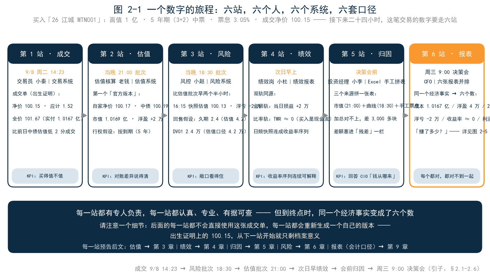
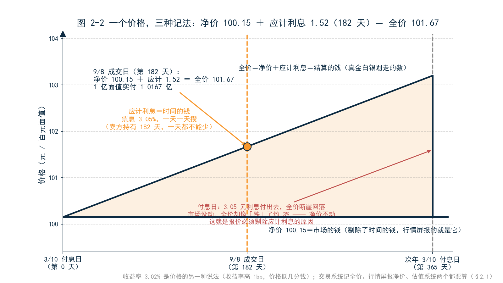
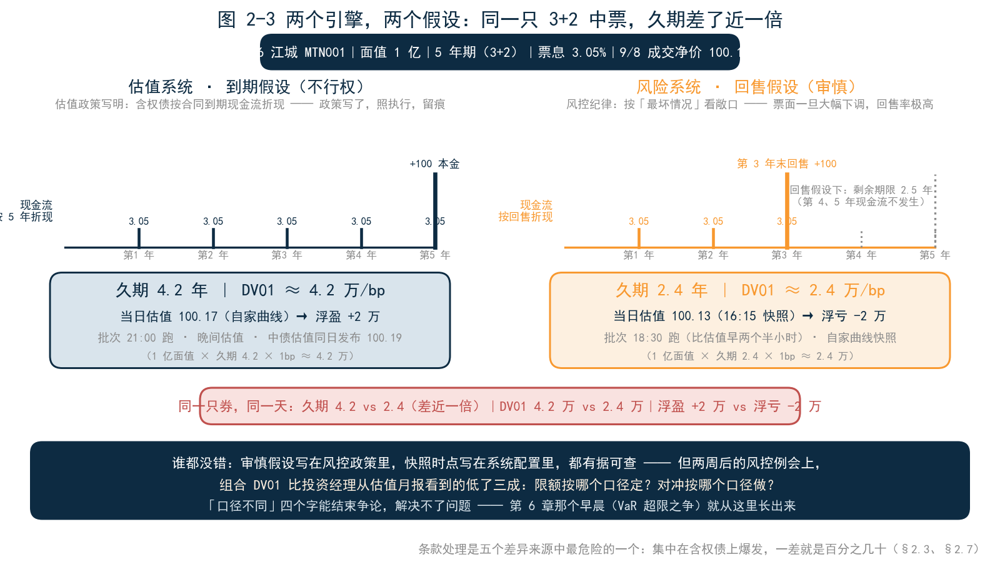
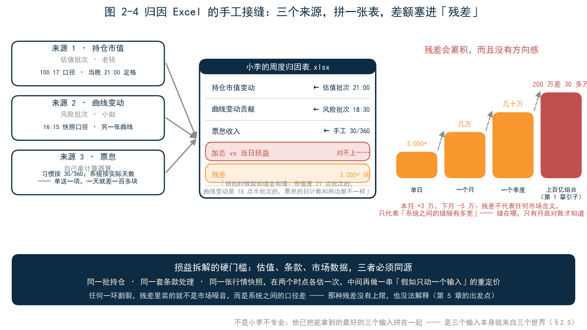
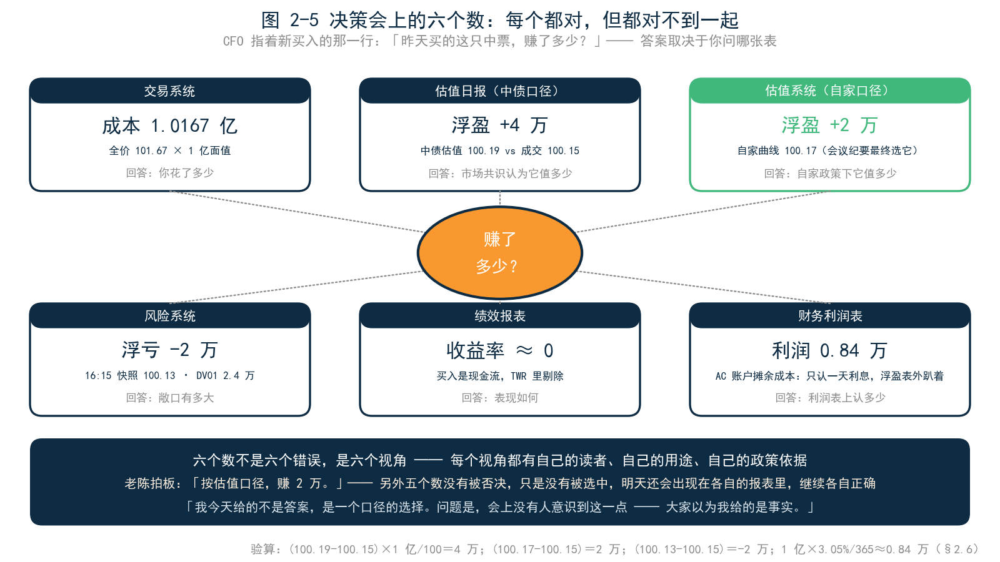
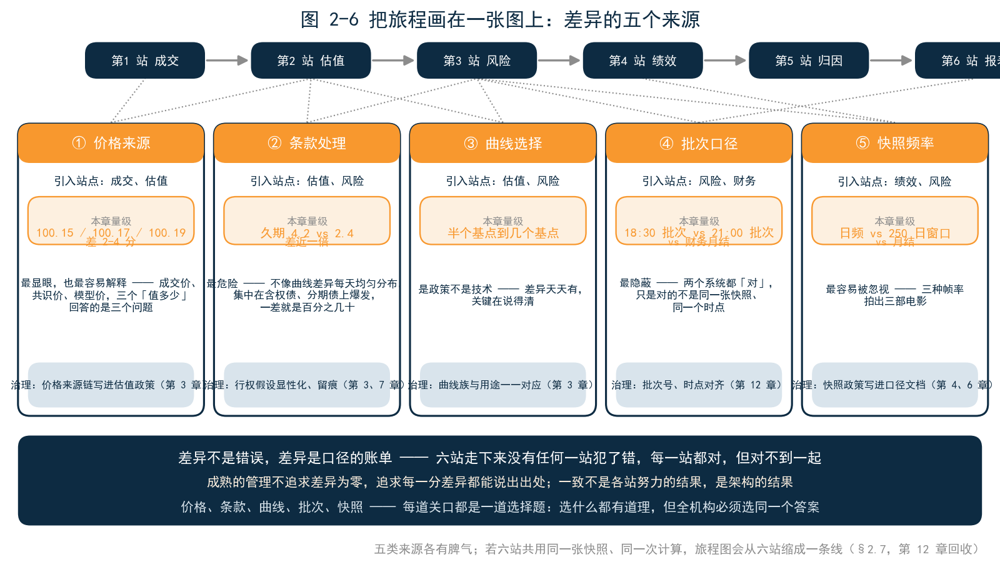

<!--
【素材来源】
- 章节定位与结构：docs/customer/财联社/book/_archive/02_提纲_方案B.md 第一部分第 2 章（一个数字的旅程：交易录入→估值→绩效→归因→风险→报表；五个差异来源：价格来源、条款处理、曲线选择、批次口径、快照频率）
- 净价/全价/应计利息、最后成交价 vs 估值、价格来源链：12_第3章_估值.md §3.1、§3.2
- 中债估值（共识价，「价值不在准，在同」）：ch03 §3.2.2
- 3+2 含权中票的行权假设（「活到哪一年」、久期 4 年 vs 2 年、禁止静默沿用旧票面）：12_第3章_估值.md §3.3.2、16_第7章_中国债券条款.md
- 绩效口径（分母、现金流处理、快照频率、金额轨 vs 比率轨、双轨同源）：13_第4章_绩效.md §4.1
- 归因 Excel 三来源拼接（估值岗市值 + 风控曲线 + 自己算票息、「拼的时候就知道会有缝」）：21_第12章_一个引擎一套口径.md 引子
- 会计口径（AC 账户摊余成本爬坡、浮盈不进利润表）：18_第9章_IFRS9.md 引子
- 批次口径（各系统各跑各的批次、日终批次归档）：ch12 §12.4、§12.6
- 「差异不是错误，是口径的账单」：ch03 §3.4.4
- 五道关口与「每道关口都是一道口径选择题」：22_第13章_亲手试试.md 全书总结（本章埋下，第 13 章回收）
- 语气范本：12_第3章_估值.md、21_第12章_一个引擎一套口径.md

【衔接与伏笔】
- 承接第 1 章：割裂不是抽象的组织问题，它发生在每一个数字身上——本章是割裂的解剖图
- 六站旅程的每一站预告后文：第二站→第 3 章（估值）、第四站→第 4 章（绩效）、第五站→第 5 章（归因）、第三站→第 6 章（风险）、第六站→第 9 章（IFRS9）
- 2.7 的五个差异来源与「关口」比喻，由第 13 章全书总结回收为「五道关口」（条款、曲线、口径、同源计算、批次）
- 结尾「如果六站共用同一张快照」为第 12 章「一个引擎，一套口径」埋伏笔
- 人物沿用：老陈、小李（第 3–6 章）、风控小赵（第 6 章）；新增交易员小秦、估值核算岗老钱、绩效岗小杜

【仍需补充】
1. 全章债券案例（26 江城 MTN001、3+2、票息 3.05%、成交净价 100.15、应计利息 1.52、全价 101.67 等）为合成案例，数字经自洽验算但非真实债券，成稿前建议用匿名化真实交易替换。
2. 应计利息天数（182 天）、中债估值差（+4 分）、风险快照差（−2 分）、久期（4.2 vs 2.4）等为示意口径，需与真实市场量级核对；财务利息 0.84 万按票息直线简化，未按 EIR 精确计算。
3. 各系统批次时点（风险 18:30、估值 21:00、财务月结）为典型行业实践，非监管规定。
4. ~~正文【图 2-x 占位】待替换为实际图片引用。~~（2026-09-09 已完成：图 2-1～2-6 已替换为 figures/ch02/ 下的实际图片引用）
-->

# 第 2 章　一个数字的旅程

## 引子：一笔普通的买入

9 月 8 日，周二，14 点 23 分。某券商资管的固收交易室里，交易员小秦敲下一笔成交：买入「26 江城 MTN001」，面值 1 亿，5 年期（3+2）中票，票息 3.05%，成交净价 100.15 元。

这笔交易普通得不能再普通。投资经理小李上午下的指令，理由是这只券的利差有性价比；小秦询了三家对手方，比前一日中债估值低 2 分成交。从下单到成交，四十分钟。

接下来二十四小时，这笔交易产生的数字要走六站：交易、估值、风险、绩效、归因、报表。每一站都有专人负责，每一站都认真、专业、有据可查。但到周三上午的决策会上，同一个经济事实——「昨天买了 1 个亿的中票」——在报表上变成了六个数。**每个都对，但都对不到一起。**

第 1 章说，割裂是二十年的合理决策叠出来的。那是宏观的讲法——机柜、监管、部门墙。本章换一种讲法：跟着这个数字走一遍，看割裂在一天之内、在一个数字身上，是怎么发生的。六站，六个人，六个系统，六套口径——读完这一章，你会拿到一张地图；后面每一章，都是把这张地图上的某一站放大。

---

## 2.1 第一站·成交：一个价格，三种记法

14 点 23 分之前，还有四十分钟的询价。小秦向三家对手方报了意向，收到的报价分别是 100.17、100.16、100.15。他选了最低的那家，又压了压，没压动，成交。前一日中债估值是 100.17——比估值低 2 分成交，这一单在交易员的评价体系里属于「买得值」。

成交达成的那一刻，这笔交易同时有了三个价格。

**净价 100.15 元**：行情屏上的价格，也是成交单上的价格。它剔除了「时间的钱」，只反映市场对这只券本身的定价。**应计利息 1.52 元**：上个付息日（3 月 10 日）到今天，182 天累积的票息——卖方替发行人持有了这 182 天，一天的票息都不能少，结算时买方要连本带利补给他。**全价 101.67 元**：净价加应计利息，真金白银的结算金额——1 亿面值，实付 1.0167 亿，明天交割时从账上划走的就是这个数。

除此之外还有第四个数：收益率 3.02%。它是价格的另一种说法，交易员之间的通用语言——询价时报净价还是报收益率，说的是同一笔买卖；收益率高 1 个基点，价格就低几分钱，交易员心算就能完成换算。

为什么一个价格要拆成三种记法？设想报价含应计利息会发生什么：付息日前一天，价格里攒了快一年的利息；付息日当天利息付出去，价格「断崖式」下跌——市场没有任何变化，价格却像跌了 3%。净价把时间的钱剔出去，剩下的才是市场的钱。这个区分的业务后果很实际：**交易系统记全价（那是真付出去的），行情屏报净价，估值系统两个都要算。**第 3 章会专门展开，这里先记住：从第一站开始，「这个数是什么口径」就是必须回答的问题。

交易系统忠实地记录下这一切：成交时间、对手方、净价、全价、清算路径、合规校验结果。它是合规的守护者——价格偏离中债估值超过阈值会预警，单笔超授权会拦截。但它的数字使命到成交为止：它记录「你多少钱买的」，从不回答「它今天值多少」。

小秦的 KPI 是「买得值不值」：比中债估值低 2 分，比三家对手方的报价都优，这一单干得漂亮。他的数字使命，在成交这一刻就完成了。成交单是这笔交易的出生证明——但请注意一个细节：**后面的每一站，都不会直接使用这张成交单。每一站都会重新生成一个自己的版本。**出生证明上的 100.15，从下一站开始，就只剩档案意义了。

---

## 2.2 第二站·估值：今天值多少

傍晚，中债估值发布：这只券的估值净价 100.19 元。

先花半分钟理解「中债估值」是什么。银行间市场的债券大多不活跃——全市场几万只债，每天有真实成交的是少数，没有市价可抄。中债金融估值中心每个交易日用一整套收益率曲线族加个券利差调整，为全市场债券算出估值价与估值收益率。它不是成交价，不保证你能按这个价格卖出去；它是一个**方法论公开、口径统一、全市场共用的模型价**。它的价值不在「准」，在「同」——全行业用同一把尺子，净值才可比，审计才有基准。

估值核算岗老钱的自家系统，按自家曲线算出 100.17 元。两个数差 2 分——1 亿面值就是 2 万——老钱在对账表上写下原因：曲线差异，半个基点以内，正常。这个场景在第 3 章有完整的解剖，这里只需要知道：**「今天值多少」这个问题，市场上有一个共识答案（中债估值），机构内部还有一个自家答案，两者存在小幅差异是正常的，需要管理的不是消灭差异，是解释差异。**

老钱这一站还有一条不成文的流水线，叫价格来源链：**有市价按市价，无市价按条款与曲线定价。**交易所连续竞价的可转债、每天有真实成交的活跃利率债，价格直接从市场来；而「26 江城 MTN001」这类银行间中票，一周未必有一笔成交，只能走估值——按条款推出现金流，按曲线折现。链条的每一环都有优先级，链条的终点不是「随便给个价」，而是明确报错。这条纪律第 3 章会展开，它有个好记的说法：错得清楚，好过错得安静。

真正有意思的是条款。这只券是 3+2：5 年期，第 3 年末发行人有权调整票面利率，投资者有权按面值回售。设想第 3 年末市场利率下行，发行人把票面从 3.05% 大幅下调到 1.5%，投资者大概率集体回售——这只「5 年期」债券实际只活了 3 年。估值因此必须先回答一个非技术问题：**你假设它活到哪一年？**按 5 年现金流折现和按 3 年折现，价格差一截，久期差得更多。老钱所在机构的估值政策写明了：含权债按合同到期现金流折现，即「不行权假设」。按 5 年折现，这只券的久期是 4.2 年。政策写了，老钱照执行，执行留痕——这是估值岗的纪律。至于这个假设合不合理、谁来定、改了怎么办，那是估值政策委员会的事，第 7 章还会回到这片条款的丛林。

晚上 21 点，估值批次跑完，结果归档：输入、配置、行情快照、输出、日志，落进一个以时间戳命名的批次目录。这是这个数字的第一个「官方版本」：净价 100.17，市值 1.0169 亿（含应计），当日浮盈 2 万（对成交净价）。老钱把估值表发给财务和绩效岗，下班回家。

老钱的 KPI 是「对账差异说得清」。他这一站没有犯任何错误。但请留意三样东西已经悄悄进场：**价格来源**（成交价 100.15、中债估值 100.19、自家估值 100.17，三个「值多少」）、**曲线选择**（中债曲线还是自家曲线）、**条款处理**（行权假设是 5 年）。它们将在后面几站逐一发酵。

---

## 2.3 第三站·风险：同一批持仓，另一台引擎

注意时间：风险批次是 18 点 30 分跑的——比估值批次早两个半小时。风控要在晚间例会前出敞口，等不了中债估值。

风控小赵的风险系统用 16 点 15 分的自家曲线快照，把全组合重估了一遍。这只券在风险系统里的估值是 100.13 元——比成交净价还低 2 分。也就是说，**估值系统说这只券当天浮盈 2 万，风险系统说它浮亏 2 万。**谁错了？都没错：快照时点不同（16:15 对晚间），曲线版本不同，2 分的差异对两个系统都在正常区间。小赵甚至没注意到这 2 分——他看的是全组合上百只券的敞口加总，单券的 2 分远在噪声线以下。

更大的分歧在条款假设上。风险系统的纪律是审慎：含权债按「回售假设」处理——假设第 3 年末投资者集体回售，这只券按 2.5 年剩余期限计算。这个假设有它的道理：历史上 3+2 到行权日，票面一旦大幅下调，回售率极高；风控的职责是按「最坏情况」看敞口，而不是按「合同约定」看敞口。于是同一个久期，估值口径是 4.2 年，风险口径是 2.4 年；同一个 DV01（利率动一个基点，市值动多少），估值口径约 4.2 万，风险口径约 2.4 万——**差了近一倍。**

小赵的 KPI 是「敞口看得住」。他这一站同样没有犯任何错误：审慎假设写在风控政策里，快照时点写在系统配置里，都有据可查。但后果是实打实的。两周后的风控例会上，小赵报的组合 DV01 比投资经理从估值月报里看到的低了三成，投资经理当场皱眉：「我的久期明明按 4 年以上管的，你的数怎么对不上？」小赵答：「口径不同。」——这四个字能结束争论，但解决不了问题：限额按哪个口径定？对冲按哪个口径做？第 6 章开头那个早晨——VaR 超限、投资经理不服气、风控说「数字就是数字」——就是从这样的分歧里长出来的。

这一站给旅程添了第四个差异来源：**批次口径**。估值批次 21 点跑，风险批次 18 点半跑，财务月结批次月末跑——各系统各跑各的批次，各用各的输入，各存各的结果。没有谁的批次是「错」的，但没有任何两个批次用的是同一张快照。

---

## 2.4 第四站·绩效：收益率是定义出来的

次日早上，绩效岗小杜计算这只券对组合的贡献。她的输入是昨晚的估值批次，面前有两条轨道。

**金额轨**：当日损益 = 今日估值（自家口径，全价 101.69）− 买入成本（全价 101.67）= +2 万。这是财务语言，回答「赚了多少」，最终进利润表。**比率轨**：时间加权收益率（TWR）。买入属于现金流流出，要从收益率里剔除——剔除之后，这只券当天的收益率约等于零。这是投资语言，回答「表现如何」，最终进考核表。

两个数描述同一天，回答的是两个问题，都对。但小杜知道，实务中常见的混乱是「双轨变单轨」：金额轨来自财务系统，比率轨来自投资系统，两边估值口径不一样，月末对不上，再花一周拼数。她所在的机构还算幸运——至少绩效岗和估值岗用的是同一个估值批次，金额轨和比率轨从同一条组合价值序列里长出来，天然咬合。不是所有机构都有这份幸运：第 4 章开头，财务总监、机构客户和投资经理会拿着三个互相矛盾的收益率，把老陈堵在月度经营分析会上。

小杜的 KPI 是「收益率序列连续、可解释」。她手里的工具是日频快照：组合每天一个市值，连成序列，算出收益率，再年化、算夏普、算最大回撤。这里藏着旅程的第五个差异来源——**快照频率**：绩效用日频快照，风险系统的 VaR 用 250 个交易日的历史窗口，财务按月结账。三个时间尺度，三种「看世界」的帧率。第 4 章会讲清楚，快照频率本身就是口径：同一段收益，日频算的和月频算的可以对不上——现金流落在两个快照之间，处理规则不同，收益率就不同。

---

## 2.5 第五站·归因：Excel 里的手工接缝

周三上午要开决策会，小李要准备周度归因。他的流程是全行业最普遍的那种：打开 Excel，拉出三列数字。

第一列，持仓市值——找老钱要的，来自估值批次，100.17 口径，21 点定格。第二列，曲线变动——找小赵要的，来自风险批次，16:15 快照口径。第三列，票息——自己拿计算器算的，他习惯按 30/360（每月按 30 天、每年按 360 天计），而老钱的系统按实际天数。单这一项，一天就差出一百多块。

三个来源，拼一张表。

拼的时候小李就知道会有缝：市值是 21 点批次的，曲线变动是 18 点半批次的，票息的日计数惯例和两边都不一样。果然，几项加总对上当天的损益，差 3,000 多块。他把差额塞进「残差」一栏，心里默念：单日几千块，决策会不会有人问。

他是对的，决策会没人问。但残差会累积：单日 3,000，一个月就是几万，一个季度就是几十万——第 1 章里那家券商「归因加总对不上 200 万、差 30 多万」的窟窿，就是这么来的，只不过那里的组合是上百亿，缝也按比例放大。更麻烦的是，残差没有方向感：这个月是正的三万，下个月是负的五万，它不代表任何市场含义，只代表「系统之间的缝隙有多宽」。**缝在哪，只有月底对账才知道。**

这一站值得停下来看一眼，因为它是全书主线的现场。第 1 章引子里那句答不上来的「这 200 万从哪来」，答案本来应该在这一站产生——损益拆解，把总损益拆成票息、曲线、利差、择券。但现在，这一站的基础设施是一张 Excel、三个来源、和一个叫「残差」的垃圾桶。不是小李不专业：他已经把能拿到的最好的三个输入拼在了一起。是三个输入本身就来自三个世界。

小李的 KPI 是回答 CIO 那句「钱从哪来」。他业务过硬，Excel 手艺精湛，那张归因表他用了三年，每一格的公式都熟——但他手里的三个输入来自三个口径，这是手艺解决不了的问题。损益拆解有一道硬门槛：**估值、条款、市场数据，三者必须同源**——同一批持仓、同一套条款处理、同一张行情快照，在两个时点各估一次，中间再做一串「假如只动一个输入」的重定价。任何一环割裂，拆出来的残差里装的就不是市场噪音，而是系统之间的口径差——那种残差没有上限，也没法解释。这是第 5 章的全部出发点。

---

## 2.6 第六站·报表：决策会上的六个数

周三 9 点，决策会。CFO 翻到组合日报，指着新买入的那一行问了一个朴素的问题：「昨天买的这只中票，赚了多少？」

桌上的答案，取决于你问哪张表：

| 报表 | 数字 | 它回答的问题 |
|---|---|---|
| 交易系统 | 成本 1.0167 亿 | 你花了多少 |
| 估值日报（中债口径） | 浮盈 4 万（100.19） | 市场共识认为它值多少 |
| 估值系统（自家口径） | 浮盈 2 万（100.17） | 自家政策下它值多少 |
| 风险系统 | 浮亏 2 万（100.13），DV01 2.4 万 | 敞口有多大 |
| 绩效报表 | 收益率 ≈ 0 | 表现如何 |
| 财务利润表 | 利润 0.84 万 | 利润表上认多少 |

这张表值得盯着看半分钟。六个数不是六个错误，是六个视角——每个视角都有自己的读者、自己的用途、自己的政策依据。问题在于，决策需要一个数，而六张表给了六个。更要命的是，六个数之间的换算关系，只存在于在场几个人的脑子里：为什么中债口径是 4 万而自家口径是 2 万？为什么风险系统是亏的？为什么利润表只有 0.84 万？——每一个「为什么」的答案都是一堂口径课，而决策会只有两分钟。

财务那个数值得多说一句。这只券放在 AC 账户（摊余成本法），按 IFRS9 的规则，账面价值按买入时锁定的实际利率每天「爬坡」，市场浮盈不进利润表——所以利润表上它当天的贡献只有一天的利息，约 0.84 万。浮盈 2 万去哪了？在表外趴着，会计上认，利润里不认。如果它放在 FVTPL 账户，2 万浮盈当天就进利润；放在 FVOCI 账户，进净资产不进利润。同一只券，同一个市场，三个账户三种命运——这是第 9 章的主题，这里只需记住：**会计口径和经济口径是两套都合法的定义，谁也不是错的。**

六个数，每个都有专人背书，每个都答得上来历。但「赚了多少」这个问题没有答案——或者说，有六个答案。会议室安静了几秒，老陈最后拍板：「按估值口径，赚 2 万。」

CFO 追问了一句：「那风控为什么说亏 2 万？」老陈答：「快照时点不同，口径不同。」财务总监补了一句：「利润表上只有 0.84 万，别拿 2 万去跟审计说。」三句话，三个口径，都对。会议纪要里最终只写了一个数：2 万。另外五个数没有被否决，只是没有被选中——它们明天还会出现在各自的报表里，继续各自正确。

会议继续，讨论下季度的配置。但老陈心里清楚，刚才那两分钟才是这个会最真实的部分：一个 1 亿的小交易，六个部门级的系统，六个都对的数字，最后靠负责人拍板选一个。如果这笔交易是 100 亿呢？如果会上讨论的不是「赚了多少」，而是「要不要加仓」呢？

散会后老陈跟小李说了一句话：「我今天给的不是答案，是一个口径的选择。**问题是，会上没有人意识到这一点——大家以为我给的是事实。**」

---

## 2.7 把旅程画在一张图上：差异的五个来源

六站走完了。把整张旅程图铺在桌上，差异的来源一共五类：

| 差异来源 | 引入站点 | 本章的量级 | 治理方式 |
|---|---|---|---|
| 价格来源 | 成交、估值 | 100.15 / 100.17 / 100.19，差 2–4 分 | 价格来源链写进估值政策（第 3 章） |
| 条款处理 | 估值、风险 | 久期 4.2 vs 2.4，差近一倍 | 行权假设显性化、留痕（第 3、7 章） |
| 曲线选择 | 估值、风险 | 半个基点到几个基点 | 曲线族与用途一一对应（第 3 章） |
| 批次口径 | 风险、财务 | 18:30 批次 vs 21:00 批次 vs 月结 | 批次号、时点对齐（第 12 章） |
| 快照频率 | 绩效、风险 | 日频 vs 250 日窗口 vs 月结 | 快照政策写进口径文档（第 4、6 章） |

五类来源，各有各的脾气。**价格来源**的差异最显眼，也最容易解释——成交价、共识价、模型价，三个「值多少」回答的是三个问题。**条款处理**的差异最危险，它不像曲线差异那样每天均匀分布，而是集中在含权债、分期债这类特定品种上爆发，一差就是百分之几十。**曲线选择**是政策不是技术，半个基点的差异天天有，关键在说得清。**批次口径**最隐蔽——两个系统都「对」，只是对的不是同一张快照、同一个时点。**快照频率**最容易被忽视，日频、窗口、月结，三种帧率拍出三部电影。

盯着这张表看一会儿，会得出两个结论。

第一个结论关于「错」。六站走下来，没有任何一站犯了错：小秦买得漂亮，老钱执行政策，小赵审慎留痕，小杜口径连续，小李手艺精湛，财务严格按准则。**每一站都对，但对不到一起——差异不是错误，差异是口径的账单。**这句话第 3 章还会再说一遍，它是对账文化的第一课：成熟的管理不追求差异为零，追求每一分差异都能说出出处。

第二个结论关于「一致」。如果每一站都对还拼不出一个一致的数，那「一致」显然不是各站努力能堆出来的——**一致不是各站努力的结果，是架构的结果。**六站共用同一张快照、同一次计算，一致才存在；六站各算各的，再敬业、再专业，月底还是得开对账会。这就是为什么第 1 章说「打通」解决不了问题：接口能把六站的数字搬进一张表，搬不动六站各自的口径。

可以做一个思想实验：如果这六站共用同一张行情快照、同一次计算——估值、损益、归因、绩效、风险从同一条计算链里长出来——这张旅程图会缩成什么样？六站会缩成一条线：交易录入，一次计算，六张报表同时出锅，数字天然咬合，对账会无账可对。这不是空想，第 12 章会把这条线走一遍——一个组合从交易录入到日报输出的二十四小时。

最后记住一个比喻。这只债券走过的每一站，都是一道口径的关口：价格、条款、曲线、批次、快照——**每道关口都是一道选择题**，选什么都有道理，但全机构必须选同一个答案。这个比喻先寄存在这里，全书最后一章会连本带息地回收它。

---

## 2.8 如果 AI 来走这条旅程

设想一下，决策会上 CFO 不问老陈，改问 AI：「这只券昨天赚了多少？」

AI 会立刻给出一个流畅的回答。但这个回答的值，取决于它连的是哪一站的系统：连估值批次，答案是 +2 万；连风险系统，答案是 −2 万；连财务系统，答案是 0.84 万；如果它哪一站都没连，它还能编出第四个「像真的」的数。**连错一站，答案就换一个——而 AI 不会主动告诉你它连的是哪一站**，除非数字自带出处：批次号、指标名、估值日，一个不能少。

这就是为什么本书坚持把「这个数字从哪来」问到底。AI 时代的问题不是「AI 算得准不准」，而是「AI 答的数，连的是哪一站」。六站六数的机构里，AI 只是第七个口径；而在统一口径的地基上，AI 才能成为那个三分钟答完「这 200 万从哪来」、每个数都能当场验证的助手。第 10 章划边界，第 11 章看实战。

---

## 本章小结

回到引子的问题：从一笔交易到一张报表，中间经过多少环节？

六站。成交站，一个价格拆成三种记法，净价、全价、收益率各就各位，成交单完成使命、退居档案；估值站，价格来源、曲线选择、条款假设三样东西进场，产出第一个官方版本；风险站，另一台引擎、另一张快照、另一个行权假设，同一只券的久期差了近一倍；绩效站，金额轨和比率轨分岔，快照频率成为口径；归因站，三个来源在 Excel 里手工拼接，残差开始累积；报表站，同一个经济事实变成六个数，每个都对，每个都答得上来历——但「赚了多少」没有答案，只有一个口径的选择。

这就是第 1 章「割裂」在一个数字身上的样子：不是某个环节出了错，而是每个环节都对，对不到一起。六个部门级的系统，六个敬业的岗位，六套有据可查的口径——和一场靠拍板收场的决策会。

差异的来源一共五类：价格来源、条款处理、曲线选择、批次口径、快照频率。它们中的每一个，都将在后面的章节里被单独放大：价格、条款、曲线归第 3 章和第 7、8 章，快照频率归第 4 章和第 6 章，会计口径归第 9 章，批次口径归第 12 章——那一章会回答本章留下的真正问题：如果六站共用同一张快照、同一次计算，这张旅程图会变成什么样？提示一句：它会从六站缩成一条线。

下一站，第 3 章，把第二站放大——估值：从一笔交易到一个价格。为什么我的估值和中债估值差了 2 分钱？为什么可转债在强赎公告后估值跳变？为什么系统对条款的理解差一分，估值就差一截？

旅程还长。但至少现在，你手里有地图了。
