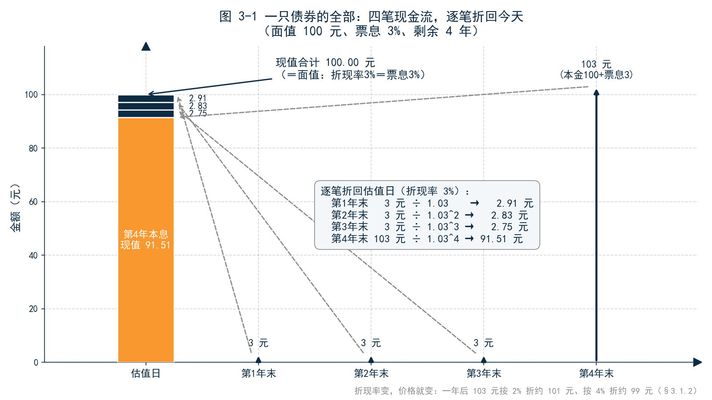
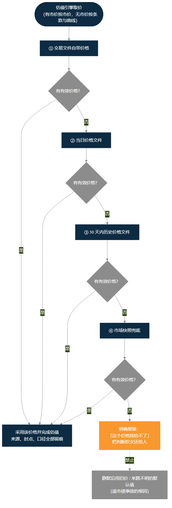
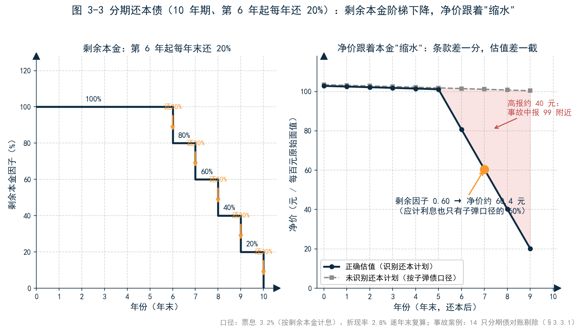
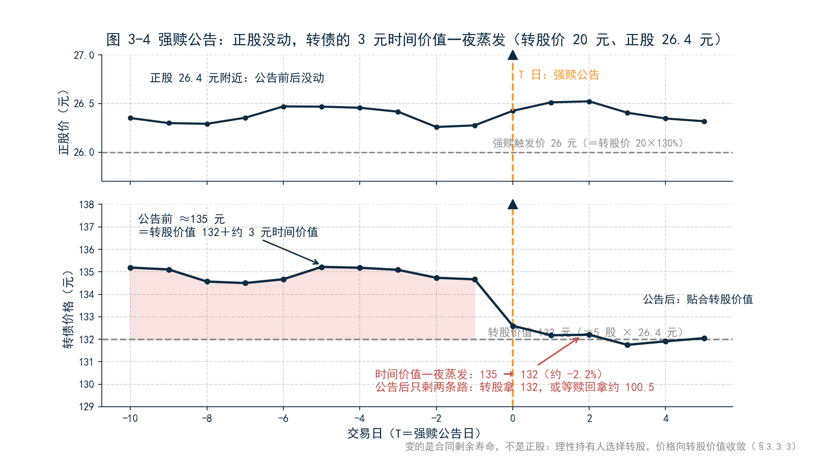
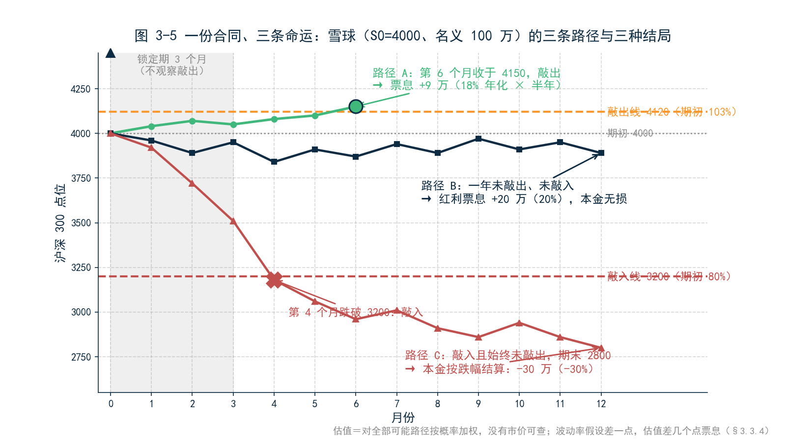
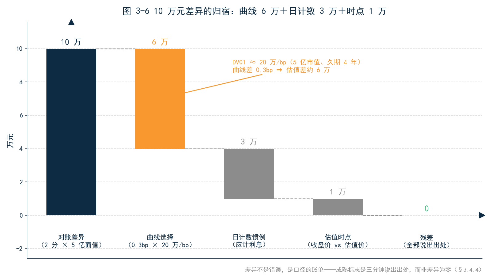

<!--
【素材来源】
- 估值基础公式（正文零公式，公式集中放附录 A）：docs/markdown/products/ch02_BOND_DETAILED.md 附录 C（PV/净价/全价/YTM/久期/凸性/DV01）
- 指标定义口径：docs/markdown/user_manual/ch12_PRODUCT_AND_METRICS_REFERENCE_MANUAL_v3.md §4.1（估值指标表：PV、净价、全价、公允价值、应计利息、YTM、Z-Spread、OAS）
- 摊余成本与 EIR（正文只用业务语言）：D:\vuepress\help-master3\zh\latest\docs\fixedincome\bond_accounting.md
- 中国条款：docs/ficc_design/BOND_SPECIAL_TYPES_ENGINE_OVERVIEW.md（分期还本剩余因子 0.60 时应计约为子弹口径 60%、净价约 60.4；前海对账剔除 14 只无还本计划分期债；已调票面禁止静默沿用旧票面）
- 可转债四条款与强赎定价：docs/markdown/products/ch04_CONVERTIBLEBOND_DETAILED.md（§3.2 强赎条款 20 日窗口/15 日触发/130%；§4.4 二叉树节点价值 = min(CB价值, 强赎价格)）
- 雪球三条路径数值案例：D:\vuepress\help-master3\zh\latest\docs\structure\snowball.md（S0=4000、名义 100 万、锁定期 3 个月、敲出 103%/敲入 80%、票息 18%/20%，路径 A/B/C = 9 万/20 万/-30 万）
- 语气范本：docs/customer/财联社/三折页文案.md、docs/customer/财联社/book/_archive/ch11_股票与基金.md
- 结构依据：docs/customer/财联社/book/_archive/02_提纲_方案B.md 第 3 章（问题驱动、品种穿插、正文零公式、章末 AI 问题、为第 5 章损益拆解埋伏笔）

【插图已完成】
图 3-1 至 3-6 已全部生成（A 类 5 张 matplotlib + B 类 1 张 Mermaid），见 figures/ch03/ 与 _archive/92_插图清单_ch03.md。数字与正文严格一致，猛犸色板统一。

【仍需补充】
1. 引子与 3.4.4 的对账差异拆解（曲线 6 万 / 日计数 3 万 / 时点 1 万）为示意数字，成稿前建议用真实对账案例替换。
3. 中债估值方法论的描述（曲线族、个券利差调整）需与中债金融估值中心公开资料核对。
4. 可转债强赎案例（转股价 20 元、正股 26.4 元、市价 135→132）为合成案例；如需真实案例，建议匿名化处理后替换。
5. 「亲手试试」的问法需与 MVE 实操包内置数据（组合编号 PORT_BOND、债券代码、中债估值对照文件）最终对齐。
6. 摊余成本与 EIR 仅点到为止；会计口径与经济口径的对账留待第 9 章（IFRS9）展开。
7. ~~正文中的【图 3-x 占位】标记待替换为实际图片引用（Markdown 图片语法或出版排版软件的图注格式）。~~（2026-09-09 已完成：图 3-1～3-6 已替换为 figures/ch03/ 下的实际图片引用）
-->

# 第 3 章　估值：从一笔交易到一个价格

## 引子：两分钱的追问

月初第一个工作日，早上八点半，某券商资管固收投资部的负责人老陈收到估值岗发来的一封邮件，标题是《10 月估值对账差异说明》。正文很短：组合里一只 5 亿面值的政策性金融债，自家估值系统算出的净价是 101.23 元，中债估值是 101.25 元，差 2 分钱。

2 分钱听起来像四舍五入的误差。但 5 亿面值持仓，每百元面值差 2 分，就是 10 万元。10 万元在月度损益里不是可以忽略的小数——它足够让财务问一句「这个差异需要调账吗」，也足够让审计问一句「你们的估值为什么不和中债一致」。

老陈还没回邮件，投资经理小李先推门进来了，问的是同一只券的另一个问题：「交易系统里这只券显示 101.20，估值系统算出来 101.23，中债估值 101.25。三个数，哪个是对的？」

下午又出了一件事。组合里一只可转债昨晚发了强赎公告，今天估值从 135 元跳到 132 元。小李又来问：「正股今天没跌，为什么估值跌了 2 个多点？是不是系统算错了？」

三个问题看起来各不相同：一个是对账差异，一个是价格打架，一个是估值跳变。但它们是同一个问题的三张面孔——**你报表上的这个价格，到底是从哪来的？**这个问题答不清楚，后面的一切都立不住：损益说不清来源，绩效算不出口径，归因对不上数字，风险量不准敞口。本章就回答这个问题。

---

## 3.1 估值的第一性问题：一串未来的钱，今天值多少

先从一个更朴素的问题开始：一只债券到底「是」什么？

### 3.1.1 把债券拆开看：它只是一串现金流

剥掉所有金融术语，一只债券就是一纸承诺：未来某几个日子，发行人付给你几笔钱。每年付一次票息，到期还本金。一只面值 100 元、票息 3%、还有 4 年到期的债券，承诺的是：第 1 年末 3 元，第 2 年末 3 元，第 3 年末 3 元，第 4 年末连本带息 103 元。

所以「这只债值多少钱」这个问题，等价于「这串未来的钱，今天值多少」。这不是查报价能回答的问题——即使报价屏上有一个价格，那个价格也只是别人对这串现金流的出价。估值的第一性原理只有一个：**把未来的每笔现金流，按今天的利率水平折算成今天的钱，加总。**这就是现值，一切估值的起点。

### 3.1.2 折现：未来的钱要打折扣

为什么未来的钱要打折？因为今天的 100 元存出去，一年后会变成 102 元多——钱有时间价值。反过来，一年后的 100 元，今天只值 98 元左右。折扣的力度由收益率曲线决定：曲线上每个期限对应一个折现率，1 年后到的钱按 1 年期利率折，5 年后到的钱按 5 年期利率折，各折各的，再加总。

一个直觉例子：两只债券都承诺一年后付 103 元，但一只折现率 2%、一只折现率 4%，今天的价值就分别是约 101 元和约 99 元。**现金流一模一样，差的是折现率。**于是估值的第一个口径选择出现了：**用哪条曲线？**国债曲线、国开债曲线、AAA 信用债曲线，折出来的价格都不一样。这个选择没有技术上的对错，只有政策上的约定——它是 3.4 节「系统间差异」的第一个来源，也是自家估值与中债估值差异的首要嫌疑人。

（现值与折现因子的公式见附录 A。）

### 3.1.3 净价与全价：把「时间的钱」从报价里剔出去

买债券实际付的钱，和报价屏上的价格，不是同一个数。

报价屏上是净价；你实际付的是全价——净价加上应计利息。应计利息是上一个付息日到今天累积的利息：你在两个付息日之间买入，等于替卖方持有了这段时间，这部分利息要在结算时补给他。

为什么报价要用净价？设想一下报价含应计利息会发生什么：付息日前一天，价格里攒了快一年的利息；付息日当天，利息付出去了，价格「断崖式」下跌——市场没有任何变化，价格却像跌了 3%。时间的流逝被误读成了市场的暴跌。净价把「时间的钱」剔出去，剩下的才是「市场的钱」：净价涨，才是真的涨。

这个区分的业务后果很实际：**交易系统通常记全价（那是你真金白银付出去的），行情屏报净价，估值系统两个都要算。**小李看到的「三个价格」里，至少有一个差异来自净价全价口径，而不是谁算错了。

### 3.1.4 到期收益率：价格的另一种说法

现值是把现金流折成价格；到期收益率（YTM）是反过来的问题——按今天的价格买入，持有到期，年化收益率是多少？

同一个信息，两种说法。价格是一个绝对数，不好横向比较：一只 98 元的债和一只 103 元的债，哪只「便宜」？比价格没意义，因为票息、期限都不同。折成 YTM 就可比了：98 元那只 YTM 3.2%，103 元那只 YTM 2.8%，前者收益率更高。交易员报价格，投资经理看 YTM，风控把 YTM 拆成「无风险利率加利差」——各取所需，但源头是同一笔现金流、同一条曲线。

值得记住的一点：**YTM 是价格的函数，价格变了 YTM 就变。**所以它适合比较、适合沟通，却不适合记账——账上记的是价格，不是收益率。

### 3.1.5 久期与 DV01：把敏感度翻译成钱

业务负责人不需要会算久期，但需要会用久期思考。久期的直觉一句话：**利率上行 1 个百分点，价格大约跌百分之几。**久期 4 年的债，利率上 1%，价格跌约 4%；上 1 个基点（万分之一），跌约 0.04%。

DV01 把久期从百分比翻译成钱：利率动 1 个基点，持仓市值动多少。5 亿市值、久期 4 年的持仓，DV01 约 20 万——曲线动 1 个基点，估值动 20 万。

记住这个数，它在 3.4 节有用：老陈那 10 万元的对账差异，折算下来只是半个基点的曲线差异。**债券估值的精度战争，打到最后一律是基点零头之战。**

---

## 3.2 价格从哪来：市价、估值价与模型价

小李的问题——「三个价格哪个对」——的正式答案是：三个都可能对，因为它们来自三条不同的价格来源。估值的第一条工程原则是：**有市价按市价，无市价按条款与曲线定价。**

### 3.2.1 有市价按市价

可转债在交易所连续竞价，活跃利率债每天有真实成交，这类资产的价格直接从市场来。市价优先的理由很朴素——公允价值的定义就是「此刻有序交易能成交的价格」，有真实交易的地方，不需要模型。

但市价有市价的管理问题。交易系统里躺着的 101.20，是这只券的**最后成交价**——而这只券可能已经三天没成交了，那是一个旧价格，不是今天的估值。交易系统的职责是记录「你多少钱买的、市场最后多少钱成交」，估值的职责是回答「今天值多少」。两个系统价格不一样，往往不是因为谁错了，而是因为它们在回答不同的问题。

市价还有另一层值得知道的事：**市价也会偏离理论价值。**A 股可转债市场是出了名的例子——T+0 交易、散户参与度高、情绪驱动明显，市价经常偏离模型算出的理论价。成熟的做法不是二选一，而是两个都要：估值按市价入账（公允价值优先），同时用模型价反推一个隐含利差（OAS）持续监控——市价相对理论价贵了多少、便宜了多少，本身是一个交易信号和风控指标。市价是答案，模型价是尺子，两者对照才有意义。

### 3.2.2 无市价按曲线：中债估值是什么

银行间市场的债券大多不活跃——全市场几万只债，每天真正有成交的是少数。没有市价，就要靠模型：按条款推出现金流，按曲线折现。

中国市场的特殊之处是，这件事有一个「官方答案」：中债金融估值中心每个交易日发布全市场债券的估值价与估值收益率，用一整套收益率曲线族（国债、国开、各评级信用债）加个券利差调整算出来。它是净值计算、会计记账、监管报送普遍采用的「市场共识价」。

注意「共识价」这三个字的含义：中债估值不是成交价，不保证你能按这个价格卖出去；它是一个**方法论公开、口径统一、全市场共用**的模型价。它的价值不在于「准」，在于「同」——全行业用同一把尺子，净值才可比，审计才有基准。所以机构内部估值与中债估值存在小幅差异是正常的，需要管理的不是「消灭差异」，而是「解释差异」：差异来自曲线、条款还是口径，必须说得清。

实务上还有一个双轨校验的惯例：主估值源用中债估值，备用估值源用中证估值或上清所估值，两者出现显著偏离时触发人工复核。对没有活跃报价的债券，通行做法是「收益率曲线加信用利差调整」——这正是 3.1 节现值逻辑的应用，只是利差那一下调整，靠的是估值人员的判断，而判断需要留痕。

### 3.2.3 第三种「价」：摊余成本

市价和模型价之外，会计口径下还有第三种「价」：摊余成本。

它的逻辑完全不看市场：买入一只 98 元的债，买入那一刻锁定一个实际利率（EIR），之后账面价值每天按这个利率「爬坡」，付息日扣掉收到的票息，到期那天正好爬到 100 元面值。市场涨跌与它无关——利率上行、债券市价跌到 96 元，摊余成本的账面依然按自己的节奏爬坡。

这造就了两种并行的估值世界观：**市价口径回答「现在值多少」，摊余成本口径回答「持有到期能赚多少」。**同一只债，两个账面价值，两套损益逻辑——会计报表和经济绩效对不上，根源就在这里。这是第 9 章（IFRS9）的主题，本章只需记住：当你看到「估值」两个字，先问一句——这是哪一种价？

### 3.2.4 价格来源链：错得清楚，好过错得安静

工程上，「有市价按市价、无市价按曲线」要落地成一条明确的价格来源链。以估值引擎的做法为例，一只资产的价格按优先级依次取：交易文件自带的价格、当日价格文件、三十天内的历史价格文件、市场快照兜底。链条上任何一环提供了有效价格，估值就能完成；全都缺失，引擎明确报错——而不是悄悄用一个来路不明的默认值。

这条链的设计哲学值得业务负责人记住：**错得清楚，好过错得安静。**一只已经退市、没有兑付价的债券，最危险的处理不是报错，而是系统默默沿用最后价格继续估值——报表上看不出任何异常，直到审计发现这只券已经不存在了。报错是估值系统在履行职责：它把「这个数字我给不了」显性化，把判断权交还给人。

---

## 3.3 条款即估值：条款不是附属信息

前两节把估值讲成了「现金流加曲线」。但现金流从哪来？从条款来。这是中国债券市场最容易被低估的一句话：**条款不是债券的附属信息，条款就是估值本身。**系统对条款的理解差一分，估值就差一截。本节用四个本土案例说明。

### 3.3.1 分期还本：本金少了，利息和身价都跟着少

欧美市场的债券大多是「子弹式」：到期一次还本。中国市场有大量分期还本债券——比如一只 10 年期债券，约定从第 6 年起每年末偿还 20% 本金。

分期还本对估值的影响是全方位的。本金逐年减少，计息基数就逐年减少：剩余本金 60% 时，每期票息只有发行时的 60%，应计利息也是同票面子弹债的 60%。净价也跟着降：一只剩余本金 60% 的分期债，净价大约在 60 元附近（按每百元原始面值报价），而不是 100 元附近。

这不是理论推演，是真实事故。某机构对账时发现，系统里没有录入还本计划的分期债，一律按 100% 面值计息——剩余本金只剩 60% 的券，应计利息多算了四成，净价报在 99 元附近而不是 60 元附近。对账时不得不把 14 只这类债券整体剔除，等条款补录后再估。**报表上一只「净价 99.8」的分期债，不是估值准，是系统根本不知道它还过本。**

反过来，条款齐备时引擎的表现是可验证的：以一只真实的分期还本债为例，估值日剩余本金因子 0.60，引擎算出的应计利息应约为同票面子弹债的 60%，净价约 60.4 元（每百元原始面值）——这两个数就是验收标准，差一点都不行。条款驱动的估值，好处就在于对就是对、错就是错，没有模糊地带。

### 3.3.2 阶梯票息与已调票面：3+2 中票活到哪一年

第二个本土条款是票息不固定。可转债的票息通常逐年爬坡——第 1 年 0.5%，第 6 年 2.0%；分段票息债前 3 年一个票息、后 2 年另一个。现金流不是「一个票息乘期限」能概括的，必须按分段日程逐期生成。

更微妙的是「3+2」「5+2」这类含权中票：5 年期债券，第 3 年末发行人有权调整票面利率，投资者有权按面值回售。第 3 年末会发生什么，取决于发行人的选择：如果市场利率下行，发行人把票面从 3.5% 大幅下调到 1%，投资者大概率集体回售——这只「5 年期」债券实际只活了 3 年。

估值因此必须先回答一个非技术问题：**你假设它活到哪一年？**按 5 年现金流折现和按 3 年折现，价格差一截，久期差得更多——4 年多对 2 年多。而发行人未来会把票面调到多少，合同里没写，这属于「未来票面未知」。成熟的系统在这里的纪律是：要么由估值政策显式给出假设票面，要么明确预警「条款未完整建模」；**禁止静默沿用旧票面，假装一切已知。**一个默认值不会报警，但它会让全组合的久期带上系统性偏差。

### 3.3.3 可转债强赎：公告之后，时间价值蒸发

回到老陈下午的第三个问题：正股没跌，可转债估值为什么跳了 2 个多点？

先把这只券的数字摆出来：转股价 20 元，正股现价 26.4 元。每张面值 100 元的可转债可转成 5 股，转股价值就是 5 乘 26.4，等于 132 元。强赎条款约定：转股期内正股连续 20 个交易日中至少 15 日收盘价不低于转股价的 130%（即 26 元），发行人有权按「面值加应计利息」（约 100.5 元）赎回尚未转股的债券。

公告前，市价 135 元，等于转股价值 132 元加约 3 元的期权时间价值——市场还在为「正股继续涨、转债跟着涨」的可能性付费。

强赎公告改变的不是正股，是**这份合同的剩余寿命**。公告后，持有人面前只剩两条路：转股，拿 132 元；或者等赎回，拿 100.5 元。理性选择是转股。于是转债价格向转股价值收敛，那 3 元时间价值一夜蒸发——正股一动不动，估值跳变 2% 以上。

对估值系统，这是条款驱动估值的最直接例证：定价模型在每个节点上都要判断「强赎触发了没有」，一旦触发，节点价值就被压到赎回价与转股价值的较低者附近。**模型里有没有强赎条款、条款参数对不对，直接决定公告前后估值是平滑过渡还是断崖跳变。**而交易系统的「最后成交价」、估值系统的模型价、公告后的市场新价，三者在这个时点出现分歧，是条款状态切换的正常现象，不是系统故障。

强赎只是可转债四个条款里最戏剧化的一个。它的三个「兄弟」——回售（正股持续低迷时持有人可按面值回售，构成价值下限）、转股价下修（发行人可下调转股价促转股，转股价值随之抬升）、股息保护（分红后转股价相应调整）——每一个都以同样的方式影响估值：不改变正股，改变合同的现金流与期限结构。四个条款的完整讨论见第 8 章，这里只需建立直觉：**可转债的价格里，有一半信息写在正股行情里，另一半写在募集说明书里。**

### 3.3.4 雪球：一份合同，三条命运

最后一个案例把「条款即估值」推到极端。雪球结构没有交易所市价，它的全部价值由合同条款决定。

把一份典型雪球的合同翻译成业务语言：名义本金 100 万，挂钩沪深 300，期初 4000 点，期限一年；前 3 个月是锁定期，不观察敲出；之后每月观察一次，指数收于 4120 点（期初的 103%）以上则合约提前终止，按年化 18% 支付已持有期间的票息；存续期内任何一个交易日收于 3200 点（期初的 80%）以下，记为「已敲入」；一年到期时，若从未敲出也从未敲入，按年化 20% 付红利票息；若曾敲入且始终没能敲出，按期末指数相对期初的涨跌幅结算——跌多少，本金亏多少。

这份合同的命运只有三条路径：

| 路径 | 发生了什么 | 投资者拿到 |
|---|---|---|
| A：第 6 个月敲出 | 指数收于 4150，合约终止 | 约 9 万票息（18% 年化，持有半年） |
| B：一年未敲出、未敲入 | 指数始终在 3200–4120 之间 | 20 万红利票息，本金无损 |
| C：曾敲入、从未敲出 | 第 4 个月跌破 3200，期末 2800 | 亏 30 万（本金按跌幅结算） |

雪球的估值，就是给这三条路径（以及它们之间的无数条细分路径）各自标一个发生概率，把概率乘支付、折现加总。**它没有一个可以查的「市价」，也没有一个闭式公式——估值本身就是一次对全部可能未来的加权平均。**概率怎么估？靠波动率。用历史波动率和用隐含波动率曲面，算出的敲入概率不同，估值能差出几个点的年化票息。所以雪球的估值差异，本质是对「未来波动」的判断差异——这是 3.4 节的又一个注脚。

---

## 3.4 为什么不同系统算出来不一样

现在可以正式回答引子里的第一个问题了。两个系统对同一只债给出不同估值，差异来源无非三类：**曲线、条款、口径。**

### 3.4.1 曲线选择：折现率差半个基点

估值曲线的选择是政策，不是技术：用中债曲线还是自建曲线？用国债曲线加信用利差，还是直接用对应评级的信用债曲线？估值曲线与基准曲线是不是同一条？每一种选择都合法，每一种都会产生差异。

用 3.1 节的 DV01 直觉换算：5 亿市值、久期 4 年的持仓，曲线差 1 个基点，估值差约 20 万。老陈那 10 万元（2 分钱）的差异，对应曲线差异只有半个基点——**中债曲线与自家曲线在任何期限上差出半个基点，都是再正常不过的事。**

### 3.4.2 条款处理：识别了没有，假设是什么

第二类差异来自条款。分期还本识别了吗？3+2 的未来票面假设是什么？强赎条款的参数（20 日窗口、15 日触发、130% 比例）录入得对吗？3.3 节的四个案例已经说明，条款处理的差异不是小数点后的差异，而是百分之几十的差异——一只没识别还本计划的分期债，应计利息能差四成。

条款差异的隐蔽之处在于：**它不像曲线差异那样每天均匀分布，而是集中在特定品种上爆发。**普通子弹债各家系统算出来都差不多，差异全藏在分期债、含权债、可转债、结构化产品里。对账差异排查的正确顺序，是先按品种筛，再按条款查。

### 3.4.3 口径差异：净价全价、面值基准、日计数

第三类差异最琐碎也最常见：一个报净价一个报全价；分期债按原始面值报价还是按剩余面值报价；应计利息按实际天数还是按「30/360」计；估值时点取收盘价还是取估值价。每一项单独看都是小数点后的事，加在一起足以解释大多数日常对账差异。

口径差异的治理没有技术含量，只有纪律：**把口径写进估值政策文档，全系统执行同一套；跨系统对账时，先对口径，再对数字。**

三类来源放在一起，可以总结成一张排查速查表：

| 差异来源 | 量级 | 分布特征 | 排查动作 |
|---|---|---|---|
| 曲线选择 | 每半个基点约 10 万（5 亿、久期 4 年持仓） | 全组合均匀分布，每日都有 | 对比自家曲线与中债曲线的期限点差 |
| 条款处理 | 可达百分之几十 | 集中在分期债、含权债、可转债、结构化产品 | 先按品种筛，再逐券核对条款字段 |
| 口径差异 | 小数点后，但笔笔都有 | 全组合均匀分布 | 对净价全价、面值基准、日计数、估值时点 |

### 3.4.4 回到两分钱

老陈的 10 万元差异，最后的排查结果是：曲线贡献约 6 万（自家曲线与中债曲线在 4 年期限上差 0.3 个基点），应计利息的日计数惯例贡献约 3 万，剩余 1 万来自估值时点差异。没有谁是错的——**差异不是错误，差异是口径的账单。**估值管理的成熟标志，不是差异为零，而是每一分差异都能在三分钟内说出出处。

---

## 3.5 估值是损益拆解的第一环

本章开头承诺过，估值不是一个孤立的终点。这里埋下通往第 5 章的伏笔。

业务负责人最常被问、也最难答的问题是：「今天组合赚了 200 万，这 200 万从哪来？」回答它的第一步，朴素得容易被忽视：**同一批持仓，昨天估一次，今天估一次。**两次估值之差，加上今天的现金流，就是总损益。然后才有拆解：票息贡献多少（时间的钱）、曲线变动贡献多少（市场的钱）、利差变动贡献多少（信用的钱）、择券贡献多少（个券相对曲线的超额表现）、残差多少（解释不了的钱）。债券组合的这套拆解有个专门的名字——Campisi 框架，它是第 5 章的主角之一。

这里能看出估值质量如何决定拆解质量：拆解的每一项，都是「保持其他条件不变、只动一个输入」的重定价之差——只动曲线得到曲线贡献，只动利差得到利差贡献。这意味着**估值引擎必须能对同一持仓做多次「假如……」式的重定价**，而且每次重定价的条款处理、日计数、面值基准必须严格一致。

注意这个流程对估值质量的要求是加倍的。单次估值差 2 分钱，只是对账问题；**两次估值的口径如果不一致——昨天用曲线 A、今天换成曲线 B，昨天没识别还本计划、今天补录了——损益里就混进了「口径切换」的噪音**，拆解的残差会大到无法解释，「200 万从哪来」依然答不上。损益拆解要求估值在两个时点上同批持仓、同族曲线、同一套条款处理——这就是「同源」二字的分量，也是第 5 章的全部出发点。

---

## 3.6 如果 AI 来估值

章末照例问那个问题：如果让 AI 来回答「这只债值多少钱」，会发生什么？

先设想一个天真的做法：把条款丢给大模型，让它「算一个价」。它会立刻撞上本章的全部难点——用哪条曲线？中债的还是你家的？分期债的还本计划在哪？3+2 的未来票面假设什么？强赎公告出了没有？雪球用历史波动率还是隐含波动率？**这些问题没有一个是知识问题，全是政策问题——答案不在任何教科书里，在你机构的估值政策文档里。**AI 不知道你家的政策，它就会替你猜一个；而猜出来的数字，审计不认。

所以正确的分工是本章逻辑的延伸：估值数字必须由可追溯的引擎产生——条款进引擎、曲线进引擎、口径进政策，每一个数字都能回答「从哪来」；AI 站在引擎之上，做它擅长的三件事——**问数**（「组合里估值与中债差异最大的是哪三只券」）、**诊断**（「差异来自曲线、条款还是口径」）、**成文**（把差异说明写成能进决策会的报告）。你可以质疑 AI 成文的角度，但不必质疑数字本身。

「这个数字从哪来」在 AI 时代不是更轻了，而是更重了：AI 生成的内容越流畅，数字的可追溯性越稀缺。这是第四部分（第 10、11 章）要展开的主题。

---

## 本章概念卡

| 概念 | 一句话解释 | 详见 |
|---|---|---|
| 折现 | 未来的钱按折现率换算成今天的钱，估值的第一性原理 | §3.1.2 |
| 净价与全价 | 全价 = 净价 + 应计利息，把「时间的钱」从报价里剔出去 | §3.1.3 |
| 到期收益率（YTM） | 使现金流折现值等于价格的折现率——价格的另一种说法 | §3.1.4 |
| 久期与 DV01 | 价格对利率的敏感度，DV01 把它翻译成「1 个基点值多少钱」 | §3.1.5 |
| 价格来源链 | 市价、估值价、模型价的优先级链条——错得清楚，好过错得安静 | §3.2.4 |
| 摊余成本 | 按买入时锁定的实际利率爬坡的账面价，不看市场脸色 | §3.2.3 |
| 条款即估值 | 分期还本、阶梯票息、强赎直接改变现金流，条款不是附属信息 | §3.3 |
| 口径差异 | 净价全价、面值基准、日计数等口径选择，是系统间 2 分钱差异的来源 | §3.4.3 |

---

## 本章小结

回到引子的三个问题。

**为什么我的估值和中债估值差了 2 分钱？**因为估值等于现金流乘曲线，而曲线选择是政策不是技术。半个基点的曲线差异，就足以解释 2 分钱。差异不是错误，是口径的账单——成熟的估值管理不追求差异为零，追求每一分差异都能说出出处。

**为什么交易系统里的价格和估值系统里的价格不一样？**因为它们在回答不同的问题。交易系统记录「多少钱成交的」，估值系统回答「今天值多少」。有市价按市价、无市价按条款与曲线定价，价格来源链的终点是明确报错——错得清楚，好过错得安静。

**为什么可转债的估值在强赎公告后跳变了？**因为条款就是估值本身。强赎公告改变了合同的剩余寿命，时间价值一夜蒸发，价格向转股价值收敛——正股没动，变的是条款状态。分期还本、阶梯票息、已调票面、敲入敲出，同理：**系统对条款的理解差一分，估值就差一截。**

最后记住估值的下游身份：它是损益拆解的第一环。「今天赚的 200 万从哪来」，从同一批持仓在两个时点的两次同源估值开始。估值口径不稳，拆解必残——这是第 5 章的起点。

本章涉及的公式（现值、净价全价、到期收益率、久期、DV01、摊余成本与实际利率）集中收录于附录 A；中国债券特殊条款的速查见附录 E。

---

## 亲手试试

打开 MVE 实操包，对 AI 说：

> 「查一下组合 PORT_BOND 今天所有债券的估值与中债估值的差异，按差异从大到小排序，告诉我差异最大的三只券各是什么原因——曲线、条款还是口径；再把那只分期还本债单独拿出来，告诉我它今天的剩余本金比例、应计利息和净价，如果按子弹债口径算会差多少。」

跑完之后，试着追问一句：「如果这只 3+2 中票假设第 3 年末回售，估值和久期会变多少？」——这两个问题的答案，就是本章的全部要点。
