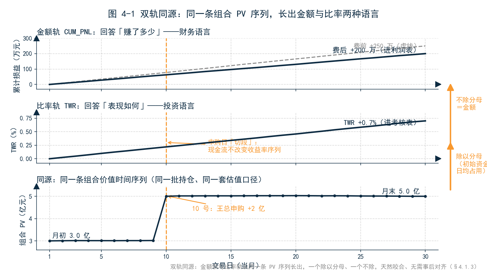
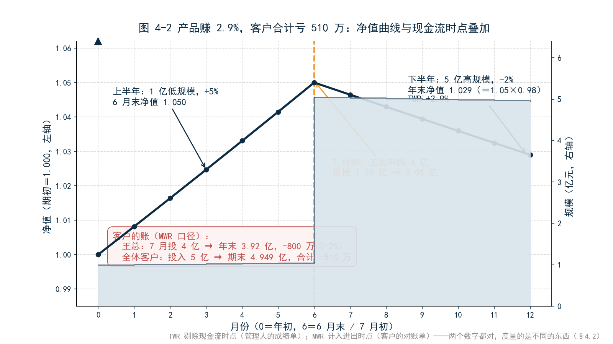
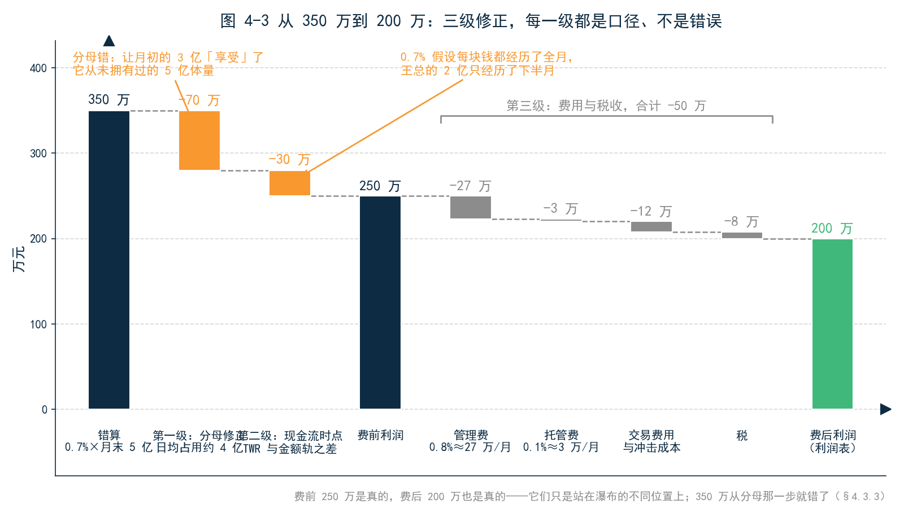
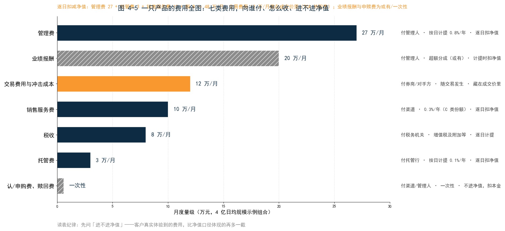
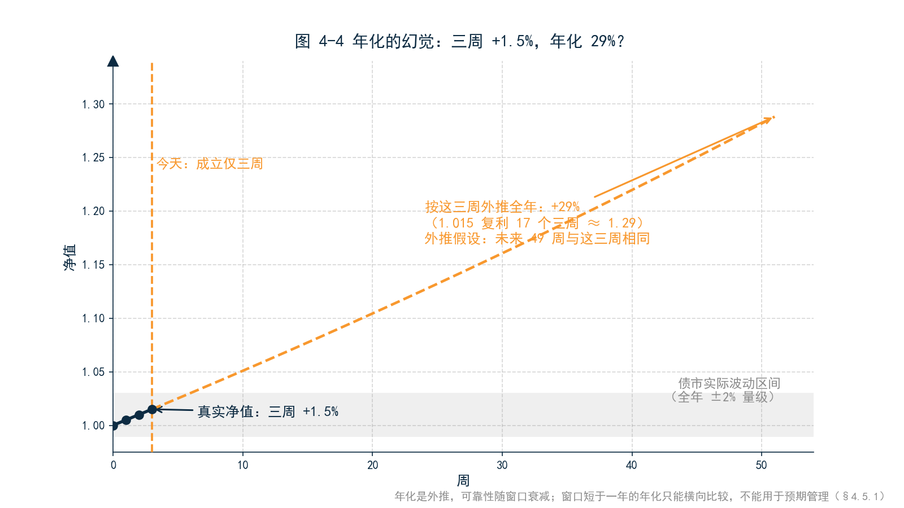
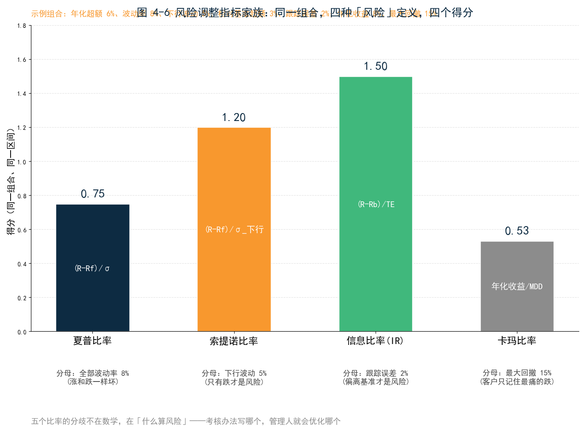

<!--
【素材来源】
- 绩效指标定义与口径陷阱：docs/markdown/products/ch42_PERFORMANCE_METRICS_DETAILED.md（六类指标、快照频率 vs 日频假设、PV 穿零与空头组合边界、initial_capital 分母优先级）
- 指标业务含义：docs/markdown/user_manual/ch12_PRODUCT_AND_METRICS_REFERENCE_MANUAL_v3.md 第 6 章（收益类/风险调整/风险特征三表）；ch12 v2.1 §6 双轨模型（金额轨 CUM_PNL vs 比率轨 TWR）与观测门槛
- 分红送转损益三分拆、理财破净叙事：docs/customer/财联社/book/_archive/ch11_股票与基金.md §11.1.2、§11.4.1（方案 B 下并入本章）
- 摊余成本 vs 市价：D:\vuepress\help-master3\zh\latest\docs\fixedincome\bond_accounting.md
- 语气范本：docs/customer/财联社/三折页文案.md、12_第3章_估值.md
- 结构依据：docs/customer/财联社/book/_archive/02_提纲_方案B.md 第 4 章

【仍需补充】
1. 引子的月度对账案例（月初 3 亿、月中申购 2 亿、TWR 0.7%、费后利润 200 万、350→280→250→200 三级修正）与 4.2 的年度案例（年初 1 亿、7 月申购 4 亿、TWR +2.9%、客户合计亏 510 万）均为合成案例，数字自洽但非真实产品，成稿前建议用匿名化真实数据替换。
2. 4.3 费用瀑布（管理费 0.8%、托管费 0.1%、交易费用、税）为行业常见量级，需按目标读者机构实际费率核对；资管产品增值税口径建议请税务合规复核。
3. 2022 年理财破净潮（3–4 月股债双杀、11 月债市负反馈）与「基金赚钱、基民亏钱」的表述需与公开研究/报道核对。
4. 夏普与最大回撤的口径边界（快照频率、PV 穿零、空头组合）以 ch42 为准；GIPS 合规宣称引擎明确不做，正文勿过度承诺。
5. 「亲手试试」问法需与 MVE 实操包内置数据（组合编号 PORT_BOND、快照序列、performance_metrics 配置）最终对齐。
6. ~~正文【图 4-x 占位】待替换为实际图片引用。~~（2026-09-09 已完成：图 4-1～4-4 已替换为 figures/ch04/ 下的实际图片引用）

【内容增强记录】2026-09-09（依据《内容增强方案.md》）：
- 新增 §4.3.4「交易成本分析（TCA）」：执行缺口四分拆（延迟/冲击/择时/机会成本）、五种基准价口径、固收 TCA 特殊性；公式收录于附录 B.11
- 新增知识框 3 处：§4.2 后「多期链接」（几何 vs 算术链接、波动率拖累、Carino/Frongello 归因链接）、§4.3.4 后「费用全图」（七类费用清单）、§4.5.3 后「风险调整指标家族」（夏普/Sortino/IR/Calmar/Treynor）
- §4.6 口径清单表新增「执行：TCA 基准价口径」一行；本章小结前新增「本章概念卡」（8 张）
- 新增插图：图 4-5（费用全图）、图 4-6（风险调整指标家族），脚本 _build/gen_enhancement_figures.py
-->

# 第 4 章　绩效：从价格序列到收益率

## 引子：三个收益率

月度经营分析会开到一半，财务总监放下手里的报表，问了老陈一个问题：「你们固收部这个月利润 200 万，我看到了。但你们月报上印的收益率是 0.7%，按月末 5 个亿的规模算，应该赚 350 万。差的 150 万去哪了？」

老陈还没答上来，手机震了一下。机构客户王总发来一条微信，语气不算客气：「陈总，你们月报写本月收益 0.7%。我 10 号申购的 2 个亿，到月底账户上只多了 0.2%。你们这个数字是怎么算出来的？」

散会后，投资经理小李跟到办公室，问的是第三个版本的问题：「陈总，季度考核快开始了。我们组合的时间加权收益率是 0.7%，资金加权只有 0.6%，财务口径算下来是 0.4%。考核用哪个数？差出来的部分，算我的还是不算我的？」

三个问题指向同一件事：**这个月赚的 200 万，到底是不是真的赚了？**第 3 章回答了「一个时点的价格从哪来」，本章回答「一段时间的收益从哪来」。答案先说在前面：**绩效数字不是算出来的，是定义出来的。**收益率的分子是什么、分母是什么、现金流怎么处理、费用扣没扣、和谁比、按什么时间尺度看——每一个选择都是政策，不是数学。把定义讲清楚之前，「赚了多少」这个问题没有答案。

---

## 4.1 收益率的第一性问题：分子分母都是选择

### 4.1.1 简单收益率：没有现金流时的完美答案

最朴素的收益率算法人人会算：期末减期初，除以期初。1 个亿变成 1.005 亿，收益率 0.5%。

这个算法有一个隐含前提：**期间没有一分钱进出。**期初那 1 个亿原封不动地经历了整段时间，没有新钱进来，也没有旧钱出去。前提成立时，简单收益率就是完美答案——它精确地回答了「每 1 元本金赚了多少钱」。

问题在于，真实组合几乎从来不满足这个前提。客户会申购赎回，产品会分红，债券会付息、会到期还本。每一笔现金流进出，都在改变「本金」的含义：期初的 3 个亿和月末的 5 个亿，哪一个才是「本金」？现金流一进来，简单收益率的分母就开始摇晃——三个收益率的故事，就从这里开始。

### 4.1.2 分母的选择：月末规模、日均占用与初始资金

财务总监的 350 万是这么算的：月报收益率 0.7% 乘以月末规模 5 亿。这个算法错了两次，第一错就在分母。

这个月的规模不是 5 亿。月初只有 3 亿，10 号王总申购 2 亿之后才变成 5 亿。用月末规模乘全月收益率，等于让月初的 3 亿也「享受」了它从未拥有过的资金体量。按日均占用算，这个月的分母大约是 4 亿：0.7% 乘 4 亿是 280 万——比 350 万接近真相了，但依然不是利润表上的 200 万。

**同一个组合、同一个月，分母取月末规模、日均占用还是初始资金，能算出三个收益率。**规模稳定的组合，三个数差不多；规模剧烈变动的组合——比如月中进来 2 亿这种情形——三个数可以差出百分之几十。所以绩效报告的第一条纪律是：**报收益率必须同时报分母口径。**只报一个百分比、不报分母，等于报了一个没有单位的数字。

### 4.1.3 金额与比率：200 万是多还是少

还有一个更隐蔽的选择：绩效到底用金额表达，还是用比率表达？

200 万是金额，0.7% 是比率。两个数描述同一个月，回答的却是两个问题。金额回答「为部门赚了多少钱」——这是财务语言，进利润表；比率回答「每单位本金的表现如何」——这是投资语言，进考核表。两种语言都对，但不能混用：用比率考核投资经理、用金额考核部门利润，前提是两个口径在同一批持仓、同一套估值下各自算清楚。

实务中常见的混乱是「双轨变单轨」：金额轨来自财务系统，比率轨来自投资系统，两边估值口径不一样，月末对不上，再花一周拼数。估值中枢的做法是**双轨同源**：金额轨（累计损益）和比率轨（时间加权收益率）从同一条组合价值时间序列里长出来，一个除以分母、一个不除，天然咬合，不需要事后对齐。

---

## 4.2 为什么你的收益率和基金公司不一样

现在可以正式回答王总的问题了。为了让数字看得更清楚，我们把时间拉长到一年——王总去年 7 月还有过一笔更大的申购，4 个亿。那只产品全年的资金流水是这样的：

- 年初规模 1 亿，上半年债市走牛，净值涨 5%，规模变成 1.05 亿；
- 7 月初，王总申购 4 亿，规模变成 5.05 亿；
- 下半年债市调整，净值跌 2%，年末规模 4.949 亿。

### 4.2.1 一笔申购如何「偷走」收益率

年底，产品年报印出来：**本年度收益率 +2.9%**。王总拿出自己的账户流水：7 月申购 4 亿，12 月底市值 3.92 亿，**亏了 800 万，收益率 −2%**。

王总的第一反应是「数字印错了」。没印错。2.9% 是这么算的：上半年涨 5%、下半年跌 2%，两段首尾相乘，1.05 乘 0.98 等于 1.029，全年 +2.9%。−2% 也是这么算的：王总的钱 7 月才进来，只经历了下半年那段 −2%。**两个数字都对，它们只是度量了不同的东西。**

更扎心的是把全体客户加起来：年初的 1 亿变成 1.029 亿，王总的 4 亿变成 3.92 亿，合计期末 4.949 亿；而客户们一共投入了 5 亿。**产品全年收益率 +2.9%，客户们的钱合计却少了 510 万。**这就是业内说了很多年的「基金赚钱、基民亏钱」——不是基金在造假，是收益率的定义里根本不包含客户的进出时点。

### 4.2.2 TWR：把现金流的影响剔出去

基金公司年报印的是时间加权收益率（TWR）。它的做法一句话可以说清：**在每笔现金流进出的时点上把净值「切段」，段内算收益率，段间首尾相乘。**

现金流进来的那一刻，先按当时净值把此前的收益率「封盘」，新钱进来后重新起算。这样，申购赎回只改变规模，不改变收益率序列——王总的 4 亿 7 月 1 日进来，TWR 在那一刻切段，上半年的 +5% 已经锁定，下半年的 −2% 从新起点算，两段相乘，+2.9%。

TWR 度量的是「管理人把 1 元钱从头到尾管得怎么样」，它刻意剔除了现金流时点的影响。这个剔除正是它存在的理由：**申购赎回是客户决定的，不是投资经理决定的。**用 TWR 考核投资经理，考核的是他能控制的东西——每一段里的投资表现，而不是客户什么时候进、什么时候出。

### 4.2.3 MWR：客户的真实体验

但客户体验到的恰恰是现金流时点。资金加权收益率（MWR，内部收益率 IRR 的另一种说法）回答的是另一个问题：**考虑每一笔钱的进出时点，这笔投资实际的回报是多少？**

把王总的流水代入：7 月 1 日投入 4 亿，12 月 31 日市值 3.92 亿，半年 −2%，年化约 −4%。把全体客户的流水代入：年初投 1 亿、年中投 4 亿、年末合计 4.949 亿，算出来的资金加权收益率是负数——尽管产品 TWR 是 +2.9%。

MWR 度量的是「钱本身的体验」：钱什么时候进、什么时候出、进出多少，全部计入。它回答不了「投资经理管得好不好」，但如实回答「客户赚到钱没有」。**TWR 是管理人的成绩单，MWR 是客户的对账单——两者度量的是同一个组合的两个侧面。**

### 4.2.4 为什么基金公司报 TWR，客户感受是 MWR

这个分裂不是中国市场的特例，而是全球资管行业的结构性事实。国际绩效呈报标准（GIPS）要求管理人对外呈报 TWR，理由很正当：TWR 剔除了管理人控制不了的现金流，不同管理人之间才可比——否则，一个恰好在牛市前收到大额申购的管理人，会凭空显得比同行优秀。

但客户不管这些。客户的体验是 MWR：他在净值高点被渠道营销打动、大额申购，在低点熬不住赎回，个人收益率系统性地低于产品 TWR。行为金融学管这个叫「投资者择时惩罚」，中国市场的数据同样如此——权益基金长期 TWR 为正、基民整体体验却差得多，主因就是申购集中在高点。

对业务负责人，这个分裂有三层管理含义。第一，**对外报数用 TWR，对内算账必须同时看 MWR**——客户的真实体验决定他持有还是赎回，而赎回行为反过来冲击组合管理。第二，**渠道考核不能只看产品 TWR**——在高点冲量的渠道，是在透支客户信任。第三，向客户解释差异时别讲公式，讲现金流时点：「您的钱 7 月才进来，没赶上上半年那段」——一句话能讲清的事，不要让它发酵成投诉。

回到财务总监的账：350 万先被分母修正到 280 万，但 280 万仍不是费前利润 250 万。差的 30 万，正是 TWR 与金额轨之间的天然缝隙——0.7% 假设每块钱都经历了全月，而王总的 2 亿只经历了下半月。**现金流剧烈变动的月份，比率轨和金额轨本来就对不齐，这不是错误，是两种度量各自的诚实。**

> **【知识框】多期链接——月度收益率为什么不能直接相加**
>
> TWR 解决了「现金流进出」的口径问题，但还有一个更隐蔽的问题藏在时间维度上：把 12 个月的月度收益率拼成年度收益率，怎么拼？
>
> 直觉的答案是加起来——而它是错的。1 月 +1%、2 月 −1%，两个月合计不是 0%：1.01 × 0.99 = 0.9999，合计 −0.01%。**收益率的跨期累计是乘法，不是加法。**乘法口径叫几何链接（复利），加法口径叫算术链接（单利）。
>
> | 口径 | 算法 | 隐含假设 | 适用场景 |
> |---|---|---|---|
> | 几何链接 | (1+r₁)×(1+r₂)×…×(1+rₙ) − 1 | 每期盈亏进入下一期本金，利滚利 | 绩效呈报的标准口径 |
> | 算术链接 | r₁ + r₂ + … + rₙ | 每期盈亏与本金无关，不再投资 | 极短窗口的粗略估算 |
>
> 两种口径的差异在三种情形下被放大：收益率绝对值大（月度 ±5% 以上）、期数多（季度以上）、序列波动大。一个经典例子：某月 +50%、次月 −50%，算术和是 0%，几何结果是 −25%。**波动本身在复利结构下是损耗**——涨 50% 再跌 50%，本金只剩七成五。这个损耗叫波动率拖累（volatility drag），它解释了为什么高波动策略的「算术平均收益」永远高估客户的真实体验。
>
> 工程纪律有三条：
>
> - **累计收益率一律用几何链接。**月报拼季报、季报拼年报，乘法；算术链接只出现在草稿纸上。
> - **超额收益的多期累计同理。**算术超额逐月相加会发散——12 个月各跑赢 0.1%，加总是 +1.20%，几何口径约 +1.16%；跨币种组合必须用几何口径（§4.4.3）。
> - **归因效应的多期拼接另有专门算法。**Brinson 三效应逐月算出后不能直接相加，需要 Carino、Frongello 等链接算法把每期效应乘上链接系数——「这个月的归因报告和上个月的接不上」，八成是链接口径没统一（详见第 5 章 §5.4.3 与附录 C.6）。
>
> 多期链接是「绩效数字是定义出来的」在时间维度上的投影：单期收益率是度量，多期累计是政策。

---

## 4.3 账面与到手之间：费用、税收与滑点

三级修正的最后一级，从费前 250 万到费后 200 万，隔着 50 万的固定流出。

### 4.3.1 费前与费后：管理费的口径

投资经理月报上的收益率通常是费前的：组合市值涨了多少就是多少。但利润表上的 200 万是费后的——计提了管理费、托管费之后剩下的。

量级感受一下：日均规模 4 亿、管理费率 0.8% 的产品，每月计提管理费约 27 万；托管费率 0.1%，再提约 3 万。光这两项，一个月就是 30 万——占 200 万利润的六分之一。**费前收益率和费后收益率之间，隔着一条固定的、与市场无关的流出。**市场不好的月份，这条流出会把微薄的费前收益整个吃掉：费前赚 0.05%，费后是亏的。

口径纪律只有一条：**报绩效必须标明费前还是费后。**对外披露的产品净值通常是费后的（管理费逐日计提），投资经理的内部月报通常是费前的——两个数放在一起比较之前，先问一句口径。

### 4.3.2 税收与交易成本

第二层流出是税和交易费用。资管产品的增值税、债券利息收入的税务处理、股票交易的佣金与印花税、期货的手续费——单项看都是小钱，加在一起，对一个换手活跃的固收组合，一年可以吃掉几十个基点的收益。

交易费用里有一项值得单独说：冲击成本。几个亿的组合调仓，买卖价差和市场冲击是真实成本，但它不进任何一张费用发票——它藏在成交价里。账面收益率用的是估值价，估值价通常是中间价口径；你真金白银卖出时，拿到的是对手方出价。中间的差，就是流动性对绩效悄悄征的税。

### 4.3.3 滑点：从决策价到成交价的最后一公里

冲击成本的极端形态是滑点：投资经理上午 10 点决定按 101.20 买入，交易员下午 2 点按 101.28 成交。8 分钱去哪了？市场自己动了 5 分，交易执行贡献了 3 分。

成熟的绩效管理会把这段拆开考核：投资经理对「决策价到估值价」负责，交易员对「决策价到成交价」负责——后者是交易成本控制（TCA）的领域。不拆开的结果是老生常谈的那幕：投资经理说交易员执行差，交易员说投资经理下单时点差。**没有口径，就没有责任边界。**

把三层流出叠起来，财务总监的账就平了：

**「这个月赚了 200 万是真的吗」的完整答案是：费前 250 万是真的，费后 200 万也是真的，它们只是站在瀑布的不同位置上。**而那个 350 万，从分母那一步就错了。

### 4.3.4 交易成本分析：这笔交易的执行成本是多少

§4.3.3 留下了一句承诺：「投资经理对决策价到估值价负责，交易员对决策价到成交价负责。」这句话要落地，得先回答一个技术问题——「决策价到成交价」这段路怎么度量？这套度量方法叫交易成本分析（TCA，Transaction Cost Analysis），它的核心概念是执行缺口（Implementation Shortfall）。

**执行缺口：纸面组合与实际组合之差。**这个概念出自 Perold（1988），定义朴素：投资决策做出那一刻，设想一个「纸面组合」——按决策价立即、足额成交；期末把它和真实组合对比，两者的收益差就是执行缺口。一句话：**从「决定买」到「真买到」之间，市场向你收的全部过路费。**

把这段路拆开，过路费有四笔：

| 分段 | 名称 | 含义 | 量级直觉 |
|---|---|---|---|
| 决策价 → 下单价 | 决策延迟成本 | 拍板到单子发出之间，市场自己走的部分 | 分钟到小时级，行情快时可观 |
| 下单价 → 成交价 | 冲击成本 | 你的单子自己把价格打跑的部分 | 与订单大小、市场深度正相关 |
| 执行期间的价格漂移 | 择时成本 | 分批执行期间，市场趋势对你有利还是不利 | 执行窗口越长，暴露越大 |
| 未成交部分 | 机会成本 | 想买没买到的仓位，踏空的收益 | 限价单、流动性枯竭时最大 |

用一个例子把四笔成本串起来。投资经理上午 10:00 决定按 101.20 买入 5,000 万某券（决策价）；交易员 10:30 把单子挂出去时，市场已经走到 101.23——**延迟成本 3 分**；单子太大，分两批成交，均价 101.28——**冲击成本 5 分**；下午市场继续涨到 101.35，最后一批被动追高——**择时成本 7 分**；收盘前只成交了 4,000 万，剩 1,000 万没买到，次日该券涨到 101.50——**机会成本**，按未成交部分的涨幅计。§4.3.3 那句「8 分钱去哪了」，现在有了完整答案：市场自己动了 5 分（延迟 3 分加择时的前段），交易执行贡献了 3 分（冲击成本的主体）——而账还没完，没买到的那 1,000 万，是第四笔。

**四笔成本性质不同，责任人也不同**：延迟成本问投资经理的决策链条（拍板到下单为什么要半小时），冲击成本问交易员的执行技术（拆单、择时、询价能力），择时成本问执行策略（窗口选多长），机会成本问限价与流动性的权衡（价格卡太死，就买不齐）。不拆开，四笔账永远互相甩锅——这就是 §4.3.3 那幕「投资经理说执行差、交易员说下单时点差」的解法：**先拆账，再问责。**

**基准价是口径选择。**「成交价好不好」需要一个参照，而参照本身有五个常见候选：

| 基准价 | 含义 | 鼓励什么 | 被博弈的方式 |
|---|---|---|---|
| 到达价 | 单子到达交易台时的价格 | 执行技术本身 | 对延迟与择时不敏感，责任上移给投资经理 |
| 开盘价 | 当日开盘价 | 全日执行的整体评价 | 开盘流动性差时失真 |
| VWAP | 成交量加权平均价 | 跟随市场节奏、不抢跑 | 自己的成交就在 VWAP 里，大单自我稀释 |
| TWAP | 时间加权平均价 | 均匀执行 | 无视成交量分布，机械拆单 |
| 收盘价 | 当日收盘价 | 与估值口径对齐 | 尾盘拉抬、打压的动机 |

**选哪个基准，就定义了哪种「执行好坏」。**用 VWAP 考核，交易员的最优策略是把单子打碎跟着成交量走——VWAP 达标了，全天的择时成本可能很高；用到达价考核，交易员会尽快成交——冲击成本可能上升。这与全书主线严丝合缝：**每个数字都是口径选择，TCA 报告的第一行应该写基准价，而不是结论。**读外部 TCA 报告（券商提供的执行质量报告），第一个问题永远是：基准价用的哪个？

**固收 TCA 的特殊性。**这套方法诞生在股票市场，搬到固收要过三道坎。第一，**没有连续报价**：股票有逐笔成交，债券可能一天没有一笔真实成交，「到达价」本身就要用模型或估值近似。第二，**买卖价差本身就是主要成本**：股票价差以分计，信用债价差以毛计——跨过价差的成本常常远大于冲击成本，而且它是「一买一卖立即亏价差」的确定性成本。第三，**询价制**：银行间市场靠询价成交，没有公开的 VWAP 可对标。实务上的替代基准是中债估值——但中债估值是中间价口径，你真实成交在对手方出价，**用中间价当基准，等于把「半个价差」预先记成了交易员的亏损**。成熟的固收 TCA 因此按品种分层：利率债用估值加减点差带做基准，信用债用询价记录纵向对比，弱资质品种只做定性复盘——口径先分层，数字才有意义。

**TCA 的用途，最后落在三件事上。**一是责任边界的落地：有了执行缺口四分拆，月度绩效会上交易执行质量从「感觉」变成「数字」，§4.3.3 的责任划分才真正可执行。二是通道与算法的评估：券商通道、算法交易（TWAP/VWAP/POV 算法）的执行质量横向比较，是机构每年调整通道配额的依据。三是归因的延伸：执行缺口是「交易能力」的度量——第 5 章把收益拆成配置、选择、择时，TCA 补上最后一块：**同样的决策，执行好坏能差出几十个基点，这笔钱也该有名字。**第 11 章场景三的对冲方案对比（期货滑点、互换点差），本质也是同一笔账——方案之间的执行成本差异，应该计入方案选择本身。

落到日常，TCA 的载体是一份月度执行质量报告。它的标准读法是三层：先看总量——本月全部交易的执行缺口合计多少个基点、折合多少钱，与上月和去年同期相比是升是降；再看结构——四笔成本各占多少，如果冲击成本占比突然上升，可能是换手放大或市场深度变薄，如果延迟成本占比高，要查的是决策链条而不是交易员；最后看个券——按执行缺口排序，最贵的十笔交易逐笔复盘：是单子太大、品种太冷，还是时点太背。执行缺口的完整公式（含四笔成本的数学定义）收录在附录 B.11；月度报告的指标口径（滑点、冲击成本、择时成本、机会成本）在附录 F.2 有速查表。报告本身不贵，贵的是坚持按月出、按月读——执行成本的节省不靠某次神来之笔，靠的是把每分钱的名字都点出来的日积月累。

最后一句提醒还是口径纪律：**TCA 数字不进估值、不进净值，它进的是管理报表**——把执行成本从「藏在成交价里」请到「摆在桌面上」，是绩效管理成熟的标志之一。

> **【知识框】一只产品的费用全图**
>
> 「费前到费后隔着 50 万」只是瀑布上的一格。把一只资管产品全部的费用流出摊开，完整清单有七类——它们向谁付、怎么计提、进不进净值，各不相同：
>
> | 费用 | 付给谁 | 怎么收 | 常见量级 | 进净值？ |
> |---|---|---|---|---|
> | 管理费 | 管理人 | 按日计提、定期支付 | 固收类 0.2%–1.0%/年（本章示例 0.8%） | 逐日扣减 |
> | 托管费 | 托管行 | 按日计提 | 0.02%–0.1%/年（示例 0.1%） | 逐日扣减 |
> | 销售服务费 | 渠道 | 按日计提（C 类份额常见） | 0.1%–0.4%/年 | 逐日扣减 |
> | 业绩报酬 | 管理人 | 超过基准/高水位后按超额分成 | 超额部分的 10%–20% | 计提时扣减 |
> | 认/申购费、赎回费 | 渠道/管理人（赎回费部分归基金财产） | 一次性，买入或卖出时 | 0–1.5%，持有期越短越高（机构常免申购费） | 不进净值，直接扣本金 |
> | 交易费用 | 券商、交易所、对手方 | 随每笔交易发生 | 佣金万几到千几、印花税（股票卖出 0.05%）；买卖价差与冲击成本无量价签 | 不进费用科目，藏在成交价里 |
> | 税收 | 税务机关 | 增值税及附加（资管产品 3% 简易计税）、利息与价差的税务处理 | 视产品结构而定 | 逐日计提或按发生 |
>
> 读这张表的三条纪律：
>
> - **先问「进不进净值」。**管理费、托管费、销售服务费逐日扣减净值，对外披露的净值已是费后；申赎费不进净值，直接从客户本金里扣——客户真实体验到的费用，比净值口径体现的还要再多一截。
> - **交易费用没有发票。**佣金、印花税有交割单，但买卖价差和冲击成本藏在成交价里，账面看不到——把它量出来，正是 TCA 的职责（§4.3.4）。
> - **费率是合同语言。**同一只产品的 A 类/C 类份额费率结构不同，业绩报酬的计提基准与高水位条款各不相同——读费率表和读合同是同一个动作。
>
> 把这张表叠在本章 4 亿日均规模的示例组合上：管理费约 27 万/月、托管费约 3 万/月之外，若份额带 0.3% 销售服务费，再加约 10 万/月；换手活跃的月份，交易费用与冲击成本再加十几万——**费前费后的差距不是一笔钱，是一叠钱。**

---

## 4.4 基准：相对收益的另一把尺子

收益率算清了，下一个问题接踵而至：这个月 0.4% 的费后收益，算好还是坏？

这个问题没有绝对答案，只有相对答案——而「相对谁」本身是一个口径选择。

### 4.4.1 绝对收益与相对收益：两种考核哲学

绝对收益口径回答「赚没赚钱」：目标是年化 4%，达到就是合格。相对收益口径回答「跑赢基准没有」：基准涨 3% 你涨 4%，合格；基准跌 2% 你跌 1%，也算合格。

两种哲学在熊市里会正面相撞。2022 年 11 月债市急跌，某纯债组合当月亏 0.5%，基准（中债总财富指数）跌 0.9%——相对收益口径下，投资经理跑赢基准 0.4 个百分点，该拿奖金；绝对收益口径下，客户亏了钱，渠道电话被打爆。**同一个月，两种口径，两种考核结论。**选哪种口径没有对错，但必须在年初写进考核办法，而不是年底看哪个有利选哪个。

### 4.4.2 基准选错，一切白算

相对收益口径的全部威力与全部风险，都系于基准的选择。用沪深 300 做基准评价一只中证 500 指增产品，超额收益会稳定地告诉你「超配了中小盘」——这不是洞察，是基准错了。用中债总财富指数评价一只短债基金，跟踪误差会大得离谱——不是管理人激进，是尺子拿错了。

基准管理因此是绩效管理的地基工程：每只产品在合同层面绑定一个基准（或基准组合），基准的构成、再平衡频率、收益来源全部文档化。收益来源这一条尤其容易被忽视：**价格指数还是全收益指数，含不含票息再投资，一年能差出整个票息本身。**基准错了，后面算的每一个超额收益、每一个信息比率，都是精确的错误。

### 4.4.3 超额收益：减出来的，还是拆出来的

超额收益有两种算法，结果不一样。算术超额：组合 4% 减基准 3%，超额 1%。几何超额：1.04 除以 1.03 再减 1，约 0.97%。单期差异不大，多期累计会分叉；跨币种组合还必须用几何口径，才能避免汇率带来的幻觉。

更重要的是，超额收益「减出来」只是开始，「拆出来」才有管理价值——这 1% 里，多少来自配置、多少来自选券、多少来自基准没选对的噪音？那是第 5 章的主题。

---

## 4.5 时间尺度：日、月与年化的陷阱

### 4.5.1 年化的幻觉：三周 1.5%，年化 29%

某新产品成立三周，净值涨 1.5%，渠道海报换算成年化：29%。数学上没错——1.015 复利 17 个三周就是 1.29。业务上近乎误导：把三周的行情外推一年，隐含假设是「未来 49 周每一周都和这三周一样」。

年化的本质是一次外推，外推的可靠性随窗口长度衰减。监管对资管产品宣传口径的限制——不得夸大、须标明区间——正是冲着这个幻觉来的。内部管理同样需要纪律：**年化数字必须带窗口长度。**「近三月年化」和「成立以来年化」是两个物种；窗口短于一年的年化，只能用于横向比较，不能用于预期管理。老陈部门这个月 0.4% 的费后收益，年化约 4.9%——这个数字可以进月报，但后面必须跟着括号：本月债市利率下行 3 个基点，此年化不可线性外推。

### 4.5.2 夏普比率：分母是波动率，也是口径

夏普比率把收益和波动放进一个数：年化超额收益除以年化波动率。它是机构比较产品的通用语言，但它的每一个输入都是口径。

无风险利率取 2% 还是 3%？同一个年化 4.9%、波动率 1.2% 的组合，夏普从 2.4 掉到 1.6。波动率用日频还是周度数据算？周度快照会漏掉周内的起伏，波动率被低估，夏普虚高——两个产品夏普都是 1.8，一个按日频算、一个按周频算，不可比。样本多长？20 个观测和 250 个观测算出的夏普，统计可靠性天差地别。

纪律和年化一样：**夏普必须带三件套——无风险利率口径、数据频率、样本窗口。**缺了任何一件，夏普就是一个没有量纲的数字。

### 4.5.3 最大回撤：空头组合与穿零的边界

最大回撤回答「最坏的一波下跌有多深」：从历史峰值到其后谷底的最大跌幅。它是客户体验最直接的代理变量——客户不一定懂波动率，但一定记得住「最多的时候亏了多少」。2022 年理财破净潮给全行业上过这一课：3—4 月股债双杀、11 月债市急跌，净值回撤直接触发赎回，赎回迫使抛售，抛售加剧下跌——**回撤不是统计指标，是会自我实现的行为变量。**

这个指标还有两个工程边界值得业务负责人知道。一是峰值必须为正：净值序列长期为负的组合（净空头、某些衍生品组合），回撤的常规定义直接失效，算出来要么缺失、要么误导。二是净值穿零：组合价值从正变负时，「相对峰值的跌幅」会超过 100%，数字本身失去直觉含义。对这类组合，回撤要让位于名义敞口和压力测试——**指标有适用域，超出适用域的数字，不报比报错更危险。**

> **【知识框】风险调整指标家族——五个比率，五种「风险」的定义**
>
> 夏普比率不是唯一的风险调整指标，只是一个家族里最出名的成员。这个家族的共同句式是「收益 ÷ 风险」——每个成员替换的是分母里「风险」的定义：
>
> | 指标 | 公式 | 分母里的「风险」 | 回答的业务问题 | 适用场景 |
> |---|---|---|---|---|
> | 夏普比率 | (R−Rf)/σ | 全部波动率 | 每承担一单位总波动，换来多少超额？ | 通用比较、产品横评 |
> | 索提诺比率 | (R−Rf)/σ_下行 | 只算下行波动 | 上涨不算风险时，性价比多少？ | 收益分布不对称的策略（含权、套利） |
> | 信息比率（IR） | (R−R_b)/TE | 跟踪误差 | 每承担一单位主动风险，换来多少超额？ | 相对收益考核、指数增强 |
> | 卡玛比率 | 年化收益/最大回撤 | 最大回撤 | 每承受一分「最痛的跌」，换来多少收益？ | 绝对收益产品、客户体验导向 |
> | 特雷诺比率 | (R−Rf)/β | 系统性风险 β | 每承担一单位市场风险，换来多少超额？ | 充分分散化的组合 |
>
> 五个比率的分歧不在数学，在「什么算风险」：夏普认为**波动就是风险**，涨和跌一样坏；索提诺认为**只有跌才是风险**，上行波动不该受罚；IR 认为**偏离基准才是风险**，绝对波动不重要，跑输基准才重要；卡玛认为**客户记住的只有最深的那次跌**，用回撤代替波动；特雷诺认为**能分散掉的风险不算风险**，只为系统性风险要补偿。
>
> 同一个组合，五个比率能给出五种排名——选用哪一个是绩效制度问题，不是统计问题：考核办法写哪个，管理人就会优化哪个。考夏普，管理人压波动；考 IR，管理人贴基准；考卡玛，管理人躲回撤。**考核什么就被博弈什么**，这条规律在第 5 章还会回来。
>
> 同夏普一样，家族成员全部适用「三件套」纪律：无风险利率口径、数据频率、样本窗口，缺一件就不可比（公式汇总见附录 B.10）。

---

## 4.6 绩效数字是定义出来的

现在可以收拢全章了。回到引子的三个收益率：0.7%、0.2%、0.4%——它们分别是时间加权口径的管理人视角、资金加权口径的客户视角、费后金额口径的财务视角。**三个数字都对，因为它们回答三个不同的问题；三个数字也都不完整，因为每个数字背后都站着一串口径选择。**

把全章的口径选择列成一张清单，就是绩效管理的全部要点：

| 口径选择 | 选项 | 影响 |
|---|---|---|
| 分母 | 初始资金 / 日均占用 / 月末规模 | 规模变动大时差异显著 |
| 现金流 | 时间加权（剔除）/ 资金加权（计入） | 管理人考核 vs 客户体验 |
| 费用 | 费前 / 费后 | 每月相差管理费加托管费 |
| 执行 | TCA 基准价：到达价 / VWAP / TWAP / 收盘价 | 选哪个基准，就定义了哪种「执行好坏」 |
| 基准 | 绝对收益 / 相对收益；基准构成与收益来源 | 熊市中考核结论相反 |
| 时间 | 区间收益 / 年化；窗口长度 | 短窗口年化近乎误导 |
| 风险调整 | 夏普的无风险利率、频率、窗口 | 三件套不齐不可比 |

还有最后一条，也是承接第 3 章的一条：**所有口径选择的前提，是估值口径稳定。**收益率的分子和分母都是估值——期初估一次、期末估一次。如果两次估值的曲线换了、条款处理改了、净价全价口径飘了，收益率里就混进了「估值口径切换」的噪音，再精细的绩效定义也救不回来。第 3 章那 2 分钱的对账差异，单次看是对账问题；放进绩效里看，它直接改变月度收益率的小数点后两位——而考核线，往往就画在小数点后两位上。

绩效数字不是算出来的，是定义出来的——而定义的地基，是第 3 章的同源估值。

---

## 4.7 如果 AI 来算绩效

章末照例问那个问题：如果让 AI 来算绩效，它会用哪个口径？

设想把净值序列丢给大模型，问「这个组合收益率多少」。它会立刻撞上本章的全部选择：分母取哪个？现金流剔除吗？费前费后？年化带不带窗口？夏普的无风险利率取多少？**这些问题没有一个是知识问题，全是政策问题——答案在你机构的绩效制度文件里，不在任何教科书里。**AI 不知道你家的制度，它就会替你选一个最常见的；而最常见的那一个，未必是你考核办法里的那一个。

所以正确的分工是第 3 章逻辑的延伸：绩效数字必须由可追溯的引擎产生——同一条 PV 序列、同一套分母规则、同一个费用口径，每个数字都能回答「从哪来」；AI 站在引擎之上，做它擅长的三件事——**问数**（「王总那个账户的资金加权收益率是多少，和产品 TWR 差多少」）、**诊断**（「差异来自现金流时点还是费用口径」）、**成文**（把口径说明写成客户能看懂的解释，而不是一封格式化的投诉回复模板）。你可以质疑 AI 成文的措辞，但不必质疑数字本身。

绩效是「这个数字从哪来」最敏感的战场：它直接连着考核、连着客户信任、连着监管披露。AI 生成的解释越流畅，口径的可追溯性越值钱。

---

## 本章概念卡

| 概念 | 一句话解释 | 详见 |
|---|---|---|
| 时间加权收益率（TWR） | 剔除申赎影响、只度量管理人投资能力的收益率，绩效呈报的标准口径 | §4.2.2 |
| 资金加权收益率（MWR） | 计入现金流时点、度量客户真实体验的收益率，即内部收益率 | §4.2.3 |
| 多期链接 | 月度收益率拼年度是乘法（几何链接）不是加法，波动在复利下是损耗 | §4.2 知识框 |
| 费用瀑布 | 费前到费后隔着管理费、托管费、交易费用等七类流出，进不进净值各不相同 | §4.3 |
| 执行缺口（IS） | 纸面组合与实际组合的收益差，拆为延迟、冲击、择时、机会成本四笔 | §4.3.4 |
| 超额收益 | 组合相对基准的收益差，有算术与几何两种口径，多期累计必须用几何 | §4.4.3 |
| 夏普比率 | 每单位总波动换来的超额收益，比较前必须对齐利率、频率、窗口三件套 | §4.5.2 |
| 最大回撤 | 从历史峰值到谷底的最大跌幅，衡量「最痛的跌」，峰值非正时失效 | §4.5.3 |

---

## 本章小结

回到引子的三个问题。

**为什么王总算的收益率和月报不一样？**因为月报是时间加权口径——它剔除现金流时点，度量管理人的投资表现；王总的账户是资金加权口径——它计入每一笔钱的进出时点，度量客户的真实体验。基金赚钱、基民亏钱，不是造假，是定义。

**为什么 200 万利润和「收益率乘规模」对不上？**因为分母取错了（月末规模代替日均占用），分子也取错了（费前收益率对费后利润）。从 350 万到 200 万，隔着分母修正、现金流时点、费用税收三级修正——每一级都是口径，不是错误。

**考核该用哪个数？**取决于你考核什么：考核投资表现用 TWR，评价客户体验看 MWR，考核部门利润用费后金额——前提是年初把口径写进制度，而不是年底挑一个有利的。

最后记住绩效在全书链条中的位置：估值回答「一个时点的价格从哪来」，绩效回答「一段时间的收益从哪来」。下一个问题自然浮现——这 200 万是从哪赚来的？票息、骑乘，还是市场波动？能不能复制？这是第 5 章的主题。

本章涉及的公式（简单收益率、TWR、MWR、几何年化、夏普比率、最大回撤、算术与几何超额）集中收录于附录 B。

---

## 亲手试试

打开 MVE 实操包，对 AI 说：

> 「用组合 PORT_BOND 的历史快照，分别算出本月的 TOTAL_RETURN、TIME_WEIGHTED_RETURN 和 ANNUALIZED_RETURN，告诉我三个数字各是多少、分母口径分别是什么；再模拟一下：如果月中有一笔大额申购把规模翻倍，TWR 和简单收益率各会变成多少。」

跑完之后，试着追问一句：「把夏普比率的无风险利率从 2% 改成 3%，再按周度快照重算一遍波动率——夏普变了多少？」——这两个问题的答案，就是本章的全部要点。

如果实操包里有交易流水，还可以再问一句：「把 PORT_BOND 本月金额最大的五笔交易挑出来，按决策价到成交价的口径各算一次执行缺口，告诉我哪笔最贵、贵在哪一段。」——这一问，就把 §4.3.4 的 TCA 从概念变成了数字。
