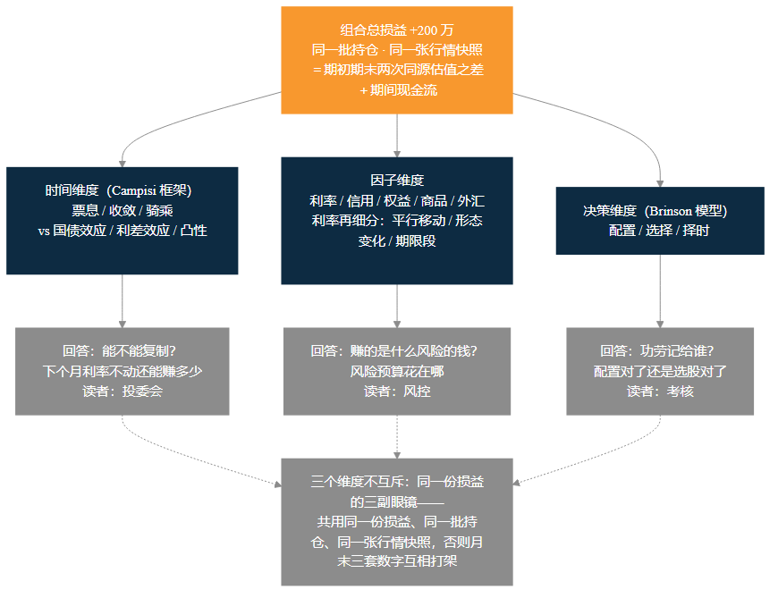
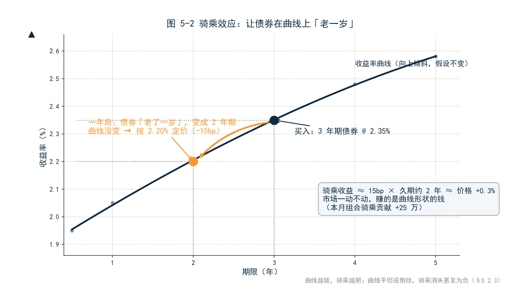
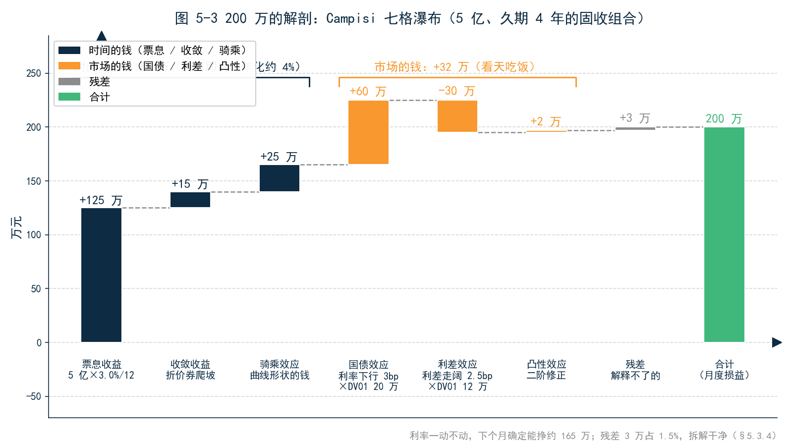
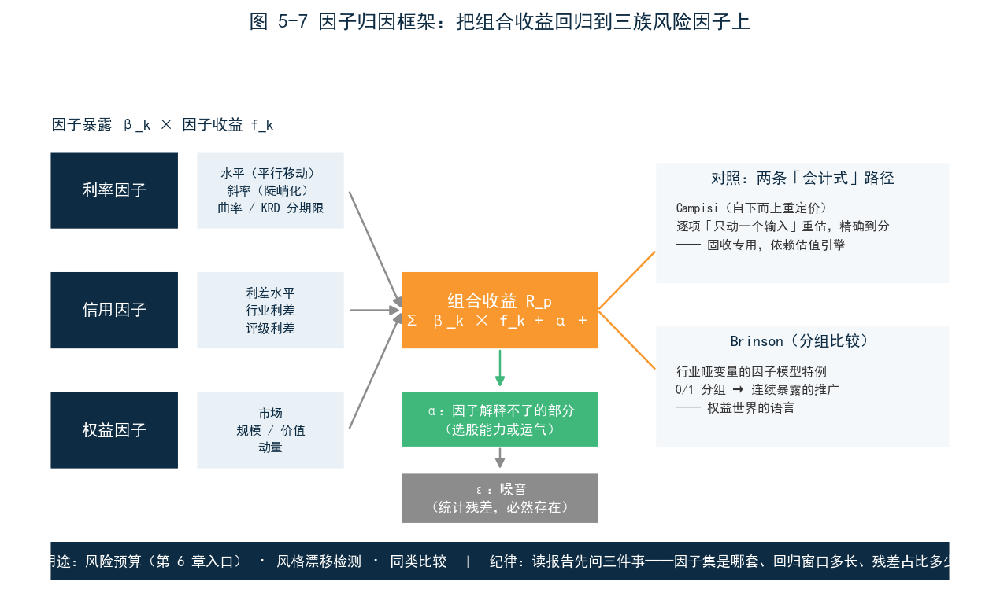
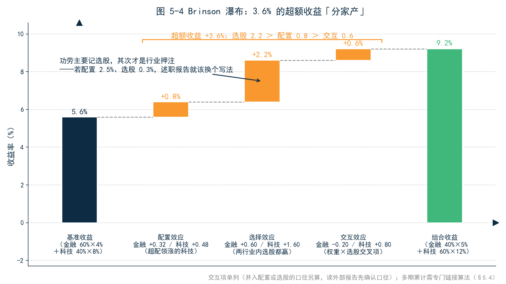
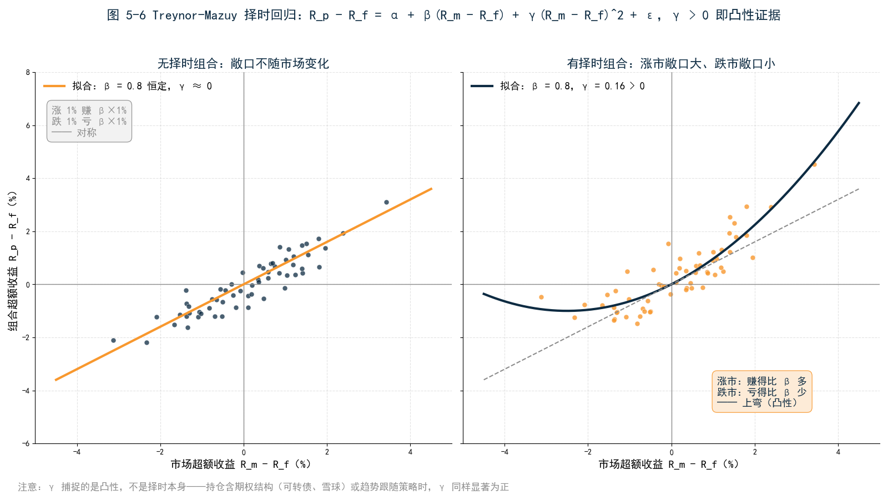
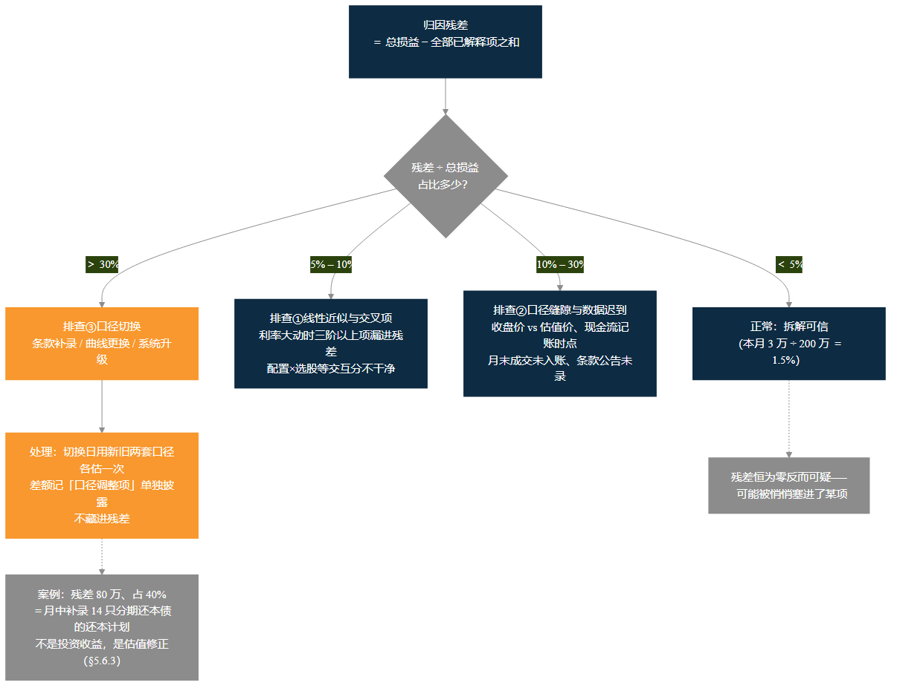

<!--
【素材来源】
- Campisi 两套口径与六项业务名映射：docs/markdown/products/ch45_ATTRIBUTION_ANALYSIS_DETAILED.md（§2.2 业务六项 ↔ metric_name、§3 两套口径、方案 A 货币窗口分解恒等式 WINDOW_PNL = CURVE_PNL + COUPON_INCOME + CONVERGENCE_YIELD + ROLL_DOWN + CONVEXITY_EFFECT + RESIDUAL_PNL）
- 票息/收敛/骑乘/曲线移动/残差的定义与数值案例：D:\vuepress\help-master3\zh\latest\docs\strategy\bond_attribution_analysis.md
- Brinson 三效应与数值案例：docs/customer/财联社/book/_archive/ch11_股票与基金.md §11.5.1、深入框 11-D（方案 B 下并入本章；数字已验算：配置 0.80 / 选择 2.20 / 交互 0.60 / 合计 3.60）
- 统一四维归因、期权 Greeks 归因：ch45 §5；归因框架总览：ch12 v3 第 5 章
- 验收口径：docs/guide/CAMPISI_PNL_ACCEPTANCE_CHECKLIST.md
- 语气范本：docs/customer/财联社/三折页文案.md、12_第3章_估值.md（§3.5 损益拆解伏笔在本章兑现）
- 结构依据：docs/customer/财联社/book/_archive/02_提纲_方案B.md 第 5 章

【仍需补充】
1. 引子与 5.3.4 的 200 万拆解瀑布（票息 125 / 收敛 15 / 骑乘 25 / 国债效应 60 / 利差 −30 / 凸性 2 / 残差 3）为合成案例，与第 4 章月度案例共用同一组合设定（5 亿、久期 4、DV01 约 20 万/bp）；成稿前建议用真实组合的 Campisi 批次结果替换。
2. 5.7.3 残差异常案例（分期还本债条款补录导致残差 80 万）呼应第 3 章的 14 只分期债对账事件，数字为示意，建议用真实事故复盘替换。
3. 残差「正常范围」的经验阈值（5% / 10% / 30%）为实务经验值，非监管或学术标准，需按机构自身归因政策校准。
4. 5.3.2 的信用下沉风控案例（利差效应占收益 80%）为合成案例，建议用匿名化真实组合替换。
5. 「亲手试试」问法需与 MVE 实操包内置数据（PORT_BOND、Campisi 报告、BY_HORIZON 窗口）最终对齐。
6. ~~正文【图 5-x 占位】待替换为实际图片引用。~~（2026-09-09 已完成：图 5-1～5-5 已替换为 figures/ch05/ 下的实际图片引用）

【内容增强记录】2026-09-09（依据《内容增强方案.md》）：
- 新增 §5.5「择时的钱：踩点是不是能力」（5.5.1 择时问题／5.5.2 Treynor-Mazuy／5.5.3 Henriksson-Merton／5.5.4 久期择时／5.5.5 统计陷阱／5.5.6 三件套）；原 §5.5–5.8 顺延为 §5.6–5.9，章内引用与附录 C/F 交叉引用已同步更新
- 新增知识框 1 处：§5.1 后「归因方法谱系」（Brinson/Campisi/因子归因/TM-HM 四套语言）
- 新增进阶框 1 处：§5.3 后「因子归因」（利率/信用/权益三族因子、与 Campisi/Brinson 的关系）
- 本章小结前新增「本章概念卡」（8 张）；小结与公式收录行已补择时内容
- 新增插图：图 5-6（择时回归示意）、图 5-7（因子归因框架），脚本 _build/gen_enhancement_figures.py
- 择时公式收录于附录 C.8（TM）、C.9（HM）、C.10（久期择时贡献）
-->

# 第 5 章　归因：从收益率到「为什么」

## 引子：投委会的追问

季度投委会上，CIO 翻到固收组合月报的最后一页，抬头问了老陈一个问题：「这个月赚了 200 万，财务口径、绩效口径，上个月已经对清楚了。今天我问另一个问题——**这 200 万是从哪赚来的？如果下个月利率一动不动，你还能赚多少？**」

会议室安静了几秒。投资经理小李翻开月报：「本月组合收益率 0.4%，跑赢基准 0.08 个百分点，久期控制在 4 年左右……」CIO 摆摆手：「我问的不是涨了多少，是钱从哪来的。票息贡献多少？利率下行贡献多少？利差贡献多少？下个月利率不动了，哪些钱还有、哪些钱就没了？」

老陈接过话：「给我们一天时间。」

第二天，一张瀑布图摆在 CIO 面前：200 万被拆成七格——票息 125 万、收敛 15 万、骑乘 25 万、国债效应 60 万、利差效应 −30 万、凸性 2 万、残差 3 万。CIO 盯着看了半分钟，指着其中三格问：「这么说，利率一动不动的话，下个月确定能挣的是这 165 万？」老陈点头。CIO 又问：「那这 60 万的国债效应，是能力还是运气？」

这一问，就是归因要回答的问题。第 4 章解决了「赚了多少、是不是真的」，本章解决「从哪赚的、能不能复制」。**绩效是终点数字，归因是数字的解剖。**

---

## 5.1 从「赚了多少」到「从哪赚的」

### 5.1.1 损益的第一性：两次同源估值之差

先把第 3 章埋下的伏笔兑现。损益从哪来？朴素得容易被忽视：**同一批持仓，期初估一次，期末估一次，两次估值之差，加上期间的现金流，就是总损益。**

拆解则是这个逻辑的延伸：保持其他条件不变、只动一个输入，重新估一次——只让时间走，得到票息和收敛；只让期限变短，得到骑乘；只动利率曲线，得到国债效应；只动信用利差，得到利差效应。每一项都是一次「假如……」式的重定价，所有项加总，再加上解释不了的部分（残差），必须等于总损益。

这个定义里藏着归因对估值的全部要求：**同一持仓、同一族曲线、同一套条款处理，在两个时点上各估一次，中间再插若干次「假如」重估。**第 3 章那 2 分钱的对账差异，在这里会换一副面孔回来——如果期初期末两次估值的口径不一致，损益里就混进了「口径切换」的噪音，拆解的残差会大到无法解释。这就是「同源」二字的分量，5.7 节会看到它爆雷的样子。

### 5.1.2 拆解的三个维度：时间、因子、决策

「200 万从哪来」其实不是一个问题，而是三个问题，对应三套拆解维度。

**时间维度**问：多少来自「持有」本身——票息、收敛、骑乘，这些钱只要拿着不动就会有；多少来自「市场变动」——利率、利差、价格的波动，这些钱下个月未必还有。这是债券组合最经典的拆法，学名 Campisi 框架，5.2 和 5.3 节展开。

**因子维度**问：损益暴露在哪些风险因子上——利率、信用、权益、商品、外汇，各贡献多少？利率因子再细分：曲线平行移动多少、形态变化多少、哪个期限段贡献多少。这个维度是风控的语言，回答「你赚的是什么风险的钱」。

**决策维度**问：超额收益来自哪类决策——大类资产配置（股债比例）、行业或品种配置（超配了什么）、个券选择（同行业里挑了哪只）、择时（仓位踩点）。这个维度是考核的语言，股票组合的标准答案是 Brinson 模型，5.4 节展开。

三个维度不互斥，是同一份损益的三副眼镜。**投委会看时间维度（能不能复制），风控看因子维度（风险预算花在哪），考核看决策维度（功劳记给谁）。**一套成熟的归因体系，三个维度共用同一份损益、同一批持仓、同一张行情快照——否则月末又是三套数字互相打架。

### 5.1.3 归因的粒度：组合层、资产层、个券层

拆解还有一个粒度选择。组合层归因回答 CIO 的问题：200 万里 Carry 占多少、市场占多少。资产层归因回答投资经理的问题：利率债部分和信用债部分各贡献多少。个券层归因回答交易员和研究员的问题：具体哪只券赚了、哪只亏了、为什么。

粒度越细，对数据的要求越高：个券层拆解需要每只券的条款、估值、曲线全部到位，任何一只券的条款缺失（想想第 3 章那 14 只没录还本计划的分期债），都会在个券层留下一个解释不了的洞。实务上的节奏是：**投委会看组合层，月度；投资经理看资产层，周度；个券层按需下钻，出了问题再查。**

> **【知识框】归因方法谱系——四套语言，一份损益**
>
> 归因不是一种方法，而是一个方法家族。半个世纪的演进留下了四套主要语言，各自回答不同的问题：
>
> | 方法 | 提出 | 维度 | 回答的问题 | 数据要求 | 本章位置 |
> |---|---|---|---|---|---|
> | Brinson 模型 | 1985/1986 | 决策 | 超额来自配置还是选股？ | 分组权重 + 分组收益 | §5.4 |
> | Campisi 框架 | 1990 年代 | 时间 | 多少来自持有、多少来自市场？ | 持仓 + 曲线 + 条款 + 重定价引擎 | §5.2–5.3 |
> | 因子归因 | Fama-French、Barra | 因子 | 赚的是哪类风险的钱？ | 因子暴露 + 因子收益序列 | §5.3 进阶框 |
> | 择时模型（TM/HM） | 1966/1981 | 决策（时间序列） | 仓位踩点是不是能力？ | 组合与基准的收益率序列 | §5.5 |
>
> 谱系的演进沿着两条轴线展开。**第一条：从会计分解到统计推断。**Brinson 和 Campisi 是「会计」——把一份损益确定性地拆成若干份，分项加总恒等于总数，结论没有不确定性；TM/HM 和因子回归是「统计」——用一段历史序列拟合系数，结论是概率性的，必须带着显著性一起读。**第二条：从事后解释到事前预算。**四套语言原本都向后看（解释过去）；2000 年代之后，因子语言被反过来用——按因子敞口设定风险预算、事前回答「这笔钱愿意亏在哪个因子上」，就成了第 6 章风险归因的入口。
>
> 四套语言不是替代关系，是分层关系：同一份损益，投委会听 Campisi（能不能复制），考核听 Brinson 加择时（功劳记给谁），风控听因子（风险花在哪）。**分层的前提是共用底座**——同一份持仓、同一族曲线、同一套估值口径；底座不统一，四套语言就各说各话，月末又回到三套数字互相打架的老局面。

---

## 5.2 时间的钱：票息、收敛与骑乘

先看时间维度。债券组合最迷人的地方在于：即使市场一动不动，它也在赚钱。这部分钱有三个名字。

### 5.2.1 票息：最确定的钱

票息是债券存在的理由：持有 5 亿、平均票面 3.0% 的组合，一个月的票息收入约 125 万。它不看市场脸色——利率涨也好跌也好，只要发行人不违约，票息按天累积，风雨无阻。

工程上有一个细节值得知道：票息按「应计利息的逐日累积加实际付息」计量，而不是「付息日才算收入」。否则报表上会出现荒谬的图案：非付息日票息为零、付息日票息暴增——**时间的钱被记成了事件的钱。**第 3 章讲净价全价时区分过「时间的钱」和「市场的钱」，票息的逐日计提正是同一个逻辑在损益上的延伸。

### 5.2.2 收敛：向面值爬坡的钱

第二笔钱更微妙。一只折价债（95 元买入、到期还 100 元），即使收益率不变，价格也会随到期日临近向面值「爬坡」；溢价债（105 元）则相反，价格随时间向面值「下滑」。这部分与 market 无关、只与时间有关的价格变动，叫收敛收益。

直觉一句话：**债券到期那天必须值 100 元，所以偏离面值的价格，余生都在回家的路上。**折价债的收敛是正贡献（爬坡），溢价债是负贡献（下滑）——买溢价债吃的亏，本质是把一部分票息提前预付给了卖方。本月组合的收敛贡献是 +15 万：组合里折价券略多。

### 5.2.3 骑乘：沿着曲线往下滑的钱

第三笔钱最考验直觉。收益率曲线通常是向上倾斜的：期限越长，收益率越高。假设 2 年期收益率 2.20%、3 年期 2.35%。你买入一只 3 年期债券，持有一年，它变成一只 2 年期债券——如果曲线没变，它现在按 2.20% 定价，比买入时的 2.35% 低了 15 个基点。收益率下行 15 个基点，久期约 2 年，价格涨约 0.3%。

**市场一动不动，你只是让债券在曲线上「老了一岁」，就赚到了 0.3%。**这就是骑乘（Roll-down）：赚的不是市场变动的钱，是曲线形状的钱。曲线越陡，骑乘越肥；曲线平坦或倒挂，骑乘消失甚至为负。本月组合的骑乘贡献是 +25 万。

把三笔时间的钱加起来：票息 125 万 + 收敛 15 万 + 骑乘 25 万 = 165 万。这就是 CIO 那个问题的答案：**下个月利率一动不动，这个组合确定能挣的，大约是 165 万，年化约 4%。**剩下的 35 万，是市场的钱——可能再有，可能再没有。

---

## 5.3 市场的钱：利率、利差与曲线形态

### 5.3.1 国债效应：利率水平的钱

市场的钱，第一块是利率水平变动。本月债市利率整体下行约 3 个基点。第 3 章的 DV01 直觉直接派上用场：5 亿市值、久期 4 年的组合，DV01 约 20 万——曲线每动 1 个基点，市值动 20 万。下行 3 个基点，贡献约 +60 万。这就是国债效应：**组合对无风险利率平行移动的暴露，乘上利率实际移动的幅度。**

注意这笔钱的性质：它和投资经理的「能力」关系不大，和「敞口」关系很大。久期 4 年的组合在利率下行月赚 60 万，久期 2 年的组合只赚 30 万——不是前者更聪明，是前者押的注更大。**国债效应回答的是「你暴露了多少利率风险、这个月这个风险的价格涨了多少」。**

### 5.3.2 利差效应：信用的钱

第二块是信用利差。本月信用利差走阔，组合里 3 亿信用债（久期约 4，DV01 约 12 万）承受了约 2.5 个基点的利差上行，贡献 −30 万。

利差效应是信用下沉策略的记分牌。这里插一个风控场景：另一家机构的固收组合，某月收益异常地高，归因一拆，利差效应贡献了总收益的 80%——不是利率判断准，是信用下沉下得深，而那个月信用利差恰好大幅收窄。风控据此问了投资经理一个问题：「如果利差反向走阔 20 个基点，这个组合会怎样？」——这个问题把归因（过去从哪赚）和风险（未来可能亏）连在了一起，也是第 6 章的入口。**归因告诉你这个月利差效应是 −30 万，风险告诉你利差再走阔 20 个基点会亏多少；同一个敞口，一个向后看，一个向前看。**

### 5.3.3 曲线形态与凸性：二阶的钱

利率变动很少是整齐划一的平行移动。更常见的是形态变化：短端不动长端动（陡峭化）、两端不动中间动（弯曲）。一个久期 4 年的组合，如果持仓集中在 5 年期，而本月恰恰是 5 年期收益率下得最多，那它赚的就比「平行移动 × 久期」估算的多——多出来的部分，是曲线形态的钱。精细的归因会把利率因子再按期限段拆开（关键期限久期，KRD），回答「曲线哪一段的变动贡献最大」。

凸性则是二阶修正：久期是线性近似，利率大幅变动时，实际价格变动比线性估算的多一点（涨时涨更多、跌时跌更少）。本月利率只动了 3 个基点，凸性贡献仅 +2 万；但在 2022 年 11 月那种单日十几基点的行情里，凸性项会大到无法忽略。**平时它是零头，剧震时它是保命钱。**

### 5.3.4 把 200 万拆开：一张瀑布图

七格拼齐，CIO 要的瀑布图完整了：

| 拆解项 | 金额 | 性质 |
|---|---|---|
| 票息收益 | +125 万 | 时间的钱 |
| 收敛收益 | +15 万 | 时间的钱 |
| 骑乘效应 | +25 万 | 时间的钱（曲线形状） |
| 国债效应 | +60 万 | 市场的钱（利率水平） |
| 利差效应 | −30 万 | 市场的钱（信用） |
| 凸性效应 | +2 万 | 市场的钱（二阶） |
| 残差 | +3 万 | 解释不了的钱 |
| **合计** | **+200 万** | |

这张图的管理读法有三层。第一，**可复制性**：165 万时间的钱是「持有即有」的，35 万市场的钱（含残差）是「看天吃饭」的——下个月利率不动，预期收益就该从 200 万下调到 165 万附近。第二，**敞口透明度**：国债效应 +60 万说明组合暴露在利率下行方向，赚的是敞口的钱；这个敞口是主动配置还是无意为之，归因本身不回答，但它把问题摆上了桌面。第三，**残差健康度**：3 万残差占 200 万的 1.5%，拆解是干净的——5.7 节会看到不干净的残差长什么样。

这套「票息、收敛、骑乘、国债、利差、凸性、残差」的拆法，就是固收归因的 Campisi 框架。它的工程实现有一个硬要求，值得再说一遍：每一项都是「只动一个输入」的重定价之差，所以**估值引擎必须能对同一持仓做多次同源重定价**——条款处理、日计数、面值基准在每次重估中严格一致。归因不是报表层的加减乘除，是估值引擎的连环调用。

> **【进阶】因子归因——把收益回归到风险因子上**
>
> Campisi 和 Brinson 都是「会计式」拆解：逐项重估或逐组比较，分项加总恒等于总损益。因子归因走的是另一条路——**统计式**拆解：把组合收益率对一组风险因子的收益率做回归，用暴露（β）乘因子收益来解释损益。基本式子是 R_p = Σ_k β_k·f_k + α + ε：每个 β_k 是组合对因子 k 的暴露，f_k 是因子 k 的收益，α 是因子解释不了的部分（选股能力或运气），ε 是噪音。
>
> 因子分三族。**利率因子**：水平（平行移动）、斜率（陡峭化）、曲率（弯曲）——Campisi 的国债效应就是水平因子的贡献，精细实现用关键期限久期（KRD）把曲线切成若干段，每段一个因子。**信用因子**：利差水平（全市场利差的整体涨跌）、行业利差、评级利差——Campisi 的利差效应对应这一族，但因子口径能再分出「利差beta的钱」和「个券alpha的钱」。**权益因子**：市场因子之外，Fama-French 的规模（小盘减大盘）、价值（低估值减高估值），加上动量（追涨杀跌的惯性）——权益组合的收益先被这几条「风格曲线」解释，剩下的 α 才谈得上选股能力。
>
> 因子归因与两个「会计式」框架的关系，值得说透。**与 Campisi 是互补**：Campisi 自下而上、逐项重定价，精确到分，但只适用于固收、且依赖估值引擎；因子归因自上而下、统计拟合，粗一些（残差更大），但跨资产通用——股、债、商品、外汇都能放进同一张因子表。成熟的机构两条腿走路：固收部分用 Campisi 出精确数字，全组合层面用因子归因出统一视图。**与 Brinson 是包含**：Brinson 按行业分组，本质是「行业哑变量」的因子模型——把行业暴露从 0/1 哑变量推广到连续暴露（价值暴露 0.8、动量暴露 −0.3），Brinson 就推广成了因子归因。
>
> 因子归因的三个实务用途。**风险预算**：知道组合的收益 70% 由利率水平因子解释，就知道风险预算的大头花在哪——这是第 6 章的入口。**风格漂移检测**：一个宣称「价值型」的经理，价值因子暴露却逐季下滑、动量暴露上升，归因比述职报告更早说出风格变了。**同类比较**：把同类产品的因子暴露放在一张表上，谁在做一样的事、谁的 α 是真的，一目了然。
>
> 一句纪律收尾：因子归因的结论是统计推断，不是会计事实——暴露的估计随窗口变化，α 的显著性随样本量变化。读因子归因报告，先问三件事：因子集是哪套、回归窗口多长、残差占比多少。

---

## 5.4 决策的钱：配置与选券

债券组合问「时间还是市场」，股票组合问的是另一个问题：跑赢基准的部分，是配置对了行业，还是选对了股票？这是决策维度的拆解，标准答案是 Brinson 模型。

### 5.4.1 Brinson：把超额收益分家产

Brinson 的思想朴素得像分家产：把组合和基准都按行业分组，逐行业比较「权重差异」和「收益差异」，超额收益自然分成三块——

- **配置效应**：你在各行业上的权重偏离（超配或低配），乘上该行业相对基准整体的表现。回答「行业押注对不对」；
- **选择效应**：各行业内部，你选的股票收益与基准行业收益之差。回答「股票选得好不好」；
- **交互效应**：权重偏离与选股能力的交叉项——超配的行业里恰好选股也强，这部分功劳记给谁都有争议，先单列。

### 5.4.2 一个两行业的例子

用隔壁权益部老周的组合算一遍。上半年组合与基准都只有金融、科技两个行业：

| 行业 | 组合权重 | 基准权重 | 组合收益 | 基准行业收益 |
|---|---|---|---|---|
| 金融 | 40% | 60% | 5% | 4% |
| 科技 | 60% | 40% | 12% | 8% |
| **合计** | 100% | 100% | **9.2%** | **5.6%** |

组合跑赢基准 3.6 个百分点。Brinson 分解（公式见附录 C）：

| 效应 | 金融 | 科技 | 合计 |
|---|---|---|---|
| 配置效应 | +0.32% | +0.48% | **+0.80%** |
| 选择效应 | +0.60% | +1.60% | **+2.20%** |
| 交互效应 | −0.20% | +0.80% | **+0.60%** |
| **超额合计** | | | **+3.60%** |

数字自己会说话：3.6% 的超额里，2.2% 来自选股（两个行业内选的股票都跑赢了行业平均），0.8% 来自配置（超配了领涨的科技、低配了落后的金融）。**这个组合的功劳主要记选股，其次才是行业押注。**如果数字反过来——配置 2.5%、选股 0.3%——述职报告就该换个写法：赚的是行业轮动的钱，不是个股研究的钱。考核结论、资源投放、团队激励，全跟着这一拆走。

### 5.4.3 Brinson 的局限

Brinson 好用，但边界要清楚。

**交互项的解释之争。**把交互并入选股、并入配置还是单列，三种口径都在用，读外部报告时先确认口径——同一份超额，三种口径下「选股贡献」能差出一倍。

**行业分组的依赖。**按行业分还是按风格分、按中信一级还是二级行业分，结果不同。更根本的问题是：债券没有天然的「行业收益」，商品、外汇、衍生品更没有——Brinson 是权益世界的语言，出了权益要换框架。

**多期的衔接。**单期 Brinson 是干净的，多期累计时各期效应不能简单相加（收益率是复利结构），需要专门的链接算法。这就是为什么「这个月的归因报告和上个月的接不上」是业务负责人的常见抱怨——很多时候不是算错了，是链接口径没统一。

---

## 5.5 择时的钱：踩点是不是能力

Brinson 报告交上去一周后，投委会又开了一次会。这次是权益部老周述职，PPT 的最后一页写着：「上半年超额 3.6%，其中相当部分来自仓位管理——2 月市场底部加仓到 95%，4 月高点降到 80%，踩点贡献显著。」

CIO 看完，问了一个让会议室再次安静的问题：「**Brinson 报告我看得懂，配置多少、选股多少，加总等于超额。但『踩点贡献显著』这六个字，数字在哪？你怎么证明这是能力，不是运气？**」

老周答不上来。这不是他一个人的问题——「我会择时」是资产管理行业最常被声称、最少被证明的能力。本节解决的就是这件事：把「踩点」从述职语言变成统计语言。

### 5.5.1 择时问题：他有没有在涨前加仓、跌前减仓

先把问题定义清楚。Brinson 回答的是横截面问题：同一时间截面上，你的持仓和基准有什么不同——超配了什么、选中了什么。择时问的是时间序列问题：**不同时间点上，你的敞口变没变、变得对不对**——市场上涨之前提高敞口，下跌之前降低敞口。一次踩中是运气，系统性地踩对才叫能力。所以择时的度量注定是统计问题：需要一段历史，而不是一个故事。

度量方法分两族。**基于持仓的方法**最直接：拿到每期的仓位或久期序列，直接计算「敞口变化」与「随后市场涨跌」的关系——变仓方向和市场随后方向一致的次数显著多于一半，就是有择时。它结论可信，但数据要求高：要历史持仓快照，还要剔除被动变仓（大额申购会机械地摊薄仓位，那不是择时，是现金流）。**基于收益率的方法**只需要两条序列——组合收益率和基准收益率，用回归推断择时，数据门槛低，是行业主流。Treynor-Mazuy 和 Henriksson-Merton 是这一族的两个经典模型。

### 5.5.2 Treynor-Mazuy 模型：二次项回归，凸性捕捉择时

起点是 CAPM 回归：组合超额收益对市场超额收益回归，R_p − R_f = α + β·(R_m − R_f) + ε。这个模型里 β 是常数——它假设敞口不随市场变化，本身就排除了择时。

Treynor 和 Mazuy（1966）的改动只有一处：加一个二次项，R_p − R_f = α + β·(R_m − R_f) + γ·(R_m − R_f)² + ε（公式与符号约定见附录 C.7）。直觉很直白：**有择时能力的人，涨市里敞口大、跌市里敞口小，组合收益对市场收益就是一条上弯的曲线**——市场涨 1% 时他赚超过 β×1%，市场跌 1% 时他亏不到 β×1%。把散点画出来，点云呈抛物线；抛物线的弯曲程度，就是二次项系数 γ。**γ 显著为正，是择时能力的统计证据；γ 不显著，「踩点贡献显著」就只是述职修辞。**

这个模型有一个根本歧义必须知道：γ 捕捉的是「凸性」，不是「择时」本身。组合里嵌了期权（可转债、雪球、保护性看跌），或者用了趋势跟随这类天然凸性的策略，γ 同样显著为正——**收益率序列上，「主动踩点」和「被动持有类期权结构」长得一模一样。**所以 γ 显著之后还要追问一句：凸性从哪来？是仓位调整，还是持仓结构？基于持仓的方法能区分这两者，收益率方法不能。

### 5.5.3 Henriksson-Merton 模型：虚拟变量，看涨期权类比

Henriksson 和 Merton（1981）换了种问法：不假设敞口连续变化，假设它在两个状态之间切换——涨市一个 β，跌市一个 β。式子是 R_p − R_f = α + β·(R_m − R_f) + γ·D·(R_m − R_f) + ε，其中 D 是虚拟变量：市场涨（R_m > R_f）时取 1，跌时取 0。于是跌市 β_跌 = β，涨市 β_涨 = β + γ。**γ > 0 且显著，意味着涨市敞口系统性大于跌市敞口——这就是择时。**

这个模型真正的贡献是 Merton 的期权类比：**一个完美的择时者，等价于免费持有一份市场看涨期权**——涨市全额参与，跌市全身而退，收益结构就是 max(0, R_m − R_f)，正是看涨期权的 payoff。这个类比值钱的推论是：择时能力是有市场价格的——它值一份期权的权利金。所以听到「我有择时能力」时，经济学直觉该问：这份免费期权谁买的单？如果没人白送，那所谓择时能力，要么是真的稀缺技能，要么是还没被识破的运气。

TM 与 HM 怎么选？TM 假设敞口渐进变化（调仓是连续的），HM 假设敞口换挡变化（仓位在几档之间跳）。实证上两者结论通常同向；**两个模型都显著，证据才算扎实**——一个显著一个不显著，多半是模型设定在凑结论。

### 5.5.4 固收的择时：久期择时

这套语言搬到固收，要先做一次翻译：固收组合的「仓位」不是股票仓位，是久期。**固收的择时，就是利率下行前拉长久期、上行前缩短久期。**它是中国固收经理最主流的主动管理动作——信用研究决定「买什么」，久期决策决定「什么时候多大胆」。

度量同样有两条路。收益率路径：把 TM/HM 里的市场收益换成债券指数收益，回归照做。持仓路径更直接，也更符合固收实务：**久期择时贡献 = Σ 各期（组合久期 − 基准久期）× 该期利率变动**，换算成金额用 DV01 口径。拿本章的组合算一遍：本月组合久期 4.0、基准久期 3.5，主动偏离 +0.5 年；利率下行 3 个基点，5 亿市值下每 0.5 年久期偏离对应 DV01 约 2.5 万/基点——择时贡献约 +7.5 万。

注意这笔账的含义：§5.3 的国债效应 +60 万被又拆了一层——52.5 万是「基准久期敞口的钱」（久期 3.5 的基准本身赚到的），7.5 万是「主动偏离的钱」（经理比基准多扛的那 0.5 年赚到的）。**前者是敞口，后者才是择时。**归因的粒度就这样一层层细下去：总损益 → 市场的钱 → 国债效应 → 基准敞口的钱与主动择时的钱。

固收择时还有三条特殊性。一是利率趋势性强于股票，久期择时的胜率天然偏高——胜率高不代表能力强，可能只是趋势还没反转。二是久期偏离受合同约束（比如「久期 2–4 年」），择时空间有天花板，评价时要看「用没用满约束」，而不是只看偏离方向对不对。三是频繁调久期要付交易成本——利率债买卖价差窄还好，用信用债调久期，价差成本可观；**择时贡献要扣掉执行成本（§4.3.4 的 TCA）才是净贡献**，否则是在给交易台打工。

### 5.5.5 统计陷阱：样本量、多重检验、择时能力的衰减

择时回归的结论，天生站在三块松动的地基上。

**样本量。**月度收益做回归，24 个月只有 24 个点，γ 的 t 值要过显著性门槛极难。这制造了一个双向陷阱：「不显著」不能证明没有能力（功效太低，测不出来），「显著」也常常只是运气（小样本下假阳性遍地）。实务门槛：至少 36 个月，最好 60 个月；用周度收益把样本量翻四倍，代价是噪音也变大。

**多重检验。**同时检验 100 个经理，按 5% 显著性水平，平均有 5 个「显著」纯靠运气。年底评「择时明星」，评出来的往往是这 5 个。矫正方法统计学里都有（Bonferroni、FDR），真正难的是制度：**评选之前先定检验规则，而不是看到结果再挑一个好看的显著性。**

**能力衰减。**择时能力不是固定资产。策略被模仿、市场结构变化、规模变大导致调仓冲击成本上升，都会让 γ 随时间衰减——历史上显著，不代表未来还有。择时能力的半衰期通常短于选股能力：选股依赖研究深度，可以积累；择时依赖市场微观结构，结构一变就没了。**对择时结论要打折使用，而且折扣随时间加大。**

落到考核上，更稳健的做法是绕开纯统计：不考核 γ 本身，考核「择时决策的事后盈亏」——用持仓路径直接计量每次变仓的盈亏贡献，并要求变仓决策有事前记录（投委会纪要、交易指令时间戳）。没有事前记录的「择时贡献」，一律按运气处理。

### 5.5.6 三件套：配置、选择与择时

回到决策维度的全景。Brinson 拆出配置和选择，TM/HM 补上择时——**配置（配了什么）+ 选择（选了什么）+ 择时（什么时候变的仓位）= 决策归因的三件套。**

三件套的数据要求逐级递进：配置和选择单期就能算（一组权重加一组收益），择时要一段历史（收益率序列或仓位序列）。结论的性质也根本不同：**配置和选择是会计——确定性的分解，分项加总恒等于超额；择时是统计——概率性的推断，结论必须带着显著性和样本窗口一起报。**把两者印在在同一张归因报告上时，最好用不同的版面语言区分开，免得读者把「γ = 0.3（t = 1.1）」读成和「配置效应 +0.80%」同样确定的数字。

实务节奏的建议：月度归因报告里，配置和选择每期都报；择时按季度滚动回归报，标注窗口与显著性；久期择时用持仓路径每月直接计量，因为它不依赖统计推断。老周那句「踩点贡献显著」，从此有了标准回应：**「把 γ 和 t 值报上来，或者把每次变仓的事前记录和事后盈亏报上来——两样都没有，这六个字就先拿掉。」**

---

## 5.6 多资产的难处：衍生品、杠杆与对冲

真实的组合很少是纯债或纯股。一旦组合里混进衍生品、杠杆和跨资产对冲，归因会撞上三堵墙。

### 5.6.1 衍生品：保证金不是敞口

一手 IF 股指期货，名义敞口 105 万（3500 点 × 300 元），保证金只占 12 万左右。如果按「市值权重」做归因，这手期货的权重只有 1.2%——但它的真实风险敞口是 105 万，和 105 万股票现货完全等价。**按资金占用归因，衍生品的贡献会被系统性低估一个数量级。**

正确的做法是按风险敞口归一：期货的 Delta 等值敞口（手数 × 乘数 × 点位）与现货市值放在同一把尺子上。期权更麻烦：它的损益是非线性的，方向损益（Delta）之外还有波动率损益（Vega）、时间衰减（Theta）、曲率损益（Gamma）——第 3 章那只雪球，敲入敲出之间的价值跳变，用任何线性框架都拆不干净，只能按 Greeks 逐项归因。

### 5.6.2 对冲组合：按资产拆会误判

一个中性策略组合：股票多头本月赚 300 万，股指期货空头亏 250 万，净损益 +50 万。按资产拆开归因，会得到两个误导性结论：「股票端选股能力很强」（+300 万）和「期货端交易很失败」（−250 万）。但期货空头本来就是买来亏的——它的职责是在市场下跌时保护组合，本月市场上涨，它亏损是履行职责。

**对冲组合的归因必须按风险因子净额，不能按资产类别分列。**股票端的权益敞口和期货端的权益负敞口先对冲，剩下的净敞口乘以市场变动，才是「方向的钱」；对冲之后剩下的那 50 万，才是剔除市场方向后的「选股的钱」。第 3 章说过「现货与期货共用同一把尺子」，在归因这里，这句话的意思是：先把 Delta 对齐，再谈贡献。

### 5.6.3 杠杆：权重和超过 100% 之后

债券组合常见杠杆：5 亿净资产，通过回购放大利率敞口到 8 亿。此时组合权重和是 160%，Brinson 式的「权重 × 收益」框架直接失真——分母到底是 5 亿还是 8 亿？融资成本记在哪一项？

成熟的处理是把杠杆显式拆成两层：**资产层的收益按 8 亿敞口归因（每一块钱敞口的表现），融资层的成本单列（回购利率 × 杠杆规模），两者之差才是净资产口径的收益。**杠杆不是收益来源，是收益放大器——归因的职责之一，就是把「放大出来的收益」和「创造出来的收益」分开，否则一个 1.6 倍杠杆的组合，永远比一个无杠杆组合「更能赚钱」。

---

## 5.7 残差：为什么拆不干净

每张归因瀑布图的最后一格都是残差——所有已知因素解释完之后，剩下的那部分。它是归因体系里最不受待见、也最有信息量的一格。

### 5.7.1 残差从哪来

残差的来源有四种。**线性近似**：久期凸性只精确到二阶，利率大动时三阶以上的项就漏进残差。**交叉项**：配置与选股的交互、利率与利差的联动，分不干净的部分进残差。**口径缝隙**：估值时点（收盘价还是估值价）、现金流记账时点、费用计提节奏，每一项都留一条小缝。**数据迟到**：月末最后一笔成交没进估值、某只券的条款公告没来得及录入，都会以残差的形式现身。

### 5.7.2 残差多大算正常

经验法则（各机构应校准自己的阈值）：**残差占总损益 5% 以内，正常；10% 以上，要排查；30% 以上，拆解基本失效。**本月组合的残差是 3 万，占 200 万的 1.5%——拆解干净，瀑布图可信。

还要给残差一点公正的评价：它不是敌人。**残差是「模型之外的世界」的测量仪**——它恒为零反而可疑（说明残差被悄悄塞进了某项），它稳定地小，说明模型抓住了主要矛盾；它突然变大，是在报警。

### 5.7.3 残差突然变大：口径断了的警报

上个月，老陈部门另一只组合的归因就报了这样的警：当月损益 200 万，残差 +80 万，占 40%。

排查结果让所有人沉默：月中估值系统升级，把第 3 章那 14 只分期还本债的还本计划补录了进去——这是正确的事，估值变准了。但月内归因要求期初、期末两次估值口径一致：期初按「无还本计划」估、期末按「有还本计划」估，两次估值之差里混进了「口径切换」本身。这 80 万不是投资收益，是估值修正，却被夹在月度损益里，残差替它背了锅。

处理办法不是把条款改回去，而是**把口径切换的影响单独计量**：升级当天，用新旧两套条款对同一持仓各估一次，差额记为「口径调整项」，从投资损益中剔除，单独披露。这正是第 3 章「同源」二字的分量——**估值口径不稳，拆解必残；口径必须切换时，切换本身要作为一个数字被说出来，而不是藏进残差里。**

---

## 5.8 归因不是为了追责，是为了理解

归因报表最容易被用错的方向，是变成追责工具：这个月利差效应 −30 万，谁决定的信用下沉？残差 3 万，估值岗怎么回事？

这么用归因，三个月后就会收获一套被博弈的归因：投资经理学会把决策包装成「市场贡献」，把失误藏进「残差」，归因数字越来越好看，越来越没用。**归因的第一用途不是追责，是理解**——理解这个组合靠什么赚钱，理解哪些钱可复制、哪些钱是运气，理解风险预算花在了哪里。CIO 那句「是能力还是运气」，才是归因的正确打开方式。

当然，理解最终会流向考核，但中间要过一道翻译：考核的不是「某项贡献的正负」，而是「贡献与意图是否一致」。一个以 Carry 策略立项的组合，时间的钱占八成就是履约；一个以利率波段为卖点的组合，国债效应占八成才是称职。**归因对照的是策略说明书，不是盈亏本身。**

---

## 5.9 如果 AI 来做归因

章末照例问那个问题：如果让 AI 来做归因，它能解释「为什么」吗？

先看 AI 不能做什么。归因的每一项都是估值引擎的重定价之差——只动曲线、只动利差、只让时间走。这些数字必须由可追溯的引擎产生；让大模型「估算」票息贡献是多少，它给出的数字再像样，也回答不了审计的那句「这个数从哪来」。**归因数字的权威性，来自每一次重定价都可复算。**

再看 AI 能做什么，而且做得比人快。一是**问数**：「把 PORT_BOND 本月的 Campisi 瀑布拉出来，残差占比多少」——一句话替代半天的报表翻找。二是**诊断**：「残差突然变大的那只组合，月中是不是有条款补录或系统升级」——AI 把残差异常和变更日志对上，比人肉排查快一个数量级。三是**成文**：把瀑布图翻译成投委会语言——「本月 200 万中，165 万来自持有收益，可复制；35 万来自利率下行，不可外推」——这段话 AI 起草，老陈审定，十分钟进投委会材料。

至于「是能力还是运气」这个终极问题，AI 可以摆出证据（该项贡献的历史波动、与基准的对比、同类组合的分布），但判断要人来下。**归因的终点不是一张瀑布图，是一个经营判断——数字由引擎出，判断由人出，AI 站在中间，把两边的距离缩短。**

---

## 本章概念卡

| 概念 | 一句话解释 | 详见 |
|---|---|---|
| Campisi 框架 | 把债券损益拆成票息、收敛、骑乘、国债、利差、凸性、残差的时间维度归因 | §5.2–5.3 |
| 骑乘效应 | 曲线不动时，债券「变老一岁」沿曲线滑向低收益率端赚到的钱 | §5.2.3 |
| 国债效应 | 组合利率敞口乘上利率实际移动幅度——是敞口的钱，不直接等于能力的钱 | §5.3.1 |
| Brinson 三效应 | 把超额收益拆成配置、选择、交互，回答「押对行业还是选对股票」 | §5.4 |
| Treynor-Mazuy 模型 | CAPM 回归加二次项，γ>0 表示涨市弹性大于跌市，用凸性捕捉择时 | §5.5.2 |
| 久期择时 | 利率下行前拉长久期的固收择时，用「久期偏离 × 利率变动」直接计量 | §5.5.4 |
| 敞口归一 | 衍生品按 Delta 等值敞口而非保证金占用参与归因 | §5.6.1 |
| 残差 | 所有已知因素解释完后剩下的部分，5% 以内正常，突变先查口径切换 | §5.7 |

---

## 本章小结

回到引子的两个问题。

**这 200 万从哪赚来的？**七格瀑布：票息 125 万、收敛 15 万、骑乘 25 万——这是时间的钱，165 万，持有即有；国债效应 +60 万、利差效应 −30 万、凸性 +2 万——这是市场的钱，看天吃饭；残差 3 万，占 1.5%，拆解干净。

**下个月利率不动还能赚多少？**约 165 万，年化约 4%——这就是「能不能复制」的量化回答。归因把「赚了多少」翻译成「靠什么赚钱」，把绩效从终点数字变成经营诊断。

三个维度记住各自的读者：时间维度（Campisi）回答投委会的可复制性问题，因子维度回答风控的风险预算问题，决策维度（Brinson）回答考核的论功行赏问题。决策维度内部再记三件套：配置、选择是会计，单期可算、加总恒等；择时（TM/HM）是统计，要一段历史、结论带着显著性一起读——固收里它翻译为久期择时，用「久期偏离 × 利率变动」直接计量。多资产组合先把衍生品的敞口归一、把对冲的 Delta 对齐、把杠杆的融资成本单列，再谈归因。残差是模型之外世界的测量仪：5% 以内正常，突然变大先查口径切换。

最后记住归因在全书链条中的位置：它向后看，回答「过去从哪来」。但 CIO 和风控真正睡不着的，是另一个方向的问题——这个靠利率敞口赚钱的组合，下个月利率反转会亏多少？归因回答「过去从哪来」，风险回答「未来可能去哪」。同一个敞口，一副眼镜向后看，一副眼镜向前看——第 6 章，我们换那副向前的眼镜。

本章涉及的公式（Campisi 四因子与货币窗口分解、Brinson 三效应、Treynor-Mazuy 与 Henriksson-Merton 择时回归、久期择时贡献、多期链接）集中收录于附录 C。

---

## 亲手试试

打开 MVE 实操包，对 AI 说：

> 「对组合 PORT_BOND 做本月 Campisi 归因，把损益拆成票息、收敛、骑乘、国债效应、利差效应、凸性和残差，告诉我各项金额和占比；残差占总损益的比例是多少？再把残差贡献最大的那只券挑出来，看看它是不是分期还本债、条款有没有在月中变更过。」

跑完之后，试着追问一句：「把归因窗口从本月换成上周，各项贡献怎么变？哪一项最稳定、哪一项波动最大？」——这两个问题的答案，就是本章的全部要点。

如果实操包里有足够长的历史快照，还可以再问一句：「用 PORT_BOND 过去 24 个月的月度收益和基准收益做一次 Treynor-Mazuy 回归，二次项系数 γ 是多少、t 值多少？再按『久期偏离 × 利率变动』逐月直接计量久期择时贡献——两种方法的结论一致吗？」这一问，就把「踩点是不是能力」从述职语言变成了统计语言。
