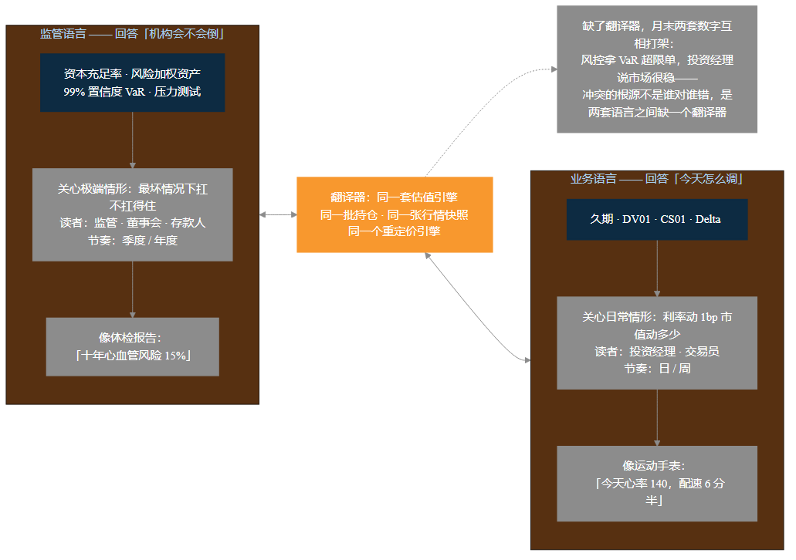
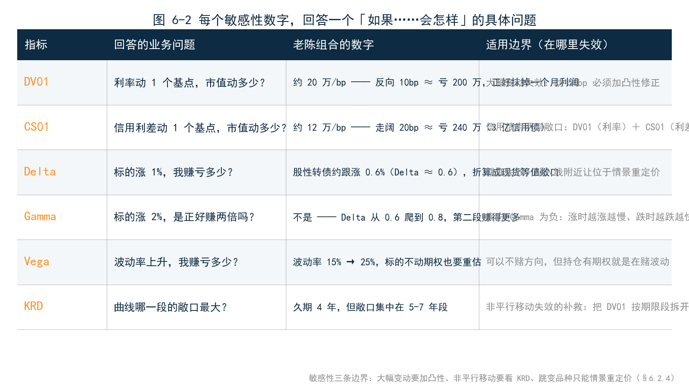
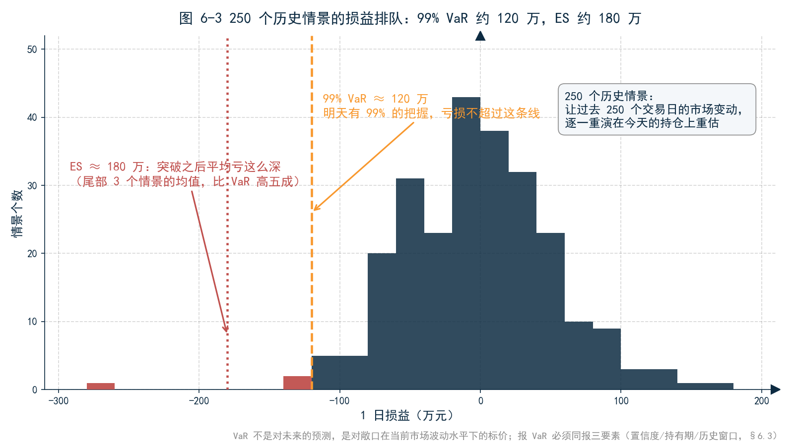
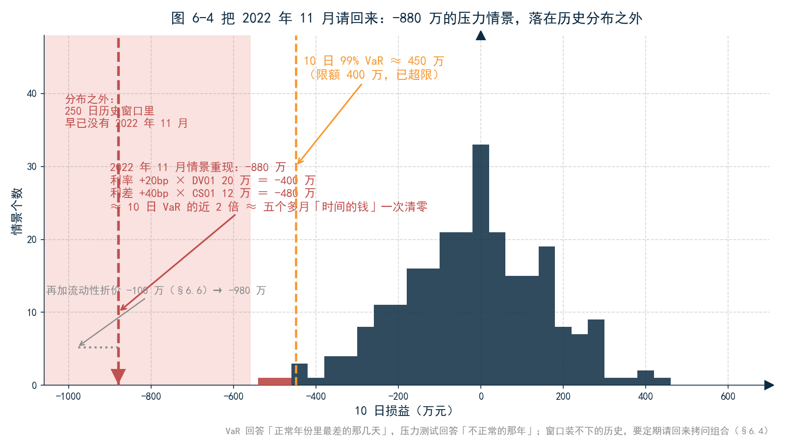
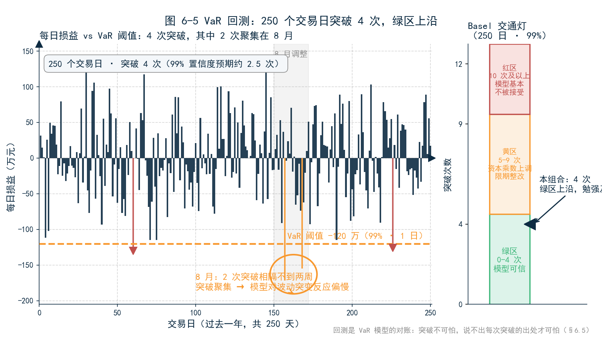
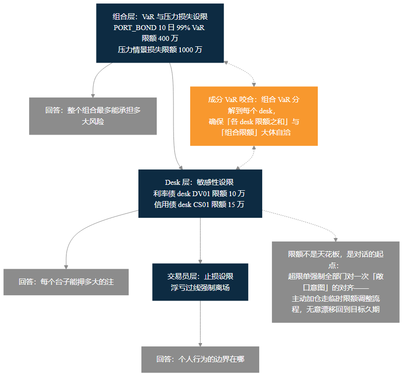
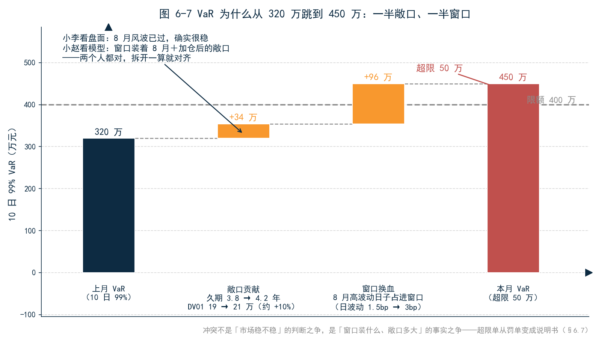

<!--
【素材来源】
- VaR/ES/PFE 定义、置信水平与持有期默认值、MC/HS/压力 VaR/回测四方法：docs/markdown/products/ch44_RISK_METRICS_DETAILED.md（§1.1 指标业务含义表、§2.1 方法概览、§2.3 置信水平与持有期、附录 A 公式）
- 历史模拟法 VaR 与回测工程细节：docs/markdown/user_manual/ch11_HS_VAR.md（§14 --backtest 独立入口、回测四件套产物、Kupiec / Basel 交通灯）
- DV01/KRD/CS01/Greeks 定义与 bump 法：docs/markdown/products/ch47_SENSITIVITY_ANALYSIS_DETAILED.md（§2 利率敏感性、§2.5 信用利差敏感性、§3 Greeks、附录 A KRD tenor 列表）
- 风险指标产品支持矩阵：docs/markdown/user_manual/ch12_PRODUCT_AND_METRICS_REFERENCE_MANUAL_v3.md §4.2
- 成分 VaR / 增量 VaR 定义：ch44 §1.1（INCREMENTAL_VAR、COMPONENT_VAR）
- 中小银行市场风险合规叙事（资本计量、监管报送）：docs/ficc_design/猛犸市场风险管理系统-介绍 (银行).md
- 语气范本：docs/customer/财联社/三折页文案.md、12_第3章_估值.md、14_第5章_归因.md
- 结构依据：docs/customer/财联社/book/_archive/02_提纲_方案B.md 第 6 章；用户指定的衔接——第 5 章国债效应 +60 万 → 「利率反向动呢」；第 7 章伏笔——单一资产风险指标如何加总成组合风险

【仍需补充】
1. 全章 VaR 数字体系（99% 1 日约 120 万、10 日 450 万、限额 400 万、上月 320 万、久期 3.8→4.2、8 月调整导致窗口换血）为合成案例，与第 4/5 章共用同一组合设定（PORT_BOND、5 亿市值、久期 4 年、DV01 约 20 万/bp、信用债 3 亿 CS01 约 12 万）；成稿前建议用真实组合的 VaR 批次输出替换。
2. 2022 年 11 月债市负反馈的行情幅度（两周利率上行约 20bp、信用利差走阔 30–50bp、理财破净赎回潮）需与公开数据核对；压力情景 −880 万为按 DV01/CS01 的线性估算示意值，未含凸性与非线性修正。
3. Basel 交通灯阈值（250 日、99%：绿区 0–4 次 / 黄区 5–9 次 / 红区 ≥10 次）与 Kupiec 检验的描述需与监管最新口径核对。
4. 国债期货对冲数字（一手 T 的 DV01 约 650 元、保证金约 2%）为近似量级，需按实际 CTD 久期与交易所保证金标准核对。
5. 成分 VaR 的分散化数字（利率债 200 万 + 信用债 350 万 > 组合 450 万，隐含相关性约 0.3）为示意，建议用真实批次输出替换。
6. ~~按用户指示，本章结尾伏笔指向「第 7 章（多资产）」~~【2026-09-09 统稿已修正】_archive/02_提纲_方案B.md 中第 7 章为「中国债券条款」，组合风险加总无专章；本章结尾伏笔已改指第 12 章（§12.5 同一坐标系加总），相关性与分散化明确声明超出本书范围。
7. 「亲手试试」问法需与 MVE 实操包内置数据（PORT_BOND、var.hs_var 配置、--backtest 入口、压力情景配置）最终对齐。
8. ~~正文【图 6-x 占位】待替换为实际图片引用。~~（2026-09-09 已完成：图 6-1～6-7 已替换为 figures/ch06/ 下的实际图片引用，其中图 6-7 为清单建议新增、插入 §6.7）
-->

# 第 6 章　风险：从持仓到「可能亏多少」

## 引子：风控预警的那个早晨

周一早上八点四十五分，老陈刚到办公室，风控岗小赵的预警邮件已经到了：固收组合 PORT_BOND 的 10 日 99% VaR 升至 450 万，超出限额 400 万，请投资部门说明原因并给出处理意见。

投资经理小李拿着手机就过来了，语气不太服气：「8 月那波调整已经过去了，这几天十年国债每天就动一两个基点，市场稳得很。VaR 凭什么跳？是不是模型出问题了？」

小赵的回答很标准：「模型没动，口径没动，数字就是数字。」

老陈没急着表态。他翻开上个月的归因报告——第 5 章那张七格瀑布图——指着其中一格问小李：「国债效应 +60 万，利率下行 3 个基点赚的。投委会上 CIO 问过一句话，你还记得吗：**如果利率反向动 10 个基点呢？**」

小李心算了一下，没说话。老陈又补了一刀：「下午接到通知，下季度监管现场检查，要查市场风险模型。人家的问题只有一句：**你们的 VaR 模型靠谱吗？拿证据来。**」

一个早晨，三个问题：敞口有多大？可能亏多少？模型可信吗？这就是本章要回答的。第 5 章的归因向后看，回答「过去的钱从哪来」；本章向前看，回答「未来可能亏多少」。**同一个敞口，一副眼镜向后看，一副眼镜向前看。现在换上向前的这副。**

---

## 6.1 风险的两种语言：监管的与业务的

先从一个常见的错位说起。监管检查问的是「资本充足率、VaR、压力测试」，投资经理每天看的是「久期、DV01、CS01、Delta」——两边都在谈风险，说的是两种语言。

**监管语言回答的问题是「机构会不会倒」。**它关心极端情形：如果市场剧烈波动，损失会不会击穿资本？所以它的单位是资本充足率、风险加权资产、99% 置信度的 VaR——全是「最坏情况下扛不扛得住」的度量。读者是监管、董事会和存款人，节奏是季度和年度。

**业务语言回答的问题是「今天怎么调」。**它关心日常情形：利率动 1 个基点，组合市值动多少？利差走阔 10 个基点，这个月利润还剩多少？所以它的单位是久期、DV01、CS01、Delta——全是「敞口」的度量。读者是投资经理和交易员，节奏是日和周。

打个比方：监管语言是体检报告——「十年心血管风险 15%」；业务语言是运动手表——「今天心率 140，配速 6 分半」。两个都是健康的度量，但体检报告不会告诉你今天该不该减速，运动手表也不会告诉你十年后的风险。

两套语言的冲突每天都在上演：风控拿着 VaR 超限单找投资经理，投资经理觉得「市场很稳、风控大惊小怪」。**冲突的根源不是谁对谁错，而是两套语言之间缺一个翻译器。**这个翻译器，就是同一套估值引擎——监管语言的 VaR 和业务语言的 DV01，必须从同一批持仓、同一张行情快照、同一个重定价引擎里长出来，否则月末又是两套数字互相打架。这句话在第 3 章讲估值时说过，在风险这里分量只增不减。

---

## 6.2 敏感性：每个数字回答一个具体问题

先看业务语言。敏感性指标家族庞大，但业务负责人只需记住一句话：**每个敏感性数字，都回答一个「如果……会怎样」的具体问题。**

### 6.2.1 DV01：利率反向动 10 个基点会怎样

先兑现 CIO 那个问题。第 3 章已经建立过直觉：5 亿市值、久期 4 年的组合，DV01 约 20 万——曲线每动 1 个基点，市值动 20 万。利率反向动 10 个基点，亏损约 200 万。

200 万这个数字值得停下来看一眼：它正好等于上个月的全月利润。**利率一次 10 个基点的反向波动，可以抹掉这个组合一个月的全部收益**——票息、收敛、骑乘、国债效应，七格瀑布一夜归零。10 个基点多不多？2022 年 11 月那两周，十年国债收益率上行了约 20 个基点。这就是 DV01 的管理含义：它不是报表上的技术字段，是「一个月利润值几个基点」的换算器。

知道 DV01 之后能干什么？三件事。一是**计量敞口**：20 万 per 基点，就是组合对利率的押注规模。二是**对冲**：想把利率敞口砍掉一半，可以做空国债期货——一手十年期国债期货（面值 100 万，CTD 久期约 6.5 年）的 DV01 约 650 元，对冲 10 万 DV01 约需 150 手，名义敞口 1.5 亿，保证金三百来万。三是**限额**：DV01 是限额体系里最常用的业务单位，6.7 节展开。

### 6.2.2 CS01：信用下沉的标价

第 5 章埋过一个伏笔：另一家机构的固收组合，某月收益的 80% 来自利差效应，风控据此问投资经理：「如果利差反向走阔 20 个基点，这个组合会怎样？」现在给出回答这个问题的工具。

CS01 是信用利差版的 DV01：利差动 1 个基点，持仓市值动多少。老陈的组合里 3 亿信用债、久期约 4 年，CS01 约 12 万——利差走阔 20 个基点，亏损约 240 万。

这里有一个容易混淆的细节：**信用债有两副敞口。**它既对无风险利率敏感（DV01），又对信用利差敏感（CS01）。老陈组合 20 万的 DV01 里，约 8 万来自 2 亿利率债，约 12 万来自 3 亿信用债的利率敏感性；另外还有 12 万 CS01，只对利差敏感。利率下行、利差走阔的月份（上月行情正是如此），两副敞口一赚一亏——国债效应 +60 万、利差效应 −30 万，第 5 章瀑布图上的那两格，就是这两副敞口各自的价格。

**CS01 是信用下沉策略的标价签。**下沉得越深——评级越低、久期越长——CS01 越大，利差走阔时亏得越快。归因告诉你上月利差效应是 −30 万（向后看），CS01 告诉你利差再走阔 20 个基点亏 240 万（向前看）。同一个敞口，两副眼镜。

### 6.2.3 Delta、Gamma、Vega：衍生品的三问

债券组合的两问（利率、利差）之外，含衍生品的组合要多问三句。用隔壁权益部老周的「固收+」产品举例——里面配了可转债，还零星用过股指期权做保护。

**Delta 回答「方向」**：标的涨 1%，我赚亏多少？一只股性较强的可转债，正股涨 1%，转债大约跟涨 0.6%——这个 0.6 就是 Delta 的直觉。Delta 是衍生品世界的 DV01，把方向性敞口折算成现货等值。

**Gamma 回答「加速度」**：标的涨 2%，是不是正好赚两倍？不是。转债越涨股性越强，Delta 从 0.6 爬到 0.8，第二段 1% 赚得比第一段多——Delta 本身在变，变化的速度就是 Gamma。Gamma 为正的组合「涨时越涨越快、跌时越跌越慢」，是花钱买的保险；Gamma 为负的组合（卖出期权的一方）正好相反。

**Vega 回答「恐慌」**：市场波动率上升，我赚亏多少？期权价格里含着对未来波动的预期，波动率从 15% 涨到 25%，即使标的一动不动，期权也要重估。2024 年初微盘股急跌、雪球集中敲入那波行情里，波动率一周翻倍，所有带期权性敞口的组合都被 Vega 上了一课：**你可以不赌方向，但只要持仓里有期权，你就在赌波动。**

### 6.2.4 敏感性的边界：线性外推在哪里失效

敏感性好用，但边界必须清楚，三条。

**大幅变动失效。**DV01 是线性近似，利率动 1 个基点很准，动 50 个基点就要加凸性修正——第 5 章那句「平时它是零头，剧震时它是保命钱」，说的正是这个修正项。

**非平行移动失效。**DV01 假设曲线整体平移，真实行情里短端不动长端动是常态。补救办法是把 DV01 按期限段拆开——关键利率久期（KRD）：组合对 1 年、3 年、5 年、7 年、10 年各期限点的敏感性分别列示。老陈的组合久期 4 年，但 KRD 一拆，敞口集中在 5—7 年段——如果行情恰恰是 7 年期领跌，「久期 4 年」这个总数会给人虚假的安全感。

**跳变失效。**第 3 章那只雪球，敲入前后价值断崖式跳变，任何敏感性指标在敲入线附近都会失灵。对这类持仓，敏感性要让位于情景重定价：直接把「跌破敲入线」作为一个情景，重新估一遍值——这正是压力测试的思路，6.4 节展开。

---

## 6.3 VaR：把「可能亏多少」压成一个数字

敏感性回答的是「如果市场动 X，我亏多少」——但「X 该取多少」本身是个问题。明天利率会动 1 个基点还是 10 个基点？VaR 的思路是反过来问：**不问市场动多少，问「在某个概率下，我最多亏多少」。**

### 6.3.1 一句话的 VaR

老陈组合的 VaR 报告上写着：99% 置信度、1 日持有期，VaR 约 120 万。翻译成一句业务语言：**明天有 99% 的把握，这个组合的亏损不超过 120 万。**

这句话里有三个信息，缺一不可：概率（99%）、时间（1 天）、金额（120 万）。同样重要的是它**没说什么**：它没说剩下的 1% 里会亏多少——可能是 121 万，也可能是 500 万；它也没预测明天会亏。**VaR 不是对未来的预测，是对敞口在当前市场波动水平下的标价。**它像天气预报里的「降水概率 90%」：不保证下雨，也不说下多大，只说按最近这段日子的天气模式，带这把伞够用了。

### 6.3.2 三要素都是政策：置信度、持有期、历史窗口

现在可以回答那个经典抱怨了：「为什么风控说的 VaR 和我算的 VaR 不一样？」因为 VaR 有三个输入要素，每一个都是政策选择，不是数学。

**置信度：多高的把握算够？**95% 意味着平均 20 天破一次，99% 意味着平均 100 天破一次。同一个组合，置信度从 95% 提到 99%，VaR 能从 90 万跳到 120 万——尾部越往里走，数字越大。监管对银行市场风险资本要求用 99%，不少券商内部管理用 95%，没有对错，只有用途。

**持有期：多长时间的亏损？**1 日 VaR 120 万，10 日 VaR 约按根号时间放大到 380 万上下（窗口里有波动聚集的日子时还会更高，老陈组合当前报 450 万）。持有期的本质是「假设你需要多长时间把仓位平掉」——这个假设在 6.6 节会回来咬人。监管用 10 日，日常盯市用 1 日。

**历史窗口：用哪段历史代表未来？**历史模拟法的做法是「让历史重演」：取过去 250 个交易日的市场变动，逐一施加到今天的持仓上重估，得到 250 个「假如那天重来」的损益，排队取分位。窗口里装着什么样的日子，VaR 就是什么样的脾气——窗口里全是平静岁月，VaR 就低；装着 2022 年 11 月那种风暴，VaR 就高。

三要素一对，八成的「VaR 不一致」都能对上账：

| 要素 | 常见选项 | 对结果的影响 |
|---|---|---|
| 置信度 | 95% / 99% / 99.9% | 越往尾部，VaR 越大，且不成比例 |
| 持有期 | 1 日 / 10 日 | 约按根号时间放大，10 日 ≈ 1 日 × 3.2 |
| 历史窗口 | 250 日 / 500 日 / 压力窗口 | 窗口里有没有风暴，直接决定 VaR 的脾气 |

**VaR 不是算出来的，是定义出来的**——这句话在第 4 章说绩效时用过，在风险这里一字不改地成立。报 VaR 不报三要素，等于报了一个没有单位的数字。

### 6.3.3 三种算法：历史会重演吗

VaR 有三种主流算法，业务负责人需要知道它们的脾气。

**历史模拟法**：让过去 250 天的市场变动逐一重演在今天的持仓上。优点是诚实——不假设分布形状；缺点是近视——窗口里没有的情景，它一无所知。2021 年底用 250 日窗口算债组 VaR，窗口里全是债牛，VaR 低得让人安心；然后 2022 年 11 月来了。

**蒙特卡洛法**：不用真实历史，用模型生成一万个「可能的明天」，每条路径上重估组合。优点是能看到历史里没发生过的情景；缺点是模型假设本身成了新的口径——波动率怎么估、相关性怎么设，每一个都是政策。

**参数法**：假设损益服从正态分布，「敞口 × 波动率 × 分位数」一个公式出数。最快，但对含期权性的组合失真严重。

三种算法之外，还有一个更隐蔽的口径：**重定价方法**。每个情景下，组合价值是「重新估一遍」（全量重定价），还是「用 DV01、Delta 乘一乘」（敏感性近似）？对债券组合差别不大，对含期权、雪球的组合，敏感性近似在极端情景下会系统性失真——6.2.4 节的三条边界，在 VaR 引擎里一条不少全部生效。成熟的引擎坚持全量重定价：同一批持仓，在每个情景下用与日常估值同一套条款、同一族曲线完整重估。**VaR 引擎和估值引擎同源，是「这个数字从哪来」在风险领域的翻版**——否则监管问「这个 VaR 怎么算的」，答案里就混进了第二套口径。

### 6.3.4 ES：VaR 管不住的尾部

VaR 有个天生的盲区：它只告诉你门槛在哪，不告诉你门槛外面有多深。99% VaR 120 万，那最坏的 1% 里平均亏多少？这个问题 VaR 拒绝回答，ES（预期短缺）来回答：**超过 VaR 的那些日子，平均亏损是多少。**老陈组合的 ES 约 180 万——比 VaR 高出五成。

这个差距不是细节，是监管的转向：巴塞尔框架的市场风险资本计量已从 VaR 转向 ES，理由正是 VaR 对尾部形状装聋作哑。两个组合 VaR 都是 120 万，一个尾部平均亏 130 万、一个平均亏 300 万——VaR 眼里一样危险，ES 眼里差了不止一倍。**VaR 回答「亏损到哪条线算异常」，ES 回答「异常之后有多深」。**

---

## 6.4 压力测试：问 VaR 不敢问的问题

VaR 再精细，也有三个盲区：历史窗口里没有的情景，它看不见；极端行情里相关性的破裂，它估不准；非线性持仓的跳变，它抓不住。这三个盲区，正是压力测试存在的理由。

### 6.4.1 把 2022 年 11 月请回来

压力测试的做法直白得近乎粗暴：**不问概率，直接构造一个极端情景，重估组合。**最经典的构造方式是历史情景重现——把 2022 年 11 月那两周的行情原样搬来：利率上行 20 个基点、信用利差走阔 40 个基点，施加到今天老陈的组合上。

用 6.2 节的敏感性粗算：利率端，20 个基点 × 20 万 DV01，亏 400 万；利差端，40 个基点 × 12 万 CS01，亏 480 万。合计约 880 万——是 10 日 VaR（450 万）的近两倍，相当于五个多月的「时间的钱」一次清零。

分工就此清楚：**VaR 回答「正常年份里最差的那几天会怎样」，压力测试回答「不正常的那年会怎样」。**250 日窗口里早已没有 2022 年 11 月，VaR 对那场风暴的记忆已经归零；压力测试的职责，就是把窗口装不下的历史，定期请回来拷问组合。

### 6.4.2 负反馈：当市场风险叫来流动性风险

2022 年 11 月值得多讲两句，因为它是中国市场最近的一次完整压力课。那两周发生了什么：债市急跌 → 理财破净 → 客户赎回 → 理财被迫抛售 → 债市进一步下跌 → 更多赎回。**下跌制造赎回，赎回制造下跌**——一个自我强化的负反馈回路。这个回路里藏着 VaR 天然算不出来的东西：流动性风险与市场风险的合体——想卖的时候，接盘消失了。6.6 节专门讲这块。

### 6.4.3 逆向压力测试：从「亏多少会死」倒推

常规压力测试问「如果情景 X 发生，我亏多少」；逆向压力测试反过来问：**「亏多少我就死了——什么情景能让我亏到那个数？」**

给老陈的部门算一笔账：全年利润目标 2400 万，某个月亏损超过 2000 万，全年考核归零。什么情景能造成 2000 万亏损？利率上行 40 个基点加利差走阔 60 个基点，差不多就到了。逆向压力测试把「风险承受能力」从口号变成可计算的敞口上限：既然亏 2000 万不可接受，而「利率 +40bp、利差 +60bp」就能做到，DV01 和 CS01 的限额就该倒推着设。这就接上了 6.7 节的限额体系。

---

## 6.5 回溯检验：VaR 说 99%，实际破了几次

现在兑现监管检查的那个问题：「你们的 VaR 模型靠谱吗？拿证据来。」

证据就是回溯检验（回测）。逻辑朴素得像第 3 章的对账：**把组合冻结，每天比较两个数——前一天收盘后模型预测的 VaR，和当天实际发生的损益。实际亏损超过 VaR 的次数，叫突破次数。**99% 置信度意味着 250 个交易日里预期突破约 2.5 次。破了 8 次，模型系统性低估风险；一次没破，模型可能高估风险、浪费资本。

监管的判断标准是现成的——巴塞尔交通灯：250 个交易日、99% 置信度下，突破 0—4 次是绿区，模型可信；5—9 次是黄区，资本乘数上调、限期整改；10 次以上是红区，模型基本不被接受。统计上还有更精细的 Kupiec 检验，但业务负责人记住交通灯就够用。

小赵为监管检查准备的回测结果是：过去一年 250 个交易日，冻结口径下突破 4 次——绿区上沿，勉强及格。但报告里多写了一段：**4 次突破里有 2 次集中在 8 月那波调整里，相隔不到两周。**突破聚集是个值得警惕的信号——它说明模型对波动率的突变反应偏慢：市场已从平静切换到剧烈，历史窗口里还大半装着平静的日子，VaR 要等窗口滚动才能「醒」过来。补救办法是有的（对近期数据加权、叠加压力 VaR），但回测报告的价值不在于证明模型完美，而在于**把模型的脾气摸清楚、写下来**。

回测还有两个口径陷阱。一是**冻结组合 vs 实际组合**：该用「假设持仓不变」的假设损益，还是含日内交易的真实损益？前者检验模型本身，后者混入交易行为，监管口径要求两者都算、以前者为主。二是**损益口径**：回测损益必须和 VaR 的重定价口径同源——估值口径年内切换过（想想第 5 章那次条款补录），突破次数就会撒谎。

**回测是 VaR 模型的对账**——和第 3 章那 2 分钱一样：突破不可怕，说不出每次突破的出处才可怕。监管问「模型靠谱吗」，最好的回答不是「靠谱」，而是摊开那张图：250 天的损益序列、VaR 线、4 次突破各自的归因。

---

## 6.6 流动性风险：VaR 算不出来的那一块

回测过关了，还有一个更根本的问题等着：**VaR 的所有数字，都建立在一个隐含假设上——持有期内，你能按估值价把仓位平掉。**

10 日持有期的由来正是这个假设：监管假定，流动性正常的组合 10 个交易日足够有序平仓。对利率债，假设大体成立——国债、国开债每天真实成交，想卖总能卖掉。对信用债，假设开始摇晃。老陈组合里那 3 亿信用债，约 2 亿是弱资质城投和私募性质的中票，正常月份日均成交只有几百万；到了 2022 年 11 月那种负反馈行情，挂出去三天没有一个有效报价。

这时候会发生什么？估值价还在每天更新——中债估值照发，净值照算，VaR 照报——但你心里清楚，**真要把 2 亿弱资质债砸出去，成交价相对估值价折让 0.5% 到 1% 是常态。**2 亿折让 0.5%，就是 100 万的额外损失，这笔钱不在任何 VaR 数字里。第 4 章讲绩效时说过，冲击成本是「流动性对绩效悄悄征的税」；在风险这里，它是「流动性对 VaR 悄悄打的折」。

工程上的补救有两条路。一是**按流动性分层设定持有期**：利率债按 1—2 日，普通信用债按 10 日，弱资质品种按 30 日以上——「能跑掉的部分」和「跑不掉的部分」用不同的尺子。二是**把流动性折价显式加进压力情景**：2022 年 11 月情景除了「利率 +20bp、利差 +40bp」，再加一条「信用债估值价折让 0.5%」——−880 万之外，再添 −100 万。

一句话收拢：**VaR 算得出「价格会到哪」，算不出「你能不能在那个价格跑掉」。**前者是市场风险，后者是流动性风险；平时各走各的，极端行情里合流——而合流的那几天，恰恰是业务负责人最需要数字的那几天。

---

## 6.7 风险限额：把抽象数字变成业务约束

所有的风险数字——DV01、CS01、VaR、ES、压力损失——最终都要落地成一样东西才有管理意义：限额。限额是风险数字与业务行为之间的转换器。

一套典型的限额体系分三层。**组合层**用 VaR 和压力损失设限：PORT_BOND 的 10 日 99% VaR 限额 400 万，压力情景损失限额 1000 万——回答「整个组合最多能承担多大风险」。**Desk 层**用敏感性设限：利率债 desk 的 DV01 限额 10 万，信用债 desk 的 CS01 限额 15 万——回答「每个台子能押多大的注」。**交易员层**用止损设限：浮亏过线强制离场——回答「个人行为的边界在哪」。三层之间用成分 VaR 咬合：组合 VaR 分解到每个 desk，确保「各 desk 限额之和」与「组合限额」大体自洽。

现在可以回到引子的冲突了。VaR 从上月 320 万跳到 450 万，超限 50 万；小李觉得市场很稳，小赵坚持数字就是数字。把跳升拆开看，两个人其实都对：

**一半来自敞口。**上月组合加仓长债，久期从 3.8 年拉到 4.2 年，DV01 从 19 万升到 21 万——仅此一项，VaR 就该涨约 10%，到 354 万。

**另一半来自窗口。**8 月那波调整里，利率日波动从 1.5 个基点冲到 3 个基点；这些高波动日子如今占在 250 日历史窗口里，把去年同期的平静日子挤了出去。窗口换血，VaR 从 354 万再跳到 450 万。

小李看的是最近几天的盘面——8 月的风波过去了，确实很稳；小赵的模型看的是窗口里装着的 8 月和加仓后的敞口——确实超了。**冲突的双方不是「市场稳不稳」的判断之争，是「窗口装什么、敞口多大」的事实之争。**而事实是可以对账的：久期变化贡献多少、窗口滚动贡献多少，拆开一算，超限单从一张「罚单」变成一份「说明书」。

接下来怎么办？这才是限额体系的精髓所在。粗糙的做法是机械执行：超限就砍仓。成熟的做法是把超限当作一次强制的对话：**这个敞口是主动加的，还是无意漂移的？**如果是主动看多利率、有意加仓，就走临时限额调整流程——理由、预期持有期、退出条件写下来，CIO 签字，风控备案；如果是调仓中无意漂移上去的，就回到目标久期，顺便查查为什么漂移了半个多月没人发现。**限额不是天花板，是对话的起点。**一张超限单的价值，不在于迫使谁砍仓，在于强制全部门对一次「敞口意图」的对齐。

还有一层更高的视角：风险预算。CIO 年初给固收部一个 VaR 预算盘子，部门再分到各 desk——本质上是把「能亏多少」当作稀缺资源分配，和分资金、分费用没有区别。**风险限额把抽象数字变成业务约束，风险预算把业务约束变成经营资源。**

---

## 6.8 如果 AI 来算风险

章末照例问那个问题：如果让 AI 来算风险，它的 VaR 可信吗？

先看 AI 不能做什么。VaR 的每一个数字都是重定价的结果——250 个历史情景，每个情景下同一批持仓完整重估一次；压力测试的 −880 万，是「利率 +20bp、利差 +40bp」情景下的重估之差。这些数字必须由可追溯的引擎产生：情景从哪来、曲线怎么动、条款怎么处理，每一步都要能复算。让大模型「估」一个 VaR，数字再像样，也回答不了监管那句「拿证据来」。**VaR 的权威性不来自模型的聪明，来自每一次重定价都可复算。**

再看 AI 能做什么，而且做得比人快。一是**问数**：「PORT_BOND 的 VaR 为什么从 320 万跳到 450 万」——一句话替代半天的批次翻找。二是**诊断**：「敞口变化贡献多少、窗口滚动贡献多少、4 次回测突破各是什么原因」——AI 把 VaR 跳升和持仓变动、市场波动对起来，比人肉排查快一个数量级。三是**成文**：监管检查要的回测报告、超限说明材料，AI 起草、小赵审定，十分钟成稿。

至于「敞口收不收、限额调不调」这个终极问题，AI 可以摆出证据——敞口的历史分位、同类组合的对比、压力情景的损失分布——但判断要人来下。**风险的终点不是一张 VaR 报表，是一个经营判断：这个数字背后押的注，值不值。**数字由引擎出，判断由人出，AI 站在中间，把两边的距离缩短。

---

## 本章概念卡

| 概念 | 一句话解释 | 详见 |
|---|---|---|
| DV01 | 利率变动 1 个基点，组合市值变动多少钱——利率敞口的标价 | §6.2.1 |
| CS01 | 信用利差变动 1 个基点的损益——信用下沉的标价 | §6.2.2 |
| VaR | 给定置信度和持有期，「最多亏多少」的单数字回答；三要素都是政策 | §6.3 |
| ES（预期损失） | 突破 VaR 之后的平均亏损，管 VaR 管不住的尾部 | §6.3.4 |
| 压力测试 | 把历史极端情景施加于当前持仓，问 VaR 不敢问的问题 | §6.4 |
| 回溯检验 | 用实际损益对照 VaR 突破次数，检验模型可不可信 | §6.5 |
| 流动性风险 | 卖不出去或折价卖出的风险，VaR 算不出来的那一块 | §6.6 |
| 风险限额 | 把抽象风险数字翻译成业务约束（久期上限、DV01 上限）的那一层 | §6.7 |

---

## 本章小结

回到引子的三个问题。

**敞口有多大？**用业务语言回答：DV01 约 20 万——利率反向 10 个基点，亏 200 万，正好抹掉一个月利润；CS01 约 12 万——利差走阔 20 个基点，亏 240 万。每个敏感性数字回答一个「如果……会怎样」的具体问题，但记住三条边界：大幅变动要加凸性、非平行移动要看 KRD、跳变品种只能情景重定价。

**可能亏多少？**用监管语言回答：99% 置信度、1 日持有期，VaR 约 120 万；10 日约 450 万，超限 50 万。但 VaR 不是算出来的，是定义出来的——置信度、持有期、历史窗口，三要素每一个都是政策。VaR 管正常年份，压力测试管不正常的年份：2022 年 11 月情景重现，亏约 880 万，是 10 日 VaR 的近两倍；再加流动性折价 100 万——VaR 算得出价格到哪，算不出能不能跑掉。

**模型可信吗？**用回测回答：250 个交易日突破 4 次，绿区上沿；其中 2 次聚集在 8 月，说明模型对波动突变反应偏慢——这个脾气要写进给监管的报告里。回测是 VaR 模型的对账：突破不可怕，说不出出处才可怕。

最后记住风险在全书链条中的位置。估值回答「价格从哪来」，绩效回答「收益从哪来」，归因回答「损益从哪来」，风险回答「未来可能亏多少」——四个环节共用同一批持仓、同一张行情快照、同一个重定价引擎。**风险不是预测未来，是理解敞口：敞口计量清楚、限额对话顺畅、模型脾气摸清，晚上自然睡得着。**

但本章藏了一个没有展开的问题。组合 VaR 是 450 万，而把利率债部分单独算（约 200 万）、信用债部分单独算（约 350 万），加起来 550 万——比 450 万多出 100 万。这 100 万去哪了？它叫分散化效应：利率风险和利差风险不完全同涨同跌，组合的风险小于各部分之和。那么，相关性从哪来？分散化的账怎么算？组合里再混进股票、外汇、商品、衍生品，风险还能不能加总、怎么分解回每笔交易？——「能不能加总」的工程前提，第 12 章会回答：四十余类产品共用同一套坐标系，加总才有意义；而相关性与分散化的完整账本，超出本书范围，留给组合风险管理的专著。

本章涉及的公式（DV01、KRD、Greeks、VaR、ES、Kupiec 检验）集中收录于附录 D。

---

## 亲手试试

打开 MVE 实操包，对 AI 说：

> 「算一下组合 PORT_BOND 的 DV01 和 CS01：利率上行 10 个基点、信用利差走阔 20 个基点，各亏多少？再按关键期限把利率敞口拆开（KRD），哪个期限段的敞口最大——如果只有 7 年期收益率上行 10 个基点、其他期限不动，亏多少？」

跑完之后，做第二个实验：

> 「对 PORT_BOND 跑历史模拟法 VaR：分别用 95% 和 99% 置信度、1 日和 10 日持有期，把四个结果排成一张表；再把历史窗口从 250 日换成 500 日，VaR 变了多少？三要素里，哪个对结果的影响最大？」

最后做第三个实验：

> 「对 PORT_BOND 做压力测试：重现 2022 年 11 月情景（利率上行 20 个基点、信用利差走阔 40 个基点），组合亏多少？是 10 日 VaR 的几倍？再跑一次 VaR 回测（--backtest），过去一年突破几次？落在 Basel 交通灯的哪个区？突破是不是集中在某几个月？」

这三组数字——敏感性、VaR 三要素、压力与回测——就是本章的全部要点。
