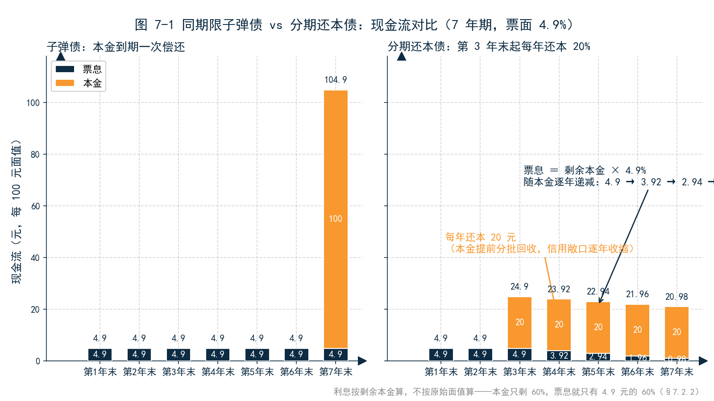
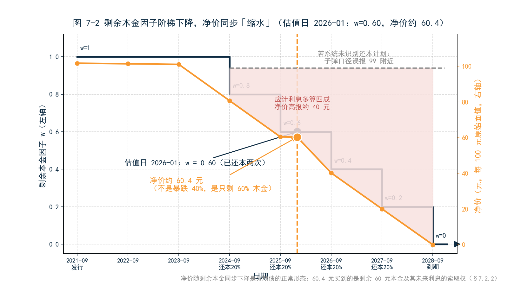
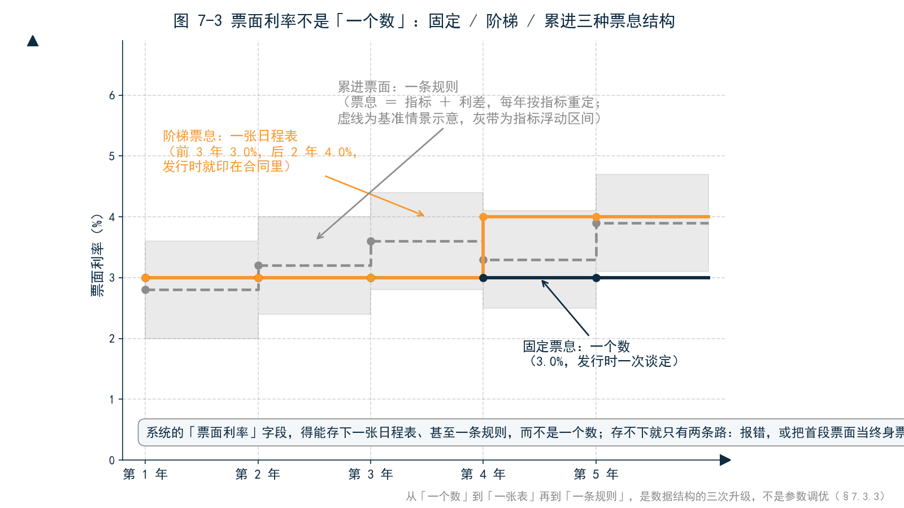
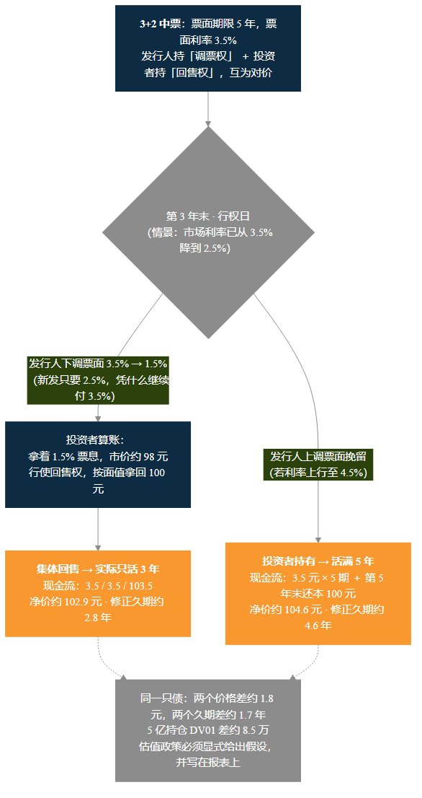
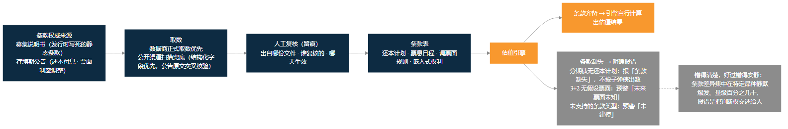

<!--
【素材来源】
- 条款分类与分流架构：docs/ficc_design/BOND_SPECIAL_TYPES_ENGINE_OVERVIEW.md（AMORTIZING / STEP / CALL_PUT / ISSUER_RESET 分类、剩余本金因子 w(t) 定义、「识别到但未实现必须 WARN、禁止静默当子弹债」纪律）
- 分期还本数字案例：docs/ficc_design/BOND_AMORTIZING_PHASE1_DETAILED_DESIGN.md（2180347 风格示意日程：2021-09-02 发行、2028-09-02 到期、票面 4.9%、年付息、第 3–7 年末各还 20%；估值日 2026-01-01 剩余因子 0.60、应计约为同票面子弹债的 60%（0.97 vs 1.62）、净价约 60.4 per 100 原始面值、4.5% 收益率下全价约 61.3）
- 条款字段规格：docs/ficc_design/BOND_INFO_SPECIAL_TYPES_SPEC.md（principal_schedule / coupon_schedule / has_coupon_reset 字段、P7「识别到但未实现必须 WARN」、P8 日程编码约定）
- 公开条款扫描：docs/markdown/market_data/ch12_BOND_TERMS_PUBLIC_SCAN.md（起息日 / 分期还本 / 已调票面的公开补全流程；含权中票行权后 5.88%→2.88% 实例；「不要把还本伪装成成交」；数据商正式取数优先于公开扫描）
- 中国债券分类科普：帮助站 fixedincome/bond.md（按偿还方式、特殊条款分类）
- 语气范本：docs/customer/财联社/book/12_第3章_估值.md、14_第5章_归因.md、15_第6章_风险.md、三折页文案.md
- 结构依据：docs/customer/财联社/book/_archive/02_提纲_方案B.md 第 7 章

【衔接与伏笔】
- 承接第 3 章「14 只分期债对账剔除」事件（§3.3.1）与第 5 章「条款补录致残差 80 万」事件（§5.6.3），本章把条款本身讲透
- 呼应第 6 章：久期假设错误 → DV01 错误 → 限额与对冲失效
- 为第 8 章埋伏笔：本章条款是「现金流的时间表」，第 8 章（可转债强赎/下修、雪球敲入敲出）是「现金流的触发器」，逻辑同为「条款即估值」

【仍需补充】
1. 引子的 POC 场景（海外估值系统、200 只持仓 60 只算不出来）为合成叙事；「三成」是情节设定，不是市场统计。成稿前如有真实系统选型/上线经历，建议匿名化替换。
2. 3+2 案例两种假设下的估值（102.9 / 104.6 元、修正久期 2.8 / 4.6 年）为按 2.5% 收益率手算的示意值；分期债久期对比（约 1.5 年 vs 约 2.4 年）同为手算示意，建议用引擎实测值替换。
3. 累进票面（挂钩 GDP / CPI 等宏观指标）在中国市场罕见，正文按估值原则处理、未引用具体债券；如需真实个例，需另查募集说明书。
4. 含权债「行权收益率 / 到期收益率」双口径报价惯例、中债估值对分期债与含权债的处理方式，需与中债金融估值中心公开资料核对。
5. 「欧美公司债绝大多数为子弹债 + 固定票息、含权以 make-whole call 为主」为定性表述，建议成稿前补充可引用的市场结构数据来源。
6. 「亲手试试」问法需与 MVE 实操包内置数据（PORT_BOND、分期债与 3+2 中票样例券）最终对齐。
7. ~~正文【图 7-x 占位】待替换为实际图片引用。~~（2026-09-09 已完成：图 7-1～7-5 已替换为 figures/ch07/ 下的实际图片引用）
-->

# 第 7 章　中国债券条款：分期还本、阶梯票息、已调票面

## 引子：六十只「算不出来」的债券

那 14 只分期债的对账风波（第 3 章）之后，老陈的部门动了一次真格：重新评估估值系统。消息传出，一家国际知名的估值系统供应商找上门来——他们的系统服务着全球几百家机构，售前总监 Kevin 专程从新加坡飞来演示。

演示很流畅：美国国债、德国国债、投资级美元债，随点随算，净价、应计利息、久期、VaR 一气呵成。老陈听完，让小李把部门的真实持仓清单拷给他：「别用你们的演示组合，跑我们这个——200 只债，跑通了我们再谈。」

一周后，POC 报告回来了。200 只债里，140 只的估值结果与中债估值对得上；剩下 60 只，要么直接报错，要么数字明显不对。Kevin 在电话里逐一解释，语气从自信变成困惑：

- 14 只分期还本债：「系统里每只债券的赎回就是到期还 100%，没有地方录入『第 3 年起每年还 20%』。」——正是第 3 章对账剔除的那 14 只。
- 三十来只 3+2、5+2 中票：「系统要我填一个票面利率、一个到期日。你们的合同给的是一段规则——第 3 年末发行人可以调票面，投资者可以回售。票面填哪个？到期算哪年？」
- 十几只阶梯票息债和可转债：「系统把第一年的票面当成了整个存续期的票面。」

「我在这个市场做了十五年，」Kevin 说，「第一次遇到三成持仓都是 special case。」

老陈的回答后来被部门反复引用：「这些不是 special case，这是中国债券市场的日常。你们的模型不笨，是它认识的『债券』太干净了。」

三成持仓算不出来——这不是第 3 章那种 2 分钱的精度之争，而是「能不能算」的问题。本章回答三件事：这些条款到底是什么；它们如何改变现金流、估值与久期；以及，为什么海外估值模型到了中国就失灵。

---

## 7.1 一只「干净」的债券：海外模型的三个隐含假设

先理解海外模型认识的「债券」长什么样。翻开任何一本欧美固收教科书，标准债券只有四个要素：面值 100 元、票面利率 3%、5 年期、每年付息一次。它的现金流一行就能写完：第 1 到第 4 年各 3 元，第 5 年 103 元。

第 3 章说过，估值就是把这串现金流按曲线折现加总。折现公式全世界通用——真正的问题藏在公式之前的那个环节：**现金流是怎么生成的。**教科书债券的现金流生成规则里，焊死了三个隐含假设：

| 隐含假设 | 内容 | 被什么条款打破 |
|---|---|---|
| 假设一：本金恒定 | 本金始终等于面值，到期一次偿还 | 分期还本 |
| 假设二：票息恒定 | 每期票息 = 面值 × 票面利率，一个常数 | 阶梯票息、累进票面、已调票面 |
| 假设三：期限确定 | 到期日写在合同里，不会变 | 3+2、5+2 含权结构 |

这三个假设不是写在论文里的公理，而是焊死在系统数据结构里的默认值。在海外估值系统的数据库里，一只债券大致是这样一条记录：到期日是一个日期，票面利率是一个浮点数，赎回比例默认 100%。**没有「还本计划」这个字段，没有「票息日程」这个字段，更没有「调票面规则」这个字段。**字段不存在，条款就无处安放；条款无处安放，现金流就是错的——而后面的折现算得再精确，也只是精确地算错。

为什么这样的系统能在欧美市场畅行无阻？因为市场结构撑得起这三个假设：欧美公司债的绝对主流就是子弹式还本、固定票息；含权债当然存在，但集中在专门的产品线上，由专门的模块和专门的数据商伺候。假设大体成立，系统大体正确，剩下的例外由人工兜底——这套分工在欧美运转了几十年。

然后这套系统来到了中国。中国债券市场的条款丰富程度是另一个量级：城投债流行分期还本，中票和公司债流行 3+2、5+2 含权结构，可转债的票息逐年爬坡，政策性金融债里还出现过票息挂钩宏观指标的写法。**在欧美，特殊条款是例外；在中国，特殊条款是日常。**三个隐含假设在这里成批失效——这就是引子里那 60 只债券的来历。下面三节，逐一看这三类条款。

---

## 7.2 分期还本：本金会「缩水」的债券

### 7.2.1 第 3 年末起，每年还 20%

先看一只真实风格的分期还本债：某城投债，2021 年 9 月 2 日发行，7 年期，2028 年 9 月 2 日到期，票面利率 4.9%，每年付息一次。募集说明书里有一行海外债券没有的约定：**从第 3 年末起，每年 9 月 2 日偿还本金的 20%**——2024 年还 20 元，2025 年还 20 元，一直到 2028 年连本带息结清。

为什么要这样设计？从发行人看，城投项目的回款是逐年到位的，分期还本让偿债现金流与项目现金流匹配，避免到期日一次性拿出 100 元的流动性悬崖；从投资者看，本金提前分批回收，信用敞口逐年收缩——对弱资质发行人，这是一种双方都接受的折中。所以分期还本不是 exotic 结构，它是中国信用债市场最常见的条款之一，在城投债、产业债、项目收益债里遍地都是。

这里引入一个全书都会用到的概念：**剩余本金因子**，记作 w——发行时是 1.0，每还一次本降一档。这只债在 2024 年 9 月 2 日还本后 w 变成 0.8，2025 年还本后变成 0.6，依此类推，到期日归零。它就像一块电池的电量显示：看一眼 w，就知道这只债还剩几成本金。

### 7.2.2 剩余本金计息：一个因子改变所有数字

分期还本债的计息规则一句话：**利息按剩余本金算，不按原始面值算。**本金只剩 60%，票息就只有发行时的 60%。

把估值日设在 2026 年 1 月，看这只债的实际数字。此时已还本两次，w = 0.60：

- **当期票息**：100 × 0.60 × 4.9% = 2.94 元——不是 4.9 元；
- **应计利息**：距上一付息日约 4 个月，约 0.97 元——同口径的子弹债是 1.62 元，正好是其 60%；
- **净价**：约 60.4 元（按每 100 元原始面值报价）——不是 100 元附近。

第三个数字最容易引起误会。新同事第一次看到分期债净价 60.4，第一反应往往是「这债是不是暴雷了、跌了 40%」。不是。**净价随剩余本金同步下降，是分期债的正常形态**：你花 60.4 元买到的，是剩余 60 元本金及其未来利息的索取权，每 1 元剩余本金对应的身价其实还在 100 元附近。中国市场对分期债的报价惯例是按原始面值 100 元报价，所以「净价不在 100 附近」不是 bug，是口径——但前提是，你的系统得知道这是一只分期债。

### 7.2.3 久期的错觉：7 年期的债，5 年期的命

分期还本对估值的影响不止于票息和净价，它还改写了这只债的「时间属性」。

直觉先看一个粗指标：本金平均回收期。子弹债的本金第 7 年末一次性回来，平均回收期就是 7 年；分期债的本金从第 3 年到第 7 年分五批回来，平均回收期是 0.2×(3+4+5+6+7) = 5 年。**一只「7 年期」的分期债，本金的平均回收节奏和一只 5 年期子弹债相当。**

久期把这个直觉精确化。站在 2026 年 1 月看：这只分期债剩余的现金流集中在未来两年多，修正久期约 1.5 年；而一只同样 2028 年到期的子弹债，修正久期约 2.4 年——**同一只债，两种理解，久期差近 1 年。**

把第 6 章的尺子拿出来量一下这个差异的业务后果：如果系统把分期债当子弹债，久期高估近 1 年，DV01 跟着高估约六成。单券看着是小事；一个组合里躺上十几只分期债，全组合的 DV01 就带上了系统性高估。久期错，则限额错、对冲错、VaR 错——第 6 章那套风险体系的地基里，有一块砖叫「条款正确」。

### 7.2.4 回到那 14 只债

现在可以完整兑现第 3 章埋下的伏笔了。那 14 只债的问题不是估值算错了，而是**系统里根本没有录入还本计划**——没有还本计划，系统就按默认假设走：本金恒等于面值，到期一次偿还。于是剩余本金只剩 60% 的券，应计利息按 100% 面值多算了四成，净价报在 99 元附近而不是 60 元附近。对账时与中债估值差异大到无法解释，只能整体剔除，等条款补录后再估。

第 3 章那句结论值得在这里再读一遍：**报表上一只「净价 99.8」的分期债，不是估值准，是系统根本不知道它还过本。**

条款齐备之后，验收是刚性的：剩余因子 0.60 时，应计利息必须约为同票面子弹债的 60%，净价必须在 60.4 附近——差一点都不行。条款驱动的估值有一个让人安心的性质：**对就是对，错就是错，中间没有模糊地带。**这也是条款问题与曲线问题的本质区别：曲线差异是半个基点的连续分歧，条款差异是「知不知道这只债还过本」的离散对错。

---

## 7.3 阶梯与累进：票面利率不是「一个数」

第二个假设的崩塌更安静，但同样致命：票息不是常数。

### 7.3.1 阶梯票息：写进合同的利率日程表

一只 5 年期公司债，募集说明书写明：前 3 年票面 3.0%，后 2 年票面 4.0%。利率不是谈出来的，是发行时就印在合同里的日程表。可转债把这种写法用到极致：6 年存续期，票息从 0.5% 逐年爬到 2.0%——发行人用低票息换转股权的估值空间，投资者用票息换期权，各取所需（第 3 章已经见过它的身影）。

阶梯票息的估值本身毫无难度：每一期的现金流都是确定的，逐期折现加总即可。难度不在数学，在工程——**系统的「票面利率」字段得能存下一张日程表，而不是一个数。**存得下，估值水到渠成；存不下，系统只有两条路：报错，或者更糟——把首段票面当成终身票面，前 3 年算对、后 2 年静默算错。引子里那十几只「把第一年票面当成整个存续期票面」的债，走的就是第二条路。

### 7.3.2 累进票面：挂钩宏观指标的票息

比阶梯更进一步的写法是累进票面：票面利率不与日历挂钩，与某个经济指标挂钩——比如「上年 GDP 实际增速加 100 个基点」「CPI 同比加 50 个基点」，每年按指标重定一次。

这类债券在市场上不多见，但它把票息问题暴露得最彻底：**票面利率可以不是「一个数」，甚至可以不是「一张确定的表」，而是「一条规则」。**规则意味着现金流在发行时不完全确定——今年的票息要等指标公布才知道。估值因此多了一层输入：对指标未来取值的假设。成熟的处理是给情景不给猜测：基准情景按指标当前值外推，同时披露指标上下浮动对估值的敏感性；并且把「假设了什么」写进估值政策，而不是藏进模型参数。

### 7.3.3 一个字段装不下一张表

把 7.3 节收拢成一句工程语言：海外系统的 coupon 是一个浮点数，中国债券需要的 coupon_schedule 是一张「日期—利率」对照表，累进票面需要的是一条「指标—利差」规则。**从「一个数」到「一张表」再到「一条规则」，是数据结构的三次升级，不是参数调优。**用浮点数字段硬扛日程表，就像用单行文本框存一篇文章——不是存不下，是存下之后面目全非。

---

## 7.4 3+2 与 5+2：这只债活到哪一年

第三类条款最微妙，因为它打破的是最不起眼的假设：期限确定。

### 7.4.1 条款解剖：发行人的权利，投资者的对价

一只典型的 3+2 中票：票面期限 5 年，票面利率 3.5%；第 3 年末，发行人有权调整票面利率（上调或下调），同时投资者有权按面值把债券回售给发行人。

把条款翻译成权利组合：**发行人持有一个「调票权」，投资者持有一个「回售权」，两者互为对价。**发行人为什么想要调票权？因为 5 年里利率环境可能大变，锁定 5 年票面太僵硬——利率下行时，它想把高票面调下来。投资者为什么肯给这个权利？因为换来了回售权——票面被调到没有吸引力时，可以按面值全身而退。3+2 结构是中国信用债市场供需双方多年博弈出的标准解：发行人保留融资灵活性，投资者保留退出选择权。

### 7.4.2 行权日的博弈：降票面就是「变相到期」

第 3 年末会发生什么？推演一个典型情景：市场利率从 3.5% 降到 2.5%。发行人算账：现在新发一只债只要 2.5%，凭什么继续付 3.5%？于是把票面下调到 1.5%。投资者接着算账：拿着 1.5% 的票息，这只债在市面上的价值约 98 元；而行使回售权，按面值拿回 100 元。理性选择一目了然——**集体回售。**

于是，一只合同上写着「5 年期」的债券，实际只活了 3 年。发行人用调票权实现了「按面值提前再融资」，投资者用回售权实现了「按面值提前退出」。反过来，如果利率上行到 4.5%，发行人大概率上调票面挽留——债券活满 5 年。

注意发行人调票面的真实动机：它不是慈善，也不是任性，是再融资成本的权衡。**降票面的本质，是按面值强制赎回加重新发行**——只是法律形式上，它只是一纸票面利率调整公告。

### 7.4.3 估值的两难：两个价格，两个久期

对估值系统，3+2 提出了一个必须先回答的非技术问题：**你假设这只债活到哪一年？**

用数字感受一下两个答案的距离（示意：收益率 2.5%，站在发行后不久看）。按「第 3 年末回售」假设，现金流是 3.5、3.5、103.5，净价约 102.9 元，修正久期约 2.8 年；按「持有到第 5 年」假设，现金流多两期票息、本金晚两年回来，净价约 104.6 元，修正久期约 4.6 年。

**同一只债，两个价格差约 1.8 元，两个久期差约 1.7 年。**1.7 年的久期差是什么概念？5 亿持仓，DV01 差约 8.5 万元——第 6 章的限额体系、对冲方案、VaR 数字，全都建立在这个假设之上。假设从「行权」切到「不行权」，组合的风险画像整个换了一张脸，而持仓一只都没变。

市场实务对这个两难的回应很有意思：含权债的报价惯例是同时给两个收益率——「行权收益率」和「到期收益率」，中债估值也按两个口径发布。**「活到哪一年」的问题，在市场报价层面就被摆上了桌面，谁也不假装它不存在。**估值系统的正确姿势与此同构：由估值政策显式给出假设（按行权、按不行权、或按显式的假设票面），引擎按假设重估，并把「当前估值基于哪个假设」写在报表上。

### 7.4.4 已调票面：行权之后，旧票面作废

行权不是理论推演，它真实发生，而且发生后估值必须跟上。一只含权中票行权后，票面从 5.88% 调整到 2.88%——后两年的票息直接腰斩。估值系统必须在生效日切换到新票面；如果没跟上，按旧票面继续算，后两年票息多算一倍。

请注意这类信息与分期还本计划的一个关键区别：**还本计划发行时就写死在募集说明书里，一次录入终身有效；已调票面是存续期内发生的事件，藏在一份份《票面利率调整公告》里。**它不在成交数据里，不在行情里，甚至数据商的基本资料库都常常滞后——它只在公告里。这就是为什么「已调票面」是估值核算最容易踩的坑之一：系统里的票面还是 5.88%，公告里的票面早已是 2.88%，而没有人收到提醒。

### 7.4.5 是条款，还是期权？

回到小标题的问题。答案是：都是。法律形式上，3+2 是条款——白纸黑字写在募集说明书里；经济实质上，它是期权——发行人的调票权加投资者的回售权，价值随利率环境波动。

那为什么海外系统的含权债模块接不住它？因为海外含权债的主流是另一种生物：美式公司债的赎回条款多为 make-whole call——发行人按「国债收益率加固定利差」折现赎回，赎回价随市场浮动，定价需要利率模型和波动率输入，走的是期权定价框架。中国的 3+2 完全不是这个逻辑：回售按面值、调票幅度由发行人相机抉择、行权驱动是「发行人信用加再融资成本」的博弈。**用利率期权模型去套 3+2，是把博弈论问题当成随机过程问题——模型越精致，错得越自信。**

所以成熟的系统在这里的纪律是「显式假设加完整披露」，而不是「假装能算」：估值政策给出假设票面或行权假设，引擎按假设估值并标注；条款信息不全时，明确预警「未来票面未知」——**禁止静默沿用旧票面，假装一切已知。**一个默认值不会报警，但它会让全组合的久期带上系统性偏差。

---

## 7.5 为什么海外模型处理不了

三节条款看完，可以正式回答本章标题的问题了。

### 7.5.1 不是算法不行，是数据结构不行

先说清楚什么不是原因。不是折现算法——现值公式全世界通用；不是数值精度——海外系统算美国国债能精确到小数点后六位；也不是工程师水平——那些系统服务全球几百家机构，久经考验。

真正的原因在数据结构。海外系统里，「债券」这个对象大致是：一个到期日、一个票面利率、一个付息频率、赎回比例默认 100%。中国债券需要的是：一个到期日（可能永远用不上）、**一张还本计划表**、**一张票息日程表**、**一条调票面规则**、**一组嵌入式权利**。这不是多填几个字段的事，是「债券」这个词的定义不同。**字段不存在，条款就无处安放；条款无处安放，现金流就是错的；现金流是错的，后面的一切都是精确地错。**

### 7.5.2 「特殊条款」在海外是例外，在中国是日常

更深一层的原因在市场结构。欧美市场当然也有分期还本（ABS、MBS 的摊还）和含权债，但它们是「专门产品」：有专门的资产类别、专门的定价模块、专门的数据商，与普通公司债分而治之。普通公司债模块面对的假设大体成立，系统大体正确。

中国市场的特殊性在于：**这些条款不长在专门产品上，长在最普通的品种上。**一只城投债可以是分期的，一只中票可以是 3+2 的，一只可转债天然带着阶梯票息和四个期权条款。它们不是 edge case，它们是持仓的主体。对海外系统，这是「例外太多，系统受不了」；对中国估值岗，这是「每个月的日常」。引子里 Kevin 的困惑——「三成持仓都是 special case」——本质上是两种市场结构的对撞。

### 7.5.3 手工补丁的代价：Excel 估值岗

海外系统接了中国的单，最后怎么落地？另一家机构的真实路径颇具代表性：系统照上，算不了的债券由估值岗每月底手工维护——一张 Excel，几十只债，逐只手工摆现金流、算净价，再导回系统。

这条路的代价有三层。第一层是效率：「系统自动化」退化成「Excel 自动化」，月结效率退回十年前。第二层是留痕：手工环节没有审计轨迹——审计问「这个净价从哪来」，答案是「估值岗的一张 Excel」，第 1 章那句「这个数字从哪来」在这里答不上。第三层最隐蔽：**口径漂移**——Excel 里的假设没人复核，三个月没人记得当时为什么这么调，半年后假设悄悄变了，损益里混进口径切换的噪音（第 5 章的 80 万残差，就是这么来的）。

所以系统选型有一条血泪经验：**POC 时跑的是国债，上线后持仓里全是城投。**条款覆盖率——拿你的真实持仓清单跑一遍，看多少只能算、多少只能对——应该是估值系统选型的一票否决项，而不是验收报告里的一个备注。

---

## 7.6 条款治理：让条款成为一等公民

问题清楚了，解法是什么？不是换一套更贵的海外系统，而是把条款当作估值的一等公民来治理。四件事。

### 7.6.1 条款从哪来：募集说明书、公告与扫描

条款的权威来源只有两个：募集说明书（发行时写死的静态条款）和存续期公告（还本付息公告、票面利率调整公告——窗口内发生的动态事件）。工程上的现实是：成交数据里没有条款，行情里没有条款，数据商的基本资料库里常常缺条款。

补全的优先级是：数据商正式取数优先；公开渠道扫描兜底——结构化字段（债券资料页、还本计划页）优先，公告原文解析做交叉校验；人工复核收尾。无论哪条路，纪律相同：**每个条款字段都要留痕——出自哪份文件、谁复核的、哪天生效。**条款数据和估值数字一样，要能回答「从哪来」。

### 7.6.2 静态条款与动态事件

条款信息分两类，治理节奏不同。静态条款——分期还本计划、阶梯票息日程——发行时写死，一次录入、终身有效，治理重点是「录入时录对」。动态事件——已调票面、已兑付还本——公告驱动、持续跟踪，治理重点是「生效日切换对」。

动态事件有一个专门的坑值得点名：**不要把还本伪装成成交。**还本是条款执行，不是买卖——如果把还本录成一笔「按面值卖出」，价差、费用、绩效全被污染。还本进还本计划，调票面进票息日程，各就各位，下游的估值、绩效、归因才各得其所。

### 7.6.3 错得清楚，好过错得安静

第 3 章讲价格来源链时的那句设计哲学，在条款这里分量更重：**条款齐备则引擎自行计算，条款缺失则明确报错。**

落到具体条款上：分期债没有还本计划——报错「条款缺失」，而不是按子弹债出数；3+2 没有假设票面——预警「未来票面未知」，要求估值政策显式给假设，而不是静默沿用旧票面；识别到系统尚未支持的条款类型——预警「未建模」，而不是假装它是普通债。

为什么对「静默」如此严防死守？因为条款错误的破坏方式是不对称的：曲线差异每天均匀分布、量级是基点零头，对账时容易暴露；**条款差异集中在特定品种上爆发、量级是百分之几十，却披着「正常估值结果」的外衣。**一只净价 99.8 的分期债混在报表里，没有任何红灯会亮——直到审计或对手盘替你发现。报错不是系统无能，是系统在履行职责：把「这个数字我给不了」显性化，把判断权交还给人。

### 7.6.4 条款变更的时点管理：回看那 80 万

最后，从条款治理的角度，把第 5 章那 80 万残差事件重讲一遍。月中估值系统升级，把 14 只分期债的还本计划补录了进去——这是正确的事，估值变准了。但月内归因要求期初、期末两次估值口径一致：期初按「无还本计划」估、期末按「有还本计划」估，两次估值之差里混进了口径切换本身，残差替它背了锅。

正确的做法不是不补录，而是**给每一次条款变更配一次「变更日双估值」**：补录当天，用新旧两套条款对同一持仓各估一次，差额记为「口径调整项」，从投资损益中剔除、单独披露。条款变了是好事，但条款变化本身要作为一个数字被说出来，而不是藏进残差里。这是条款治理的成熟标志，也是第 3 章「同源」二字在条款维度上的完整含义。

---

## 7.7 如果 AI 来读募集说明书

章末照例问那个问题：如果让 AI 来管条款，会发生什么？

先看 AI 能做什么——而且恰好是它的强项。条款抽取是典型的自然语言理解任务：读一份上百页的募集说明书，抽出还本计划、票息日程、调票面规则、回售条款，填进条款表；读一份票面利率调整公告，抽出新旧票面与生效日。人工做是月度负担，AI 做是分钟级的事。引子里 Kevin 的系统缺的是字段，而字段里的内容，AI 恰好能帮忙从公告里挖出来。

再看 AI 不能做什么。抽取结果不能直接进估值。AI 抽错一个日期、一个比例、一个「或」字的归属，现金流就全错——而且错得无声无息，比缺条款更危险：缺条款至少会报错，错条款会出数。**条款治理里最可怕的不是空白，是看似合理的错误。**

所以正确的分工是一条三道工序的流水线：**AI 抽取，引擎校验，人工复核。**引擎校验是中间那道关键工序：抽出的条款先生成现金流，与已兑付的历史还本付息对账——对得上，条款大概率抽对了；对不上，打回重查。罕见条款、冲突条款、抽不出来的条款，交给人工。AI 让条款补全从「月度手工活」变成「日常流水线」，但流水线的最后一道工序永远是人。

「这个数字从哪来」在条款领域有一个对应的版本：**「这条条款从哪来」**——出自哪份公告第几页、谁复核的、哪天生效。条款可追溯，估值才可追溯；这是全书主线在条款治理上的投影。

---

## 本章概念卡

| 概念 | 一句话解释 | 详见 |
|---|---|---|
| 分期还本 | 本金按日程表分批偿还、剩余本金计息——一个因子改变所有数字 | §7.2 |
| 阶梯票息 | 票面利率是写进合同的一张日程表，不是「一个数」 | §7.3.1 |
| 3+2 / 5+2 条款 | 发行人行权日有权调票面、投资者有权回售——债活到哪一年是博弈 | §7.4 |
| 已调票面 | 行权后新票面以公告形式生效、旧票面作废，是动态事件不是静态条款 | §7.4.4 |
| 两个价格、两个久期 | 含权债按「到期」与「行权」两种假设各有一套估值 | §7.4.3 |
| 静态条款与动态事件 | 发行时写死的一次录入终身有效；存续期发生的要公告跟踪 | §7.6.2 |
| 条款治理 | 让条款成为一等公民：来源可追溯、生效日管理、变更单独计量 | §7.6 |

---

## 本章小结

回到引子的问题：为什么海外估值模型到了中国就失灵？

**因为三个焊死在数据结构里的隐含假设，在中国市场成批失效。**本金恒定——被分期还本打破：利息按剩余本金算，剩余因子 w 改变所有数字，应计利息、净价、久期全部改写；一只 7 年期的分期债，本金平均回收期只有 5 年。票息恒定——被阶梯票息、累进票面、已调票面打破：票面利率不是一个数，是一张日程表，甚至一条规则。期限确定——被 3+2、5+2 打破：估值必须先回答「这只债活到哪一年」，两个假设对应两个价格、两个久期，5 亿持仓的 DV01 能差出 8.5 万。

**所以条款不是债券的附属信息，条款就是估值本身。**系统对条款的理解差一分，估值就差一截——而且条款差异不像曲线差异那样每天均匀暴露，它集中在特定品种上静默爆发。这决定了系统选型的纪律（条款覆盖率是一票否决项）、引擎的行为纪律（条款缺失明确报错，错得清楚好过错得安静）、以及条款治理的纪律（每个字段可追溯，每次变更配一次双估值）。

最后看一眼这条路通向哪里。本章的条款，无论分期、阶梯还是调票面，本质上都是「现金流的时间表」——钱在什么时间、按什么规则来，时间表写好了，折现是例行公事。但中国市场还有另一类条款，它不确定的是更根本的东西：钱**会不会**来、以什么形式来——可转债的强赎、回售、下修，雪球的敲入敲出，现金流由事件触发，条款本身就是定价的对象。时间表已经让海外模型束手无策，触发器会把「条款即估值」这句话推向极致。那是第 8 章的主题。

本章涉及的中国债券特殊条款速查（分期还本、阶梯与累进票面、已调票面、含权结构的字段与口径）集中收录于附录 E。

---

## 亲手试试

打开 MVE 实操包，做三个实验。

实验一，分期还本。对 AI 说：

> 「在组合 PORT_BOND 里找出那只分期还本债，告诉我它今天的剩余本金比例、当期票息、应计利息和净价；再按子弹债口径（不还本、全额计息）重估一次——两个净价差多少、应计利息差多少、久期差多少？如果按子弹口径记账，这个月会多算多少票息收入？」

实验二，3+2 的两种命运。对 AI 说：

> 「组合里那只 3+2 中票，分别按『第 3 年末行使回售』和『持有到第 5 年』两种假设估值，把两个净价、两个久期并排给我看；如果估值政策从『行权』切换到『不行权』，组合 DV01 变多少？把这只券的票面利率调整公告找出来，告诉我行权后票面从多少调到多少、哪天生效。」

实验三，条款缺失的行为。对 AI 说：

> 「把那只分期还本债的还本计划删掉再估值——引擎是明确报错，还是照样出数？如果出数，出的数是多少、错在哪？」

跑完之后追问一句：「再扫一遍 PORT_BOND，还有哪些券缺关键条款？列一张清单，按对估值的影响从大到小排序。」——这三个实验的答案，就是本章的全部要点：**条款决定现金流，现金流决定估值；条款缺失时，一个诚实的系统应该报错，而不是猜。**
