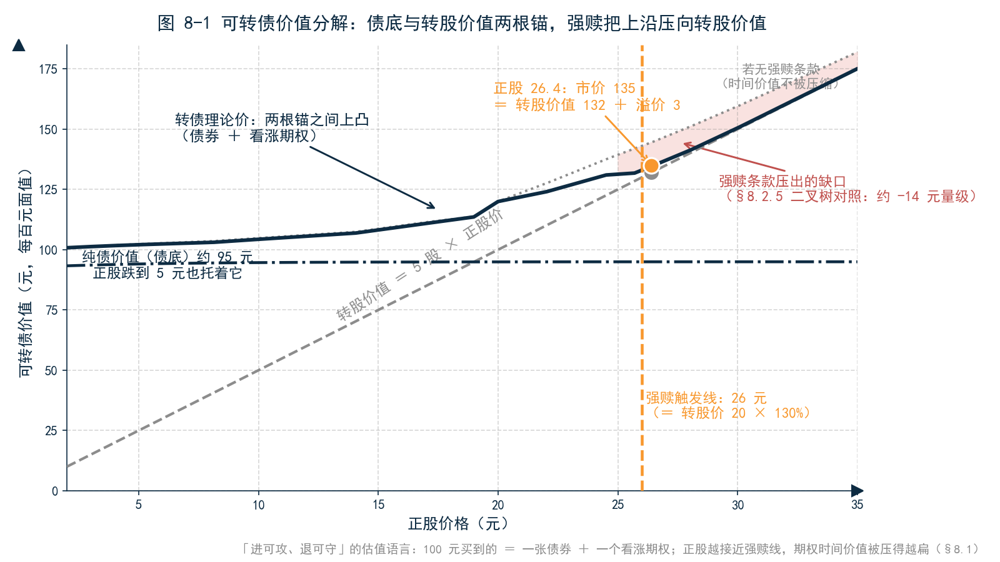
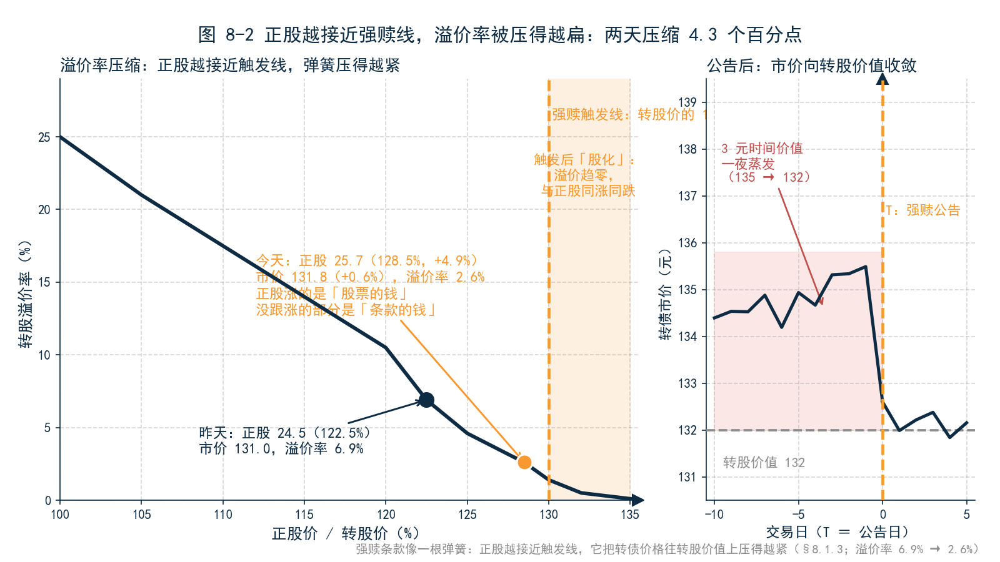
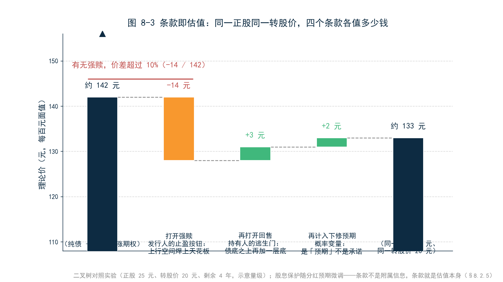
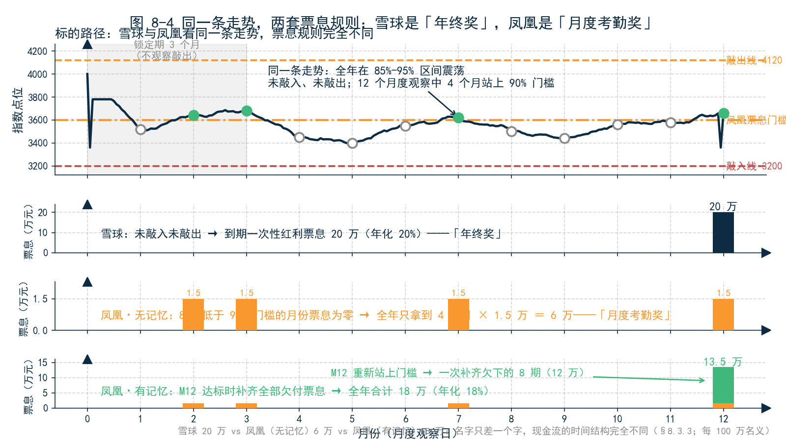
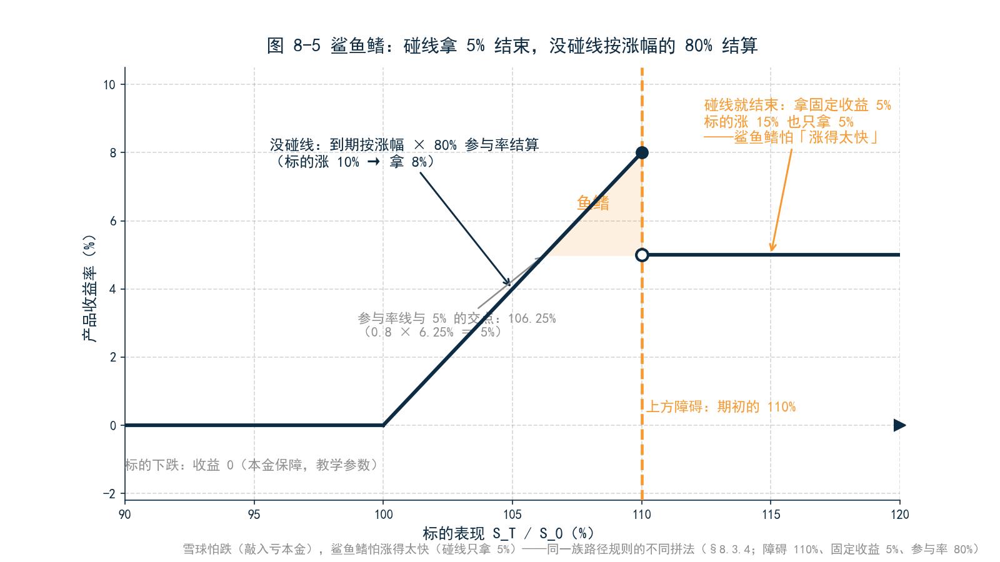
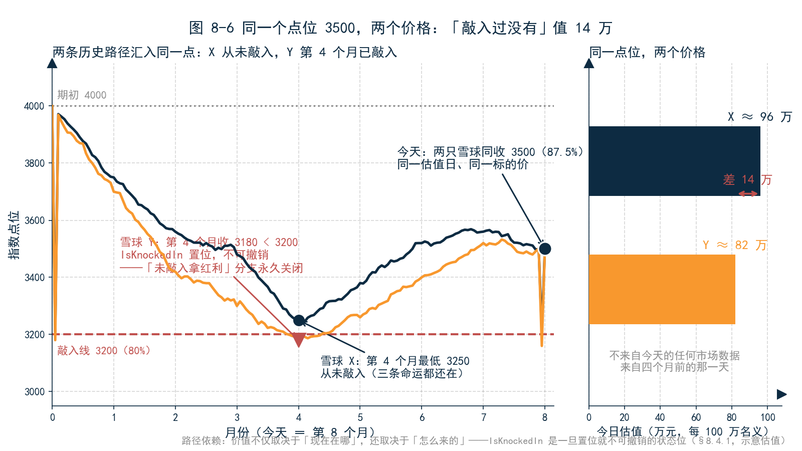
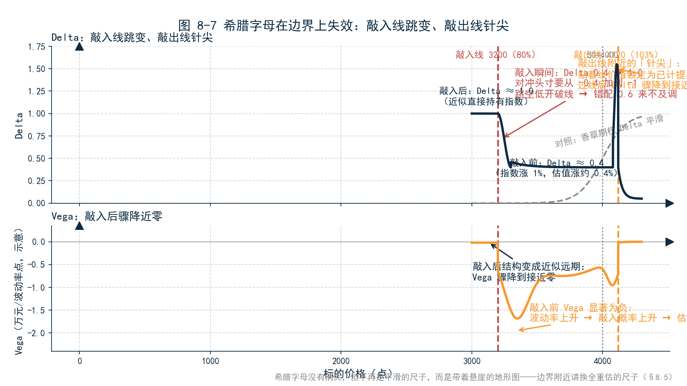

<!--
【素材来源】
- 可转债四条款参数与市场背景：docs/markdown/products/ch04_CONVERTIBLEBOND_DETAILED.md（§2.1 市场概况、§2.5 转股溢价率、§3.2 强赎 15/20 日 130%、§3.3 回售最后 2 个计息年度 30 日 70%、§3.4 下修 15/30 日 85% 且不低于每股净资产、§3.5 股息保护 P新=P旧−每股分红、§4.4 二叉树节点 min/max 条款处理、113052.SH 下修 20.00→17.50 转换比率 5.000→5.714 实例）
- 雪球三路径数值：D:\vuepress\help-master3\zh\latest\docs\structure\snowball.md（S0=4000、名义 100 万、锁定期 3 个月、敲出 103%/敲入 80%、票息 18%/20%、路径 A/B/C = +9 万/+20 万/−30 万；HistVol/ImpliedVol/LocalVol/SLV 四把尺；锁定期只关敲出不关敲入；Greeks 误区）
- 凤凰/气囊/累计器谱系：D:\vuepress\help-master3\zh\latest\docs\structure\phoenix_airbag_accumulator.md（凤凰 = 雪球 + 90% 票息门槛 + 记忆开关；族谱对比表）
- 鲨鱼鳍与结构化产品族：docs/markdown/products/ch40_STRUCTUREDDERIVATIVE_DETAILED.md（sharkfin.yaml 单障碍敲出、dualsharkfin.yaml 双障碍、YAML 结构定义、LocalVol 蒙特卡洛、VaR 双重蒙特卡洛、路径状态 IsKnockedOut/IsKnockedIn 存储与 state 压缩）
- 跨资产 Greeks 口径：D:\vuepress\help-master3\zh\latest\docs\structure\greeks.md（Bump 标准化、Gamma 双标准化）
- 语气范本：docs/customer/财联社/book/12_第3章_估值.md、16_第7章_中国债券条款.md、三折页文案.md
- 结构依据：docs/customer/财联社/book/_archive/02_提纲_方案B.md 第 8 章（强赎/回售/下修/股息保护、敲入敲出、路径依赖、条款即估值）

【衔接与伏笔】
- 承接第 3 章：强赎案例（转股价 20 元、正股 26.4 元、市价 135→132 收敛）在 8.1.3/8.2.1 展开为完整机制；雪球三路径（+9 万/+20 万/−30 万）在 8.3.1 升级为「客户投诉」场景
- 承接第 7 章：第 7 章条款是「现金流的时间表」，本章条款是「现金流的触发器」——钱会不会来、以什么形式来
- 呼应第 5 章：敲入日的估值跳变会让损益拆解残差爆炸，除非归因框架认识「条款状态切换」因子（8.4.3）
- 呼应第 6 章：Greeks 在边界跳变 → Delta 对冲失灵 → VaR 需要全重估蒙特卡洛（8.5.3）
- 为第 9 章（IFRS9）埋伏笔：可转债的负债/权益分拆、雪球过不了 SPPI 测试只能 FVTPL——条款越复杂，会计口径与经济口径距离越远（本章小结末尾）

【仍需补充】
1. 引子客户投诉场景（王总、1000 万雪球、亏 300 万）为合成叙事，成稿前如有真实客诉案例建议匿名化替换；理财经理对话为示意。
2. 8.1.3「正股涨 4.9%、转债涨 0.6%、溢价率 6.9%→2.6%」为按强赎压制机制构造的示意数字，建议用真实行情（临近强赎期的转债）回测替换。
3. 8.2.5 四条款价值分解（干净转债 142 → 强赎 −14 → 回售 +3 → 下修 +2 → 133）为二叉树模型量级示意，「有无强赎差 10% 以上」的方向与量级符合实务经验，但具体数字建议用引擎实测替换。
4. 8.3.5 波动率四把尺的价差（HistVol 20% vs LocalVol 左翼 28%、敲入概率 25%→35%、年化票息差 2–3 个点）为示意量级，建议用实操包实测。
5. 8.4.1 同一标的价 3500 下「未敲入 96 万 vs 已敲入 82 万」为示意估值，需引擎实测校准。
6. 凤凰、鲨鱼鳍的数值案例为教学参数（敲出 103%、票息门槛 90%、敲入 80%、年化 18%；鲨鱼鳍障碍 110%、固定收益 5%、参与率 80%），非具体合同报价。
7. 「亲手试试」问法需与 MVE 实操包内置数据（可转债样例券、雪球 YAML、组合编号）最终对齐；条款开关（关掉强赎/回售）与状态修改（IsKnockedIn）需在实操包中确认支持。
8. ~~正文【图 8-x 占位】待替换为实际图片引用。~~（2026-09-09 已完成：图 8-1～8-7 已替换为 figures/ch08/ 下的实际图片引用）
-->

# 第 8 章　可转债与结构化衍生品：条款即估值

## 引子：两个投诉，一个答案

上午十点，老陈被拉进一个紧急会议。电话是财富管理部总经理亲自打来的：私行客户王总，去年三月通过券商买了一千万元雪球产品，挂钩中证 500，今天到期结算，亏了 300 万。客户在电话里只有一句话：「你们当时跟我说的是年化 20%。」

理财经理小赵把产品说明书翻到第 4 页，声音有点发虚：「红利票息 20%，白纸黑字——但那是『从未敲入、也从未敲出』情形下的票息。去年 10 月指数跌破了敲入线，之后一年都没涨回敲出线，到期按指数跌幅结算。跌 30%，就亏 30%。」

王总的反问让会议室沉默了半分钟：「所以我买的到底是 20% 的票息，还是一个看运气的赌局？」

下午的麻烦是另一种。自营盘的小李拿着两只可转债的行情进来：「同一个板块，正股今天都涨了四五个点，这只转债跟涨了 8%，那只只涨了 0.6%。是不是行情源出问题了？」

行情源没有问题。那只涨不动的转债，正股已经站上了转股价的 130%，强赎倒计时开始了——市场在为「这份合同随时可能被发行人终止」定价，溢价被压没了。

两个投诉，一个在财富端，一个在自营端，看起来毫不相干。但它们的答案都不在行情软件里，而在合同里：**这类资产的价格，一半写在正股的走势里，另一半写在募集说明书和交易确认书里。**第 3 章说过「条款即估值」，第 7 章讲了条款如何规定现金流的「时间表」；本章要讲的是更极致的一类条款——它们决定的不是钱什么时候来，而是钱**会不会来、以什么形式来**。这类条款有一个共同的名字：触发器。

---

## 8.1 可转债的解剖：债券、股票与一份合同

### 8.1.1 两根锚：纯债价值与转股价值

先把可转债拆到不能再拆。一张面值 100 元的可转债，转股价 20 元，意味着持有人随时可以把它换成 5 股正股。于是它的价值有两根锚：

第一根锚是**转股价值**：5 股正股值多少钱，这张转债至少就值多少钱。正股 26.4 元，转股价值就是 132 元——这是它的「股性」。

第二根锚是**纯债价值**，市场叫「债底」：把转股权忘掉，只当它是发行人开出的一张普通信用债——票息逐年爬坡（第 1 年 0.5%，第 6 年 2.0%），到期还本——按发行人的信用利差折现，值 95 元左右。正股跌到 5 元、转股权一文不值时，这张转债也不会跌到 25 元，因为债底托着它。这是它的「债性」。

可转债的价格，就在这两根锚之间浮动：正股涨，它跟着转股价值走，越来越像股票；正股跌，它向债底靠拢，越来越像债券。**「进可攻、退可守」这句营销话术，翻译成估值语言就是：你花 100 元买到的，是一张债券加一个看涨期权。**

### 8.1.2 转股溢价率：市场给「可能性」定的价

转债价格比转股价值高出的部分，叫转股溢价。正股 26.4 元、转股价值 132 元、转债市价 135 元，多出来的 3 元就是溢价——市场为「正股继续涨、转债跟着涨，同时还有债底保护」这份可能性付的钱。

溢价率是可转债世界的气温计。溢价率高，说明市场愿意为可能性付费，通常是正股离转股价还远、时间还长、波动率还高；溢价率趋近于零，说明转债已经「股化」，和正股同涨同跌。第 3 章那个案例里，强赎公告前溢价 3 元，公告后溢价归零——**公告改变的不是正股，是这份合同的剩余寿命，可能性没了，为可能性付的钱一夜蒸发。**

### 8.1.3 为什么正股涨 4.9%，转债只涨 0.6%

现在可以回答小李的问题了。把那只「涨不动」的转债两天的数字摆出来：

| | 正股 | 转股价值 | 转债市价 | 转股溢价率 |
|---|---|---|---|---|
| 昨天 | 24.5 | 122.5 | 131.0 | 6.9% |
| 今天 | 25.7（+4.9%） | 128.5 | 131.8（+0.6%） | 2.6% |

正股涨了 4.9%，转股价值跟着涨了 6 元；但转债只涨了 0.8 元——因为溢价率从 6.9% 被压缩到 2.6%，「可能性的价格」一天之内缩水了 4 元多。

市场在怕什么？怕强赎。这只券的强赎条款约定：转股期内正股连续 20 个交易日中至少 15 日收盘价不低于转股价的 130%，也就是 26 元，发行人就**有权**按面值加应计利息（约 100.5 元）把没转股的债券赎回去。正股今天收 25.7，离 26 元只差 1.2%。每个市场参与者都在算同一笔账：一旦触发强赎，转债价格会被迅速压到转股价值附近——现在按 6.9% 的溢价买入，等于花 131 元赌一个随时可能只值 128.5 元的东西。

所以这不是行情源错了，也不是谁算错了。**正股涨的是「股票的钱」，转债没跟涨的部分，是「条款的钱」——强赎条款像一根弹簧，正股越接近触发线，它把转债价格往转股价值上压得越紧。**而另一只跟涨 8% 的转债，正股离触发线还远，弹簧还没上劲。

---

## 8.2 四个条款：写在募集说明书里的价格

强赎只是四个条款里最戏剧化的一个。把募集说明书翻完，中国可转债的标准配置是四个条款，每一个都直接参与定价。

### 8.2.1 强赎：发行人的止盈按钮

强赎条款的设计意图，得从发行人的角度才看得懂。发行人发可转债，真实目的大多不是借钱，是**想卖股票**——只是不想现在低价卖，想等股价涨上去之后，用「债转股」的方式优雅地增发。强赎条款就是确保这件事发生的机制：正股涨过转股价 30% 并站稳，发行人就获得一个「按 100.5 元赎回」的权利。持有人面前只剩两条路：转股，拿 132 元的转股价值；或者等赎回，拿 100.5 元。理性选择一目了然——**强赎的本质不是「赎回」，是「强制转股」**，发行人用 100.5 元的威胁，逼所有人把债券换成股票，债务就此消失。

对持有人，这意味着转债的上行空间被焊了一个天花板：正股涨得再多，转债价格最多贴着转股价值走，而且随时可能被终止。第 3 章的 135→132 收敛，就是天花板落下的声音。

对估值系统，强赎是一个必须在每个节点上判断的状态：触发条件（20 日窗口、15 日达标、130% 比例）满足了没有？一旦满足，节点价值就被压到「转股价值与赎回价孰低」附近。**模型里有没有这个条款、参数录得对不对，决定估值是平滑过渡还是断崖跳变。**

### 8.2.2 回售：持有人的逃生门

第二个条款站在持有人一边。典型写法是：最后两个计息年度，若正股在连续 30 个交易日里低于转股价的 70%，持有人有权按面值加应计利息把转债卖回给发行人。

正股跌到 14 元以下（转股价 20 元的 70%），转股价值只剩 70 元，转股权深度虚值；但回售权给了持有人一个「按 100 元退出」的选择。这相当于在债底之上又加了一层保险：**纯债价值托的是「发行人不违约」的底，回售权托的是「正股再差也能按面值走」的底。**有回售条款的转债，正股暴跌时的跌幅明显小于没有回售的——这个差异不是市场情绪，是条款的公允价格。

### 8.2.3 下修：一张可以重写的合同

第三个条款最有中国特色。正股跌了，转股权变虚值，转债没人要，发行人「促转股」的大计就要落空。怎么办？合同里留了一个后门：正股连续 30 个交易日中至少 15 日低于转股价的 85%，董事会可以申请下修转股价——唯一的限制是下修后不能低于最近一期经审计的每股净资产。

下修的威力用数字看：某只转债 2024 年 8 月公告下修，转股价从 20.00 元降到 17.50 元，转换比率从 5.000 股升到 5.714 股。正股如果 15 元，转股价值立刻从 75 元跳到 85.7 元——**正股一分钱没动，转债的转股价值一夜之间抬升 14%。**这就是「下修博弈」策略的逻辑：正股接近回售线时，押注发行人为了避免真金白银的回售，会选择下修。

但请注意下修条款里最值钱的两个字：**「可以」**。下修是发行人的权利，不是义务。正股跌穿 85%，董事会可以提议，也可以装没看见；股东大会还可以否决。估值系统面对的是一个「有条件、有动机、但不保证发生」的事件——它不能像处理票息那样按日程生成现金流，只能把「下修概率」作为一个判断变量放进模型。这是可转债估值里主观判断浓度最高的地方，也是各家模型分歧最大的地方。

### 8.2.4 股息保护：除息日的联动调整

第四个条款最机械，也最容易被漏掉。正股现金分红，股价除息下调，如果转股价不动，持有人的转股价值就白白缩水。所以募集说明书约定：每股派息多少，转股价就下调多少。正股每股分红 0.5 元，转股价从 20 元调到 19.5 元，转换比率从 5.000 变成 5.128。送股、配股、拆股，同理联动。

这个条款的估值影响是四个里最小的，但工程上有个硬要求：**转股价不是一个常数，是一条随公司行为变化的时间序列。**系统里存的是「20 元」一个数，还是「发行时 20 元、某年某月分红后 19.5 元、某年某月下修后 17.5 元」一条带生效日的序列，决定了除息日那天估值是对是错。这和第 7 章「已调票面」的教训同构：条款的当前值不在成交数据里，不在行情里，在一份份公告里。

### 8.2.5 条款即估值：同一正股，两个价格

现在把四个条款放到天平上，称一称它们各自值多少钱。用二叉树模型做一个对照实验：同一只转债，正股 25 元、转股价 20 元、剩余 4 年，先把所有条款都「关掉」，再逐一打开（示意数字，量级供参考）：

| 模型配置 | 理论价 | 条款的价格 |
|---|---|---|
| 干净转债（纯债 + 完整看涨期权） | 约 142 元 | — |
| 打开强赎 | 约 128 元 | **−14 元** |
| 再打开回售 | 约 131 元 | +3 元 |
| 再计入下修预期 | 约 133 元 | +2 元 |
| 股息保护 | 微调 | 随分红预期 |

**同一个正股、同一个转股价，有没有强赎条款，理论价差 14 元——超过 10%。**这就是本章标题的字面含义：条款不是债券的附属信息，条款就是估值本身。两只转债摆在面前，正股质地相当、转股价相近，一只有强赎预期压制、一只离触发线尚远，价格差出 10% 以上，不是定价错误，是条款在定价。

第 7 章的条款——分期还本、阶梯票息、已调票面——规定的是现金流的「时间表」：钱什么时间、按什么规则来，时间表定下来，折现是例行公事。本章的条款是另一个物种：它们是现金流的**触发器**——钱会不会来、以什么形式来、合同什么时候终止，取决于未来发生的事。时间表让海外模型的数据结构失灵，触发器则更进一步：**它让「现金流」本身变成一个随机变量，估值从「折现一串确定的钱」变成「给所有可能的未来称体重」。**这个转变，在结构化衍生品身上走到了极致。

---

## 8.3 雪球和它的兄弟们：把未来切成路径

### 8.3.1 回看三条命运

回到引子里王总的问题：「我买的到底是 20% 的票息，还是一个赌局？」

诚实的回答是：他买的是一份合同，合同里写着三条命运。第 3 章已经摆过这份合同的数字：名义本金 100 万，挂钩指数期初 4000 点，期限一年；前 3 个月锁定期不观察敲出；之后每月观察一次，收于 4120 点（103%）以上则合约提前终止，按年化 18% 付已持有期间的票息；存续期内任何一个交易日收于 3200 点（80%）以下，记为「已敲入」；到期时从未敲出也从未敲入，按年化 20% 付红利票息；曾敲入且始终没敲出，按期末指数涨跌幅结算，跌多少本金亏多少。

| 路径 | 发生了什么 | 投资者拿到（每 100 万名义） |
|---|---|---|
| A：第 6 个月敲出 | 指数收 4150，合约终止 | +9 万（18% 年化，持有半年） |
| B：一年未敲出、未敲入 | 指数始终在 3200–4120 之间 | +20 万红利票息 |
| C：曾敲入、从未敲出 | 第 4 个月跌破 3200，期末 2800 | −30 万 |

王总走的就是路径 C。销售材料上的「20%」是路径 B 的收益率——它不是谎言，但它只是三条命运里的一条。**客户以为自己买的是一个收益率，实际上买的是一个路径的概率分布；销售材料展示的是分布里最漂亮的那条路径。**这不是哪一家机构的问题，是这类产品的结构性认知鸿沟：合同是合法的，披露是完整的，但「20%」和「−30%」印在同一份文件里，分量天差地别。

### 8.3.2 收益率为什么每天变：给所有可能的未来称体重

雪球没有交易所市价，它的估值只有一个做法：**把未来切成无数条可能的路径，每条路径按合同规则算一个支付，再按各自的发生概率加权平均、折现到今天。**第 3 章说过，这个加权平均的权重来自波动率——这里要把这句话说透。

为什么雪球的「收益率」每天都在变？因为估值每天在变，而估值变有三个来源：

- **标的价格变了。**指数从 4000 跌到 3500，路径 C 的概率上升，路径 A 的概率下降，加权平均往下走；
- **波动率变了。**市场恐慌，隐含波动率从 20% 跳到 28%，所有「极端路径」的概率一起上升——敲入更容易，敲出也更容易，但敲入的亏损远大于敲出的票息，净效果是估值往下走；
- **时间过了。**每过一天，「还没敲出」的事实本身就在改变概率分布——剩余观察日少了一天，路径 A 的可能性又小了一点。票息时钟也在走：敲出票息按持有期计提，时间本身值钱。

普通债券的估值变动，可以归因于「曲线动了、利差动了」；雪球的估值变动，背后是**整张概率分布的形状在变**。这就是为什么它的日报数字永远对不上客户的直觉——客户记的是合同上那个 20%，系统算的是全部未来的加权平均。

### 8.3.3 凤凰：每月发一次「考勤奖」

雪球不是孤例，它是一个产品族的族长。第一个近亲是凤凰：保留敲出、敲入、锁定期，多一条**票息观察**——锁定期后每月看一次，价格在票息门槛（常见 90% 期初）之上，本期票息成立；跌破门槛，本期没有票息。如果带「记忆」，以后某个月重新站上门槛，可以把欠下的票息一次补齐；不带记忆，错过就是错过了。

同一个走势，两个产品的命运立刻分叉：指数一直在 85% 附近震荡，雪球持有人到期拿 20% 红利票息（没敲入、没敲出）；凤凰持有人每月被考核一次「考勤」，85% 低于 90% 门槛，当月票息为零——不带记忆的凤凰，一年下来可能只拿到三四个月的票息。**雪球的票息是「年终奖」，凤凰的票息是「月度考勤奖」**——名字只差一个字，现金流的时间结构完全不同，估值模型里要处理的是两套观察规则。

### 8.3.4 鲨鱼鳍：碰线就结束的短跑

第二个近亲是鲨鱼鳍，名字来自收益图的形状。单边鲨鱼鳍：设一个上方障碍（比如期初的 110%），观察期内任何一天碰到，合约结束，投资者拿一个固定的中等收益（比如 5%）；始终没碰到，到期按标的涨幅的一定比例（比如 80% 参与率）结算，收益上不封顶或另设上限。

它和雪球的风险方向正好相反：雪球怕跌（敲入亏本金），鲨鱼鳍怕「涨得太快」（刚碰线就结束，只拿 5%，错过后面的行情）；雪球是「慢慢熬票息」，鲨鱼鳍是「碰线就冲线」。**同一个标的、同一段时间，客户买雪球还是买鲨鱼鳍，赌的是完全不同的路径形状。**族谱上还有双鲨鱼鳍（上下两条障碍）、气囊（跌破保护线前像看涨、跌破后像持股）、累计器（跌了加倍买）——它们不是另一套数学，是同一族路径规则的不同拼法：敲出、敲入、票息门槛、参与率、杠杆，几块积木的排列组合。

### 8.3.5 波动率曲面：雪球估值的真正输入

既然估值是「给所有路径称体重」，体重秤的刻度——每条路径的概率——就是全部问题所在。刻度从哪来？从波动率来。实务里有四把尺：

| 尺子 | 做法 | 适合 | 陷阱 |
|---|---|---|---|
| 历史波动率 | 用过去一年已实现波动率当常数 | 没有期权市场的标的、回溯对账 | 看不到「跌的比涨的可怕」 |
| 指定常数 σ | 交易员拍一个数，快速扫描 | 试算、敏感性 | 同上，且更主观 |
| 局部波动率（LocalVol） | 拟合今天整张隐含波动率曲面 | 有流动期权面时的正式估值 | 曲面数据质量决定一切 |
| 局部随机波动率（SLV） | 在 LocalVol 上加波动率自身的随机性 | 报价复核、压力情景 | 校准不稳时反而添乱 |

关键在第三把尺。指数的隐含波动率不是一个数，是一张曲面：执行价越低（越虚值的看跌），隐含波动率越高——这就是「波动率微笑的左翼」，市场为深度下跌保险付的价格，系统性地比平值贵。雪球的敲入线 3200 点，恰好落在左翼上。用平值波动率 20% 去算敲入概率，和用左翼对应的 28% 去算，敲入概率可能从 25% 变成 35%——**同一份合同，年化票息估值能差出两三个点。**

所以实务纪律是：同一条款，四把尺各跑一遍，价差本身就是风险报告。历史波动率和 LocalVol 差出一个点以上的年化票息，先问有没有可用的期权面；LocalVol 和 SLV 差得多，先查曲面翼部的数据质量。**雪球估值的差异，本质不是算术差异，是对「未来波动」的判断差异——而判断必须显式、留痕、可复核。**

---

## 8.4 路径依赖：同一个点位，两个价格

### 8.4.1 「敲入过没有」是一个状态

结构化产品给估值带来的最深层变化，用一个思想实验就能看清。

两只雪球，合同条款一模一样，同一个估值日，标的都收在 3500 点（期初 4000 的 87.5%）。唯一的区别在历史：雪球 X 一路最低只到过 3250，从未敲入；雪球 Y 在第 4 个月曾收在 3180，已经敲入。

它们今天的价值一样吗？完全不一样。X 还有三条命运：敲出拿票息、不敲入不敲出拿 20% 红利、或者未来敲入承担亏损。Y 只剩两条：要么未来敲出拿票息，要么到期按跌幅结算——**「未敲入拿红利」这条最好的退路，在第 4 个月那天就被永久关闭了。**同一个点位，X 的估值可能在 96 万附近，Y 可能只有 82 万（示意）。14 万的差距，不来自今天的任何市场数据，来自四个月前的那一天。

这就是路径依赖：**价值不仅取决于「现在在哪」，还取决于「怎么来的」。**普通债券没有记忆——昨天的涨跌不影响今天的现金流；雪球有记忆——「敲入过没有」是一个一旦置位就不可撤销的状态位，跟着这份合同走到到期。

### 8.4.2 估值引擎的新负担：记忆

路径依赖对估值系统是一个硬约束。引擎不能只读今天的行情快照就出数，它必须知道每份合同的**状态**：IsKnockedIn 是真是假、锁定期过了没有、下一个观察日是哪天、凤凰欠了几期票息没补。蒙特卡洛模拟的每一条路径，都要带着这些状态位往前走，在路径上执行与合同逐字一致的观察规则——日频敲入看每个交易日收盘，月度敲出只看观察日，锁定期内敲出观察关闭但敲入照常。

这里有一个极易踩的坑值得点名：**锁定期锁的是敲出，不是敲入。**前三个月阴跌敲入、第四个月没能敲出，是很典型的亏损路径；系统如果把锁定期理解成「什么都不观察」，前三个月的敲入就漏记了——状态错了，后面每一步估值都是错的，而且错得无声无息。

「这个数字从哪来」在结构化产品上有了新的一层含义：不仅要说清用了哪条曲线、哪张波动率曲面，还要说清**状态从哪来**——这份合同的 IsKnockedIn，是哪一天、哪个收盘价置位的？这个状态位本身，就是一个需要留痕、需要对账、需要能向审计解释的「数字」。

### 8.4.3 对账与归因的新维度

路径依赖还会顺着报表链条往下游传染。第 5 章的损益拆解框架假设：今天的估值变动，可以由「市场变动 + 时间流逝 + 现金流」解释。雪球敲入那天，这个假设会破：标的只跌了 2%，估值可能跳跌 15%——多出来的 13% 不是任何市场因子的贡献，是**条款状态切换**的贡献。归因框架如果不认识「状态切换」这个因子，这 13% 就会掉进残差，「这 200 万从哪来」又一次答不上。

成熟的处理是把状态切换显性化：归因报告里单列一项「条款事件损益」，敲入、敲出、下修、强赎公告各算各的。这和第 7 章「条款变更配一次双估值」是同一条纪律的延伸：**条款状态的变化本身，必须作为一个数字被说出来，而不是藏进残差里。**

---

## 8.5 希腊字母的失效：边界上的悬崖

### 8.5.1 Delta 变尖：敲出线附近的「针尖」

第 6 章讲过，对冲的日常工作是盯着 Delta：标的动 1 块钱，持仓价值动多少，用反向头寸把它对冲掉。这套打法的前提是 Delta 大体稳定、平滑变化。结构化产品把这个前提拆了。

看一只雪球在敲出线附近的行为。临近月度观察日，标的价贴着 4120 的敲出线：今天收在线下方，合同继续，价值里还有未来所有路径的加权平均；明天收在线上方，合同终止，价值瞬间锁定为「已计提的票息」——再涨一分钱，价值也不会多了。于是 Delta 在敲出线附近变得极高，过了线又骤降到接近零，像一根针尖。Gamma——Delta 的变化率——在这里大到失去意义：**你按昨天的 Delta 对冲，今天一个观察日过去，Delta 自己先跳了。**

### 8.5.2 敲入之后：产品换了一张脸

敲入线附近更凶险。敲入前，投资者持有的是「卖了一份虚值看跌保险、收着高票息」的组合，Delta 温和（大约 +0.4：指数涨 1%，估值涨 0.4% 左右）；敲入那一刻，「红利票息」的退路关闭，合同退化成「到期按指数跌幅结算」——经济实质接近直接持有指数本身，Delta 跳到接近 +1。

对冲台（站在卖方）的处境是：敲入前按 −0.4 对冲，敲入瞬间需要把对冲头寸加到 −1。如果敲入是慢慢跌过去的，还来得及调；如果是跳空低开直接破线——**一夜之间，对冲头寸错配 0.6，标的跌多少，错配部分就亏多少。**Vega 同样变脸：敲入前，波动率上升意味着敲入概率上升、估值下降，Vega 显著为负；敲入后，结构变成近似远期，波动率爱怎么动怎么动，Vega 骤降到接近零。希腊字母没有消失，但它们不再是平滑的尺子，而是带着悬崖的地形图。

### 8.5.3 对冲失灵之后：风险报表要换尺子

希腊字母失效的直接后果，是风险计量的方法必须跟着换。用 Delta 近似算单日损益，在边界附近会系统性低估真实波动；用参数法 VaR（假设损益正态分布），更是从根上不成立——雪球的损益分布天生是双峰的：大概率小赚（票息），小概率大亏（敲入），正态假设装不下这种形状。

所以结构化产品的风险计量只有一条正路：**全重估。**历史模拟法 VaR，把历史上每一天的真实市场变动，施加到今天的持仓上，每天从头跑一遍蒙特卡洛——路径状态、观察规则、票息时钟，全部重来。这是双重蒙特卡洛（内层定价、外层情景），计算量是普通债券的成千上万倍，但没有捷径：条款是路径依赖的，风险就只能是路径依赖地算。压力测试也要专门设计「跳空敲入」情景：标的低开 8% 直接破线，对冲头寸来不及调，亏多少？——这个数字，Delta 报表永远不会告诉你。

对业务负责人，这一节的 takeaway 只有一句：**当你的持仓里有雪球，看到风控报表上的 Delta 和 VaR，先问一句——这是全重估算的，还是希腊字母近似的？**两个数字在平静日子里差不多，在边界附近差出一个量级，而边界附近恰恰是你最需要知道答案的时候。

---

## 8.6 如果 AI 来读合同

章末照例问那个问题：如果让 AI 来管这些产品，会发生什么？

先看 AI 的强项——而且强得恰到好处。结构化产品的条款载体是什么？交易确认书、产品说明书、募集说明书，全是自然语言文档。让 AI 读一份雪球交易确认书，抽出期初价、敲出线、敲入线、两种票息、锁定期、观察频率，生成一份机器可执行的结构定义；读一份可转债募集说明书，抽出强赎的窗口天数、触发比例、回售的生效年度、下修的触发条件和下限——这正是第 7 章说的「AI 抽取」工序，在条款更厚、更非标的产品上价值更大。引子里那场客诉，AI 也帮得上：把合同里的三条路径翻译成客户能看懂的一页纸——「最好拿多少、最差亏多少、什么情况下发生」，在销售环节就把「20% 只是其中一条路径」说清楚。

再看 AI 不能做什么。第一，**波动率用哪把尺，是政策不是知识**——用历史波动率还是 LocalVol，取决于你机构有没有期权面数据、估值政策怎么写，AI 不知道你家的政策，就会替你猜一个。第二，**条款状态的判定必须是引擎的职责**——IsKnockedIn 是真是假，要按交易日历逐日核对收盘价来置位，这是确定性计算，不是语言理解；让 AI「判断」有没有敲入，等于让一个有幻觉风险的系统去维护一个不可撤销的状态位。第三，**估值数字必须可追溯**——蒙特卡洛的每一条路径、每一次状态切换，都要能回放给审计看。

所以分工依然是那条三道工序的流水线：**AI 抽取条款，引擎校验与定价，人工复核。**引擎校验在这里有一手绝活：抽出的条款先生成结构定义，用历史行情回放一遍——合同存续期内每个观察日的敲入敲出状态，与真实发生过的对账；对得上，条款大概率抽对了；对不上，打回重查。AI 让「读合同」从按天计的人工活变成按分钟计的流水线，但定价的尺子、状态的判定、最终的数字，必须留在可追溯的引擎里。

---

## 本章概念卡

| 概念 | 一句话解释 | 详见 |
|---|---|---|
| 纯债价值与转股价值 | 可转债的两根锚——债底与股性，价格在两锚之间浮动 | §8.1.1 |
| 转股溢价率 | 转债价格相对转股价值的溢价，市场给「可能性」定的价 | §8.1.2 |
| 强赎 / 回售 / 下修 | 发行人的止盈按钮、持有人的逃生门、一张可重写的合同 | §8.2 |
| 雪球结构 | 一份合同三条命运：敲出拿票息、持有到期、敲入后承担跌幅 | §8.3.1 |
| 波动率曲面 | 雪球估值的真正输入——不同行权价、不同期限的隐含波动率 | §8.3.5 |
| 路径依赖 | 同一个点位两个价格——「敲入过没有」是一个状态，引擎要有记忆 | §8.4 |
| Delta 变尖 | 敲出线附近希腊字母失效、对冲失灵，风险报表要换尺子 | §8.5 |

---

## 本章小结

回到引子的两个投诉。

**为什么同样的正股，转债价格差这么多？**因为转债的价格里，一半信息写在正股行情里，另一半写在募集说明书里。强赎是发行人的止盈按钮，正股越接近触发线，它把价格往转股价值上压得越紧——正股涨 4.9%、转债涨 0.6%，差的那 4 个多点是「条款的钱」；回售是持有人的逃生门，在债底之上再加一层底；下修是一张可以重写的合同，正股不动、转股价值一夜抬升 14%；股息保护保证除息日转股价联动调整。同一正股、同一转股价，有无强赎条款，理论价差超过 10%——**条款不是附属信息，条款就是估值本身。**

**为什么雪球的收益率每天都在变？**因为雪球没有一个写在合同里的「收益率」，只有三条（以至无数条）路径各自的支付和概率。客户买的不是一个收益率，是一个路径的概率分布；估值就是给所有可能的未来称体重，而体重秤的刻度——波动率曲面——每天在变。凤凰、鲨鱼鳍、气囊、累计器，是同一族路径规则的不同拼法。

再往深记两层。第一，**路径依赖**：同一个点位，「敲入过」和「没敲入过」是两个价格；估值引擎必须带着状态位走路，「状态从哪来」本身成了要留痕、要对账的数字。第二，**希腊字母在边界上失效**：Delta 在敲出线附近成针尖、在敲入瞬间跳变，对冲失灵不是操作失误，是结构使然——风险计量必须换全重估的尺子。

最后看一眼这条路通向哪里。这些条款复杂的产品，到了会计手里会变成什么？可转债在发行人端要拆成「负债成分 + 权益成分」分别列报，在投资者端因为现金流不只是「本金加利息」，过不了 SPPI 测试，通常整体以公允价值计量且变动进当期损益；雪球就更不用说——它的现金流连「本金保障」都没有，会计分类没有任何悬念，但公允价值的每一个跳动都要进利润表。**条款越复杂，会计口径与经济口径的距离越远，对账越难。**估值引擎算出的这个数，会计认不认、怎么认、进了哪张表——那是第 9 章（IFRS9）的主题。

本章涉及的公式（二叉树节点定价、蒙特卡洛路径模拟、希腊字母定义）集中收录于附录 A 与附录 D；可转债四条款与结构化产品条款速查见附录 E。

---

## 亲手试试

打开 MVE 实操包，做三个实验。

实验一，条款的价格。对 AI 说：

> 「对组合里那只可转债做估值，告诉我今天的理论价、纯债价值、期权价值和转股溢价率；然后把强赎条款关掉重估一次、把回售条款也关掉再重估一次——三个价格并排给我看，每个条款各值多少钱？再看看它现在的正股价离强赎触发线还有多远，如果正股再涨 5%，溢价率会被压到多少？」

实验二，路径依赖。对 AI 说：

> 「把组合里那只雪球调出来，告诉我它今天的估值、敲入敲出状态和剩余观察日；然后假设它上个月曾经敲入过，同样的标的价格、同样的波动率再估一次——两个价值差多少？再按合同规则模拟三条路径：第 6 个月敲出、一年未敲入未敲出、第 4 个月敲入后到期跌 30%，每条路径投资者各拿多少钱？」

实验三，边界上的希腊字母。对 AI 说：

> 「把那只雪球的标的价从敲入线上方 10% 开始，每次下移 2%，一直移到敲入线下方，逐点输出估值、Delta 和 Vega，画成曲线——敲入线附近发生了什么？再对那只可转债做同样的事：正股从转股价的 100% 移到 140%，看 Delta 怎么爬、溢价率怎么压。」

跑完之后追问一句：「这三个实验里，哪个数字是 AI 能自己编的，哪个数字必须来自引擎？」——想清这个问题，就是本章的全部要点：**条款决定路径，路径决定估值；而每一个数字，都要能回答「从哪来」。**
