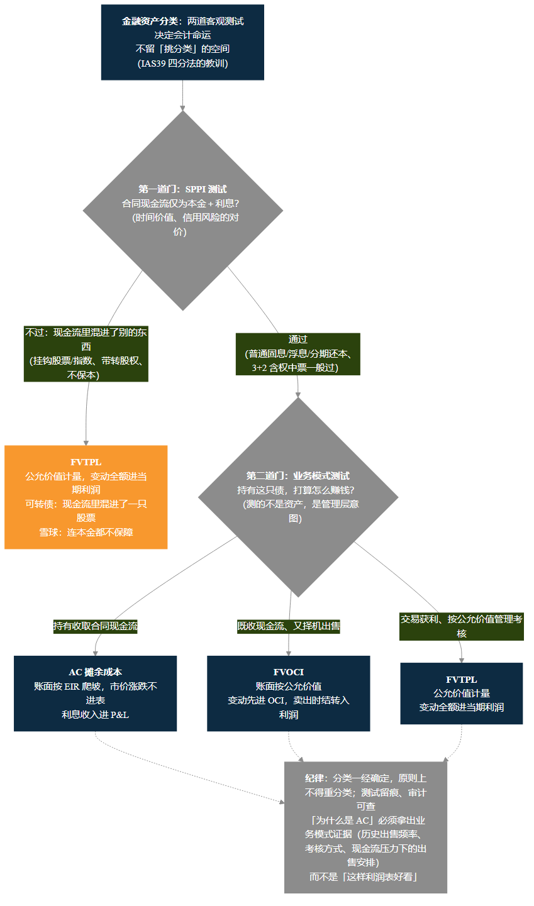
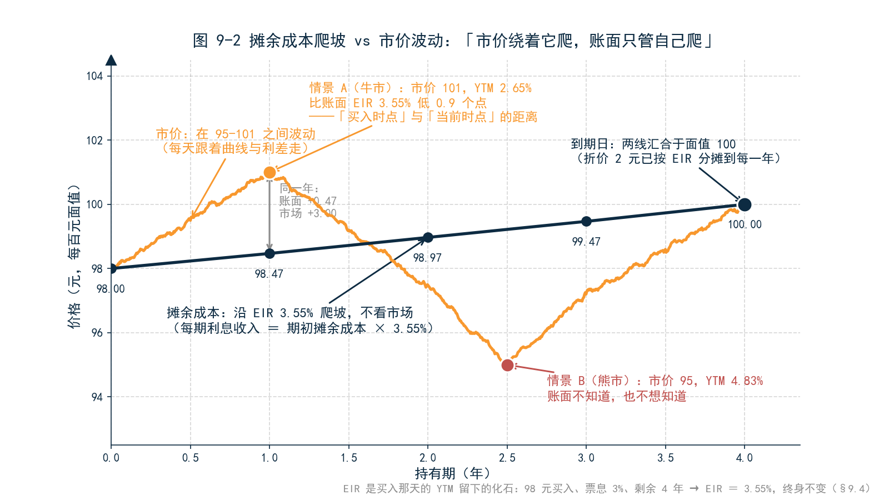
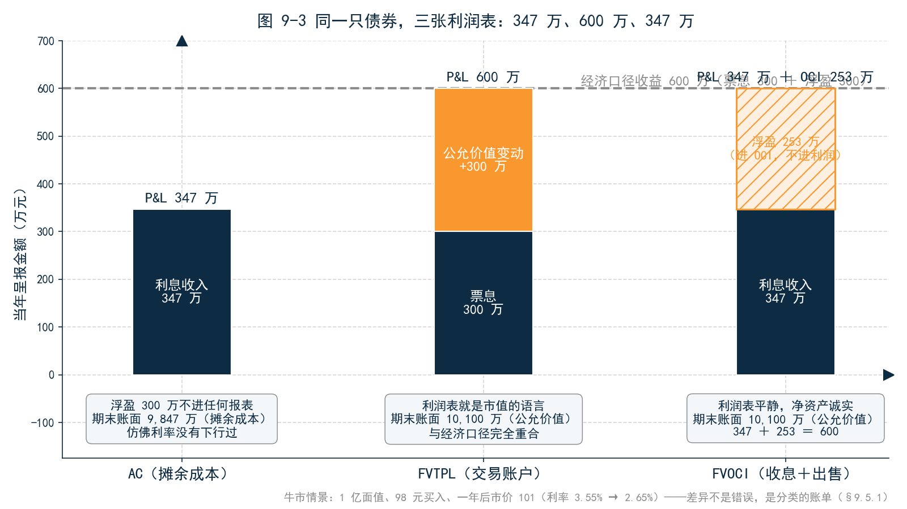
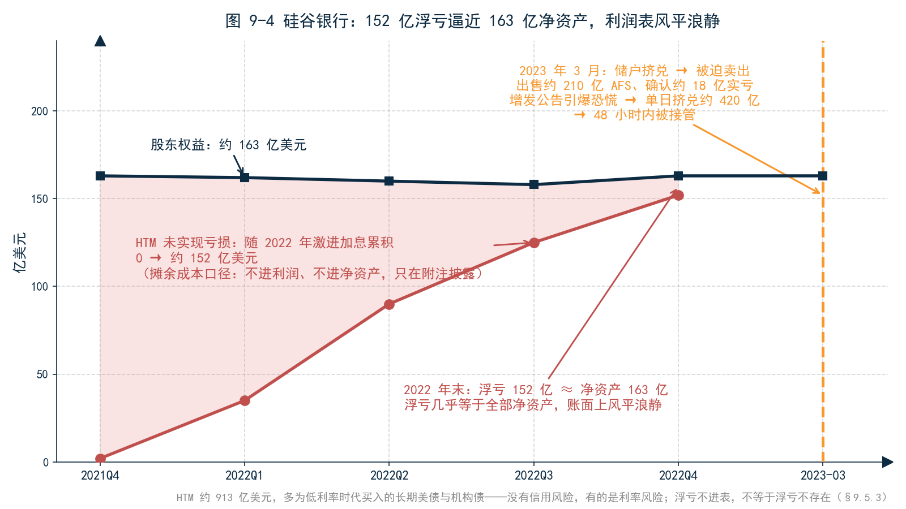
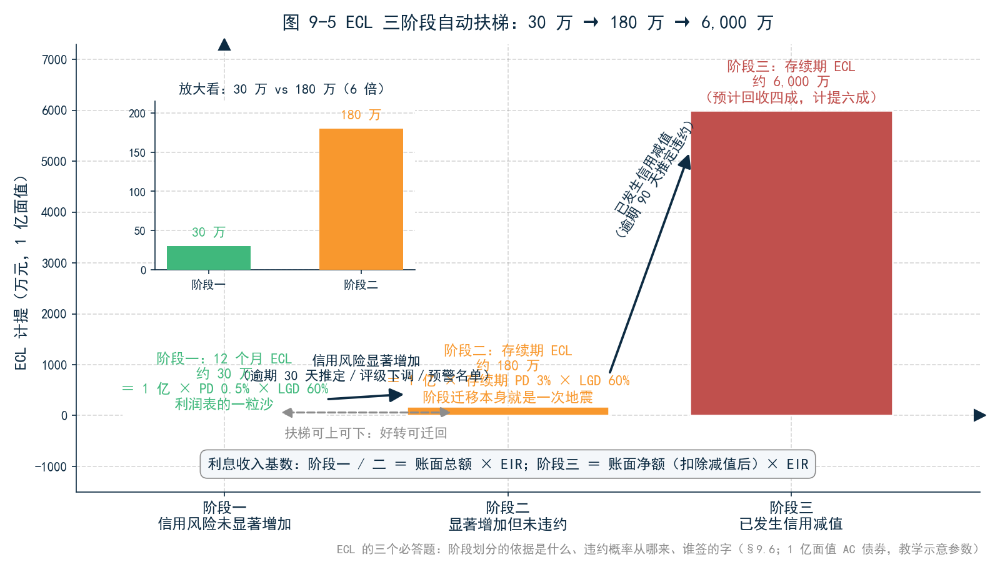
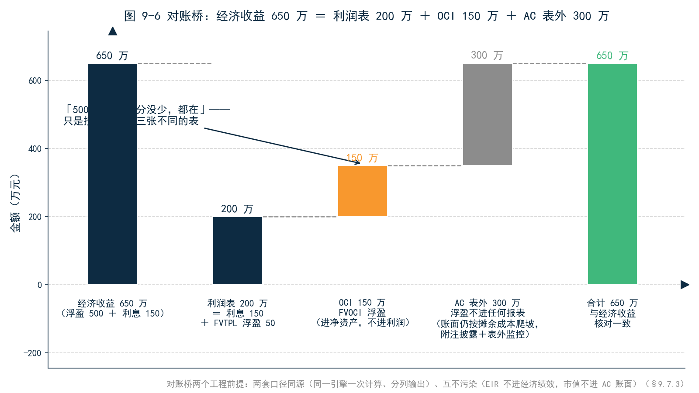

<!--
【素材来源】
- IFRS9 三分类与 SPPI 测试、EIR 摊余成本滚动公式、EIR vs YTM 辨析表、管理口径 vs 会计口径对账、中债估值优先原则、直线法/周期 EIR 等替代摊销方法：D:\vuepress\help-master3\zh\latest\docs\fixedincome\bond_accounting.md
- 会计指标表（AMORTIZED_COST / EFFECTIVE_INTEREST_RATE / DAILY_ACCRUAL / FAIR_VALUE_CHANGE / IMPAIRMENT_ALLOWANCE / INTEREST_INCOME / CAPITAL_GAIN_PNL / PREMIUM_DISCOUNT_AMORTIZATION / OCI_IMPACT / PANDL_IMPACT / ACCOUNTING_PNL）：docs/markdown/user_manual/ch12_PRODUCT_AND_METRICS_REFERENCE_MANUAL_v2.1.md §4.4
- 「EIR 不进经济绩效」口径论证（防与 pull-to-par / Carry / 净价变动重复计算）：docs/portfolio/PERFORMANCE_SYSTEM_REDESIGN.md §2.4、§8、§9.2
- 会计能力一句定位（「IFRS9 三分类下的应计、摊销、兑付出清与 OCI 影响，同一资产在不同账户下的损益可并列比较」）：docs/customer/财联社/三折页文案.md 内页二
- 可转债负债/权益分拆与投资者端 SPPI 伏笔、雪球无本金保障：docs/customer/财联社/book/17_第8章_可转债与结构化衍生品.md 本章小结
- 摊余成本「第三种价」伏笔：12_第3章_估值.md §3.2.3；现值与 YTM：12_第3章_估值.md §3.1
- 「绩效数字是定义出来的」呼应：13_第4章_绩效.md §4.6；2022 年 11 月债市负反馈：13_第4章_绩效.md §4.5.3
- 结构依据：docs/customer/财联社/book/_archive/02_提纲_方案B.md 第 9 章（三分类估值与损益逻辑、EIR 摊余成本 vs 市价估值、会计报表与经济绩效对不上）

【数值案例（均经 Python 验算自洽）】
- 9.4/9.5 单券案例：面值 100、票息 3% 年付、剩余 4 年、买入净价 98 → EIR = 3.5451%（正文取 3.55%）；摊余成本滚动 98.00 → 98.47 → 98.97 → 99.47 → 100.00，各年利息收入 3.47 / 3.49 / 3.51 / 3.53（每百元），折价摊销合计恰为 2.00
- 情景 A（牛市）：1 年后市价 101，对应 YTM 2.65%（下行约 90bp）；1 亿面值下 AC 利息收入 347 万，FVTPL 损益 600 万，FVOCI = P&L 347 万 + OCI 253 万，347+253=600 与经济收益恒等
- 情景 B（熊市）：市价 95，对应 YTM 4.83%；AC 利润 347 万不变，FVTPL 利润为 0，FVOCI = P&L 347 万 + OCI −347 万
- 引子月度数字：5 亿组合（AC 3 亿 / FVOCI 1.5 亿 / FVTPL 0.5 亿）、久期 4、利率月内下行 25bp → 浮盈 300/150/50 合计 500 万；月利息收入（年化约 3.6%）90/45/15 合计 150 万；利润表 = 150+50 = 200 万；对账桥 650 = 200（P&L）+ 150（OCI）+ 300（AC 表外）

【衔接与伏笔】
- 承接第 3 章：§3.2.3 摊余成本「第三种价」点到为止 → 本章 9.4 展开 EIR 机制；公允价值来源（中债估值优先）在 9.5.1 引回第 3 章
- 承接第 4 章：「绩效数字是定义出来的」→ 会计口径是有准则背书、可审计、全市场可比的一种定义（9.7.3 收尾呼应）
- 承接第 8 章：可转债发行人端负债/权益分拆、投资者端过不了 SPPI 只能 FVTPL、雪球现金流无本金保障 → 9.3 展开；「条款越复杂，会计口径与经济口径距离越远」在 9.3.3 给出机制性解释（复杂条款被强制钉在市场上，真正拉开距离的是可选择 AC 的简单产品）
- 呼应第 5 章：会计 EIR 利息 ≠ Campisi 的 Carry，EIR 不进经济绩效（9.4.4）
- 为第 10 章（AI 的边界）埋伏笔：业务模式测试与 ECL「显著增加」判断是管理层责任，AI 能解释口径但不能替代会计判断（9.8）

【仍需补充】
1. 引子（月度经营分析会、浮盈 500 万 vs 利润 200 万、审计师询证 EIR）为合成场景，数字自洽但非真实机构案例，成稿前建议匿名化替换。
2. 9.5.3 SVB 案例数字（2022 年末 HTM 约 913 亿美元、未实现亏损约 152 亿美元、股东权益约 163 亿美元、2023 年 3 月出售约 210 亿美元 AFS 确认约 18 亿美元亏损、单日挤兑约 420 亿美元）来自公开报道与 10-K 披露，成稿前需与原始披露文件逐项核对。
3. 9.6 ECL 三阶段数字（12 个月 PD 0.5% × LGD 60% ≈ 30 万、存续期 PD 3% ≈ 180 万、阶段三回收四成计提约 6,000 万）为教学示意参数，非真实评级映射；逾期 30/90 天兜底规则的表述需与 CAS22 应用指南核对。
4. 9.5.2 摊余成本法理财的表述需与 2022 年后监管公开文件核对；3+2 含权中票 SPPI「一般认定过」的表述建议请会计实务专家复核。
5. 「亲手试试」问法需与 MVE 实操包内置数据（AC 类债券样例、三账户并列输出、SPPI 条款分析能力）最终对齐。
6. ~~正文【图 9-x 占位】待替换为实际图片引用。~~（2026-09-09 已完成：图 9-1～9-6 已替换为 figures/ch09/ 下的实际图片引用）
-->

# 第 9 章　IFRS9：会计口径 vs 经济口径

## 引子：500 万浮盈，200 万利润

月度经营分析会。9 月债市大涨，利率一个月下行 25 个基点，老陈的固收组合 5 个亿、平均久期 4 年，市值浮盈约 500 万。投资经理小李把这个数字写进了月度总结。

财务总监报出来的却是另一个数：债券投资利息收入 150 万，公允价值变动损益 50 万，合计 200 万。

小李当场没忍住：「组合明明浮盈 500 万，利润表怎么只有 200 万？剩下 300 万去哪了？」

财务总监把组合构成投到屏幕上：5 个亿里，3 亿在 AC 账户（摊余成本），1.5 亿在 FVOCI 账户，只有 0.5 亿在 FVTPL 账户。「500 万浮盈一分没少，都在。但按 IFRS9 的规则：AC 账户的 300 万浮盈，不进利润表，也不进资产负债表——账面还按摊余成本爬坡；FVOCI 账户的 150 万浮盈，进其他综合收益，净资产里能看到，利润表里看不到；只有 FVTPL 账户的 50 万，全额进当期利润。加上三个账户的利息收入 150 万，利润表就是 200 万。」

小李追问：「那这 500 万到底算不算我们赚的？」

财务总监的回答让他沉默了半分钟：「算，也不算。看你要哪本账。」

同一周还有一件事。年报审计师小周发来询证清单，第一条就是：「请提供 AC 账户债券 XX 的实际利率计算过程——账面 EIR 3.55%，该券当前到期收益率 2.65%，请解释差异。」

两个问题，一个指向利润表，一个指向账面价值，背后是同一件事：**会计报表上的数字，和市场上的数字，用的是两套口径。**第 4 章说「绩效数字是定义出来的」；本章要讲的是一个更硬的事实——**会计口径也是一种定义，只不过这种定义写进了准则，有监管背书，可审计，全市场可比。**它和经济口径谁也不是错的，但你必须说清它们为什么对不上、差在哪、怎么对账。

---

## 9.1 一个资产，两本账

### 9.1.1 经济口径：市值不说谎

本书前八章讲的都是经济口径。第 3 章的估值：一只债值多少钱，等于未来现金流按今天的曲线折现；第 4 章的绩效：期末市值减期初市值加现金流；第 5 章的损益拆解：把市值变动拆成票息、曲线、利差、择券。经济口径的逻辑只有一个——**资产值多少钱，就看市场今天愿意出多少钱。**

经济口径的优点是真实：利率下行 25 个基点，5 亿组合浮盈 500 万，这是市场给出的答案，不含糊。代价是波动：明天利率上行 25 个基点，500 万浮盈就没了。市值每天说话，而且说的是真话——哪怕是你不爱听的真话。

### 9.1.2 会计口径：利润表是一种「呈报制度」

会计口径回答的不是「这只债值多少钱」，而是另一个问题：**这笔价值变动，应该在哪一期、进哪张表、以什么名目呈报给报表使用者？**

这个问题之所以存在，是因为利润表有读者。储户、债券持有人、监管、评级机构，都按利润表和资产负债表做决策。如果一家银行的利润完全随市场每日波动，今天赚 5 亿明天亏 5 亿，报表使用者分不清哪些是经营的成果、哪些是市场的噪音。会计准则的全部设计——三分类、摊余成本、减值——都是在回答同一个问题：**怎么把「价值」翻译成「呈报」，让报表既可审计、又稳健、还可比。**

所以会计口径天生是保守的、有规则的。它不是不知道市价，而是选择「什么时候承认市价」。

### 9.1.3 两套口径各自的追求

把两套口径的目标并排看：

| | 经济口径 | 会计口径 |
|---|---|---|
| 回答的问题 | 现在值多少、赚了多少 | 在哪期、进哪张表、以什么名目呈报 |
| 第一追求 | 真实反映价值 | 可审计、可比、稳健 |
| 对市场波动的态度 | 即时反映 | 有选择地承认 |
| 谁说了算 | 市场 | 准则 + 管理层判断 + 审计 |
| 典型用户 | 投资经理、风控 | CFO、审计、监管、报表使用者 |

引子里的 500 万与 200 万，不是谁算错了，是两套口径各自忠实地完成了自己的任务。**问题不在于两套数字不一样，在于你说不说得清它们为什么不一样。**

---

## 9.2 三分类的两道门

IFRS9 把金融资产分成三类，分类结果直接决定这只资产怎么计量、损益进哪张表。

### 9.2.1 从四分类到三分类

旧准则（IAS39，对应我国旧会计准则）时代，金融资产分四类：交易性、持有至到期（HTM）、可供出售（AFS）、贷款及应收款项。四分法的问题在 2008 年金融危机中暴露无遗：分类边界模糊，管理层可以「挑分类」——同一只债券，想平滑利润就放持有至到期，想藏浮盈就放可供出售，分类成了利润管理的工具。

IFRS9 的改革思路是**把主观分类改成客观测试**：一只资产进哪个类别，不由管理层的好恶决定，由两道测试决定——合同现金流特征测试（SPPI）和业务模式测试。测试要留痕，审计可查。

### 9.2.2 第一道门：SPPI 测试

SPPI 是 Solely Payments of Principal and Interest 的缩写——**合同现金流是否仅为「本金加利息」**。

这句话的会计含义很精确：本金是你借出去的那笔钱；利息是对「钱的时间价值、信用风险、流动性风险、管理成本和合理利润」的对价。一只普通固息债：每年票息 3%，到期还本 100——现金流里只有本金和利息，过。浮息债挂钩 LPR：利息随基准利率浮动，仍然是对时间价值和信用风险的对价，过。

但只要现金流里混进了别的东西——挂钩股票指数的、挂钩商品价格的、带转股权的——就不再是「仅为本金和利息」，测试失败。**SPPI 不过，后面不用测了：直接 FVTPL。**第 8 章的可转债和雪球，都倒在这一道门上，9.3 节展开。

### 9.2.3 第二道门：业务模式测试

过了 SPPI 的债券，再看业务模式——**你持有这只债，打算怎么赚钱？**

三种答案对应三个类别：

- **持有收取合同现金流**（持有收息到期）→ **AC（摊余成本）**：账面按实际利率法爬坡，市价涨跌不进表；
- **既收现金流、又择机出售** → **FVOCI**：账面按公允价值，但公允价值变动先进其他综合收益（OCI），卖出时才结转进利润；
- **交易获利、按公允价值管理考核** → **FVTPL**：账面按公允价值，变动全额进当期利润。

注意第二道门的性质：**它测的不是资产，是管理层意图。**同一只国债，交易台买来搏价差是 FVTPL，负债部门买来吃票息是 AC，司库买来既吃息又做流动性管理是 FVOCI。资产没变，意图不同，会计命运不同。这就是为什么 IFRS9 要求分类时留下书面依据——审计问「为什么是 AC」，答案必须是一套能自洽的业务模式证据：历史出售频率、考核方式、现金流压力下的出售安排，而不是「这样利润表好看」。

还有两条纪律防止利润操纵。一是**分类一经确定，原则上不得重分类**——只有业务模式本身发生改变（极罕见）才允许；二是公允价值选择权——如果指定 FVTPL 能消除「会计错配」（比如对应的负债端已是公允价值计量），允许指定，但指定同样不可逆。

---

## 9.3 SPPI 测试：为什么可转债和雪球过不了

### 9.3.1 本金加利息：最朴素的合同

先把「本金加利息」想成一份最朴素的借条：我借你 100 元，你每年付我 3 元利息，第 4 年末还我 100 元。这份合同的现金流只和两个变量有关：时间（利息随时间累积）和信用（你能不能还）。SPPI 测试守护的就是这份朴素：**会计上最古老的记账方法——摊余成本——只对「现金流可预期」的合同有意义。**

中国市场的常见条款大多过得了这道门。分期还本债：本金分五次还，每笔还是本金，过；浮息债、合理的提前偿还补偿，同理；3+2 含权中票：回售权的行权对价是「面值加应计利息」，发行人调整后的票面仍是利率对价，实务上一般认定能过——但要留分析底稿。

### 9.3.2 可转债：现金流里混进了一只股票

第 8 章解剖过可转债：一张债券加一个看涨期权，价格的一半信息写在正股行情里。这正是它过不了 SPPI 的原因——**持有人的回报不只看时间和信用，还看正股的股价。**转股权的价值随正股波动，这部分现金流既不是本金也不是利息，是股票。

所以投资者端的处理没有任何悬念：可转债整体 FVTPL，每个交易日的公允价值变动都进利润表。买可转债的机构，利润表天然是波动的——这不是选择，是准则的强制。

有意思的是发行人端的对称处理：同一只可转债，发行人要在报表上把它**拆成两半**——负债成分（纯债价值，按摊余成本计量）和权益成分（转股权，计入权益），分别列报。第 8 章说「你花 100 元买到的是一张债券加一个看涨期权」，会计把这句话原样搬进了资产负债表：**同一份合同，发行人拆成两半个账，投资者合成一个 FVTPL——会计口径对「条款即估值」的回应，是把条款翻译成科目。**

### 9.3.3 雪球：连本金都不保，更谈不上 SPPI

雪球的处境更彻底。SPPI 的第一个字母 P 是本金——而雪球的合同里，本金本身是不保障的：敲入后到期按指数跌幅结算，跌 30% 本金亏 30%（第 8 章王总走的那条路径 C）。一份连「还本」都不承诺的合同，现金流与「本金加利息」的距离，比可转债还远。

所以雪球的会计分类没有任何讨论空间：FVTPL。王总亏的 300 万，在会计上一天都没有隐藏过——每个估值日，公允价值变动都如实进了利润表。**这里有个值得玩味的反转：条款最复杂的产品，会计口径与经济口径反而最近——因为准则不给它们别的选择。**第 8 章末尾说「条款越复杂，会计口径与经济口径的距离越远」，说的是对账与理解的难度；而在计量层面，复杂条款产品被强制钉在市场上，距离为零。真正拉开距离的，是那些**可以选择**的简单产品——普通债券放进 AC 账户，账面从此不看市场。这是 9.5 节的主题。

### 9.3.4 一张 SPPI 速查表

| 产品/条款 | 现金流里有什么 | SPPI | 分类去向 |
|---|---|---|---|
| 普通固息债 | 本金+利息 | 过 | 看业务模式 |
| 浮息债（挂钩 LPR/SHIBOR） | 本金+浮动利息 | 过 | 看业务模式 |
| 分期还本债 | 本金（分期）+利息 | 过 | 看业务模式 |
| 3+2 含权中票 | 本金+利息+回售/调票面权 | 一般过（需分析对价并留痕） | 看业务模式 |
| 可转债 | 本金+利息+转股权 | **不过** | 整体 FVTPL |
| 雪球/结构化票据 | 不保本，挂钩指数 | **不过** | FVTPL |

---

## 9.4 EIR 摊余成本：一条不看市场的爬坡曲线

第 3 章把摊余成本称为「第三种价」，点到为止。本节展开它的机制——这也是审计师小周那个问题的答案。

### 9.4.1 买入那一刻，锁定一个利率

一只债券：面值 100 元，票息 3% 年付，还有 4 年到期，你按 98 元折价买入。买入那一刻，会计上做一件事：解一个方程——什么样的折现率，能让「未来 3、3、3、103 元」的现金流正好折回 98 元？答案是 3.55%。这个折现率就是实际利率（EIR）。

EIR 的经济含义一句话：**按 98 元买入、持有到期，这笔投资锁定的年化回报率。**它和买入时的到期收益率（YTM）数值相等——同一个方程的两种叫法。但从这一刻起，两者分道扬镳：YTM 每天跟着市价变，EIR 终身不变（除非合同重议）。**EIR 是买入那天的 YTM 留下的化石。**

### 9.4.2 每期利息收入 = 期初摊余成本 × EIR

摊余成本的滚动规则只有一条：**每期确认利息收入 = 期初摊余成本 × EIR；收到的票息从账面扣掉。**四年滚动如下（每百元面值）：

| 年度 | 期初摊余成本 | 利息收入（×3.55%） | 收到票息 | 期末摊余成本 |
|---|---|---|---|---|
| 1 | 98.00 | 3.47 | 3.00 | 98.47 |
| 2 | 98.47 | 3.49 | 3.00 | 98.97 |
| 3 | 98.97 | 3.51 | 3.00 | 99.47 |
| 4 | 99.47 | 3.53 | 3.00 | 100.00（到期还本） |

注意利息收入的结构：第一年 3.47 元里，3 元是票息，0.47 元是**折价摊销**——你 98 元买的债到期还 100 元，这 2 元折价收益不在到期日一次性确认，而是按 EIR 分摊到每一年。账面价值因此沿着一条平滑的曲线从 98 爬向 100，市场涨跌与它无关。

### 9.4.3 回答审计师：EIR 3.55% 与 YTM 2.65% 为什么不矛盾

现在可以回答小周了。账面 EIR 3.55%，比当前 YTM 2.65% 高出 0.9 个百分点——因为它们是**两个时点的价格**：

| | EIR | YTM |
|---|---|---|
| 计算时点 | 买入时确定，终身不变 | 每个估值日随市价重算 |
| 回答的问题 | 这笔投资锁定了多少回报 | 现在买入能获得多少回报 |
| 用途 | 摊余成本法算利息收入 | 市场定价与比较 |

买入时市场利率 3.55%，一年后市场利率降到 2.65%——这正是债券浮盈的原因（老券的票息比新券值钱）。**EIR 与 YTM 的差，不是计算错误，是「买入时点」与「当前时点」的距离。**审计要的不是两个数相等，而是 EIR 的计算过程可追溯：买入价、交易费用、现金流日程，进方程，出 3.55%——每一步留痕。

（EIR 的完整公式，以及直线法、周期 EIR 等替代摊销方法的对照，见附录 A。）

### 9.4.4 一个工程细节：EIR 不进经济绩效

这里埋一个通往第 5 章的技术点。摊余成本法下第一年确认利息收入 347 万（1 亿面值），其中 47 万是折价摊销；而经济口径下，同一只债的 Carry（票息加收敛）也包含「价格向面值收敛」的贡献。**如果绩效系统把 EIR 利息收入直接当收益，折价收敛就被算了两次。**成熟的口径设计是：EIR 只留会计报表，经济绩效用市值口径的票息与应计——两套指标同源计算、分列输出，互不混用。这不是抠细节，是「一个引擎，两套口径」的纪律。

---

## 9.5 同一只债券，三张利润表

把 9.4 这只债（1 亿面值，98 元买入）放进三个账户，各持有一年，看三张报表。先交代一句公允价值的来源：FVTPL 和 FVOCI 都要按公允价值计量，这个「公允价值」从哪来？第 3 章已经回答——有市价按市价，无市价按中债估值。**会计口径的公允价值，用的正是第 3 章那套估值；会计与估值从来不是两套数，是一套数的两种呈报。**

### 9.5.1 牛市情景：浮盈 300 万去哪了

假设买入后市场利率从 3.55% 下行到 2.65%，一年后这只债市价 101 元——市值 1.01 亿，浮盈 300 万；当年票息 300 万已到账。经济口径的收益清清楚楚：**600 万。**

三张利润表：

| | AC | FVTPL | FVOCI |
|---|---|---|---|
| 利润表（P&L） | 利息收入 **347 万** | 票息 300 万 + 公允价值变动 300 万 = **600 万** | 利息收入 **347 万** |
| 其他综合收益（OCI） | — | — | **+253 万** |
| 期末账面价值 | 9,847 万（摊余成本） | 10,100 万（公允价值） | 10,100 万（公允价值） |
| 净资产变动 | +347 万 | +600 万 | +600 万（347+253） |

**同一只债券，同一个市场，同一年：利润 347 万、600 万、347 万。**FVTPL 与经济口径完全重合——它的利润表就是市值的语言。FVOCI 把 600 万拆成两半：利息 347 万进利润，浮盈 253 万（公允价值 10,100 万 − 摊余成本 9,847 万）进 OCI——利润表平静，净资产诚实。AC 最彻底：300 万浮盈不进任何报表，账面按自己的节奏从 9,800 万爬到 9,847 万，仿佛利率没有下行过。

### 9.5.2 熊市情景：风平浪静与惊涛骇浪

反过来，利率上行到 4.83%，市价跌到 95 元，浮亏 300 万。三张表：

- **AC**：利息收入 347 万，利润表风平浪静——市价跌的 300 万，账面不知道，也不想知道；
- **FVTPL**：票息 300 万 − 公允价值变动 300 万 = **利润为零**——惊涛骇浪原样呈报；
- **FVOCI**：利润 347 万，OCI −347 万，净资产变动为零——利润表平静，净资产挨打。

2022 年 11 月债市急跌，全行业上过这一课：银行理财按市值法计价，净值急跌触发赎回，赎回迫使抛售，抛售加剧下跌——第 4 章讲过这个负反馈。事后行业的应对之一，正是会计口径的重新选择：符合条件的封闭式产品申请摊余成本法计量，把净值的波动「熨平」。**会计口径的选择，本身成了产品竞争力。**这没有违规——准则允许，条件明确——但它提醒报表读者：看到一条平滑的净值曲线，先问一句，这是市场平静，还是口径平静。

### 9.5.3 SVB：当 AC 账户被迫卖出

AC 口径的信仰是「持有到期，所以中间波动是噪音」。这个信仰在 2023 年 3 月的硅谷银行（SVB）身上，接受了一次极限压力测试。

硅谷银行的资产负债表上趴着约 913 亿美元持有至到期债券——大部分是低利率时代买入的长期美债和机构债。2022 年美联储激进加息，这批债券市价大跌，未实现亏损累积到约 152 亿美元。利润表对此一无所知：摊余成本口径下，这些浮亏不进利润、不进净资产，只在报表附注里披露。而硅谷银行的股东权益，总共约 163 亿美元——**浮亏几乎等于全部净资产，但账面上风平浪静。**

转折点不是市场，是负债端：储户挤兑，银行被迫卖出债券补流动性。一旦卖出，「持有到期」的业务模式假设破灭，浮亏变成实亏——出售约 210 亿美元债券确认约 18 亿美元亏损，紧接着的增发公告引爆恐慌，单日挤兑约 420 亿美元，48 小时内银行被接管。

SVB 的教训不是「AC 口径错了」——准则给了它 AC 的选择，它持有的美债也没有信用风险。教训是：**摊余成本能熨平利润表，熨不平经济现实；浮亏不进表，不等于浮亏不存在。**对业务负责人，这意味着 AC 账户必须配一套表外的市值监控——账面不看的数字，风控必须看。

### 9.5.4 FVOCI 的 OCI 结转：一笔递延的损益

FVOCI 账户还有一个动作值得知道：卖出时的 OCI 结转。

假设第二年年初按 101 元把这只债卖掉。会计上做两件事：卖出价 10,100 万与摊余成本 9,847 万之差 253 万，确认为处置损益；同时，上一年累积在 OCI 里的 253 万，一次性**结转**进当期利润。两笔是同一笔钱的两次呈报——持有时先寄存在 OCI（不影响利润），卖出时转进利润（尘埃落定）。

OCI 因此可以理解为一个**候场区**：价值变动先进候场区等结果，卖出（或减值）时才正式登场。这个设计让 FVOCI 兼顾了两头——资产负债表按公允价值（诚实），利润表只认利息（平稳）——代价是读者必须多看一张表：**只看利润表的 FVOCI 机构，你少看了一半的故事。**

---

## 9.6 减值：ECL 三阶段——从「已发生」到「预期」

三分类决定「价值变动进哪张表」，减值模型决定「信用损失什么时候认」。IFRS9 的第二个支柱是 ECL（预期信用损失）。

### 9.6.1 旧准则的教训：损失确认得太晚

旧准则用「已发生损失」模型：减值要有客观证据——对方违约了、逾期了——才能计提。2008 年金融危机暴露了它的荒谬：雷曼违约前一周，账上还是零减值；损失确认集中在危机最深的时候，利润表雪上加霜，顺周期地放大了恐慌。

ECL 模型把逻辑反过来：**损失不要等到发生才认，从买入那天起就按「预期」计提。**信用风险每恶化一步，计提就跟进一步。

### 9.6.2 三阶段：信用风险的自动扶梯

ECL 把资产按信用风险分成三个阶段（适用于 AC 与 FVOCI；FVTPL 不需要——信用恶化已经通过公允价值变动进了利润表）：

| 阶段 | 状态 | 计提口径 | 利息收入基数 |
|---|---|---|---|
| 一 | 信用风险未显著增加 | **12 个月 ECL**（未来 12 个月内违约的预期损失） | 账面总额 × EIR |
| 二 | 信用风险**显著增加**但未违约 | **整个存续期 ECL** | 账面总额 × EIR |
| 三 | 已发生信用减值 | 整个存续期 ECL | 账面**净额**（扣除减值后）× EIR |

量级感受一下（示意数字）：1 亿面值的 AC 债券，阶段一按 12 个月违约概率 0.5%、违约损失率 60% 计提，ECL 约 30 万——利润表的一粒沙；信用风险显著恶化进入阶段二，按存续期累计违约概率 3% 计提，ECL 跳到 180 万——**阶段迁移本身，就是利润表上的一次地震**；真违约进入阶段三，预计回收四成，计提约 6,000 万。

### 9.6.3 「显著增加」是一个判断

三阶段的边界怎么划？准则给了兜底规则——逾期 30 天通常推定「显著增加」，逾期 90 天通常视为违约——但核心判断是定性的：评级下调几档算显著？发行人被列入预警名单算不算？行业景气度恶化要不要前瞻计入？

**ECL 是 IFRS9 里判断浓度最高的地方，也是审计博弈的主战场。**计提不足，利润虚高；计提过度，利润被藏。对业务负责人，这一节的要点是：ECL 的数字必须能回答三个问题——阶段划分的依据是什么、违约概率从哪来、谁签的字。三个都答得清，ECL 是风险管理；答不清，ECL 是利润调节。

---

## 9.7 为什么对不上：两种口径各自的诚实

现在可以正式回答本章开头的问题了。

### 9.7.1 会计口径追求什么

会计口径有三条第一性原则：**可审计**（每个数字有凭证、有规则、有留痕）、**可比**（全行业同一套准则，跨机构可对照）、**稳健**（谨慎性，坏消息早认、好消息晚认）。为了这三条，它必须牺牲一些东西：及时性（AC 不看市场）、完整性（AC 的浮盈浮亏在表外）、对称性（FVOCI 的利润表永远只见利息，浮盈浮亏都在 OCI）。

### 9.7.2 经济口径追求什么

经济口径只有一条原则：**真实反映价值。**500 万浮盈就是 500 万，不问名目、不分账户、不等卖出。为了这一条，它牺牲了稳定性（每天波动）和一部分可审计性（模型价依赖曲线与假设）。

### 9.7.3 对账：两套数字如何共存

所以「会计报表和经济绩效对不上」不是故障，是设计。**两套口径的关系，不是谁纠正谁，而是互相注释。**成熟机构的做法是建一座对账桥：从经济收益出发，逐项说出每一分钱在会计口径下的去向。引子里的数字，桥是这样的：

| 经济口径 | 会计去向 | 金额 |
|---|---|---|
| 浮盈 500 万 | AC 账户：不进表（表外监控） | 300 万 |
| | FVOCI 账户：进 OCI，不进利润 | 150 万 |
| | FVTPL 账户：进当期利润 | 50 万 |
| 利息 150 万 | 三账户利息收入，进利润 | 150 万 |
| **经济收益合计 650 万** | **利润表 200 万 + OCI 150 万 + 表外 300 万** | **650 万** |

这座桥有两个工程前提。第一，**两套口径必须同源**：同一批持仓、同一张行情快照、同一套条款处理，引擎一次计算、分列输出会计指标（摊余成本、EIR、每日计提、OCI 影响）与经济指标（市值、损益、归因）——如果会计数来自财务系统、经济数来自估值系统，桥的两端永远对不齐。第二，**两套口径互不污染**：EIR 利息不进经济绩效（9.4.4），市值波动不进 AC 账面——各守各的定义，桥才搭得稳。

回到第 4 章那句话：绩效数字是定义出来的。本章可以补上下半句：**会计口径是所有定义里最硬的一种——它有准则背书、有审计签字、有监管检查。但「最硬」不等于「最真」，它只是一种被制度化的定义。**财务总监那句「算，也不算，看你要哪本账」，至此有了完整的含义。

---

## 9.8 如果 AI 来做会计判断

章末照例问那个问题：如果让 AI 来管会计口径，会发生什么？

先看 AI 帮得上的。IFRS9 的条文是公开知识，AI 解释三分类、讲清 EIR 机制、把对账桥写成管理层能看懂的说明，都比翻准则原文快得多；读一份可转债募集说明书，提示「这份合同的现金流里有转股权，SPPI 大概率不过」；把 9.7 的对账桥自动生成差异说明——问数、诊断、成文，还是那三道工序。

再看 AI 不能替代的。**业务模式测试测的是管理层意图**——「你打算持有收息还是择机出售」，这不是文档里的事实，是管理层的决策，要书面留痕、要历史行为佐证、要在审计面前签字负责。ECL 的「信用风险显著增加」同理：逾期天数是数据，但「显著」二字是判断，判断错了要有人担责。**会计判断的本质是一种责任分配机制——准则故意留下需要人来回答的问题，因为报表需要一个能签字的人。**AI 可以帮人把判断的依据摆得更齐，但签字栏里不能是模型的名字。

还有一层更深的。本章的全部数字——EIR、摊余成本、OCI、ECL——都必须是可追溯的计算，不是生成的文本。审计师小周问「EIR 3.55% 怎么算的」，合格的回答是调出买入价、现金流日程和求解过程；不合格的回答是一段流畅的解释。**AI 生成的解释越流畅，会计数字的可追溯性越值钱。**AI 到底能做什么、不能做什么，「这个数字从哪来」在 AI 时代为什么更重要——这是下一章的全部内容。

---

## 本章概念卡

| 概念 | 一句话解释 | 详见 |
|---|---|---|
| 经济口径 vs 会计口径 | 市值不说谎 vs 利润表是一种呈报制度——两套口径各自的诚实 | §9.1 |
| 三分类 | AC / FVOCI / FVTPL，由 SPPI 测试和业务模式测试两道门决定 | §9.2 |
| SPPI 测试 | 合同现金流是否仅为「本金加利息」——可转债和雪球过不了 | §9.3 |
| EIR 摊余成本 | 买入那一刻锁定的实际利率，一条不看市场的爬坡曲线 | §9.4 |
| OCI 结转 | FVOCI 浮盈先进其他综合收益，卖出时结转进损益——递延的损益 | §9.5.4 |
| SVB 教训 | AC 账户被迫卖出时，递延的浮亏一次性进利润表 | §9.5.3 |
| ECL 三阶段 | 预期信用损失的自动扶梯：阶段一 12 个月、阶段二全期、阶段三已减值 | §9.6.2 |

---

## 本章小结

回到引子的两个问题。

**为什么浮盈 500 万，利润表只有 200 万？**因为 IFRS9 用两道测试给每只资产定了会计命运：SPPI 测试问「现金流是不是只有本金和利息」，业务模式测试问「你打算怎么持有它」。AC 账户的浮盈不进任何报表，FVOCI 的浮盈进 OCI 不进利润，只有 FVTPL 全额进利润——同一只债券，三张利润表，347 万、600 万、347 万。**差异不是错误，是分类的账单。**

**EIR 3.55% 和 YTM 2.65% 为什么不矛盾？**因为 EIR 是买入时点的化石，YTM 是当前时点的价格。摊余成本沿着 EIR 爬坡，不看市场——这熨平了利润表，但熨不平经济现实：SVB 的 152 亿美元浮亏不进表，不等于不存在；被迫卖出的那一刻，浮亏变实亏，48 小时击穿了一家两千亿美元资产的银行。

再往深记三层。第一，**SPPI 是条款的会计镜像**：可转债过不了，因为现金流里混进了股票；雪球过不了，因为本金都不保——第 8 章说条款即估值，本章说条款也决定会计命运。第二，**ECL 把减值从「已发生」改成「预期」**，三阶段迁移是利润表上的地震，而「显著增加」四个字是判断，判断要留痕、要有人签字。第三，**会计口径与经济口径不是谁对谁错，是两种诚实**——一种对准则诚实，一种对市场诚实；成熟的做法不是二选一，是建一座对账桥，让每一分钱都能说出它在两本账里的去向。

最后看一眼这条路通向哪里。会计判断是「AI 的边界」最好的样本：AI 能解释口径、生成对账说明、提示 SPPI 风险，但业务模式测试要管理层签字，ECL 阶段迁移要有人担责——**AI 能帮助理解会计口径，但不能替代会计判断。**这是第 10 章的主题。

本章涉及的公式（EIR 求解、摊余成本滚动、ECL 计提口径）集中收录于附录 A。

---

## 亲手试试

打开 MVE 实操包，做三个实验。

实验一，EIR 摊销。对 AI 说：

> 「调出组合里那只 AC 类债券，告诉我它的买入成本、EIR、当前摊余成本和每日计提；把剩余期限内每期的利息收入、票息、折价摊销和期末摊余成本列成一张表——EIR 是怎么从买入价和现金流解出来的？如果买入价从 98 改成 97.5，EIR 变多少？」

实验二，一只债券，三张利润表。对 AI 说：

> 「把这只债券分别按 AC、FVTPL、FVOCI 三个账户各记一次，给我上个月的三张利润表：利息收入、公允价值变动损益、OCI 影响各是多少，期末账面价值各是多少；三个账户的合计与经济口径收益差多少，差在哪一项？」

实验三，SPPI 测试。对 AI 说：

> 「调出组合里的可转债和那只雪球，逐条列出它们合同现金流里除了本金和利息还有什么——转股权、敲入敲出条款各是怎么破坏 SPPI 的？如果只能整体 FVTPL，上个月它们的公允价值变动有多少进了利润表？」

跑完之后追问一句：「这三个实验里，哪些数字是引擎算出来的，哪些判断必须人来签字？」——想清这个问题，就是本章的全部要点。
