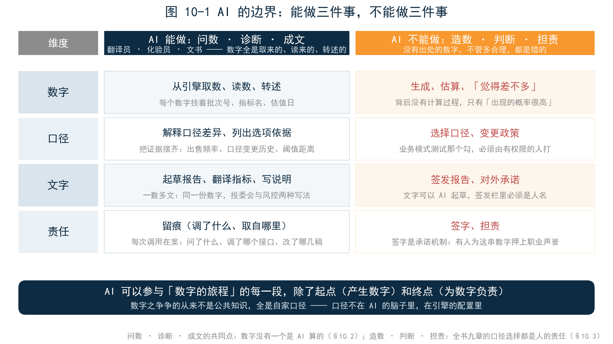
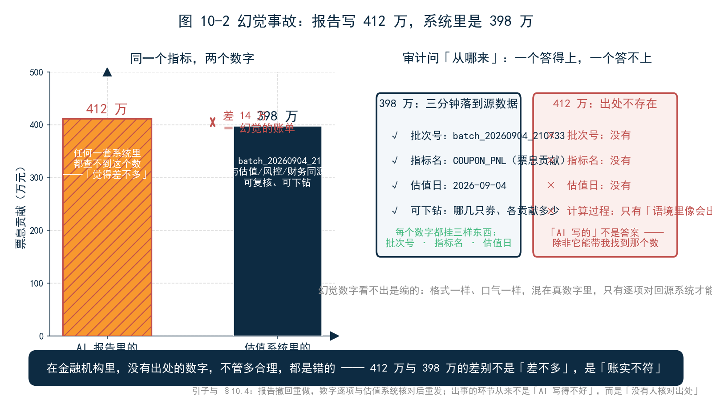
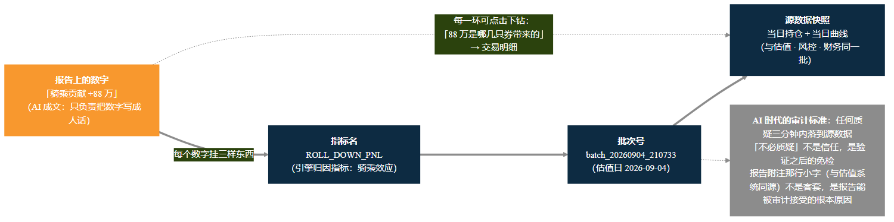
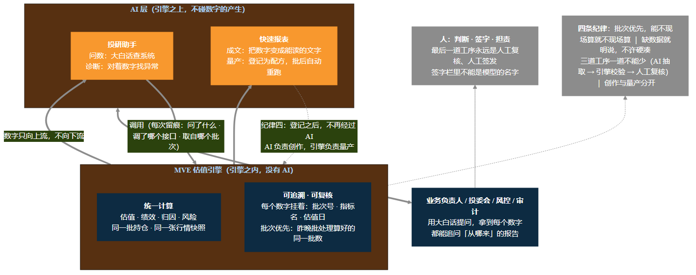

<!--
【素材来源】
- 章节定位与结构：docs/customer/财联社/book/_archive/02_提纲_方案B.md 第四部分（第 10 章「AI 的边界」：问数/诊断/成文 vs 造数/判断/担责、幻觉与合规、可追溯性）
- 「AI 不是第二套数」「AI 放在引擎之上，而不是引擎之内」「你可以质疑成文的角度，但不必质疑数字本身」：docs/customer/财联社/三折页文案.md 内页三
- 三道工序（AI 抽取 → 引擎校验 → 人工复核）与「看似合理的错误比空白更危险」：16_第7章_中国债券条款.md §7.7
- 「签字栏里不能是模型的名字」「会计判断是责任分配机制」：18_第9章_IFRS9.md §9.8
- 「错得清楚，好过错得安静」：12_第3章_估值.md §3.2.4
- 「绩效数字是定义出来的」：13_第4章_绩效.md §4.6
- VaR 三要素都是政策：15_第6章_风险.md §6.3.2
- 报表配方生命周期（生成 → 改稿 → 登记 → 批后重跑，登记后不再经过 AI）：mfp-agent/docs/design/REPORT_SKILL_ARCHITECTURE.md、_archive/ai_场景叙事.md 场景一
- 批次优先（CSV 优先 + MCP 兜底）：mfp-agent/docs/design/ARCHITECTURE.md
- 各章「如果 AI 来...」小节的回收：ch03 §3.6、ch04 §4.7、ch05 §5.8、ch06 §6.8、ch07 §7.7、ch08 §8.6、ch09 §9.8

【衔接与伏笔】
- 直接承接第 9 章末尾「签字栏里不能是模型的名字」→ 引子的审计质询场景（审计师小周沿自第 9 章）
- 10.2 逐一回收第 3–9 章「如果 AI 来...」小节的设问（估值曲线、绩效口径、损益拆解、VaR、条款、合同、会计判断）
- 10.4 呼应第 7 章「条款治理里最可怕的不是空白，是看似合理的错误」
- 10.6 为第 11 章四个场景立原则（本章划边界，下一章看实战）
- 10.7 与小结为第 12 章「一个引擎，一套口径」埋伏笔：AI 的一切聪明，立足在一套可复核的数上

【仍需补充】
1. 引子的 AI 幻觉事故（412 万 vs 398 万）为合成场景，数字自洽但非真实机构案例，成稿前建议匿名化或替换为公开报道案例（需核实来源）。
2. 10.4 幻觉示例中的收益率、基点换算等均为示意口径，非真实市场数据。
3. 「亲手试试」的问法需与 MVE 实操包内置数据（批次号、组合代码、指标名）最终对齐。
4. ~~正文【图 10-x 占位】待替换为实际图片引用。~~（2026-09-09 已完成：图 10-1 插入 §10.3 边界表处、图 10-2 插入 §10.4、图 10-3 替换 §10.6 占位、图 10-4 承接 §10.5 原溯源链占位；§10.1 原「实习生」占位按插图清单改列为 C 类候选）

【统稿修正记录（2026-09-09）】
- §10.6 纪律一举例「对冲 3 亿互换」→「对冲 12 亿互换」（与第 11 章场景三推荐档统一）
-->

# 第 10 章　AI 的边界

## 引子：一份漂亮的报告，一个答不上的问题

季度审计的第三周，审计师小周——第 9 章里追问过 EIR 的那位——拿到一份月度组合分析报告。报告装帧精美：归因分解、市场展望、风险提示，一应俱全，文字流畅得不像月报，像研报。这是研究部新来的实习生用 AI 工具生成的，从提问到成稿，十分钟。

小周翻到第二页，指着一行字问：「这里写『组合上周票息贡献 412 万元』。这个数从哪来？」

实习生答得很诚实：「AI 写的。」

「AI 从哪拿到的？」

「……它自己算的？或者，它本来就知道？」

小周打开估值系统，调出同一组合同一周的归因结果：票息贡献 398 万。「差 14 万。14 万不多，但问题不在大小——报告里这个数字，在你们任何一套系统里都查不到。它是 AI『觉得差不多』的一个数。」

会议室安静了几秒。部门负责人打圆场：「文字部分确实写得好，效率也高，以前这份报告要做一天……」

小周点头：「文字我不审，我审数字。一份要进决策会、要交监管的报告，每个数字都得能回答一句『从哪来』，而且答案要能复核。『AI 写的』不是答案——除非它能带我找到那个数。」

这次质询的结局不算严重：报告撤回重做，数字逐项与估值系统核对后重发，没有人被处分。但部门负责人事后说了一句话，值得放在本章开头：**「AI 写的报告，读起来最放心，查起来最不放心。」**

为什么会这样？AI 到底能做什么、不能做什么？「这个数字从哪来」这句全书反复追问的话，在 AI 时代为什么不是更轻了，而是更重了？这是本章要回答的问题。

---

## 10.1 先弄清一件事：AI 到底「会」什么

要划清边界，先得知道边界里面是什么。

今天说的大模型 AI，本质上是一个「读过海量文本、学会了说话」的系统。它读过公开的书籍、论文、新闻、公告，学会的是语言本身的规律：什么样的问题配什么样的回答，什么样的数字出现在什么样的语境里。你问它「债券的久期是什么」，它能给出教科书级的解释——因为教科书它读过。

但有三样东西它天然不知道：**你的持仓、昨天的收盘价、你机构的估值政策。**这些不在任何公开文本里，在你的系统里。一个不知道你持仓的 AI 回答「我的组合昨天赚了多少」，只有两条路：要么去查你的系统，要么——编一个「像真的」的数。

所以一个实用的类比是：**AI 像一个过目不忘、文笔极佳、但第一天上班的实习生。**他读过所有公开的书，却没进过你的机房。你问他组合昨天赚了多少，他如果凭「印象」回答，那是编；他如果转身去查系统、再回来告诉你，那是查。两种回答听起来可能一模一样地流畅——区别不在聪明程度，在数字的出处。

这个实习生还有一项前辈没有的本事：他会用工具。给他配好估值引擎的查询接口，他就能听懂「帮我查一下 FI-01 上周的票息贡献」这样的大白话，翻译成引擎听得懂的参数——哪个组合、哪个时间窗、哪个指标、哪个批次——取回数字，再用通顺的话讲给你听。**理解问题、调用工具、组织语言，这三件事是 AI 的本职；产生数字，从来不是。**

还要纠正一个常见的错觉：AI 谈起金融来头头是道，不等于它「懂金融」。它能解释 Campisi 框架的六项分解，是因为这个框架写在公开的书里；但它不知道你机构用的收敛口径是净价差法还是利差法，不知道你的组合里那只 3+2 中票的估值政策是假设行权还是假设不行权，更不知道这些选择背后的监管要求和历史沿革。**它懂的是「金融的公共知识」，不懂的是「你家的口径」。**而本书前九章反复证明了一件事：金融机构的数字之争，争的从来不是公共知识，全是自家口径。这就是为什么 AI 必须站在一个「口径已经固化」的引擎之上工作——口径不在 AI 的脑子里，在引擎的配置里。

<!-- 原【图 10-1 占位：「第一天上班的实习生」能力圈/盲区示意】按插图清单改列为 C 类概念图候选，待全书定稿后统一生成；本章图 10-1（AI 能做/不能做对照表）见 §10.3 -->

---

## 10.2 AI 能做的三件事：问数、诊断、成文

本书从第 3 章起，每章末尾都问了一句「如果 AI 来……」。现在把这些设问收拢起来看，AI 能做的其实是三件事。

**第一件：问数——用大白话查系统。**第 3 章末尾问「如果 AI 来估值，它会用什么曲线」，答案的一半是：AI 自己不该估值，但它能替你问估值系统。一个典型的问数对话长这样：

> **投资经理**：组合里估值与中债差异最大的是哪三只券？各是什么原因？

> **AI**：按差异绝对值排序：第一名 23 附息国债 17（差 3.2 分，曲线差异为主），第二名 21 江苏城投 05（差 2.8 分，个券利差调整），第三名 20 进出 09（差 2.1 分，应计利息日计数惯例）。数据来自昨日估值批次，逐券差异分解见下表。

自然语言进，引擎数字出。问数的价值不在快，在**门槛低**：业务负责人不用学查询语法，不用记表名字段，想问就问。以前要麻烦估值岗跑一趟的事，现在一句话——而且答案里的每个数，都来自和估值岗同一批的数据。

**第二件：诊断——对着数字找异常。**第 6 章末尾问「AI 的 VaR 可信吗」，答案的一半是：AI 不该算 VaR，但它能替你盯 VaR。风控晨会上最常见的问题——「今天组合的 VaR 为什么跳升？」——AI 调出昨日、今日两批结果逐项对比：是 5–10 年段的敞口加了仓，还是市场波动率整体抬升，还是模型参数变了，三分钟给出一张差异对照表。诊断的本质是**对比与定位**：数字还是引擎的数字，AI 做的是把「哪里变了、可能为什么」找出来，把人的排查范围从「整个系统」缩到「这一两项」。第 7 章读募集说明书、第 8 章读合同，也是诊断的同类——AI 把上百页条款里的关键字段抽出来、标出异常，人再看重点。

**第三件：成文——把数字变成能读的文字。**第 5 章末尾问「AI 能解释『为什么』吗」，答案的一半是：AI 不该编解释，但它能把归因结果写成人话——「本周收益 +528 万，票息贡献 +412 万占 78%，持有收息是绝对主力」。归因六项是引擎算的，「绝对主力」这个措辞是 AI 给的。成文的价值在于**翻译**：把指标名翻译成业务语言，把表格翻译成结论。一份给投委会的报告和一份给风控的明细，数字是同一份，文字是两种写法——这种「一数多文」的活儿，正是 AI 的强项。

问数、诊断、成文——注意这三件事的共同点：**数字没有一个是 AI 算的，全是 AI 取来的、读来的、转述的。**AI 在这三件事里的角色，分别是翻译员、化验员和文书。这个角色清单，就是引子那场质询的答案的前半部分：AI 写的报告可以又快又好——只要报告里的每个数字都来自系统，而不是来自 AI 的「印象」。

---

## 10.3 AI 不能做的三件事：造数、判断、担责

边界的另一侧，也是三件事。

**第一件：不能造数。**这是引子的事故，也是全书的主线。金融数字和一般文字有一个根本区别：**它必须可复核。**「组合上周票息贡献 412 万」不是一句话，是一个承诺——承诺存在一个计算过程：哪批持仓、哪张曲线、哪套条款、哪个批次，算出来 412 万。AI 生成的数字背后没有这个过程，只有「这个数在这个语境里出现的概率很高」。398 万的组合被写成 412 万，差的 14 万就是幻觉的账单。**在金融机构里，没有出处的数字，不管多合理，都是错的。**

**第二件：不能判断。**本书一路走来，处处是判断：第 3 章，估值用哪条曲线是政策；第 4 章，绩效用哪个口径是定义；第 6 章，VaR 的置信度、持有期、历史窗口三要素都是政策；第 7 章，3+2 中票假设活到哪一年是估值政策；第 9 章，业务模式测试测的是管理层意图，ECL 的「信用风险显著增加」是定性判断。这些判断有一个共同特征：**它们不是从数据里算出来的，是由人选择、并由人负责的。**

以第 9 章的业务模式测试为例。「持有收息还是择机出售」，答案不在任何数据里，在管理层的经营意图里；要书面留痕，要历史出售行为佐证，要在审计面前自洽。AI 能做什么？能把证据摆齐——调出该账户过去三年的出售频率、列出口径变更的历史、提示「出售规模接近 AC 账户的容忍阈值」。但「这只债进 AC」那个勾，必须由有权限的人打。第 9 章说过：会计判断的本质是一种责任分配机制，准则故意留下需要人来回答的问题。这句话适用于全书所有的口径选择。

**第三件：不能担责。**这是第 9 章末尾那句话：签字栏里不能是模型的名字。一份报告出了错，监管问「谁复核的」，审计问「谁签的字」，问责问「谁负责」——三个问题的答案都必须是人。这不是保守，是制度设计：**签字是一种承诺机制，承诺有人为这串数字押上了职业声誉。**AI 没有职业声誉可押，它的「承诺」一文不值。所以哪怕 AI 把报告写得十全十美，最后一道工序永远是人工复核、人工签发。

造数、判断、担责——把这三件不能做的事和上一节三件能做的事并排，边界就清楚了：

| | AI 能做 | AI 不能做 |
|---|---|---|
| 数字 | 从引擎取数、读数、转述 | 生成、估算、「觉得差不多」 |
| 口径 | 解释口径差异、列出选项依据 | 选择口径、变更政策 |
| 文字 | 起草报告、翻译指标、写说明 | 签发报告、对外承诺 |
| 责任 | 留痕（调了什么、取自哪里） | 签字、担责 |

一句话总结：**AI 可以参与「数字的旅程」的每一段，除了起点（产生数字）和终点（为数字负责）。**

---

## 10.4 幻觉：看似合理的错误，比空白更危险

「造数」这件事值得单独一节，因为它不是 AI 偶尔犯的错，而是 AI 的工作方式本身。

大模型生成文字的机制，决定了它**永远会给出「最像答案」的东西**。问它一个它不知道的数字，它不会说「我不知道」——在它的训练目标里，「我不知道」不是一个好回答，一个格式正确、量级合理、语境吻合的数字才是。于是它编。编出来的数字有正确的单位、合理的小数位，甚至配上合理的解释——这就是「幻觉」。

幻觉不止发生在数字上。同一个机制会编造**事实**：一份 AI 起草的债券分析里写着「发行人已于 3 月公告下调票面利率至 2.1%」——公告日期、文号、利率一应俱全，但这份公告不存在；一份 AI 生成的市场回顾里写着「上周央行开展 5,000 亿 MLF 操作」——操作是真的，不过是上个月那次。日期、文号、金额，全是「这个语境里最像会出现」的内容。第 7、8 章让 AI 读募集说明书、读合同，为什么要配「引擎校验、人工复核」两道工序？就是因为抽取和转述的每一步，幻觉都在旁边等着。

幻觉在闲聊里是无伤大雅的瑕疵，在金融里是事故。金融数字的容错率是零：412 万和 398 万的差别不是「差不多」，是「账实不符」；一只券的收益率编错 5 个基点，5 亿持仓的估值就差 20 万。更要命的是，幻觉数字**看不出是编的**——它混在一堆真数字里，格式一样、口气一样，只有逐项对回源系统才能发现。第 7 章讲条款治理时说过一句话：最可怕的不是空白，是看似合理的错误——缺条款至少会报错，错条款会出数。AI 幻觉是同一句话的升级版：**空白会被发现，错误会被追问，而「看似合理」会直接穿过复核，进决策会。**

这类事故已经在公开报道里反复上演：律师事务所把 AI 生成的法律文书递交法院，里面引用的判例查无此案；研究机构用 AI 起草市场综述，里面的数据与官方发布对不上。这些案例的教训惊人地一致——**出事的环节从来不是「AI 写得不好」，而是「没有人核对出处」。**文字越流畅，读者越容易跳过核对；而金融机构的报表，恰恰是最不能跳过核对的东西。

这解释了机构读者对 AI 输出的深层不信任。业务部门负责人不是不理解 AI 的效率，而是太理解数字的代价：一个编造的数字进了监管报送，是合规事件；进了投资决策，是亏损来源；进了审计底稿，是职业生涯的污点。**这种不信任不是 AI 的阻力，是金融机构的免疫系统。**问题不在于如何说服机构「相信 AI」，在于如何设计一种「不需要相信 AI」的工作方式——AI 说的每个数字都能当场验证，信任就是多余的概念。

这正是下一节的主题。

---

## 10.5 可追溯性：AI 时代，「这个数字从哪来」更重要了

本书的书名是一句话：这个数字从哪来。前九章把这句话问遍了估值、绩效、归因、风险、条款、会计。到了 AI 这一章，这句话的分量反而更重了。

道理很朴素：**AI 生成的内容越流畅，出处就越稀缺；出处越稀缺，能指出出处的数字就越值钱。**以前一份报告的数字可疑，至少能猜到它出自哪个 Excel、哪个人；现在一份 AI 生成的报告，文字天衣无缝，数字的出处却可能根本不存在。审计师小周那句「AI 写的不是答案，除非它能带我找到那个数」，就是 AI 时代的审计标准。

所以「AI 生成的数字必须可追溯」不是口号，是一套具体的工程要求。一份合格的 AI 生成报告，每个数字背后应该挂着三样东西：**批次号**（哪个估值批次算的）、**指标名**（引擎里的哪个指标）、**估值日**（哪天的口径）。有了这三样，任何质疑都能在三分钟内落到源数据：「骑乘贡献 88 万是哪几只券带来的」——下钻到交易明细；「这个 VaR 用的什么参数」——调出批次配置。报告附注里那行小字「本报告全部数字来自估值批次 batch_20260904_210733，与估值系统同源」，不是客套，是这份报告能被审计接受的根本原因。

可追溯性还有一个容易被忽视的好处：**它让「用 AI」这件事本身变得可以审计。**传统系统里，审计查的是「这个数怎么算的」；AI 参与的流程里，审计还要多查一层——「这份报告是怎么生成的」。如果每次 AI 调用都留痕（问了什么、调了哪个接口、取了哪个批次、改了哪几稿），那么一份报告从一句话到定稿的完整链条就都在案：谁发起的、AI 取了哪些数、人改了哪些地方、谁签发的。留痕不是不信任 AI，是让 AI 的工作成果配得上机构的信任体系——和第 9 章会计口径追求的「可审计」，是同一件事在新时代的延伸。

第 3 章末尾说过：你可以质疑 AI 成文的角度，但不必质疑数字本身。现在可以把这句话说完整了——**「不必质疑」不是信任，是验证之后的免检。**数字经得起质疑，是因为每个数字都能当场指出出处，而不是因为 AI 看起来可信。

---

## 10.6 正确的姿势：AI 在引擎之上，不在引擎之内

边界划清了，剩下的问题是工程上怎么落地。这个问题眼下正摆在每一家机构面前：大模型能力扑面而来，业务部门想要效率，合规部门盯着风险，科技部门被夹在中间。路线其实只有两条——把 AI 请进计算环节，或者把 AI 架在计算环节之上。两条路的差别，不在演示效果里，在第一次审计质询里。

答案是一种架构：**AI 在引擎之上，而不是引擎之内。**

「引擎之内」的做法，是让 AI 直接参与计算——让模型估一个价、算一个 VaR、编一个归因数字。这条路看起来省事，实际上是把幻觉请进了机房：数字一旦由模型产生，「从哪来」就永远没有答案。「引擎之上」的做法正相反：**数字全部由可追溯的估值引擎产生，AI 站在引擎之上，做它擅长的三件事——问数、诊断、成文。**引擎不知道 AI 的存在，AI 不碰数字的产生；两者之间是明明白白的调用关系，每次调用都留痕。

这个架构有四条具体纪律，都是从事故里学来的。

**纪律一：批次优先，能不现场算就不现场算。**报告要用的数字，优先从已跑完的估值批次里取——这些数字是昨晚批处理算好的，和估值系统、风控系统、财务系统看到的是同一批。AI 现场重算，哪怕公式一样，也引入了「两个版本」的风险。能从批次拿到的，绝不现场重算；只有批次里没有的试算（比如「假如对冲 12 亿互换会怎样」），才走实时计算，并且明确标注「试算口径」。

**纪律二：缺数据就明说，不许硬凑。**批次缺了一天、某只券条款不全，AI 的正确行为是标注「该日数据缺失」，而不是用前后两天「插值出一个合理的数」。这是第 3 章那句「错得清楚，好过错得安静」在 AI 语境的重述：**AI 宁可说「我不知道」，不可编一个数。**

**纪律三：三道工序，一道不能少。**第 7、8 章已经见过这条流水线：AI 抽取（读募集说明书、读合同），引擎校验（抽出的条款生成现金流，与历史兑付对账），人工复核（罕见条款、冲突条款交给人）。三道工序的分配原则就是本章的边界表：AI 做它擅长的（读、抽、写），引擎做它擅长的（算、验、对），人做只有人能做的（判断、签字、担责）。

**纪律四：AI 负责创作，引擎负责量产。**一份 AI 辅助生成的报告，如果每周都要出，正确的做法不是每周让 AI 重写一遍——而是把这份报告登记成一个「配方」：脚本、参数、模板版本固定下来，挂到批后流程上，每周批次跑完自动重跑。**登记之后，不再经过 AI。**AI 把报表「创作」出来，引擎把它「量产」下去——创作环节享受 AI 的灵活，量产环节享受引擎的确定性，各得其所。

这四条纪律合起来，就是引子那场质询的完整答案。小周的问题不是「AI 能不能用」，而是「数字从哪来」。架构对了，这个问题每个数字都答得上；架构错了，再聪明的 AI 也是在给审计制造考古现场。

---

## 10.7 机构引入 AI 的四个问题

本章的边界，最后可以落成一份业务负责人的采购与验收清单。无论你是评估一套「AI 投研助手」，还是验收科技部门自建的智能报表，都只需要问四个问题。

**第一问：数字是谁算的？**让对方当场演示：随便挑报告里的一个数字，问「从哪来」。合格的回答是调出批次号、指标名、估值日，三分钟落到源数据；不合格的回答是一段流畅的解释。**解释越流畅，越要追问出处**——这是本章最贵的一句话。

**第二问：缺数据时它怎么办？**故意挑一个数据缺失的场景问它：「上周三的市场数据没有，那周三的归因呢？」看它明确标注「缺失」，还是悄悄插值出一个「合理的数」。前者是可用的系统，后者是定时炸弹。

**第三问：判断留痕吗？**报告里每一个口径选择——用了哪条曲线、哪个归因框架、哪天的批次——有没有写在附注里？换人、换模型、换版本之后，同一批数据重跑，数字还一不一样？**可复现，是机构级工具和个人玩具的分界线。**

**第四问：量产的报告还过不过 AI？**一份每周要出的报告，是每周让 AI 重新写一遍，还是登记成配方、由引擎自动重跑？前者每周都有一次幻觉的机会，后者把 AI 关在了量产环节之外。问清楚这一条，就知道对方懂不懂「创作与量产分开」。

四个问题都不需要技术背景，都是业务语言——但它们问出的答案，能把「AI 在引擎之上」和「AI 在引擎之内」两种架构，当场区分开。

---

## 10.8 一个坦白：本章是 AI 起草的

章末照例要交代一件事，本章的交代有点特殊：**你正在读的这一章，初稿就是 AI 写的。**

过程大致是：人给出提纲、素材和前几章的样本，AI 起草，人逐节核对——核对事实（第 3–9 章的引用是否准确）、核对数字（每个例子是否自洽）、核对观点（边界划得对不对），然后改稿、定稿、签字。换句话说，本章本身就是本章论点的演示：**文字可以 AI 起草，事实必须人工核对，数字必须引擎产生。**如果这本书里有一个数字是 AI「觉得差不多」编出来的，那这本书就白写了。

这也是对业务负责人的最后一句话：AI 的边界不是限制，是分工。边界划得越清楚，AI 能做的事反而越多——因为每件事都在它真正能做好的范围内。下一章，我们把这条边界落到地上：四个真实场景，看 AI 和引擎各就各位之后，一个业务负责人的一天会变成什么样。

---

## 本章小结

回到引子的问题：AI 生成的报表里的数字，审计为什么不认？

**因为那个数字没有出处。**「组合上周票息贡献 412 万」是一个承诺——承诺存在一个可复核的计算过程。AI 生成的数字背后没有这个过程，只有概率。估值系统里的 398 万和报告里的 412 万，差的 14 万不是误差，是幻觉的账单。

本章把边界划成了两张清单。AI 能做三件事：**问数**（大白话查系统）、**诊断**（对着数字找异常）、**成文**（把数字变成能读的文字）——共同点是数字全是取来的，不是算出来的。AI 不能做三件事：**造数**（金融数字必须可复核，没有出处的数字再合理也是错的）、**判断**（口径选择是责任分配机制，要由能负责的人勾）、**担责**（签字栏里不能是模型的名字）。

再往深记两层。第一，**幻觉不是 AI 的毛病，是 AI 的工作方式**——它永远给出最像答案的东西，包括数字。机构对 AI 的不信任不是阻力，是免疫系统；正确的应对不是「更聪明的模型」，而是「不需要相信 AI」的架构。第二，**「这个数字从哪来」在 AI 时代更重了**：AI 生成的内容越流畅，出处越稀缺，能指出出处的数字越值钱。所以数字全部由引擎产生、AI 站在引擎之上；批次优先、缺数明说、三道工序、创作与量产分开——这四条纪律，让「从哪来」每个数字都答得上。

最后记住那份四个问题的验收清单：数字是谁算的？缺数据时怎么办？判断留痕吗？量产的报告还过不过 AI？四个问题都不需要技术背景，却能当场区分两种架构——**一种把 AI 当计算器，一种把 AI 当界面。前者制造第二套数，后者让同一套数第一次真正好用。**

下一章，看这套分工在四个场景里怎么干活。

---

## 亲手试试

打开 MVE 实操包，做三个实验，亲手摸一遍本章的边界。

实验一，问数与溯源。对 AI 说：

> 「组合 PORT_BOND 昨天的总损益是多少？票息贡献多少？——先别急着回答，把每个数字的出处一起给我：来自哪个批次、哪个指标、哪个估值日。」

然后照着出处，自己打开批次的输出文件核对一遍。体会一下「不必质疑数字本身」的前提是什么。

实验二，幻觉测试。问 AI 一个批次里不存在的数据，比如：

> 「组合 PORT_BOND 里那只 30 年期国债昨天的收益率是多少？」（组合里其实没有 30 年期国债。）

看它是明确回答「组合里没有这只券」，还是编一个看似合理的数。再试一次：「上周三组合的收益是多少？」（如果批次里缺周三的数据。）一个诚实的系统应该报错，而不是猜——这是第 3 章那句话在 AI 身上的验收。

实验三，边界演练。让 AI 起草一份组合周报，然后做两件事：第一，让它把报告里每个数字的出处列成一张溯源表；第二，找出报告里所有「判断性」的句子（「建议加仓」「风险可控」之类），逐句问自己——这句话如果错了，谁负责？

想清这个问题，就是本章的全部要点。
