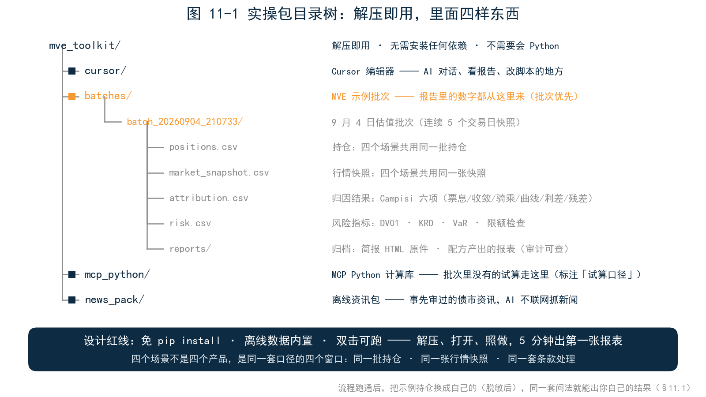
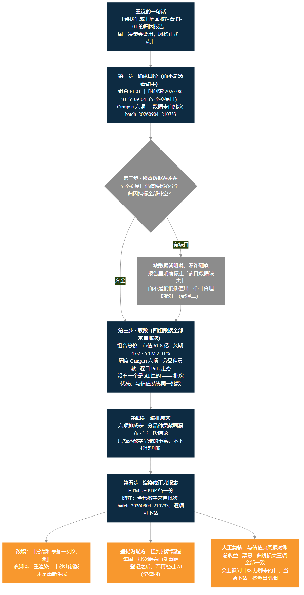
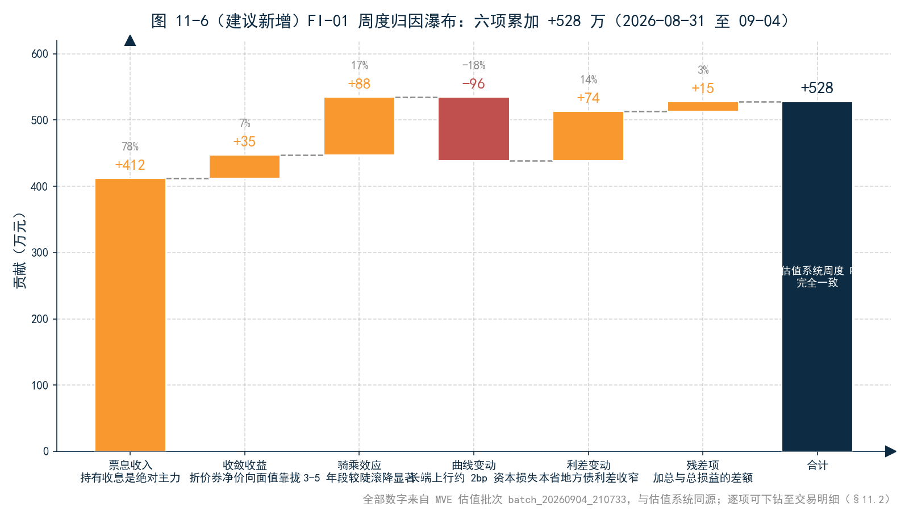
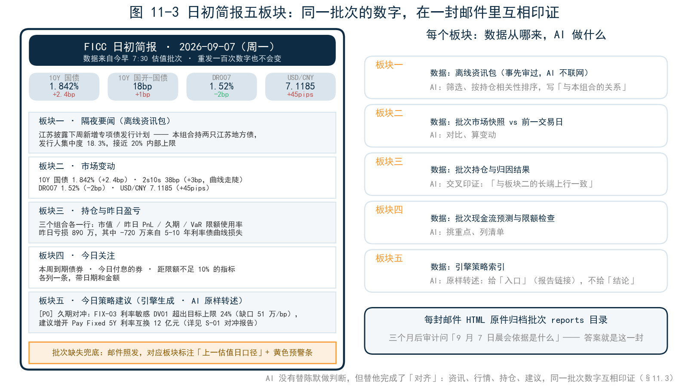
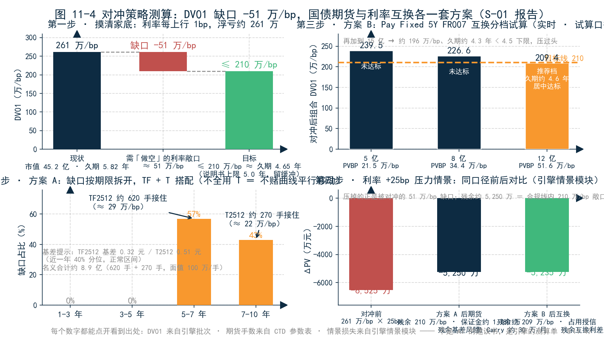
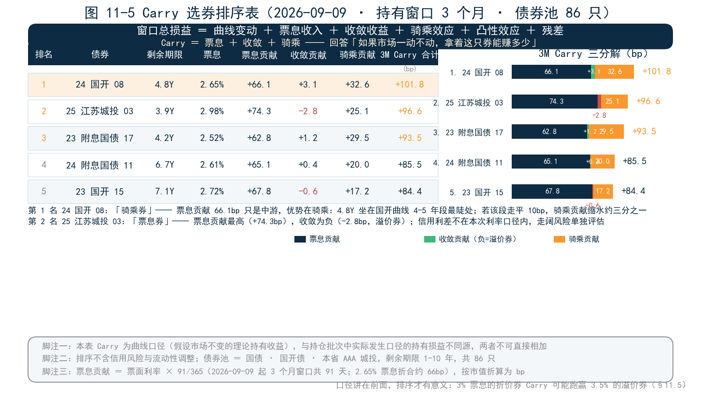
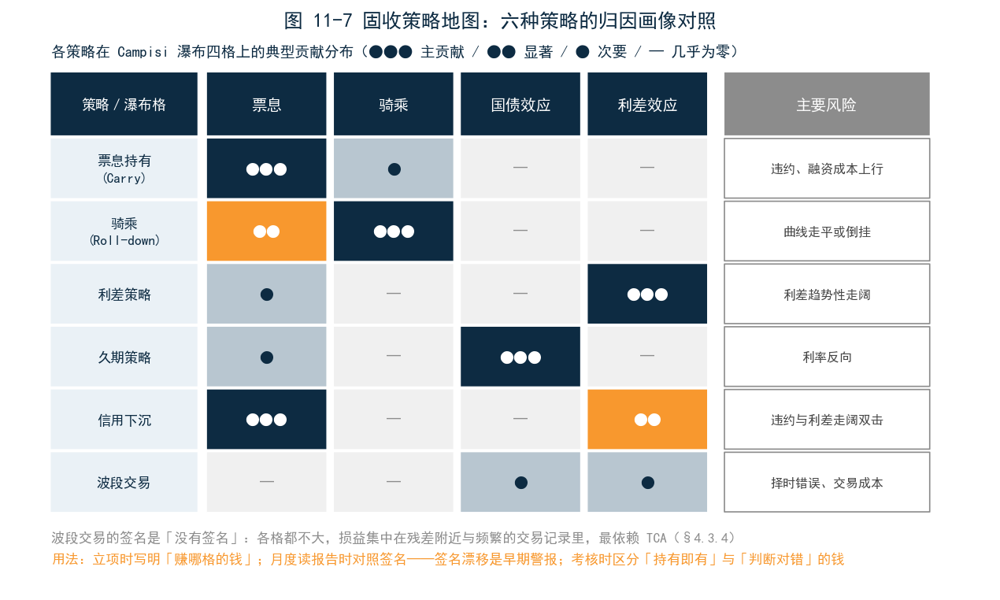

<!--
【素材来源】
- 四个场景的完整叙事脚本（角色、对话、表格、环境准备清单）：docs/customer/财联社/book/_archive/ai_场景叙事.md（本章为其书稿化改写，压缩叙事、保留关键对话与表格，环境准备清单改写为「亲手试试」操作步骤）
- 章节定位：docs/customer/财联社/book/_archive/02_提纲_方案B.md 第 11 章（报表生成 / 日初简报 / 对冲策略 / Carry & Roll）
- 「AI 不是第二套数」「选题、编排、成文」定位：docs/customer/财联社/三折页文案.md 内页三
- 实操包目录结构与设计红线（免 pip install、离线数据内置、双击可跑、版本锁定）：docs/customer/财联社/book/_archive/提纲.md「配套实操包」节
- 报表配方生命周期（生成 → 改稿 → 登记 → 批后重跑）：mfp-agent/docs/design/REPORT_SKILL_ARCHITECTURE.md
- 对冲口径（CTD / 转换因子 / CTD_DV01 / 合约乘数）：docs/markdown/products/ch05_BONDFUTURE_DETAILED.md
- Carry 恒等式（WINDOW_PNL 六项分解、TIME_CARRY_PNL）：docs/markdown/products/ch45_ATTRIBUTION_ANALYSIS_DETAILED.md
- fi_strategy 报告链（S-01 久期对冲 / S-06 Carry 选券）：docs/ficc_design/FICC_PPT_OUTLINE.md P23、mfp-agent/docs/design/FI_STRATEGY_REPORTS_INTEGRATION.md

【衔接与伏笔】
- 承接第 10 章：四个场景是「AI 在引擎之上」四条纪律（批次优先、缺数明说、三道工序、创作与量产分开）的工程演示
- 回收全书主线：场景一直接回答第 1、5 章的「这 200 万从哪来」；场景三呼应第 6 章 DV01/限额；场景四呼应第 5 章 Campisi 框架
- 为第 12 章埋伏笔：四个场景共用一套持仓与一张行情快照——「一个引擎，一套口径」是这一切的前提
- 为第 13 章埋伏笔：每个场景的「亲手试试」即实操包的读者路径预览

【仍需补充】（沿用 _archive/ai_场景叙事.md 的取材清单，成稿前需实跑替换）
1. 场景一：用真实批次（连续 5 个交易日快照、Campisi 六项非零）替换归因表数字；截取 Cursor 对话界面（含工具调用气泡）。（2026-09-09：【图 11-x】占位已替换为 figures/ch11/ 图片引用，其中 Cursor 对话界面截图改列 C 类待实跑）
2. 场景二：真实跑一次邮件发送，截取手机端/Outlook 端 HTML 邮件效果图；落实离线资讯包 JSON 格式。
3. 场景三：S-01 报告实跑，取 DV01 缺口、Pay Fixed 分档表、IR+25bp ΔPV 真实数字；国债期货手数需用真实 CTD_DV01 与转换因子重算（文中 620 手 / 270 手 / 12 亿名义均为演示口径，待实操包实跑替换）。
4. 场景四：S-06 报告实跑，取 BondPick 排序表真实债券与 TIME_CARRY_PNL 数值；补 WINDOW_PNL 恒等式校验（六项加总，残差≈0）。排序表数字（101.8/96.6/93.5/85.5/84.4bp）为合成案例，待实操包实跑替换。
5. 全章：实操包目录结构确定后，统一替换各场景「亲手试试」中的路径与问法。
6. ~~正文【图 11-x 占位】待替换为实际截图引用。~~（2026-09-09 已完成：图 11-1～11-6 已替换为 figures/ch11/ 下的实际图片引用；图 11-3、13-2 类 mockup 与 Cursor 界面截图待实操包实跑后可换真截图）

【统稿修正记录】2026-09-09 统稿修正 §11.3/§11.4/§11.5 数字自洽性（详见 _archive/90_统稿报告.md）：
- §11.4 DV01 体系 ×10 修正：26.1→261 万/bp、目标 21.0→210 万/bp、缺口 −5.1→−51 万/bp（261×25bp=6,525 万，与 ΔPV 自洽；45.2 亿×5.82 年≈263 万/bp，261 为利率敏感口径，差异 <1%）
- §11.4 KRD 缺口分布：58%/31% → 57%/43%（29/51≈57%、22/51≈43%，与手数分配一致）
- §11.4 方案 A 手数：62/27 手 → 620/270 手（TF 约 470 元/bp/手、T 约 815 元/bp/手）；保证金 1,780 万不变（名义 8.9 亿×综合 2%）
- §11.4 方案 B 分档：1/2/3 亿 → 5/8/12 亿（PVBP 4.3 万/bp/亿），推荐 12 亿；对冲后 ΔPV：−1,890/−1,640 万 → −5,250/−5,235 万（残余 DV01 210/209.4 万/bp × 25bp）
- §11.3 [P0] 建议与场景三统一：FI-01/42%/3 亿 → FIX-03/24%（缺口 51 万/bp）/12 亿
- §11.4 对冲成本：每月 8-10 万 → 约 30 万上下（12 亿名义 × 负 Carry 约 30bp/年 ÷ 12）
- §11.4 久期换算约数校准：目标 210 万/bp ≈ 久期 4.65 年；12 亿档 209.4 万/bp ≈ 4.6 年；15 亿档 ≈ 4.3 年
- §11.4 追问成本段、李铮附言、§11.1 举例中「3 亿」→「12 亿」三处联动
- §11.5 票息口径：按 91 天/365 计提（2.65%×91/365≈66bp），排序表五行票息贡献与合计全部重算，第 2、3 名随之对调
- §11.5 错别字：「折价为止」→「折价为正」
- 受影响插图（待重新生成）：图 11-3、11-4、11-5、12-6、13-4，新锚点见 _archive/96_插图清单_ch10_ch11.md / _archive/97_插图清单_ch12_ch13.md 的修订记录

【内容增强记录】2026-09-09（依据《内容增强方案.md》）：
- §11.5 后新增进阶框「固收策略地图」：六种策略（票息持有/骑乘/利差/久期/信用下沉/波段）的归因画像对照表，呼应第 5 章 Campisi 瀑布与 §5.8「归因对照策略说明书」
- 新增插图：图 11-7（固收策略地图），脚本 _build/gen_enhancement_figures.py
-->

# 第 11 章　四个场景

## 引子：四位读者，同一个问题

第 10 章把边界划完了：AI 问数、诊断、成文，引擎产生数字，人负责判断和签字。道理讲完了，问题还剩一个最实际的——**这套分工落到我的办公桌上，到底长什么样？**

本章请四位读者登场。王岚，城商行金融市场部固收投资经理，管 60 亿债券组合，每周要被问「上周的收益从哪来」；陈默，券商资管 FICC 投资总监，管三个组合两个敞口，每天 8:45 开晨会；李铮，理财子固收投资经理，45 亿组合久期超标，被要求「不准卖券、一周内压回来」；赵一鸣，农商行债券交易员，手里 2 亿新资金，两周内要配出去。

四个人的岗位、机构、问题各不相同，但他们会用同一个东西回答自己的问题：**一套 AI + 估值引擎的实操包，和一句大白话。**本章的约定只有一条：四个场景里的每一个数字——持仓、盈亏、DV01、Carry——都由引擎产生，AI 只做三件事：选题、编排、成文。你可以盯着任何一个数字问「从哪来」，每个都有答案。

读法上给一个建议：四个场景不必顺序读。管组合的先读场景一，开晨会的先读场景二，做对冲的先读场景三，做配置的先读场景四——但每个场景末尾的「亲手试试」建议都做一遍，因为四个场景合起来，才是这套工具的完整用法。

---

## 11.1 开始之前：实操包里有什么

四个场景都跑在同一套环境上，先花一分钟认识它。随书配套的实操包是一个「解压即用」的文件夹，里面四样东西：

- **Cursor 编辑器**：AI 对话的地方，也是看报告、改脚本的地方；
- **MVE 示例批次**：已经跑好的估值批次，含持仓、行情快照、归因与风险结果——报告里的数字都从这里来；
- **MCP Python 计算库**：引擎的实时计算能力，批次里没有的试算（比如「假如对冲 12 亿互换」）走这里；
- **离线资讯包**：事先审过的债市资讯样本，供日初简报使用——AI 不联网抓新闻。

设计上有一条红线：不需要会 Python，不需要装任何依赖，解压、打开、照做，**5 分钟出第一张报表**。四个场景的数字均为演示口径，重点不在数字本身，在流程——流程跑通了，把示例持仓换成你自己的（脱敏后），同一套问法就能出你自己的结果。

还要交代一句四个场景共同的「看不见的地基」：王岚的报告、陈默的晨报、李铮的对冲方案、赵一鸣的排序表，读的是**同一套引擎跑出来的同一批数据**——同一批持仓、同一张行情快照、同一套条款处理。所以报表里的周收益能和估值岗的周报对上，晨报里的亏损归因能和风控例会的口径对上。这个地基怎么搭，是第 12 章的内容；本章只需记住：**四个场景不是四个产品，是同一套口径的四个窗口。**

---

## 11.2 场景一：报表生成——一句话，一份能进决策会的归因报告

### 痛点：半天拼一张表，会上答不上「怎么算的」

周一下午两点，王岚接到通知：周三上午的月度投资决策会上，每个投资经理用十分钟讲清楚「上周组合的收益从哪来」。搁在以前，她的流程是：找估值岗要持仓和盈亏表，找风控要归因分解，自己在 Excel 里把票息、利差、曲线几项拼成一张表，截图贴进 PPT——顺利半天，不顺利一天；而且会上一旦被问「这个数怎么算的」，她得当场翻三张表。

这一次，她打开 Cursor，只说了一句话：

> **王岚**：帮我生成上周固收组合 FI-01 的归因报告，周三决策会要用，风格正式一点。

### AI 在中间做了什么：五步，步步留痕

**第一步，确认口径，而不是急着动手。**AI 先把口语翻译成引擎参数：

> **AI**：收到。先确认三件事：组合是 FI-01；时间窗是上周（2026-08-31 至 09-04，共 5 个交易日）；归因方法用 Campisi 框架（票息、收敛、骑乘、曲线、利差、残差六项）。数据来自 9 月 4 日估值批次 `batch_20260904_210733`。开始取数。

口径先对齐，数字才不会错——这是第 4 章「绩效数字是定义出来的」在 AI 对话里的样子。

**第二步，检查数据在不在。**上周 5 个交易日的估值快照齐全，归因指标全部非空。如果这里有缺口——比如周三的市场数据缺失——AI 会在报告里明确标注「该日数据缺失」，而不是悄悄编一个数（第 10 章纪律二）。

**第三步，取数——四组数据，全部来自批次。**组合总貌（市值 61.8 亿、久期 4.62、YTM 2.31%）、周度 Campisi 六项、分品种贡献、逐日 PnL 走势。注意一个细节：**这四组数据没有一个是 AI 算的**，它们上周五晚就由批处理算好落在 CSV 里，AI 只是按语义读出来——批次优先，保证报告里的数和估值系统里的数是同一批数。

**第四步，编排成文。**归因六项排成表，分品种贡献画成瀑布图，再写三段结论。结论的写法有讲究：AI 只描述数字呈现的事实（「票息贡献 +412 万，占周收益的 78%」），不下投资判断（不说「建议加仓」）。

**第五步，渲染成正式报表**，HTML 加 PDF 各一份。

<!-- 原【图 11-1 占位：Cursor 对话界面截图】按插图清单改列为 C 类实跑截图，待实操包定稿后截取 -->

### 输出：核心一页长这样

报告标题《固收组合 FI-01 周度归因报告（2026-08-31 至 09-04）》，核心页是这张表：

| 归因因子 | 贡献（万元） | 占周收益 | 一句话解读（AI 撰写） |
|---|---:|---:|---|
| 票息收入 | +412 | 78% | 持有收息是本周收益的绝对主力 |
| 收敛收益 | +35 | 7% | 折价券净价向面值靠拢 |
| 骑乘效应 | +88 | 17% | 曲线 3-5 年段较陡，滚降贡献显著 |
| 曲线变动 | −96 | −18% | 长端收益率上行约 2bp 带来资本损失 |
| 利差变动 | +74 | 14% | 本省地方债利差小幅收窄 |
| 残差项 | +15 | 3% | 六项加总与总损益的差额，在合理范围 |
| **合计** | **+528** | 100% | 与估值系统周度 PnL 完全一致 |

报告附注里有一行小字：「本报告全部数字来自 MVE 估值批次 batch_20260904_210733，与估值系统同源；逐项可下钻至交易明细。」——第 10 章说的可追溯性，就落在这一行上。

### 改稿、登记与复核

初稿出来后，王岚提了两个要求：「分品种那张表加一列久期；另外这报告以后每周一早上自动出一份。」第一个要求，AI 没有重生成整份报告，而是在同一份报表脚本上加一列、重新渲染，十秒出新版。第二个要求更关键：AI 把报表登记为一个「配方」，挂到批后流程上——从此每周一批次跑完，配方自动重跑，报告静静躺在共享目录里，**登记之后，不再经过 AI**（第 10 章纪律四）。

周三会上，有领导问：「骑乘贡献 88 万，是哪几只券带来的？」王岚当场下钻，三秒调出明细。会后她把这份报告和估值岗的周报并在一起核了一遍：总收益、票息、曲线损失，三项全部一致。区别只在于，估值岗的周报做了半天，她的这份用了一句话。

### 亲手试试

打开实操包，依次做三步：

1. 对 AI 说：「帮我生成上周固收组合 FI-01 的归因报告，风格正式一点。」观察它先确认口径、再取数的过程；
2. 改稿：「分品种那张表加一列久期。」体会「改脚本、重渲染」和「重新生成」的区别；
3. 溯源：挑报告里任意一个数字，问「这个数从哪来」，让它给出批次号、指标名，并下钻到交易明细。

---

## 11.3 场景二：日初简报——八点整，邮箱里躺着一份晨报

### 痛点：晨会前的 50 分钟，看到什么全凭手速

陈默的一天从 8:45 的晨会开始。以前每个工作日早晨是这样的：7:50 到办公室，先刷资讯看隔夜发生了什么，再登录估值系统导出昨天的持仓和盈亏，再打开行情终端抄几个关键利率汇率，手忙脚乱拼成脑子里的「今日图景」。8:45 会上他讲什么，取决于早上 50 分钟里来得及看什么——看漏一条地方债供给消息，会上就可能被研究员问住。

现在，他 8:00 整会收到一封邮件。不是谁熬夜写的，是 AI 在每日估值批次跑完后自动生成、自动发送的。

### 触发：定时为主，口令兜底

主路径是定时的：每个工作日 7:30 批次跑完，7:45 简报脚本自动唤起，生成并发送。兜底是手动的——某周一 8:12，陈默在出租车上看完邮件，到办公室想再看细节，说了一句：

> **陈默**：把今早的简报再发我一份，抄送晨会群。

> **AI**：已重新生成并发送。数据仍来自今早 7:30 的批次（估值日 2026-09-07），与 8:00 那封内容一致——因为底层批次没有变。

这句回答看似平淡，实则关键：**同一批次、同一口径，重发一百次数字也不会变。**简报不是 AI 即兴写的，是从引擎结果里「取」出来的。

### 五个板块：一封邮件里的「今日图景」

邮件是 HTML 格式（手机上也舒服），标题《FICC 日初简报 · 2026-09-07（周一）》，正文五个板块：

**板块一 · 隔夜要闻。**来源是离线资讯包——前一交易日盘后至当日清晨的债市资讯，已按「政策 / 资金 / 债市 / 地方债供给 / 海外」打好标签。AI 只做两件事：按与陈默持仓的相关性排序，给每条写一句「与本组合的关系」。例如：「江苏披露下周新增专项债发行计划——本组合持有两只江苏地方债，发行人集中度 18.3%，接近 20% 的内部上限。」资讯是离线的、事先审过的；AI 不联网抓取、不生成新闻，只做筛选和关联。

**板块二 · 市场变动。**批次里的市场快照与前一交易日对比：10Y 国债 1.842%（+2.4bp）、10Y 国开−国债利差 18bp（+1bp）、2s10s 38bp（+3bp，曲线走陡）、DR007 1.52%（−2bp）、USD/CNY 7.1185（+45pips）。

**板块三 · 持仓与昨日盈亏。**三个组合各一行：市值、昨日 PnL、久期、VaR 限额使用率；下面跟一句 AI 写的归因摘要：「昨日亏损 890 万，其中 −720 万来自 5-10 年利率债的曲线损失，与板块二的长端上行一致。」——注意这句的写法：数字来自批次，「与板块二一致」是 AI 做的交叉印证。

**板块四 · 今日关注。**批次的现金流预测与限额检查：本周到期的债券、今日付息的券、距离限额不足 10% 的指标，各列一条，带日期和金额。

**板块五 · 今日策略建议。**批次里引擎自动生成的策略索引，AI 原样转述，每条标注优先级与依据，并缀着引擎报告的链接：「[P0] 久期对冲：FIX-03 利率敏感 DV01 超出目标上限 24%（缺口 51 万/bp），建议增开 Pay Fixed 5Y 利率互换 12 亿元（详见 S-01 对冲报告）。」AI 给的是「入口」，数字和测算过程在报告里，可下钻、可复核。

还有一条兜底原则：如果某天批次跑失败，简报不会「硬凑」——邮件照发，但对应板块明确标注「今日批次缺失，本板块数据为上一估值日口径」，标题加黄色预警条。**宁可明说没数据，不可悄悄用过期数**——和第 3 章「错得清楚，好过错得安静」一脉相承。每封邮件的 HTML 原件同时归档到批次的 reports 目录——三个月后审计问「9 月 7 日晨会依据是什么」，答案就是这一封。

### 陈默看到了什么

8:45 晨会，他的开场白变了。以前是「我早上看到的情况」，现在是：「今早简报里三件事——长端上了 2.4bp，我们昨天亏的 890 万里七成是曲线损失；江苏下周有供给，我们集中度 18.3% 快贴线了；引擎建议 FIX-03 今天做 12 亿互换对冲。研究员先说说供给这条。」

**AI 没有替他做判断，但替他完成了「对齐」**：资讯、行情、持仓、建议，四件事在同一封邮件里、用同一批次的数字互相印证。他要做的，只剩下判断本身。

### 亲手试试

1. 对 AI 说：「现在给我发一份今日简报。」对照邮件正文，逐个板块问「这块的数据从哪来」；
2. 追问：「板块三里说 890 万亏损的七成是曲线损失——把归因明细调出来我看。」
3. 检查归档：打开批次的 reports 目录，找到今早那封邮件的 HTML 原件——想想三个月后审计来了，你拿什么给他看。

---

## 11.4 场景三：对冲策略——「久期太长了」，从一句话到两套方案

### 痛点：久期超标，但不准卖券

9 月初，债市连续调整，10 年国债一周上了 6bp。周五风控例会上，李铮被点名：他的「稳健添利」组合（FIX-03，45 亿，以 3-10 年利率债为主）久期 5.8 年，超出产品说明书 5.0 年的上限；利率敏感 DV01 达 261 万/bp——利率每上行 1bp，浮亏约 261 万。会议要求：下周内把久期压回 5.0 以内，**但不准卖券**——组合里的券多数是配置盘，卖了就实现亏损，还影响客户关系。

不卖出、只降久期，答案只有一个：用衍生品对冲。李铮打开 Cursor：

> **李铮**：FIX-03 久期太长了，帮我用国债期货和利率互换做对冲。目标：久期从 5.8 降到 5.0 以内，DV01 缺口算清楚，两套工具各给一套方案。

### AI 的计算过程：缺口、双方案、前后对比

**第一步，摸清家底。**AI 从当日批次读取 FIX-03 的风险指标，全部来自引擎：组合市值 45.2 亿，修正久期 5.82 年，DV01 261 万/bp；目标 DV01 ≤ 210 万/bp（对应久期约 4.65 年，较 5.0 年的上限留出缓冲）——**对冲缺口 −51 万/bp**，需要「做空」约 51 万/bp 的利率敞口。AI 还拉出 KRD（关键期限久期）分布：缺口集中在 5-7 年段（57%，约 29 万/bp）和 7-10 年段（43%，约 22 万/bp）——这决定了两套工具怎么配。

**第二步，方案 A：国债期货。**按 KRD 缺口分布配比：做空 TF2512 约 620 手（接住 5-7 年段缺口 29 万/bp）+ 做空 T2512 约 270 手（接住 7-10 年段缺口 22 万/bp），名义本金合计约 8.9 亿。同时，AI 给出了一段它必须说的话：

> **基差风险提示**：期货对冲的是 CTD 券的利率风险，与您持仓的现券之间存在基差。当前 TF2512 基差 0.32 元、T2512 基差 0.51 元，处于近一年 40% 分位，属正常区间；但若交割月临近或 CTD 切换，对冲效果会偏离。本方案为一阶近似（DV01 匹配），执行前建议用引擎做全量重定价复核。

**第三步，方案 B：利率互换。**AI 调用实时计算能力，对「增开 Pay Fixed 5Y FR007 互换」做分档试算：

| 名义本金 | 互换 PVBP | 对冲后组合 DV01 | 是否达标 |
|---:|---:|---:|:---:|
| 5 亿 | 21.5 万/bp | 239.5 万/bp | 否 |
| 8 亿 | 34.4 万/bp | 226.6 万/bp | 否 |
| **12 亿** | **51.6 万/bp** | **209.4 万/bp** | **是（推荐档）** |

为什么推荐 12 亿？AI 的解释：5 亿、8 亿两档对冲后 DV01 仍在 210 万/bp 的目标线之上，不达标；12 亿档把 DV01 压到 209.4 万/bp，对应久期约 4.6 年——既回到 5.0 以内，又守住 4.5 年的下限，居中达标。继续加到 15 亿，DV01 将压到约 196 万/bp、久期约 4.3 年，跌破下限——久期压过头同样违规。

**第四步，前后对比。**用引擎情景模块做同口径对比（利率 +25bp 压力情景）：对冲前 ΔPV −6,525 万（261 万/bp × 25bp）；方案 A 后 −5,250 万（残余 DV01 210 万/bp），占用保证金约 1,780 万，残余基差风险；方案 B 后 −5,235 万（残余 DV01 约 209 万/bp），占用授信额度，残余互换利差风险。两套方案压掉的，正是被对冲的 51 万/bp 缺口；残余的 5,250 万上下，对应合规线内 210 万/bp 的敞口——那是产品说明书允许持有的利率风险，对冲的目标从来不是消灭它。

### 追问中完善：方案是聊出来的

李铮盯着方案 A 看了一会儿，追问：

> **李铮**：为什么期货要 TF 和 T 搭配着用？全用 10 年期的 T，手数更少，不是更省事？

> **AI**：可以，但会引入新的风险。您的缺口按期限拆开：5-7 年段占 57%，7-10 年段占 43%。全用 T 对冲，DV01 总量匹配了，期限结构没匹配——相当于赌曲线平行移动。一旦曲线走平，您 5-7 年的持仓照样亏，T 空头却不赚钱，对冲就漏了。TF+T 按缺口分布配比，赌的只是「各段的风险被各自的工具接住」。

> **李铮**：两套工具的成本差多少？

> **AI**：期货方案占用保证金约 1,780 万（名义合计约 8.9 亿、综合保证金率约 2%），资金机会成本约年化 1.5%；互换方案不占保证金但占用交易对手授信，且 Pay Fixed 头寸持有期内有负 Carry，每月约 30 万上下。两者都不免费——对冲的本质是**用确定的持有成本，换掉不确定的利率损失**。

这里值得停一下：AI 解释了两种工具的风险差异和成本结构，但**没有替李铮拍板**。「建议周一先做互换 12 亿」这样的话，是李铮自己说的，不是 AI 说的。AI 把账算清楚、把风险摆明白，决策权留在人手里——这既是产品设计的边界，也是合规的边界（第 10 章）。

### 李铮看到了什么

五分钟后，他把两套方案连同对比表发给风控总监，附言：「两套方案都把久期压回 5.0 以内。期货灵活、可日内调整，但有基差风险；互换更干净，占用授信。建议周一先做互换 12 亿锁定底线，期货留作日内微调。」

风控总监回了一个字：「可。」——因为方案里每个数字都能点开看到出处：DV01 来自引擎批次，期货手数来自 CTD 参数表，情景损失来自引擎情景模块。**这不是 AI 的建议书，是引擎的测算单，AI 只是把它翻译成了人话。**

### 亲手试试

1. 对 AI 说：「FIX-03 久期太长了，帮我用国债期货和利率互换各做一套对冲方案，目标久期 5.0 以内。」
2. 追问：「为什么不全用 10 年期 T？」让它调出 KRD 分布回答；
3. 复核：挑方案里任意一个数字（缺口 51 万、620 手、ΔPV −5,235 万），问「这个数从哪来」，追到批次或试算脚本。

---

## 11.5 场景四：Carry 选券——先讲一道恒等式，再给一张排序表

### 痛点：2 亿资金，两周内配出去

赵一鸣的行里自营盘 30 亿，考核口径很朴素：持有收益。领导的原话是：「波段你做不过大行，就把票息和骑乘的钱挣踏实。」9 月第二周，行里一笔 2 亿资金到账，要求两周内配出去。他的问题是：当前市场上，买哪只券的「持有体验」最好？他问出了那句每个固收交易员都问过的话：

> **赵一鸣**：帮我找当前市场上 Carry 最高的债券，2 亿资金，打算持有 3 个月。

### AI 先讲了一道恒等式

AI 没有直接甩出一张排序表。它先花三行字对齐口径——因为「Carry 高」这个词，在不同系统里含义完全不同：

> **AI**：先对齐口径。在引擎里，持有一段窗口的总损益满足一道恒等式：
>
> **窗口总损益 = 曲线变动 + 票息收入 + 收敛收益 + 骑乘效应 + 凸性效应 + 残差**
>
> 其中「票息 + 收敛 + 骑乘」三项合称 **Carry（持有收益）**——它回答的是「如果市场一动不动，我拿着这只券能赚多少」。我按这个口径扫描，排序依据是 3 个月窗口的持有损益。曲线变动那一项是市场给的，不在本次排序内——这一点报告里会写明。

这道恒等式是整件事的地基（第 5 章的 Campisi 框架在这里换了副面孔出现）：Carry 不是「票息高」的同义词——一只 3% 票息的折价券，Carry 可能跑赢 3.5% 票息的溢价券，因为折价券有收敛收益加持，溢价券的收敛是负的。**AI 把口径讲在前面，后面的排序才有意义。**

### 扫描：86 只券，逐券三分解

第一步，确定债券池：按行里可投范围（国债、国开债、本省 AAA 城投，剩余期限 1-10 年）筛出 86 只。第二步，逐券算三项：**票息收入**（票面利率 × 持有天数 / 365，按市值折算成 bp——9 月 9 日起的 3 个月窗口共 91 天，2.65% 的票息折合约 66bp）、**收敛收益**（假设收益率不变，净价向面值 100 元靠拢的幅度——溢价为负、折价为正）、**骑乘效应**（假设曲线形态不变，3 个月后剩余期限缩短，收益率沿曲线「滚」到更短期限带来的价格变化——曲线越陡的期限段，骑乘越厚）。第三步，排序输出。

<!-- 原占位所述「国债曲线 Carry/Roll 矩阵」按插图清单改列为候选增补，待 S-06 实跑取真实曲线后生成 -->

### 输出：排序表 + 每只券的分解

报告标题《Carry 选券扫描 · 2026-09-09（持有窗口 3 个月）》，主表：

| 排名 | 债券 | 剩余期限 | 票息 | 3M Carry 合计(bp) | 票息贡献 | 收敛贡献 | 骑乘贡献 |
|---:|---|---:|---:|---:|---:|---:|---:|
| 1 | 24 国开 08 | 4.8Y | 2.65% | **+101.8** | +66.1 | +3.1 | +32.6 |
| 2 | 25 江苏城投 03 | 3.9Y | 2.98% | **+96.6** | +74.3 | −2.8 | +25.1 |
| 3 | 23 附息国债 17 | 4.2Y | 2.52% | **+93.5** | +62.8 | +1.2 | +29.5 |
| 4 | 24 附息国债 11 | 6.7Y | 2.61% | +85.5 | +65.1 | +0.4 | +20.0 |
| 5 | 23 国开 15 | 7.1Y | 2.72% | +84.4 | +67.8 | −0.6 | +17.2 |

AI 为前三名各写了一段「为什么是它」。第一名 24 国开 08：「票息贡献 66.1bp 只是中游，真正的优势在骑乘——剩余 4.8 年，正好坐在国开曲线 4-5 年段最陡的位置，3 个月滚降贡献 32.6bp。**一句话：这是一张『骑乘券』，赚的是曲线形态的钱。**」风险对称地写在下面：「若 4-5 年段走平 10bp，骑乘贡献将缩水约三分之一。」第二名 25 江苏城投 03 的点评则相反：「票息贡献最高（+74.3bp），但收敛为负（−2.8bp，溢价券），且信用利差不在本次利率口径内——买它赚的是票息，利差走阔风险要单独评估。」

报告末尾有两条脚注，AI 坚持保留：一，本表 Carry 为**曲线口径**（假设市场不变的理论持有收益），与持仓批次中实际发生口径的持有损益不同源，两者不可直接相加；二，排序不含信用风险与流动性调整。

### 赵一鸣看到了什么

他把报告转发给领导，附言：「建议 2 亿分两只：1.2 亿配 24 国开 08（骑乘为主），0.8 亿配 25 江苏城投 03（票息为主），Carry 结构互补。」领导问了那个经典问题：「这个 101.8bp 是怎么算的？」赵一鸣直接把报告里那道恒等式转了过去——**票息、收敛、骑乘，三项各有公式、各可复算，加总还能和引擎的窗口损益恒等式对上。**这和他以前在 Excel 里拍脑袋算的「Carry」，已经不是同一种东西。

### 亲手试试

1. 对 AI 说：「帮我找当前市场上 Carry 最高的债券，2 亿资金，持有 3 个月。」注意它先对齐口径再动手；
2. 追问第一名：「24 国开 08 的 101.8bp 拆开给我看——票息、收敛、骑乘各多少？如果 4-5 年段走平 10bp，还剩多少？」
3. 验证恒等式：让 AI 把某只持仓券的窗口损益六项加总，看残差是否接近零——这是「数字来自引擎」最硬的一句证明。

> **【进阶】固收策略地图——六种策略的归因画像**
>
> 场景四做的是「Carry 选券」，但 Carry 只是固收策略地图上的一块。实务中一个固收组合的收益，几乎全部来自六种动作的某种组合。每种动作在 Campisi 瀑布上都有自己独特的「签名」——归因报告读得对不对，取决于你手里有没有这张地图：
>
> | 策略 | 赚什么钱 | 瀑布上的签名 | 主要风险 | 失效环境 |
> |---|---|---|---|---|
> | 票息持有（Carry） | 票面利率减去融资成本 | 票息格大且稳，其余格小 | 违约、融资成本上行 | 信用事件、资金利率飙升 |
> | 骑乘（Roll-down） | 曲线形态（陡峭度） | 骑乘格显著为正 | 曲线走平或倒挂 | 曲线平坦化 |
> | 利差策略 | 品种/期限/等级利差收敛 | 利差格持续为正 | 利差反向走阔 | 利差趋势性走阔 |
> | 久期策略 | 利率方向判断 | 国债效应格大起大落 | 利率反向 | 利率横盘（赚不到也亏不多） |
> | 信用下沉 | 信用利差补偿 | 票息格偏高 + 利差格波动大 | 违约与利差走阔双击 | 信用收缩期 |
> | 波段交易 | 低买高卖的价差 | 各格都不大、残差/交易项活跃 | 择时错误、交易成本 | 低波动横盘市 |
>
> 逐条点评。**票息持有**是最朴素的策略，签名是「瀑布只有一格」——票息格贡献九成以上；它的风险不在市场而在信用，所以读它的归因报告，第一眼看的不是收益而是「票息里有多少是信用补偿」。**骑乘**是场景四的主角：签名是骑乘格与票息格双高，风险对称地写在曲线形态上——4-5 年段走平 10bp，骑乘贡献缩水三分之一，这就是赵一鸣报告里那句风险提示的含义。**利差策略**赚的是「利差向均值回归」的钱，签名是利差格持续小幅为正；它的危险在于收益分布不对称——平时稳定赚小钱，利差走阔时一次亏掉几年的积累，和信用下沉是近亲。**久期策略**的签名是国债效应格的大开大合：利率下行月它是英雄，上行月它是罪人——读它的归因要配合第 5 章的择时检验（§5.5），区分「判断对」和「胆子大」。**信用下沉**的签名最具迷惑性：票息格高得像 Carry 策略，但利差格波动出卖了它；第 5 章那个「利差效应占收益 80%」的风控案例，就是这张签名被读出来的样子。**波段交易**的签名是「没有签名」——各格都不大，损益集中在残差附近和频繁的交易记录里；它最依赖 TCA（§4.3.4），因为交易成本决定这个策略的生死。
>
> 地图的用法有三层。**立项时**：策略说明书里写明「本组合赚哪格的钱」，归因报告就有了对照基准——第 5 章说过，归因对照的是策略说明书，不是盈亏本身（§5.8）。**月度读报告时**：签名漂移是早期警报——一个以 Carry 立项的组合，国债效应格连续三个月最大，说明它实际上在做久期策略，要么改说明书，要么改持仓。**考核时**：六种策略的「可复制性」排序天然不同——Carry 和骑乘是「持有即有」的钱，利差和信用下沉是「承担补偿」的钱，久期和波段是「判断对错」的钱；同样的 200 万，来自不同格子，含金量不同。
>
> 最后一句话回到全书主线：这张地图之所以能用，是因为 Campisi 瀑布的每一格都由同一引擎、同一口径产出——**策略可以不同，口径必须相同**，否则地图上比较的就不是策略，是各家的算法。

---

## 11.6 四个场景，一条主线

把四个场景连起来看，AI 的角色始终一致：

| 场景 | 读者要的 | AI 做的 | 数字来自 |
|---|---|---|---|
| 报表生成 | 一份能进决策会的报告 | 确认口径、取数、编排、成文 | 估值批次（Campisi 归因） |
| 日初简报 | 睁眼即得的今日图景 | 定时触发、五板块汇编、邮件投递 | 估值批次 + 离线资讯包 |
| 对冲策略 | 可执行的对冲方案 | 缺口测算、双工具配比、前后对比 | 估值批次 + 实时试算 |
| Carry 选券 | 持有收益最高的券 | 口径对齐、逐券分解、排序成表 | 曲线计算 + 估值批次 |

四个场景还共享同一条暗线：**每个场景的结尾，都有一次人工复核**——王岚与估值岗对账，陈默在晨会上做判断，李铮的方案要风控总监批一个「可」，赵一鸣的排序要回答领导「怎么算的」。AI 把准备工作的成本压到接近零，但「最后一道工序是人」这件事，四个场景里一次都没有省略。

再回头看第 10 章的边界表，四个场景其实是它的四组注脚：AI 查数据（问数）、找异常（诊断）、起草文字（成文），但没有一个数字是它编造的；它给建议的「入口」，不给决策的「结论」；它把报告创作出来，然后退出，由引擎量产下去。**你可以质疑成文的角度，但不必质疑数字本身**——这句话在四个场景里，各被验证了一次。

---

## 本章小结

回到引子的问题：AI + 估值引擎到底能帮你做什么？

四个场景给了四个具体的答案：**一句话出一份能进决策会的归因报告**（从半天到 40 秒，且每个数字可下钻）；**八点整邮箱里躺着一份口径对齐的晨报**（资讯、行情、持仓、建议，同一批次的数字互相印证）；**「久期太长了」五分钟后变成两套可执行的对冲方案**（缺口、配比、成本、残余风险，逐项可复核）；**「帮我找 Carry 最高的券」先得到一道恒等式、再得到一张排序表**（口径讲在前面，排序才有意义）。

但比四个答案更重要的是同一个前提：**四个场景里的每一个数字，都来自同一套引擎、同一批持仓、同一张行情快照。**报表里的 528 万和晨报里的 890 万能对上，对冲方案的 DV01 和风控例会的 DV01 是同一个数——这不是 AI 的功劳，是「一个引擎，一套口径」的功劳。AI 不是第二套数；它是同一套数的新界面。

这个前提是怎么工程实现的——估值、绩效、归因、风险怎样共用同一批持仓与同一张快照，条款缺失时引擎为什么宁可报错也不猜——是下一章的主题。

---

## 亲手试试

本章本身就是「亲手试试」的展开：四个场景末尾的操作步骤，合起来就是实操包的完整读者路径。如果只做一件事，建议从场景一开始——解压实操包，对 AI 说「帮我生成上周固收组合 FI-01 的归因报告」，5 分钟后，你会拿到本书第一张属于你的报表。

然后做最后一个动作：把报表里任意一个数字挑出来，问「这个数从哪来」。**从这一问开始，你就已经在用这本书的全部内容了。**
