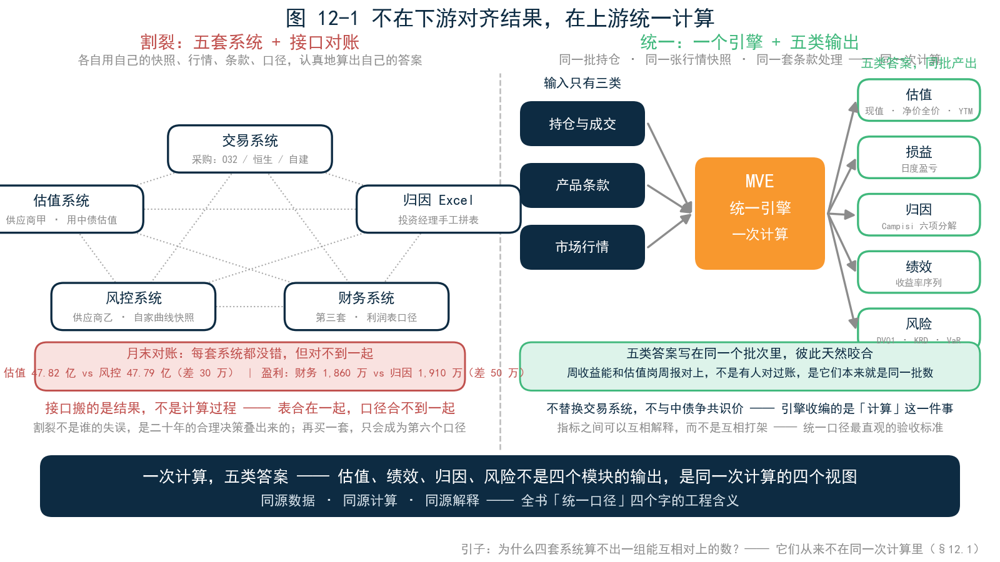
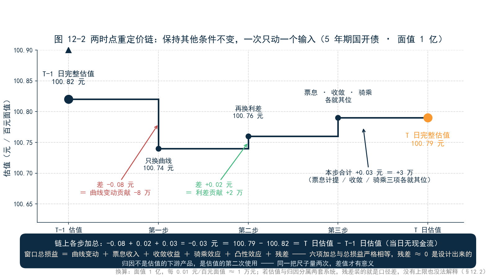
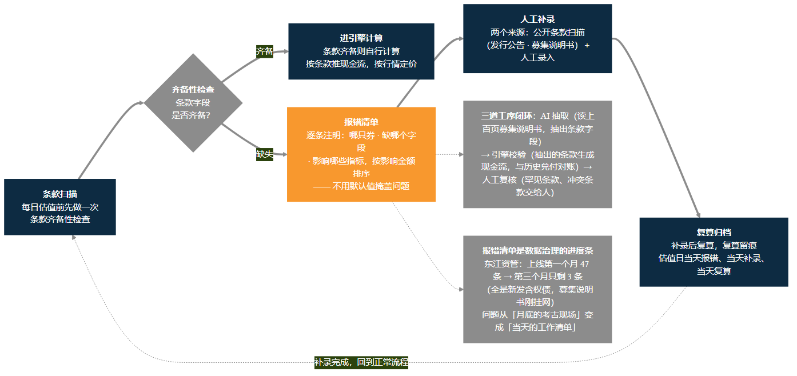
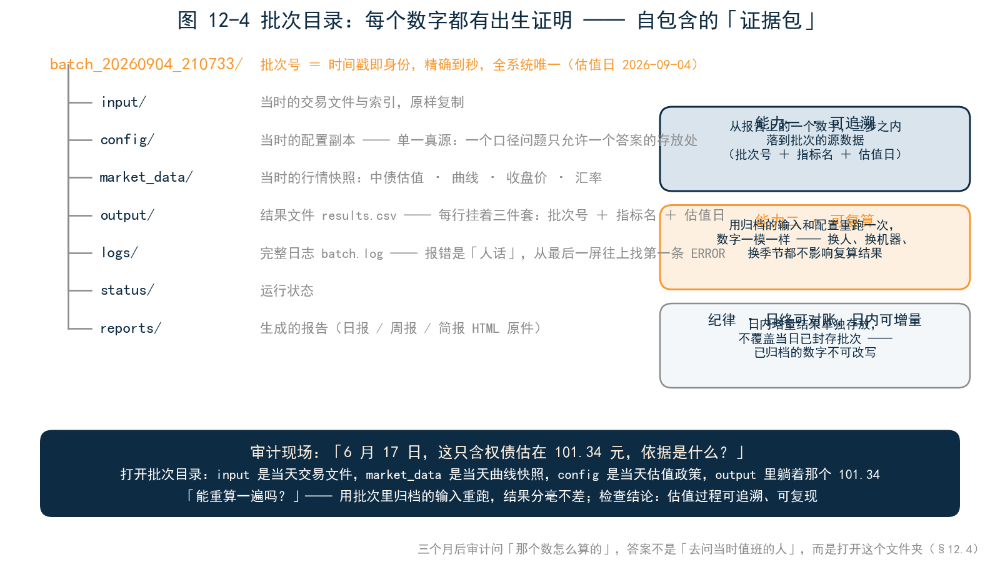
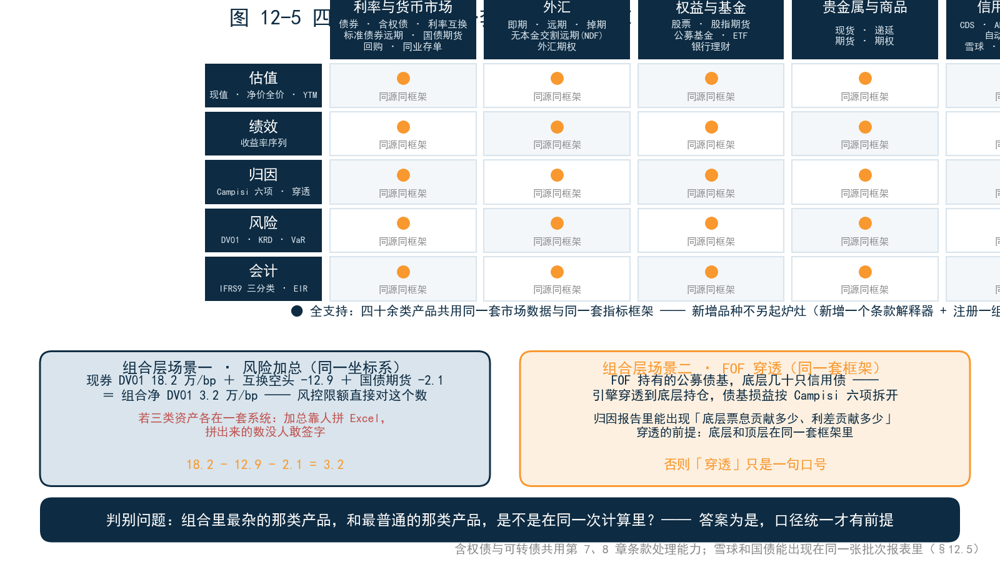
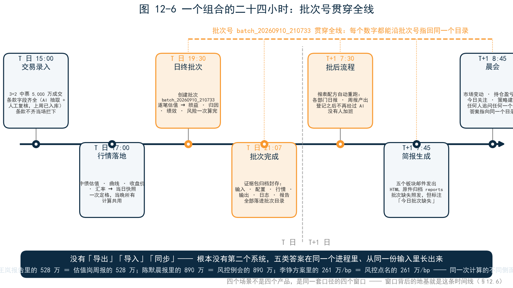

<!--
【素材来源】
- 章节定位与结构：docs/customer/财联社/book/_archive/02_提纲_方案B.md 第五部分第 12 章（一个引擎，一套口径：设计哲学、条款治理、端到端流程）
- 设计哲学与品种覆盖：docs/customer/财联社/三折页文案.md 内页一/内页二（输入只有三类、一次计算五类答案、日终可对账日内可增量、四十余类产品共用一套框架、三种落地方式、同源数据·同源计算·同源解释）
- 同源估值与两时点重定价：12_第3章_估值.md §3.5（损益拆解的第一环）、14_第5章_归因.md（三者同源）；WINDOW_PNL 恒等式与重估路径：docs/markdown/products/ch45_ATTRIBUTION_ANALYSIS_DETAILED.md
- 条款治理：12_第3章_估值.md §3.2.4（价格来源链、错得清楚好过错得安静）、16_第7章_中国债券条款.md §7.7（三道工序）；三折页「条款齐备则引擎自行计算；条款缺失则明确报错，不用默认值掩盖问题」
- 批次管理：docs/markdown/user_manual/ch01_overview.md（核心流程、配置分层与单一真源约定）、ch08_output_and_results.md（批次目录自包含结构、results.csv 字段、日内增量不覆盖批次）
- 端到端跑批流程：docs/guide/QIANHAI_BATCH_RUN.md（数据→跑批→报告→验收顺序、批次产出物速查）
- 承接伏笔：20_第11章_四个场景.md 本章小结末尾（共用同一批持仓与同一张快照、条款缺失宁可报错也不猜）

【衔接与伏笔】
- 直接承接第 11 章末尾伏笔：四个场景共用的「看不见的地基」本章揭开；12.6 回扣「四个场景是同一套口径的四个窗口」
- 回收第 1 章「统一口径不是技术口号，是业务刚需」、第 3 章「错得清楚，好过错得安静」与三类差异排查表、第 5 章「三者同源」、第 9 章对账桥「两套口径必须同源」、第 10 章「可复现是机构级工具和个人玩具的分界线」「批次号+指标名+估值日」三件套
- 章末为第 13 章埋伏笔：把引擎交到读者手里

【仍需补充】
1. 引子与 12.7 的「东江资管」迁移案例为合成案例（人物、机构、数字均虚构但自洽），成稿前建议替换为可公开引用并脱敏的真实实施案例。
2. 12.6 端到端时间线（19:30 批次启动、21:07 完成、批次号 batch_20260910_210733 等）为演示口径，需与实操包内置批次的真实时间戳对齐。
3. 12.5 产品清单以三折页为准，成稿前需与引擎当前版本的产品×指标矩阵（docs/markdown/user_manual/ch12_PRODUCT_AND_METRICS_REFERENCE_MANUAL_v3.md §4.2）核对数量与名录。
4. ~~正文【图 12-x 占位】待替换为实际图片引用。~~（2026-09-09 已完成：图 12-1～12-6 已替换为 figures/ch12/ 下的实际图片引用）
5. 「亲手试试」的路径与问法需与实操包内置数据最终对齐。

【统稿修正记录】2026-09-09：§12.6 末段「李铮方案里的 26.1 万/bp」随 20_第11章_四个场景.md §11.4 的 DV01 体系修正改为「261 万/bp」（详见 _archive/90_统稿报告.md）；图 12-6 横幅中的「26.1 万/bp」需同步重新生成。
-->

# 第 12 章　一个引擎，一套口径

## 引子：四张报表，四个「对的」数字

三月最后一个工作日，晚上七点，东江资管的月度对账会开到了第三个小时。

会议室长桌上摊着四张表。估值核算主管方姐面前的表上，固收组合月末市值 47.82 亿；风控老罗的系统里，同一个组合的市值是 47.79 亿——差 30 万。老罗的解释是现成的：「风控用自家曲线快照，估值用中债估值，口径不同。」财务送来的利润表上，这个组合当月盈利 1,860 万；而投资经理用 Excel 自己拼的归因表上，票息、曲线、利差几项加总是 1,910 万——又差 50 万，谁也说不清差在哪一项上。

投资经理没说话。他的归因表是昨天下午拼出来的：估值岗给的持仓市值，风控给的曲线变动，自己算的票息——三张来源拼一张表，拼的时候就知道会有缝，但缝在哪，只有月底对账才知道。

主持会的分管副总郑总把四张表并在一起，问了一个朴素的问题：「这四个数，到底哪个是对的？」

沉默了几秒，老罗先开口：「都对。换个说法——也都没法互相对账，每套系统各算各的。」

郑总追问的那句，才是本章的起点：「**为什么四套系统，算不出一组能互相对上的数？**」

在场没人答得上来。估值系统是一家供应商的，风控系统是另一家的，财务用第三套，投资经理的归因干脆活在 Excel 里。每套系统都没错——各自用自己的持仓快照、自己的行情、自己的条款假设、自己的口径，认真地算出了自己的答案。问题不在任何一套系统内部，在系统与系统之间：**它们从来不在同一次计算里。**

三个月后，东江资管启动了一个口径统一项目。实施方的架构师沈工第一次进场，只问了一个问题：「你们的归因数字，和估值数字，是同一次算出来的吗？」又过了一个季度，月末对账会开到了二十分钟。这中间发生了什么，是本章要讲的事——估值、绩效、归因、风险怎样共用同一批持仓与同一张行情快照；条款缺失时，引擎为什么宁可报错也不猜；每一次计算怎样做到可追溯、可复算；以及，为什么「统一口径」不是一句技术口号，而是业务刚需。

上一章末尾留了一个伏笔：四个场景共用一套持仓与一张快照，那块「看不见的地基」怎么搭。现在揭开它。

---

## 12.1 不是接口对齐，是一次计算

面对「四套系统对不上」，行业的第一反应通常是「打通」：建数据中台，做接口同步，上 ETL，把四套系统的结果搬到一张大表里，再配一套对账规则。这个方向看起来顺理成章，实际上搞错了问题的位置。

沈工进场后画的第一张图，就是指出这个错位：**搬运解决不了口径，因为搬的是结果，不是计算过程。**估值系统的 47.82 亿和风控系统的 47.79 亿，即便搬进同一张表，依然是两个口径的产物——用不同的曲线、不同的快照时点、不同的条款假设算出来的。表合在一起，口径合不到一起；对账规则能做的，只是给每处差异写一条「已知差异说明」。月底照差，说明照写，考古照挖。

先理解割裂是怎么来的，才能理解统一的难。第 1 章回顾过这段历史：交易系统是采购的（O32、恒生或自建平台），估值大量依赖第三方，归因常常落在 Excel 里，风险又在另一套引擎中重算——每一套系统当初都是正确的采购决策，监管要求、部门分工、历史沿革，各有各的道理。**割裂不是谁的失误，是二十年的合理决策叠出来的。**也正因为如此，靠「再买一套系统」解决不了它——新系统只会成为第六个口径。

MVE 的设计哲学反其道而行：**不在下游对齐结果，在上游统一计算。**估值、绩效、归因、风险，不是四个模块各自的输出，而是同一次计算的四个视图。

具体说，引擎的输入只有三类：**持仓与成交、产品条款、市场行情。**给定一个估值日，引擎按条款推出现金流，按行情为现金流定价，按账户分类记账——一次计算跑完，同时产出五类答案：当日的估值（现值、净价全价、到期收益率）、损益（日度盈亏）、归因（Campisi 六项分解）、绩效（收益率序列）、风险（DV01、KRD、VaR）。五类答案写在同一个批次的输出里，彼此天然咬合：报表里的周收益能和估值岗的周报对上，不是因为有人对过账，是因为它们本来就是同一批数。

打个比方。割裂架构像五口锅各炒各的菜，最后拼成一桌——每道菜都没错，但咸淡永远凑不齐，因为盐是分五次放的。统一引擎是一个厨房、一批食材、一次开火，五道菜同时出锅。**「一次计算，五类答案」——这八个字是本章的题眼，也是全书「统一口径」四个字的工程含义。**同源数据、同源计算、同源解释，说的都是这一件事。

「五类答案互相咬合」不是修辞，是每天都能验证的事实。风控例会上 DV01 超了标，投资经理当天的归因报告里就能直接看到对应的曲线损失——两个数字来自同一张快照，必然对得上；CFO 问月度损益，归因六项加总就是答案，不用等估值岗和风控岗先对一遍数；审计问某天的估值依据，批次目录里的输入、配置、行情原样都在。**指标之间可以互相解释，而不是互相打架**——这是统一口径最直观的验收标准。

还有一层设计取舍值得说破。统一引擎不替换交易系统，也不和中债、中证争夺市场共识价——交易该在哪做还在哪做，监管报送该用中债估值还用中债估值。引擎收编的是「计算」这一件事：把持仓、条款、行情收进同一条计算链，让内部管理用的净值、损益、归因、风险从同一次计算中产生。定位清楚了，落地才不拧巴——这一点，12.7 节的三种落地方式还会展开。

---

## 12.2 同源估值：两个时点，同一把尺子

五类答案里，归因对「同源」的要求最苛刻，值得单独讲。

第 5 章讲过，「这 200 万从哪来」的拆解，第一步朴素得容易被忽视：同一批持仓，昨天估一次，今天估一次，两次估值之差加上今天的现金流，就是总损益。但「各估一次」有一个隐藏前提：**两次估值必须用同一把尺子**——同一族曲线、同一套条款处理、同一个日计数惯例、同一个面值基准。昨天用曲线 A、今天换成曲线 B，或者昨天没识别还本计划、今天补录了，损益里就混进了「口径切换」的噪音——拆出来的不是市场的钱，是系统的钱。

同源估值的工程含义，是一条**重定价链**。引擎对同一批持仓做的，不只是「昨天一次、今天一次」两次估值，而是一串「保持其他条件不变、只动一个输入」的重定价：从昨天的完整估值出发，先把曲线换成今天的，差值就是曲线变动贡献；再把利差换成今天的，差值就是利差贡献；票息、收敛、骑乘各就各位——每一步的差，恰好是一个归因因子。链条走完，六项加总与窗口总损益严格相等，剩下的残差小到可以解释。

拿一只具体的券走一遍这条链。一只 5 年期国开债，面值 1 亿，T-1 日估值 100.82 元。T 日清晨，引擎开始走链：第一步，其他输入不动，只把曲线换成 T 日的——估值变成 100.74 元，差 −0.08 元，即曲线变动贡献 −8 万；第二步，再把利差换成 T 日的——100.76 元，利差贡献 +2 万；票息计提、收敛、骑乘各就其位。最后，T 日完整估值 100.79 元。链上每一步的差加总起来，与「T 日估值 − T-1 日估值 + 当日现金流」严格相等——等式两边是同一条链算出来的，不存在「对不上」的空间。

第 11 章场景四里那道恒等式——窗口总损益 = 曲线变动 + 票息收入 + 收敛收益 + 骑乘效应 + 凸性效应 + 残差——说的就是这条链。**残差小不是运气好，是设计出来的**：总损益和六项分解来自同一条计算链，等式两边天然同源。反过来，如果估值在系统甲、归因在系统乙，残差里装的就不是市场噪音，而是两套系统的口径差——那种残差没有上限，也没法解释，「200 万从哪来」永远答不全。

绩效和风险同理。绩效的收益率序列，分子是同一批次的损益，分母是同一批次的市值——分子分母同源，时间加权收益率才不会「算出来和体感对不上」。风险的 DV01 和 VaR，用的是和估值同一张行情快照、同一套重定价逻辑——风控说的 DV01 和投资经理归因里的曲线损失，才能是同一件事的两面。第 9 章那座对账桥的两个工程前提，说的也是这件事：两套口径必须同源，且互不污染。

一句话总结本节：**归因不是估值的下游产品，是估值的第二次使用。**同一把尺子量两次，差值才有意义。

---

## 12.3 条款治理：宁可报错，绝不猜

统一口径最脆弱的环节，不是曲线，是条款。第 7 章已经见识过中国债券条款的丛林：分期还本、阶梯票息、发行人已调票面、含权回售。曲线选错，差的是基点；条款漏掉，差的是百分之几十——一只没录入还本计划的分期债，应计利息能差四成。

引擎在这个环节的纪律只有一条：**条款齐备则自行计算，条款缺失则明确报错——不用默认值掩盖问题。**

为什么对默认值如此决绝？因为默认值是口径统一最隐蔽的破坏者。一只 3+2 中票，第 3 年末发行人会把票面调到多少，合同里没写——系统如果静默沿用旧票面按 5 年折现，不会报任何警，报表上一切如常，但全组合的久期就此带上系统性偏差。一个默认值不会报警，但它每天都在给数字掺水。第 3 章那句话在这里要再说一遍：**错得清楚，好过错得安静。**报错不是引擎无能，是引擎在履行职责——它把「这个数字我给不了」显性化，把判断权交还给人。

沈工在东江资管讲这条纪律时，用了一个比方：「引擎像会计，不像销售。销售怕你跑单，缺什么都说『没问题』；会计缺一张发票就不入账——当时难看，年底好看。」

坦白说，这条纪律刚上线时并不受欢迎。业务部门的第一反应是「这系统怎么这么娇气——别的系统都能算，就它报错」。沈工的回答后来成了东江资管内部的一句口头禅：「**别的系统不是能算，是敢猜。**」三个月后风向变了——估值岗发现，凡是引擎报错的券，追下去都确实缺了东西；凡是引擎算出来的数，对账时从来没出过事。信任是这样建立的：不是从不犯错，而是从不说谎。

报错之后怎么办，同样是一套流程，而不是一句提示。缺失条款的券进入报错清单，逐条注明缺什么字段、影响哪些指标；补录有两个来源——公开条款扫描（发行公告、募集说明书里的票面、还本计划、调票面安排）和人工录入；补录后复算，复算留痕。第 7 章的三道工序在这里闭环：AI 抽取（读上百页募集说明书，抽出条款字段），引擎校验（抽出的条款生成现金流，与历史兑付对账），人工复核（罕见条款、冲突条款交给人）。

报错清单本身也是一份管理报表。每天估值前，引擎先做一次条款齐备性检查：全组合多少只券条款齐备、多少只缺字段、缺的字段各影响哪些指标——清单按影响金额排序，估值岗照单补录。这张单子还有一个隐性用途：**它是数据治理的进度条**。东江资管上线第一个月，清单上有 47 条；第三个月，只剩 3 条——全是新发的含权债，募集说明书刚挂网。条款治理不是一次性项目，是每天的日常；有了清单，日常才看得见、管得住。

这套治理对估值核算岗的意义，方姐最有发言权。以前缺条款的券要到月末对账才暴露——差异查到最后，发现是某只券的还本计划没录；现在估值日当天就报错，当天补录，当天复算。**问题从「月底的考古现场」变成了「当天的工作清单」**——这是统一口径最不起眼、也最日常的一笔红利。

---

## 12.4 批次管理：每个数字都有出生证明

同源估值解决了「怎么算」，条款治理解决了「算什么」，还剩一个问题：算完的数字，三个月后还认不认？

引擎的答案是批次管理。**每一次计算都有一个批次号**——`batch_20260904_210733`，时间戳即身份，精确到秒，全系统唯一。第 10、11 章里报告附注那行小字「本报告全部数字来自估值批次 batch_20260904_210733」，挂的就是这个身份。

批次号背后是一个**自包含的批次目录**。每跑一次计算，引擎把这次计算的全部「证据」归档进一个文件夹：`input/` 里是当时的交易文件和索引原样复制，`config/` 里是当时的配置副本，`market_data/` 里是当时的行情快照，`output/` 里是结果文件，`logs/` 里是完整日志，`status/` 里是运行状态，`reports/` 里是生成的报告。沈工管这个目录叫「证据包」：**三个月后审计问「9 月 4 日那个数怎么算的」，答案不是「去问当时值班的人」，而是打开这个文件夹——输入、配置、行情、输出、日志，一样不少。**

自包含带来两个能力。第一是**可追溯**：输出文件里每一行指标都挂着批次号、指标名、估值日，从报告上的一个数字，三步之内能落到批次的源数据——这是第 10 章「批次号 + 指标名 + 估值日」三件套的地基。第二是**可复算**：用批次里归档的输入和配置重跑一次，数字一模一样。换人、换机器、换季节，都不影响复算结果——第 10 章说过，可复现是机构级工具和个人玩具的分界线。

这两个能力合起来的威力，在审计场景里最直观。东江资管迁移后的第一次现场检查，检查人员问的是一笔三个月前的估值：「6 月 17 日，这只含权债估在 101.34 元，依据是什么？」方姐没有打电话找任何人，当场打开批次目录：input 里是当天的交易文件，market_data 里是当天的曲线快照，config 里是当天的估值政策，output 里躺着那个 101.34。检查人员又问：「能重算一遍吗？」方姐用批次里归档的输入重跑，结果分毫不差。那次的检查结论里，多了一句以前没有过的话：「估值过程可追溯、可复现。」

批次管理还有一条容易忽视的规定：**日终可对账，日内可增量。**日终批次全量计算、归档、封存；日内的临时需要——比如下午新成交了一笔，想立刻看到它对组合的影响——走增量估值，结果单独存放，**不覆盖当日已完成的批次**。举个具体的例子：下午两点，投资经理新成交 5,000 万利率债，想立刻知道组合久期变了多少。引擎走日内增量，只对这笔新交易估值，结果写在单独的增量文件里，当日已封存的批次一个字不动。投资经理看到了想看的数，审计的底稿也一尘不染——两件事同时成立。已归档的数字不可改写，这是对「可追溯」最底线的保护：你永远不会遇到「上次看到的三月数字，和这次看到的不一样」的窘境。

与批次管理配套的是配置的纪律：估值日、市场数据路径、风险参数，每个语义只允许在一个地方定义——单一真源。同一个字段在多处重复填写，系统会告警，而不是默默挑一个用。这条纪律防的是一种经典事故：两处配置不一致，两套数字各自「有据可查」——查到最后，发现两边都对，只是对的不是同一份配置。单一真源的意思是：**一个口径问题，只允许有一个答案的存放处。**

---

## 12.5 四十余类产品，一套框架

前四节讲的都是「一套口径」怎么立起来，本节回答它的覆盖面：多大的组合都能装进来吗？

先看真实组合长什么样。一个券商资管的固收增强组合，里面可能同时有利率债、信用债、可转债、国债期货、利率互换；一个 FOF，底层是公募债基和股票基金；自营盘里可能还有外汇掉期和商品期货。如果每类资产各用一套引擎，组合层面会发生三件难堪的事：债券的久期和互换的 DV01 加不到一起（坐标系不同）；FOF 的归因穿透不下去（底层基金在另一套系统里）；含衍生品组合的风险要手工拼表（拼出来的数没人敢签字）。

MVE 的做法是**四十余类产品共用同一套市场数据与同一套指标框架**：利率与货币市场（债券、含权债、利率互换、标准债券远期、国债期货、回购、同业存单），外汇（即期、远期、掉期、无本金交割远期、外汇期权），权益与基金（股票、股指期货、公募基金、ETF、银行理财），贵金属与商品（现货、递延、期货、期权），信用与结构化（CDS、ABS、总收益互换，以及雪球、凤凰、鲨鱼鳍等自动赎回结构）。

「一套框架」的含金量在组合层，两个具体场景可以说明。其一，固收增强组合的风险加总：现券 DV01 18.2 万/bp，互换空头 −12.9 万/bp，国债期货 −2.1 万/bp——三个数在同一坐标系里加总，组合净 DV01 3.2 万/bp，风控限额直接对这个数。如果三类资产各在一套系统里，这个加总要靠人拼 Excel，拼出来的数没人敢签字。其二，FOF 穿透：一只 FOF 持有的公募债基，底层是几十只信用债——引擎把基金穿透到底层持仓，债基的损益按 Campisi 六项拆开，FOF 的归因报告里就能出现「底层票息贡献多少、利差贡献多少」。穿透的前提是底层和顶层在同一套框架里，否则「穿透」只是一句口号。

含权债和可转债，则共用第 7、8 章的条款处理能力。**新增品种不另起炉灶**——一个新产品进引擎，做的是新增一个条款解释器、注册一组指标；市场数据、批次管理、归因框架、报告体系，全部复用。这也是为什么第 8 章的雪球和第 3 章的国债，能出现在同一张批次报表里。

对业务负责人，这一节只需记住一个判别问题。评估任何一套估值或风险系统时，问一句：「我的组合里最杂的那类产品，和最普通的那类产品，是不是在同一次计算里？」答案为是，口径统一才有前提；答案为否，组合层的数字永远是拼出来的。这个问题不需要技术背景，却能问出一套系统最深的架构事实——因为多资产共用一套框架，意味着条款、曲线、批次、归因在底层就是一体的，这不是后期能「集成」出来的能力。

---

## 12.6 一个组合的二十四小时

概念讲完了，把它们装进一条真实的时间线。跟随一个多资产组合，从交易录入走到日报输出——这也是东江资管迁移完成之后，每个交易日的日常。

**T 日 15:00，交易录入。**投资经理成交一笔 3+2 中票，面值 5,000 万。交易文件进入引擎的输入目录，条款字段齐全：票面利率、还本计划、第 3 年末的调票面与回售安排。事实上，这笔中票的条款字段，是上周由 AI 从募集说明书里抽出来、经人工复核后入库的——第 7 章的三道工序提前把路铺好了。条款不齐的交易，在这一步就被拦下、进报错清单，不会混进批次。

**T 日 17:00，行情落地。**中债估值、收益率曲线、交易所收盘价、汇率，进入当日市场数据快照。快照是当天全市场的一张「照片」，一次定格，当晚所有计算共用——估值用它，归因用它，VaR 的历史窗口也从它里面取。这就是「同一张行情快照」的物理形态：不是一句口号，是一个文件目录。

**T 日 19:30，日终批次。**引擎读取索引文件，创建批次 `batch_20260910_210733`，加载快照，逐笔估值：债券按条款推现金流、按曲线折现；股票基金按市价；互换按曲线两端定价。估值完成，同一条计算链不停顿地继续：日度损益、Campisi 归因、绩效序列更新、DV01/KRD/VaR，一次算完。注意这里没有出现「导出」「导入」「同步」——因为根本没有第二个系统，五类答案在同一个进程里、从同一份输入里长出来。

**T 日 21:07，批次完成。**结果写入批次目录，归档封存——输入、配置、行情、输出、日志、报告，全部落进那个自包含的「证据包」。

**T+1 日 7:30，批后流程。**挂在批次后的报表配方自动重跑：各部门的日报、周报在这一刻产出。若是周一，王岚那份周度归因报告也会在这个时刻自动出新一期——登记之后，不再经过 AI（第 10 章纪律四）。没有人加班，没有人口述需求，报告静静躺在共享目录里，附注里挂着新的批次号。

**T+1 日 7:45，简报生成。**日初简报脚本读取批次结果与离线资讯包，生成五个板块，发出邮件；HTML 原件同时归档进批次的 reports 目录。如果批次前一晚跑失败了，简报照发，但对应板块明确标注「今日批次缺失」——宁可明说没数据，不可悄悄用过期数。

**T+1 日 8:45，晨会。**陈默打开邮件：市场变动、持仓盈亏、今日关注、策略建议，全部来自昨晚那个批次。会上任何人追问任何一个数，答案都指向同一个目录。

现在回头看第 11 章那句「四个场景不是四个产品，是同一套口径的四个窗口」——窗口背后的地基，就是这条时间线：**二十四小时里产生的每一个数字，估值、损益、归因六项、DV01、VaR、报告里的表格，都能沿着批次号指回同一个目录。**王岚报告里的 528 万和估值岗周报里的 528 万，陈默晨报里的 890 万和风控例会口径里的 890 万，李铮方案里的 261 万/bp 和风控点名的 261 万/bp——不是对账对出来的巧合，是同一次计算的不同侧面。

---

## 12.7 九十天迁移记

最后回到东江资管，看这套设计怎么落地。郑总拍板之后，沈工给出的实施路径分三步，九十天。

**第一个三十天：并行，不对任何人做说服工作。**引擎与既有系统并行跑批，每天对账，差异逐笔解释：这 30 万里，曲线差贡献多少、条款处理差多少、口径惯例差多少——第 3 章那张三类差异排查表，在这三十天里每天用一遍。并行期的意义不是证明谁对谁错，是让每一分钱差异都有出处。方姐后来总结：「第一个月什么也没切换，但我们第一次知道了差异长什么样。」

**第二个三十天：按数字的流向切换，估值先行。**估值核算是下游一切数字的源头，先切；风控的 DV01 与 VaR 跟着切——因为风险和估值共用同一张快照，切换之后，风控例会上的 DV01 第一次和估值批次里的 DV01 是同一个数；归因最后切，投资经理的 Excel 表退役。切换的顺序就是数字的流向：先统一源头，再统一下游。

切换不是没有阻力。投资经理舍不得那张用了三年的 Excel 归因表——「我自己拼的表，我信得过。」沈工没有争论，只做了一个实验：同一周，Excel 表和引擎报告并排摆，逐项对。对到第三项，Excel 表的骑乘贡献和引擎差了 40 万——查下去，是 Excel 里用的曲线还是上个月的。投资经理自己把那张表关了。**「自己拼的表信得过」的前提，是表的每个输入都新鲜、都对口径——而这个前提，靠人肉维持不了。**

**第三个三十天：收口。**月末对账会，从三小时缩到二十分钟。不是差异消失了——中债估值与自家估值的 2 分钱还在，但它三分钟内能说出出处；财务口径与经济口径的差异还在，但对账桥两端同源，每一分钱都能说出在两本账里的去向。估值核算岗的工作内容也变了：以前七成时间在对账，现在七成时间在看条款和口径——从「找差异的人」变成「管口径的人」。郑总有一句话可以记在这里：「**以前开对账会是为了找差异，现在是为了确认没有新差异。**」

落地方式上，东江资管选的是「补齐既有平台」：不替换交易系统，不与中债争共识价，引擎只承接估值、归因、风险计量的计算环节，与现有系统并行运行、结果交叉验证。同样的引擎还有另外两种落地方式——作为计算库嵌入行内系统（Python、Excel、C++ 接口，交易、风控、科技共用同一套定价逻辑），或作为估值与组合管理平台整体部署。三种方式对应三种起点：科技能力强、想自己掌控流程的，选嵌入；没有估值系统、从零起步的，选独立部署；已有系统但有缺口的，选补齐。三种方式共享同一个内核：一次计算，五类答案。

这里该交代一句立场。本章讲 MVE 的设计，但无意说它是唯一的答案——**「统一口径」的五个设计决策（一次计算、同源估值、条款治理、批次管理、多资产一套框架）是判别标准，不是品牌广告。**你机构自建的系统、采购的其他系统，都可以拿这五条去量。量出来的差距，就是第 1 章说的「割裂的代价」的具体形状。

方姐的收尾更朴素。项目验收那天她说：「以前月底是考古，现在是查字典。」——考古面对的是没有出处的残片，查字典面对的是有出处的词条。**统一口径不是技术口号，是业务刚需；刚需的意思是，没有它，月末对账会永远开三个小时。**

---

## 本章小结

回到引子的问题：为什么四套系统，算不出一组能互相对上的数？

因为它们从来不在同一次计算里。接口能搬运结果，搬不动口径；四套各自正确的系统，拼不出一组互相对账的数字。MVE 的答案是五个设计决策：

**一次计算**——估值、绩效、归因、风险不是四个模块的输出，是同一次计算的四个视图；输入只有三类：持仓与成交、产品条款、市场行情。**同源估值**——同一批持仓、同一族曲线、同一套条款处理，在两个时点各估一次；归因不是估值的下游产品，是估值的第二次使用。**条款治理**——条款齐备则自行计算，条款缺失则明确报错；错得清楚，好过错得安静。**批次管理**——每次计算都有批次号，自包含的批次目录让每个数字可追溯、可复算；日终可对账，日内可增量，已归档的数字不可改写。**多资产一套框架**——四十余类产品共用同一套市场数据与指标框架，新增品种不另起炉灶。

五个决策合起来，就是第 11 章那块「看不见的地基」。地基之上，AI 的问数、诊断、成文才有立足之地；地基之内，每个数字都能回答「从哪来」。东江资管的九十天证明了一件事：这套设计不是纸面架构，是能落地、能验收、能让月末对账会从三小时变成二十分钟的工程现实。

这套东西能不能亲手摸到？下一章，把引擎交到你手里。

---

## 亲手试试

打开 MVE 实操包，做三个实验，亲手摸一遍本章的五个设计决策。

实验一，打开一个批次目录。在 `mve_batches/` 里找到 `batch_20260904_210733`，逐层打开：input 里的交易文件、config 里的配置副本、market_data 里的行情快照、output 里的 results.csv、logs 里的 batch.log。体会「自包含」——这个文件夹，就是 9 月 4 日那次计算的全部证据。

实验二，一次溯源。打开第 11 章场景一那份归因报告，挑出「骑乘效应 +88 万」，对 AI 说：

> 「这个数从哪来？给我批次号、指标名、估值日，再下钻到交易明细。」

然后自己打开批次的 results.csv，按指标名找到那一行——报告上的数字和 CSV 里的数字，应该是同一个。

实验三，制造一次报错。把示例持仓里某只分期还本债的还本计划字段删掉（先备份），重跑批次，看引擎的反应：它应该明确报出哪只券、缺哪个字段、影响哪些指标——而不是悄悄按 100% 面值算下去。体会第 3 章那句话：错得清楚，好过错得安静。做完记得把字段补回去，再跑一次，确认报错消失、估值恢复——补录、复算、留痕，条款治理的完整闭环，你刚刚亲手走了一遍。

做完三个实验，再翻到下一章——那里有一条从开机到出报告的完整路径在等你。
