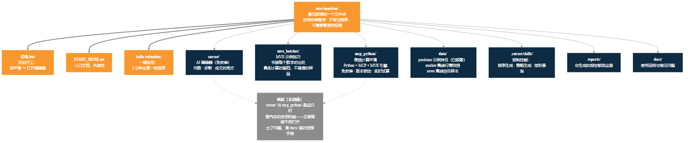
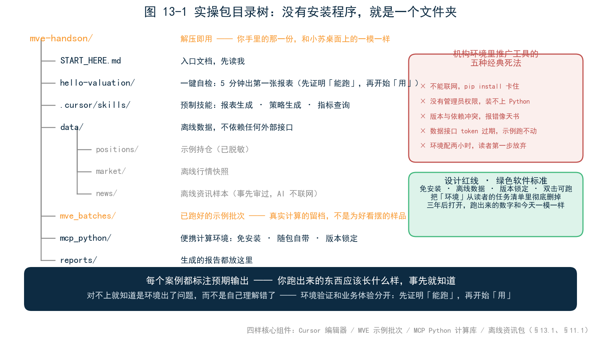
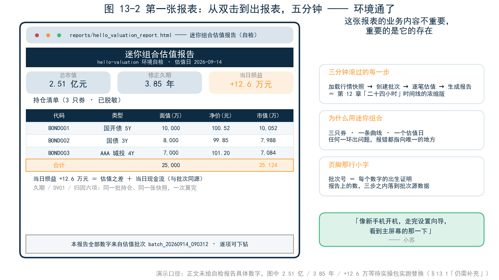
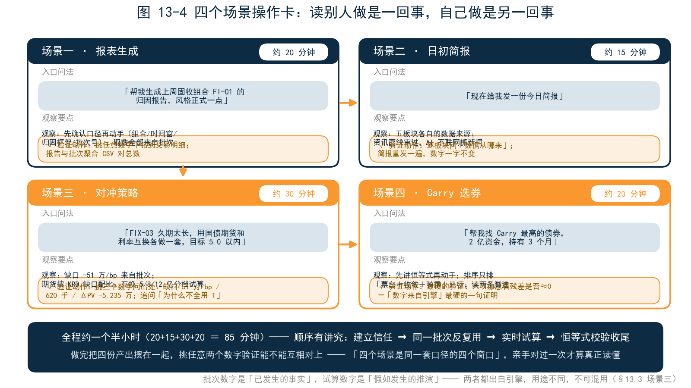
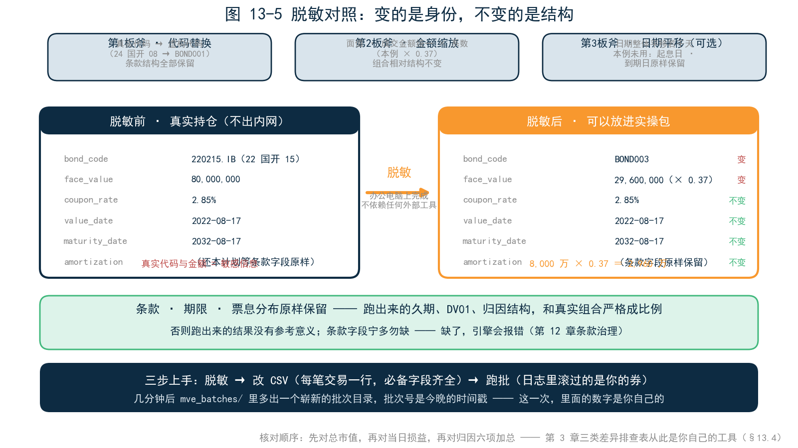
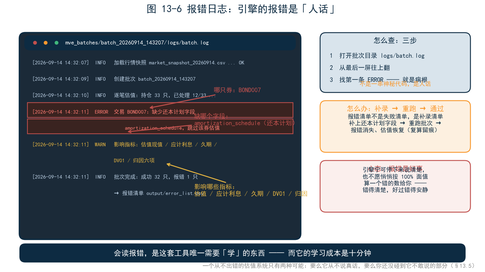

<!--
【素材来源】
- 章节定位与结构：docs/customer/财联社/book/_archive/02_提纲_方案B.md 第五部分第 13 章（亲手试试：实操包指南、读者路径、换成自己的数据）
- 实操包目录结构与设计红线（免 pip install、离线数据内置、双击可跑、版本锁定、案例与章节编号绑定并提供预期输出）：docs/customer/财联社/book/_archive/提纲.md「配套实操包」节
- 四样核心组件（Cursor 编辑器 / MVE 示例批次 / MCP Python 计算库 / 离线资讯包）：20_第11章_四个场景.md §11.1
- 四个场景的操作问法与验证动作：20_第11章_四个场景.md 各「亲手试试」节、_archive/ai_场景叙事.md 各场景环境准备清单
- 报表配方生命周期（登记之后不再经过 AI）：mfp-agent/docs/design/REPORT_SKILL_ARCHITECTURE.md
- 常见问题素材：docs/guide/QIANHAI_BATCH_RUN.md 常见问题表、docs/markdown/user_manual/ch09_troubleshooting.md、ch01_overview.md（5 分钟快速开始）、ch08_output_and_results.md（批次目录与日志位置）
- 全书总结回收：_archive/02_提纲_方案B.md 核心定位（五个问题）、19_第10章_AI的边界.md（审计师小周的验收标准）、21_第12章_一个引擎一套口径.md（五个设计决策）

【衔接与伏笔】
- 承接第 12 章末尾：「把引擎交到你手里」→ 本章引子小苏收到实操包
- 人物承接第 11 章：小苏（苏晓）是王岚部门新来的投资助理；FI-01 组合、Campisi 六项、批次号体系沿用第 11、12 章设定
- 全书收尾：回收第 1 章四个问题、「这 200 万从哪来」主线、「统一口径不是技术口号，是业务刚需」、第 10 章「AI 不是第二套数」、第 12 章「一个引擎，一套口径」

【仍需补充】
1. 实操包目录结构、批次号（batch_20260911_210558 等）、问法均需与最终发布的实操包逐项对齐（当前为设计口径）。
2. 13.2/13.3 的数字（持仓 32 只、市值 61.8 亿、周三单日 −386 万、骑乘 +96 万等）为演示口径，成稿前需用实操包实跑结果替换；其中 61.8 亿/4.62/2.31% 沿用第 11 章设定，若批次更新需同步修改。
3. 13.5 常见问题表需根据实操包内测反馈扩充；报错日志截图待实际取材。
4. ~~正文【图 13-x 占位】待替换为实际截图引用。~~（2026-09-09 已完成：图 13-1～13-6 已替换为 figures/ch13/ 下的实际图片引用；图 13-2、13-6 为程序绘制 mockup，实操包定稿后可换真实截图）
5. §13.0 占位待替换：资源页链接、封底二维码、zip 实际大小（暂填约 450 MB）、SHA256 校验值，均待实操包构建发布后在出版前替换为真实值；「AI 在线」口径（Cursor 账号登录 / 机构模型网关）需与最终发布形态一致。

【修改记录】2026-09-09（实操包方案落地）：
- 新增 §13.0「实操包：下载、安装与启动」（下载/解压/启动/验证四步 + 下载安装类 FAQ），衔接引子与 §13.1；设计方案详见 _build/实操包方案.md
- §13.1 目录树代码块补三行（启动.bat / cursor/ / docs/），与 §13.0 及实操包实际结构对齐
- 新增图 13-0（figures/ch13/图13-0_实操包目录结构.mmd/.png，B 类 Mermaid），插入 §13.0「包里有什么」

【统稿修正记录】2026-09-09：§13.3 场景三操作卡随 20_第11章_四个场景.md §11.4 修正同步更新——缺口 −5.1→−51 万/bp、分档 1/2/3 亿→5/8/12 亿、验证数字 62 手→620 手、ΔPV −1,640→−5,235 万（详见 _archive/90_统稿报告.md）；图 13-4 场景三卡片需同步重新生成。
-->

# 第 13 章　亲手试试

```{=latex}
\begin{center}
{\small 扫描下方二维码，获取实操包下载链接}

\vspace{0.8em}
\includegraphics[width=0.30\linewidth]{figures/common/weixin-contact.jpg}
\end{center}
```

## 引子：小苏的第一天

9 月 14 日，周一，苏晓第一天到金融市场部报到。

她是今年校招进来的投资助理，经济学硕士，论文写的是利率期限结构——但此刻站在工位前，她发现自己的工作电脑干净得像新买的一样：没有 Python，没有终端，连管理员权限都没有。部门 IT 的规定很清楚：工作机不装任何未经审批的软件。

师傅是王岚——第 11 章里那位一句话出归因报告的投资经理。晨会回来，王岚把一个文件夹拷到她桌面，说了三句话：「这是咱们部门在用的估值实操包。先把 START_HERE 打开，照着做。下班前，给我一份 FI-01 上周的周度归因报告。」

小苏打开文件夹，心里打鼓：不会编程，没有权限，一天之内出一份能进决策会的报告？王岚看出了她的表情，补了一句：「不用装任何东西，不用写代码。遇到问题，先问它，再来问我。」走到门口，她又回头补了一句：「报告里每个数，我都会问从哪来——你最好现在就习惯。」

这个文件夹，就是随书配套的实操包——你手里的那一份，和小苏桌面上的一模一样。本章跟着她走一遍：从解压到第一张报表，从第一句话到一份完整报告，从示例数据到她自己的持仓。路上会踩几个坑，每个坑都值得踩——踩过坑的地方，才是真的学会的地方。

---

## 13.0 实操包：下载、安装与启动

小苏的实操包是王岚拷到她桌面上的——机构内部流转，U 盘一插，文件夹一拖，这是常态。你手里的这一份，从这本书来：扫一个码，下载一个 zip，解压，双击。包的出处不同，内容一模一样——同一个版本，同一条红线，同一个起点。

这一节把「拿到包」到「打开包」之间的路走完，一共四步：下载、解压、启动、验证。顺利的话十五分钟，不需要管理员权限，不需要装任何软件，不需要碰一行命令——唯一要敲的一条命令是可选的，用来校验下载文件没坏。走完之后，你就可以跟上小苏的步伐了。

### 包里有什么

先花一分钟看全景。实操包是一个 zip 文件，解压后是一个文件夹——没有安装程序，不写注册表，不在 C 盘留任何东西：

```
mve-handson/
├── 启动.bat              ← 双击它：设好环境，打开 AI 编辑器
├── START_HERE.md         ← 入口文档，先读我
├── hello-valuation/      ← 一键自检：3 分钟出第一张报表
├── .cursor/skills/       ← 预制技能：报表生成、策略生成、指标查询
├── cursor/               ← AI 编辑器程序（免安装，不用直接碰）
├── mcp_python/           ← 便携计算环境：Python + MCP + MVE 引擎（免安装）
├── data/                 ← 示例持仓、离线行情、离线资讯
├── mve_batches/          ← 已跑好的示例批次（书里数字的出处）
├── reports/              ← 你生成的报告都放这里
└── docs/                 ← 使用说明与常见问题
```



记住三件事就够了。**三个入口**：`启动.bat`（双击开工）、`START_HERE.md`（图文引导）、`hello-valuation/`（环境自检）。**四样组件**：第 11 章介绍过的 AI 编辑器、MVE 示例批次、MCP Python 计算库、离线资讯包，各就各位。**两层「不用碰」**：`cursor/` 和 `mcp_python/` 是运行时，像汽车的发动机舱——正常驾驶不用打开，出了问题也有 `docs/` 里的检修手册。

### 第一步：下载

扫描本书封底的二维码，或访问本书资源页（【链接占位，出版时替换】），你会看到一个文件：

| 项目 | 内容 |
|---|---|
| 文件名 | `mve-toolkit-v1.0.zip` |
| 大小 | 约 【450】MB（以资源页公布为准） |
| 版本 | v1.0，与本书版次对应 |
| 校验值 | SHA256：【出版时公布】 |

下载完成后，建议花十秒钟做一次完整性校验——网盘传输偶尔会把大文件「磕坏」，校验能帮你把这类问题挡在门外。在 zip 所在文件夹的地址栏输入 `cmd` 回车，敲下全书唯一需要你敲的一条命令：

```
certutil -hashfile mve-toolkit-v1.0.zip SHA256
```

回车后屏幕上出现一长串十六进制字符，和资源页公布的校验值对照——**逐字符一致，文件完好；不一致，删掉重下**。`certutil` 是 Windows 自带的工具，不用安装任何东西。

### 第二步：解压

右键 zip 文件，「全部解压缩」，目标位置有一个讲究：**纯英文、无空格的路径**，比如 `D:\mve-handson`。

不要解压到桌面，也不要解压到「新建文件夹（2）」——路径里的中文和空格会让引擎脚本闪退，这是本章 §13.5 要讲的第一个坑，小苏踩过，你提前绕开。磁盘空间预留 1.5 GB 以上。解压完成后，对照上一小节的目录结构看一眼：十个条目都在，解压就成功了。

### 第三步：启动

双击 `启动.bat`。这个脚本只做三件事：把包内的便携计算环境加进临时路径、检查当前路径有没有中文和空格（有就弹窗提醒）、然后用包内的编辑器程序打开这个文件夹。它不安装任何东西，不碰注册表，关掉之后电脑和之前一模一样——这就是「绿色软件」的字面意思。

首次启动会多花十几秒：编辑器在 `cursor/data/` 下初始化自己的配置目录（已预置好：关闭自动更新、关闭遥测、加载本书技能）。之后你会看到编辑器窗口打开，左侧文件树就是刚才那个文件夹，左下角的 MCP 指示灯变成绿色——**绿灯亮，说明编辑器和估值引擎已经握手成功**。

这里要如实交代一件事：**这个包是「数据离线、AI 在线」的。**持仓、行情、批次、资讯全部内置，不依赖任何外部数据接口，三年后打开跑出来的数字和今天一模一样；但 AI 对话需要联网——编辑器要登录账号（或按 `docs/` 里的指引配置你所在机构的模型网关）才能应答。如果你此刻在一台完全隔离内网的机器上：自检脚本、批次目录、CSV 核对照常可用，只是「问数」这一步要等回到能联网的环境。这不是设计的疏漏，是第 10 章那条分工的代价——AI 在引擎之上，而 AI 住在云端。

### 第四步：验证

环境通不通，一个问题见分晓。在编辑器的对话框里输入：

> FI-01 这个组合现在有多少只券？总市值多少？久期多少？

预期回答是这样的：

> 组合 FI-01 当前持仓 32 只，总市值 61.8 亿元，修正久期 4.62 年，加权 YTM 2.31%。数据来自估值批次 batch_20260911_210558（估值日 2026-09-11）。

别急着高兴，再做最后一个动作——也是本书反复强调的那个动作：打开 `mve_batches/batch_20260911_210558/output/` 里的聚合 CSV，亲手找到这三个数。**对上了，环境就是通的；AI 答的数能在批次里找到，这本书的方法论就在你手里活了。**对不上，先别怀疑自己，查下面的常见问题表。

### 常见问题（下载与安装）

| 现象 | 可能原因 | 处理 |
|---|---|---|
| 下载慢或中断 | 网盘限速 | 换资源页提供的镜像链接；或用下载工具续传 |
| 校验值对不上 | 传输损坏 | 删掉重下；重下两次仍不符，联系资源页公布的邮箱 |
| 解压报错「路径过长」 | 解压层级太深 | 直接解压到盘符根目录（如 `D:\`） |
| 双击启动.bat 闪退 | 路径含中文/空格，或杀毒软件拦截 | 换纯英文路径；把文件夹加入杀毒软件白名单 |
| 启动后 MCP 指示灯红色 | 便携环境被杀软隔离 | 检查杀软隔离区，恢复并加白名单后重启 |
| 完全无外网，AI 不应答 | 「数据离线、AI 在线」 | 自检与批次查看照常；AI 对话需联网或配置机构模型网关（见 docs/） |
| 公司策略禁止运行 .bat | 机构安全策略 | 把 docs/ 里的手动启动命令交给 IT 部门审计后执行 |

运行中的问题（批次报错、CSV 格式、数字对不上）不在这里——那是小苏要踩的坑，§13.5 有一张完整的表等着。

---

环境通了。接下来的故事属于小苏：她会先带你认识这个文件夹里的每一样东西，跑出第一张报表，然后走完问数、诊断、成文、登记四步。你已经站在起跑线上了——跟上她。

---

## 13.1 开箱：解压即用，五分钟第一张报表

小苏双击打开文件夹，里面的结构出乎意料地简单——没有安装程序，没有注册表，没有「请先阅读三十页部署手册」，就是一个文件夹：

```
mve-handson/
├── 启动.bat               ← 双击开工（上一节已经用过）
├── START_HERE.md           ← 入口文档，先读我
├── hello-valuation/        ← 一键自检：5 分钟出第一张报表
├── .cursor/skills/         ← 预制技能：报表生成、策略生成、指标查询
├── cursor/                 ← AI 编辑器程序（免安装，不用直接碰）
├── data/
│   ├── positions/          ← 示例持仓（已脱敏）
│   ├── market/             ← 离线行情快照
│   └── news/               ← 离线资讯样本
├── mve_batches/            ← 已跑好的示例批次
├── mcp_python/             ← 便携计算环境（免安装）
├── reports/                ← 生成的报告都放这里
└── docs/                   ← 使用说明与常见问题
```



四样核心组件，第 11 章已经介绍过：Cursor 编辑器（和 AI 对话的地方）、MVE 示例批次（报告里的数字都从这里来）、MCP Python 计算库（实时试算能力）、离线资讯包（事先审过的资讯样本）。小苏需要知道的是它们的存在，不需要知道它们的原理。但她还是多问了一句：「这些批次是谁跑的？」王岚答：「上周五晚上，引擎自己跑的。你看到的每个数字，都是那次真实计算的产物——不是为这本书编的演示数据。」这个区别很重要：**示例批次是「真实计算的留档」，不是「为了好看摆的样品」**——所以书里的每个数字才都能溯源。

真正值得一提的是这套包的设计红线——**绿色软件标准：免安装、离线数据、版本锁定、双击可跑。**这四条不是为了图方便，是从失败里学来的。在机构环境里推广一套工具，经典的死法有五种：读者电脑不能联网，pip install 卡住；没有管理员权限，装不上 Python；Python 版本和依赖包冲突，报错信息像天书；数据接口的 token 过期，示例跑不起来；环境配了两个小时，读者在第一步就放弃。五种死法指向同一个教训：**让读者在第一天成功的唯一办法，是把「环境」这件事从读者的任务清单里彻底删掉。**所以实操包里，Python 环境是便携版、随包自带、版本锁定——你在任何一台 Windows 工作机上解压，得到的都是同一个版本、同一套依赖；行情和资讯是离线文件，不依赖任何外部接口，三年后打开这个包，跑出来的数字和今天一模一样；每个案例都标注了预期输出——你跑出来的东西应该长什么样，事先就知道，对不上就知道是环境出了问题，而不是自己理解错了。

小苏按 START_HERE 的指示，双击 `hello-valuation` 里的自检脚本。一个窗口弹出来，滚动了几行日志：加载行情快照、创建批次、逐笔估值、生成报告。她后来知道，这三分钟里滚过的每一步，就是第 12 章那条「二十四小时」时间线的浓缩版——索引、快照、估值、输出，一个环节不少。三分钟后，窗口停在一行字上：批次完成，报告已生成。`reports/` 目录里多了一份 HTML 文件——一只迷你组合的估值报告：持仓清单、市值、久期、当日损益，一应俱全，页脚挂着批次号。



这张报表的业务内容不重要，重要的是它的存在：**环境通了。**从双击到出报表，五分钟。小苏后来跟同学形容这一刻：「像新手机开机，走完设置向导，看到主屏幕的那一下。」

为什么第一张报表用迷你组合，而不是直接上完整组合？因为自检的目标是验证环境，不是看业务——三只券、一条曲线、一个估值日，任何一环出问题，报错都指向唯一的地方。**环境验证和业务体验分开，是实操包的另一条设计原则**：先证明「能跑」，再开始「用」。很多工具把这两件事混在一起，结果是读者分不清卡在环境还是卡在操作，最后一起放弃。

---

## 13.2 读者路径：从第一句话到一份完整报告

环境通了，接下来是正经活：王岚要的那份周度归因报告。小苏打开 Cursor，照着 START_HERE 的第二条指示，开始了她和 AI 的第一段对话。这段对话有四步，也是本书给所有读者设计的路径——**问数、诊断、成文、登记。**

**第一步，问数——先建立信任。**这一步的顺序有讲究：不要一上来就要报告。先问一个你能独立验证的小问题，看 AI 答的数能不能在源数据里找到——能对上，再托付更大的任务。这是本书给所有 AI 工具的使用纪律：信任从一个小验证开始，不从一份漂亮的报告开始。小苏没敢直接要报告，先问了句简单的：

> **小苏**：FI-01 这个组合现在有多少只券？总市值多少？久期多少？

> **AI**：组合 FI-01 当前持仓 32 只，总市值 61.8 亿元，修正久期 4.62 年，加权 YTM 2.31%。数据来自估值批次 batch_20260911_210558（估值日 2026-09-11）。

小苏照着批次号，在 `mve_batches/` 里找到那个文件夹，打开 output 里的聚合 CSV——三个数都在，一模一样。**这是她第一次亲手验证「AI 答的数，能在批次里找到」。**信任不是被要求出来的，是被验证出来的。

她又多问了一句：

> **小苏**：这个批次是什么时候跑的？

> **AI**：上周五 21:05，日终批处理。批次的 input、config、行情快照都归档在同一个目录里，随时可以复算——重跑一遍，数字不变。

第 12 章讲的批次管理，她第一次摸到了实物。

**第二步，诊断——对着数字找异常。**

> **小苏**：上周五个交易日，哪天亏得最多？为什么？

> **AI**：上周三（9 月 9 日）亏损最大，单日 −386 万。归因看，其中 −342 万来自曲线变动——当天 5-10 年段收益率上行约 3bp，组合久期 4.62，方向与幅度一致。逐日明细如下表。

小苏注意到这个回答的结构：先给结论（哪天、多少），再给归因（哪一项、多少），最后给交叉印证（市场变动与组合久期方向一致）。三层都是批次里的数，AI 做的是把它们按「问题」的顺序摆好——这就是第 10 章说的「诊断」：数字是引擎的，定位是 AI 的。

**第三步，成文——把数字变成报告。**铺垫完成，小苏发出了王岚交代的那句话：

> **小苏**：帮我生成上周固收组合 FI-01 的周度归因报告，风格正式一点，决策会要用。

接下来的四十秒，她看到了第 11 章场景一的全过程：AI 先确认口径（组合、时间窗 9 月 7 日至 11 日、Campisi 六项、批次号），再检查数据齐全性，再从批次取数，再编排成文，最后渲染出 HTML 和 PDF 各一份。报告附注里那行小字还在老位置：「本报告全部数字来自 MVE 估值批次 batch_20260911_210558，与估值系统同源；逐项可下钻至交易明细。」

小苏盯着屏幕想：同一份报告，估值岗的同事要做半天——找数、拼表、画图、写结论。她的四十秒里，AI 做的其实是「翻译和排版」，数字一个没算。这就是第 10 章的分工落在桌面上的样子。

**第四步，登记——让报告以后自动出。**小苏想起王岚说过这份报告每周都要，补了一句：

> **小苏**：这份报告以后每周一早上自动出一份。

> **AI**：已登记为周度配方。每周一批次跑完后自动重跑，报告输出到 reports/ 目录。登记之后不再经过 AI——数字由引擎量产，保证每期口径一致。

这一步初看不起眼，其实是四步里最接近「机构级」的一步。每周让 AI 重写一遍报告，每周就有一次幻觉的机会；登记成配方之后，脚本、参数、模板版本全部固定，AI 退出量产环节——创作环节享受 AI 的灵活，量产环节享受引擎的确定性。小苏后来向王岚汇报时特意提了这件事，王岚点头：「对，以后你每周一只需要核对一件事——批次号是不是新的。」


四步走完，小苏做了最后一个动作——也是本书反复强调的那个动作：她挑了报告里「骑乘效应 +96 万」这个数字，问：「这个数从哪来？」AI 给出批次号、指标名 ROLL_DOWN_PNL、估值日，并下钻到贡献最大的三只券。**从这一问开始，她已经在用这本书的全部内容了。**

值得停一下，看这四步的顺序。不是「先学软件，再学业务」，而是反过来：先用大白话问数，建立「数字能溯源」的信任；再诊断，体会「AI 定位、引擎出数」的分工；再成文，拿到第一份属于自己的产出；最后登记，把一次性的产出变成每周自动的流程。**信任、诊断、产出、量产——四步走完，工具就从「别人的系统」变成了「我的工作台」。**

---

## 13.3 四个场景，挨个做一遍

第 11 章的四个场景，读别人做是一回事，自己做是另一回事。这一节是四个场景的详细操作卡：每个场景给入口问法、观察要点、预期输出、验证动作和常见卡点。建议按顺序做，全程约一个半小时——顺序是有讲究的：场景一建立「数字来自批次」的信任，场景二体会「同一批次反复用」，场景三接触「实时试算」这个第二种数字来源，场景四用恒等式校验收尾。四个场景合起来，是这套工具的完整用法，也是全书方法论的一次实操复习。

**场景一 · 报表生成（约 20 分钟）。**入口问法就是小苏那句：「帮我生成上周固收组合 FI-01 的归因报告，风格正式一点。」观察要点有三个：AI 先确认口径再动手（组合、时间窗、归因框架、批次号，四样缺一不可）；取数全部来自批次，AI 一个数都不算；结论只描述事实，不下投资判断。预期输出：`reports/` 目录下新增 HTML 和 PDF 各一份，标题《固收组合 FI-01 周度归因报告（2026-09-07 至 09-11）》，核心页是 Campisi 六项表和归因瀑布图。验证动作：挑任意数字下钻到交易明细；再把报告和批次里的聚合 CSV 对一遍总数。然后做改稿练习：「分品种那张表加一列久期」——体会「改脚本、重渲染」和「重新生成」的区别：前者十秒出新版、数字不变，后者一切重来。常见卡点：如果 AI 提示某日数据缺失，不要慌——那是第 10 章纪律二在工作，缺数明说，不许硬凑。

**场景二 · 日初简报（约 15 分钟）。**入口问法：「现在给我发一份今日简报。」观察要点：五个板块（隔夜要闻、市场变动、持仓盈亏、今日关注、策略建议）各自的数据来源——前四个来自批次与离线资讯包，策略建议来自引擎的策略索引，AI 只做汇编和转述。特别注意板块一：资讯是离线的、事先审过的，AI 不联网抓新闻——它给每条资讯写的那句「与本组合的关系」，关联依据（持仓、集中度）也全部来自批次。预期输出：一封 HTML 简报；如果实操包未配置邮箱，简报会以 HTML 文件形式生成在 `reports/` 目录下，双击用浏览器打开即可——离线环境不依赖任何邮件网关。验证动作有两个：一是逐板块问「这块的数据从哪来」；二是把简报再发一遍——「把今早的简报再发我一份」，看 AI 回答「数据仍来自今早的批次，内容一致」。**同一批次、同一口径，重发一百次数字也不会变**——亲手验证这句话，比读十遍都有用。最后打开批次的 reports 目录，找到那封邮件的 HTML 原件：三个月后审计问「那天晨会的依据是什么」，答案就是它。

**场景三 · 对冲策略（约 30 分钟）。**入口问法：「FIX-03 久期太长了，帮我用国债期货和利率互换各做一套对冲方案，目标久期 5.0 以内，DV01 缺口算清楚。」观察要点：缺口 −51 万/bp 是从批次的组合 DV01 和目标 DV01 算出来的；期货手数按 KRD 缺口分布配比（TF 接 5-7 年段，T 接 7-10 年段）；互换方案是分档试算出来的——5 亿、8 亿、12 亿三档，推荐档的理由写在报告里。预期输出：一份对冲报告（HTML），含 DV01 缺口瀑布、分档试算表、对冲前后的久期与情景损失对比。必做的追问：「为什么不全用 10 年期的 T？」——让 AI 调出 KRD 分布回答，体会「总量匹配」和「期限结构匹配」的区别。验证动作：挑三个数字问出处——缺口 51 万/bp（来自批次）、620 手（来自 CTD 参数表）、ΔPV −5,235 万（来自情景模块试算）。常见卡点：试算走的是实时计算，报告里会标注「试算口径」——注意它和批次数字的区别：批次数字是「已发生的事实」，试算数字是「假如发生的推演」，两者都出自引擎，但用途不同，不可混用。

**场景四 · Carry 选券（约 20 分钟）。**入口问法：「帮我找当前市场上 Carry 最高的债券，2 亿资金，打算持有 3 个月。」观察要点：AI 先讲恒等式再动手——窗口总损益 = 曲线变动 + 票息 + 收敛 + 骑乘 + 凸性 + 残差，排序只排「票息 + 收敛 + 骑乘」三项；报告末尾的两条脚注（曲线口径与实际发生口径不同源、排序不含信用与流动性调整）值得逐字读一遍。预期输出：一份 Carry 选券报告，主表是债券池的排序（示例池 86 只券），每只券带票息、收敛、骑乘的三分解，附 Excel 明细。验证动作是四个场景里最硬的一个：让 AI 把某只持仓券的窗口损益六项加总，看残差是否接近零——**六项加总等于窗口总损益，这是「数字来自引擎」最硬的一句证明**，也是第 12 章同源估值在你手心里的样子。



四个场景做完，建议回头做一件事：把四份产出物（归因报告、简报邮件、对冲方案、选券排序表）摆在一起，挑出任意两个数字，验证它们能不能互相对上。归因报告里的周收益，和简报里的持仓盈亏，口径是否一致？对冲方案里的组合 DV01，和归因报告里的曲线损失，能不能互相解释？能对上，你就亲手摸到了第 12 章的地基——**四个场景不是四个产品，是同一套口径的四个窗口**，这句话只有亲手对过一次，才算真正读懂。

---

## 13.4 把示例持仓换成自己的

示例数据跑通了，下一个问题自然冒出来：**能不能看我自己的组合？**能——而且这才是实操包真正的用意：示例数据只是陪练，你的持仓才是正文。

整个过程三步：脱敏、改 CSV、跑批。

**第一步，脱敏。**机构数据不出内网是铁律，所以这一步在你的办公电脑上完成，不依赖任何外部工具。三板斧：**代码替换**——把真实债券代码换成虚构代码（如「24 国开 08」换成「BOND001」），但保留全部条款结构；**金额缩放**——所有面值、成交金额统一乘一个系数（比如 0.37），保留组合的相对结构；**日期平移**（可选）——把日期整体平移若干天。脱敏的原则只有一条：**变的是身份，不变的是结构**——条款、期限、票息分布原样保留，否则跑出来的结果没有参考意义。

以一只真实持仓为例。脱敏前：「22 国开 15，面值 8,000 万，票息 2.85%，2022-08-17 起息，2032-08-17 到期」。脱敏后：「BOND003，面值 2,960 万（8,000 万 × 0.37），票息 2.85%，起息日与到期日不变」。代码和金额变了，条款结构、期限、票息原样——跑出来的久期、DV01、归因结构，和真实组合严格成比例。

**第二步，改 CSV。**打开 `data/positions/` 里的示例持仓文件，照着它的格式准备你自己的：每笔交易一行，必备字段包括交易 ID、产品类型、组合键、面值、票息、起息日、到期日；债券带上还本计划、调票面安排等条款字段。一个原则：**条款字段宁多勿缺**——缺了，引擎会报错；报错的含义，第 12 章讲过了。

**第三步，跑批。**把自己的 CSV 放进数据目录，在索引配置里指过去，运行批处理。入口是一行命令或一个双击脚本，日志滚动的方式和 hello-valuation 一模一样——区别只是这一次，日志里滚过的是你的券。几分钟后，`mve_batches/` 里多出一个崭新的批次目录，批次号是今晚的时间戳——这一次，里面的数字是你自己的。



然后是全程最有意思的时刻：打开属于自己的批次，看自己组合的 Campisi 六项——票息贡献多少、曲线损益多少、骑乘多少；看 DV01 和 KRD 分布；看 VaR。很多读者在这一步会第一次发现一些「体感之外」的事实：以为收益主要来自票息，一看骑乘占了一半；以为久期风险集中在长端，一看 5-7 年段才是大头。这些发现不是 AI 的洞察，是你自己的持仓第一次被同一套口径照亮——以前它们散在交易系统、估值表、风控报表里，从来没有在同一个地方、用同一把尺子量过。

小苏走到这一步时，把部门一个真实小组合（脱敏后）跑了进去。她盯着归因表看了很久，说了一句话，被王岚记了下来：「**以前这些数字是别人报表里的，现在是我问出来的。**」王岚后来把这句话转述给部门负责人，补了一句自己的评论：「这套东西最大的变化，不是省时间，是把『看数的能力』从系统管理员手里，交还给了业务的人。」

一句提醒：示例批次的数字是演示口径，换成自己的数据后，每个数字都要自己核一遍——先对口径（估值日、批次、净价全价），再对数字。建议的核对顺序是：先对总市值（和估值系统或托管表对），再对当日损益，再对归因六项的加总。总市值对不上，多半是价格或条款问题；总市值对、损益对不上，多半是现金流或口径问题；损益对、归因对不上，才轮到曲线和重定价的问题。这不是额外负担，这正是本书教的方法本身——**第 3 章那张三类差异排查表，从此是你自己的工具了。**

---

## 13.5 常见问题：报错了怎么办

小苏这一天踩了三个坑，一个比一个典型。把她的踩坑记和更多常见问题整理在这里——先记住总原则：**引擎报错是好事，报错清单就是工作清单。**这套工具的设计者把「出错」分成两类：环境的错（路径、编码、权限），一眼能修；口径的错（缺条款、缺价格），必须人补。两类错都会停下来告诉你，没有一类会悄悄绕过去——这正是它和「怎么都能跑出数」的工具最大的区别。

**坑一：路径里有中文和空格。**小苏一开始把实操包解压到了「桌面\新建文件夹（2）」下，自检脚本双击后闪退。她第一反应是包坏了，差点去找王岚。原因其实很小：引擎对路径中的中文和空格敏感。解法：换到纯英文、无空格的路径（如 `D:\mve-handson`），重跑即好。教训：金融工具大多出生在英文环境里，**路径越朴素，麻烦越少**。

**坑二：CSV 被 Excel「顺手」改了。**她用自己的数据时，用 Excel 编辑持仓文件后另存，批次跑失败。查日志发现两处问题：编码从 UTF-8 变成了 ANSI，日期从 `2026-09-11` 变成了 `2026/9/11`——Excel 的「智能」保存，把两样东西都悄悄改了。解法：CSV 用 UTF-8 编码保存，日期一律 `YYYY-MM-DD`；或者改完后用文本编辑器检查一遍再跑。教训：**Excel 是最好的查看器，最差的保存器**——看数据用它，改数据存盘前多一道检查。

**坑三：条款字段缺了一列。**她加的一只分期还本债忘了填还本计划，批次在该券处报错停止。报错信息直接写明：哪只券、缺哪个字段、影响哪些指标。补上字段，重跑，通过。她后来理解了第 12 章那句话——**引擎宁可停下来说清楚，也不愿悄悄按 100% 面值算一个错的数给她。**教训：报错清单不是失败清单，是补录清单。

更多常见问题，一张表：

| 现象 | 可能原因 | 处理 |
|---|---|---|
| 双击脚本闪退 | 路径含中文/空格，或杀毒软件拦截 | 换纯英文路径；把目录加入杀毒白名单 |
| 自检报「找不到行情文件」 | data/market 被移动或重命名 | 恢复目录原名，保持各目录相对位置不变 |
| 批次跑失败 | 数据格式或条款问题 | 打开批次 logs/batch.log，从最后一屏往上找第一条 ERROR |
| 某只券没有估值结果 | 条款缺失或价格缺失 | 按报错清单补条款/补价格，重跑 |
| 数字和预期对不上 | 口径不一致 | 先对估值日、批次号、净价全价，再对数字 |
| AI 答非所问 | 问法缺口径 | 把组合号、时间窗、指标名说具体 |
| 报告里的数和 CSV 不一致 | 看了不同批次 | 核对报告附注的批次号与 CSV 所属批次 |
| 报告生成但图表空白 | 浏览器拦截了本地页面脚本 | 按浏览器提示允许，或用包内推荐的打开方式 |



查日志的方法值得单独说一句。批次失败时，打开批次目录里的 `logs/batch.log`，从最后一屏往上翻，找第一条 ERROR——引擎的报错是「人话」：它会说「交易 BOND007：缺少还本计划字段 amortization_schedule，跳过该券估值」，而不是一串神秘代码。**会读报错，是这套工具唯一需要「学」的东西，而它的学习成本是十分钟。**

还有一个心态要专门调整。用惯了对答如流的 AI，第一次遇到引擎报错，很多人的直觉是「这工具不行」。请反过来想：一个从不出错的估值系统，只有两种可能——要么它从不说真话，要么你还没碰到它不敢说的部分。报错是引擎在替你守住口径的边界；它今天拦下的一只缺条款的券，就是下个月对账会上少的一笔糊涂账。

---

## 13.6 下班之前

下午五点十分，小苏把报告发给了王岚——FI-01 上周的周度归因报告，HTML 加 PDF，附注里挂着批次号。王岚看完回了两个字：「存档。」隔了一分钟又发来一句：「明天开始，这份报告每周一你负责盯。配方已经登记了，你只需要核对批次号。」

小苏合上电脑前，最后看了一眼桌上的文件夹。早上它还是一个让她打鼓的黑盒子，现在她知道里面每个目录是干什么的：批次是证据包，行情是快照，报告是配方的产物，报错是朋友。

第一天，小苏走完了：开箱、问数、诊断、出报告、溯源、踩坑、解决、换成自己的数据。她没有写一行代码，没有装一个软件，但她做成了一件以前要麻烦估值岗半天的事——而且每个数字都答得上「从哪来」。

从实操包到生产环境，距离没有想象中远：示例数据换成真实数据（13.4 已经做过），个人电脑换成日终批后流程（第 12 章的二十四小时），单机换成部门共享——**但口径不变，问法不变，「从哪来」的答案不变。**如果要在机构里正式落地，第 12 章的三种方式（嵌入行内系统、独立平台部署、补齐既有平台）各自对应不同的起点：科技能力强、想自己掌控流程的，选嵌入；没有估值系统、从零起步的，选独立部署；已有系统但有缺口的，选补齐。无论哪条路，第一步都一样——带一组真实持仓来，用你们的数据看结果。实操包是缩小版的生产环境：流程是真的，口径是真的，只有数据是假的。

一个月后，小苏成了部门里默认的「批次管理员」——不是因为她学会了编程，而是因为她最习惯问那句话：「这个数从哪来？」新同事来问报告，她的标准回答是王岚那句话的翻版：「先问它，再来问我；问它的时候，记得问出处。」问出处的习惯，就这样从一个人传到另一个人——这大概是一套口径最好的推广方式：不靠发文，靠示范。

---

## 本章小结

回到引子的问题：一个不会编程、没有权限的新人，一天之内能交出一份能进决策会的报告吗？

小苏的答案是：能——不是因为她是高手，是因为工具把门槛压到了「会提问题」。开箱即用，绿色软件标准把「环境」从任务清单里删掉；四步路径，问数、诊断、成文、登记，每一步都有验证动作；四个场景挨个做一遍，每个场景都有「挑一个数字问出处」的硬验证；示例持仓换成自己的，脱敏三板斧，变的是身份、不变的是结构；报错了不慌，报错清单就是工作清单——错得清楚，好过错得安静。这五件事串起来，就是一条从「读者」到「用户」的最短路径。

这一章没有新概念，只有一件事：**亲手做一遍。**书读到这里，估值、绩效、归因、风险的口径之争你都懂了；但只有亲手把一个数字从批次里挖出来，「这个数字从哪来」才从知识变成肌肉。这套工具把「专业」拆成了两层：数字的严谨由引擎守住，提问的自由留给人。你要做的，只是会提问、会溯源、会读报错——三件事都不需要编程。

---

## 全书总结：这个数字从哪来

合上本书之前，回到书名。

全书从四个问题开始：为什么我的估值和中债估值差了 2 分钱？为什么风控说的 VaR 和我算的不一样？为什么这个月的归因报告和上个月的接不上？为什么「今天赚了 200 万，这 200 万从哪来」答不上？

四个问题指向同一件事：金融机构的估值、绩效、归因、风险，长期以来是割裂的——每个环节都对，但对不到一起。这本书没有用教科书的顺序回答它们，而是跟着问题走：先看清数字怎么产生（估值、绩效、归因、风险），再看清中国市场的特殊条款（分期还本、可转债、IFRS9），再划清 AI 的边界，最后落到一套引擎和一双手上。

现在可以给出完整的答案了。**一个数字的旅程，要过五道关口，每道关口都是一道口径选择题：**

它从**条款**来——现金流是合同写出来的，分期还本、阶梯票息、强赎回售，系统对条款的理解差一分，估值就差一截；条款不是附属信息，条款就是估值本身（第 3、7、8 章）。它从**曲线**来——折现率是政策选择不是技术事实，半个基点的曲线差异就是 2 分钱；差异不是错误，是口径的账单（第 3 章）。它从**口径**来——绩效、风险、会计数字都是定义出来的，定义不同，数字就不同；成熟的管理不追求差异为零，追求每一分差异都能说出出处（第 4、6、9 章）。它从**同源计算**来——损益拆解的前提是同一批持仓、同一张快照、同一套条款处理，在两个时点各估一次；归因不是估值的下游产品，是估值的第二次使用（第 5、12 章）。它从**批次**来——批次号、指标名、估值日，让每个数字可追溯、可复算；可复现，是机构级工具和个人玩具的分界线（第 10、12 章）。

五道关口串起来，就是全书的主线：**估值、绩效、归因、风险，四个环节必须同一套数字口径。**统一口径不是技术口号，是业务刚需——没有它，月末对账是考古，审计质询是灾难，决策会上报表互相打架；有了它，「这 200 万从哪来」三分钟答完，AI 的每个数字都能当场验证，新人的第一天就能出报告。第 1 章说「割裂的代价」，到这里可以说出它的反面了：**统一的红利**——对账会从三小时到二十分钟，报告从半天到四十秒，审计质询从翻档案到打开一个文件夹。这些不是效率数字，是信任的生产力。

AI 的位置也清楚了：**在引擎之上，不在引擎之内。**AI 问数、诊断、成文，引擎产生数字，人负责判断和签字。AI 不是第二套数——它是同一套数的新界面。这个分工回答的是 AI 时代金融机构最焦虑的问题：效率和责任能不能兼得？答案是能，条件是各司其职——让 AI 做它擅长的（理解问题、调用工具、组织语言），让引擎做它擅长的（按口径计算、留痕、可复算），让人做只有人能做的（选择口径、判断、签字）。审计师小周那句话，可以作为全书的验收标准：「AI 写的不是答案，除非它能带我找到那个数。」这本书的全部内容，就是让每个数字都能带人找到它。

书末的技术附录收录了全部公式——估值、绩效、归因、风险，从现值到 Campisi 到 VaR。正文里刻意一个公式都没有放。这不是回避数学，是一种立场：**公式是口径的精确化，先理解「为什么是这个口径」，公式才有意义。**需要的时候，附录 A 到 F 在那里。

最后一个动作留给你。打开实操包，随便找一份报告，挑出任意一个数字，问：「这个数从哪来？」

然后沿着批次号、指标名、估值日，自己走一遍——从报告到 CSV，从 CSV 到批次目录，从批次目录到那天晚上的行情快照和条款字段。这条路不长，三分钟；但它是一个金融数字从「报表上的墨水」变回「可复核的事实」的全程。全书十三章，归根结底就是为了让你能走完这三分钟——并且知道每一步在看什么。

**走通的那一刻，这本书就是你的了——而那个数字，从此也就是你的了。它从哪来，你亲眼见过。**
